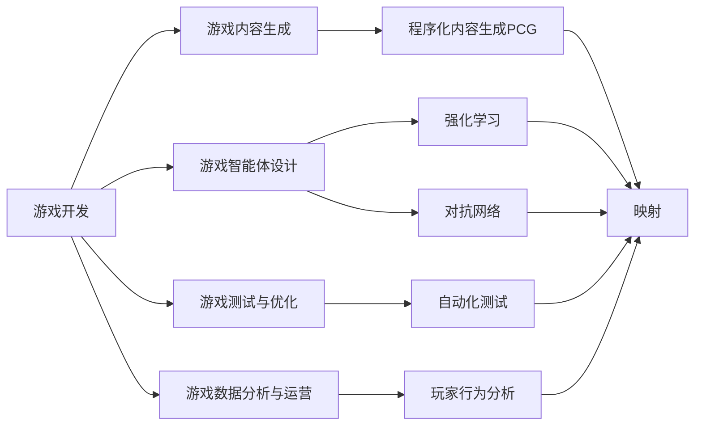

# 一切皆是映射：AI在游戏开发中的应用

## 1. 背景介绍
### 1.1 游戏行业的发展现状
#### 1.1.1 游戏市场规模不断扩大
#### 1.1.2 游戏类型日益丰富多样
#### 1.1.3 游戏开发技术不断进步

### 1.2 人工智能技术的发展与应用
#### 1.2.1 人工智能的发展历程
#### 1.2.2 人工智能在各行业的应用现状
#### 1.2.3 人工智能在游戏领域的应用前景

### 1.3 游戏开发中的痛点与挑战
#### 1.3.1 游戏内容创作的瓶颈
#### 1.3.2 游戏测试与调优的难题
#### 1.3.3 游戏运营与玩家互动的困境

## 2. 核心概念与联系
### 2.1 游戏开发流程概述
#### 2.1.1 游戏策划与设计
#### 2.1.2 游戏美术与音效制作
#### 2.1.3 游戏程序开发与测试

### 2.2 人工智能在游戏开发中的应用领域
#### 2.2.1 游戏内容生成
#### 2.2.2 游戏智能体设计 
#### 2.2.3 游戏测试与优化
#### 2.2.4 游戏数据分析与运营

### 2.3 映射的概念与作用
#### 2.3.1 映射的数学定义
#### 2.3.2 映射在游戏开发中的应用
#### 2.3.3 映射与人工智能的关系

### 2.4 游戏开发中AI应用的核心概念关系图


## 3. 核心算法原理具体操作步骤
### 3.1 程序化内容生成PCG算法
#### 3.1.1 基于模板的PCG
##### 3.1.1.1 模板定义
##### 3.1.1.2 参数化生成
##### 3.1.1.3 后处理优化

#### 3.1.2 基于搜索的PCG  
##### 3.1.2.1 搜索空间定义
##### 3.1.2.2 适应度函数设计
##### 3.1.2.3 搜索算法选择

#### 3.1.3 基于机器学习的PCG
##### 3.1.3.1 数据集准备
##### 3.1.3.2 模型训练
##### 3.1.3.3 内容生成与评估

### 3.2 强化学习在游戏AI中的应用
#### 3.2.1 马尔可夫决策过程MDP
##### 3.2.1.1 状态空间
##### 3.2.1.2 动作空间
##### 3.2.1.3 转移概率与奖励函数

#### 3.2.2 Q-learning算法
##### 3.2.2.1 Q值表示
##### 3.2.2.2 贪婪策略与探索
##### 3.2.2.3 Q值更新

#### 3.2.3 Deep Q-Network算法
##### 3.2.3.1 神经网络价值函数近似
##### 3.2.3.2 经验回放
##### 3.2.3.3 目标网络

### 3.3 对抗网络在游戏AI中的应用
#### 3.3.1 生成对抗网络GAN
##### 3.3.1.1 生成器
##### 3.3.1.2 判别器
##### 3.3.1.3 对抗训练

#### 3.3.2 条件生成对抗网络CGAN
##### 3.3.2.1 条件信息引入
##### 3.3.2.2 条件嵌入
##### 3.3.2.3 多样性生成

#### 3.3.3 循环对抗网络RecGAN
##### 3.3.3.1 序列生成
##### 3.3.3.2 时间一致性约束
##### 3.3.3.3 交互式生成

## 4. 数学模型和公式详细讲解举例说明
### 4.1 马尔可夫决策过程MDP数学模型
#### 4.1.1 MDP的形式化定义
$$ MDP=\langle S,A,P,R,\gamma \rangle $$
其中，$S$为状态空间，$A$为动作空间，$P$为转移概率，$R$为奖励函数，$\gamma$为折扣因子。

#### 4.1.2 MDP的最优策略
最优策略 $\pi^*$ 满足贝尔曼最优方程：
$$V^*(s)=\max_{a \in A}\left[R(s,a)+\gamma \sum_{s' \in S}P(s'|s,a)V^*(s')\right]$$
$$Q^*(s,a)=R(s,a)+\gamma \sum_{s' \in S}P(s'|s,a)\max_{a' \in A}Q^*(s',a')$$

#### 4.1.3 MDP在游戏AI中的应用举例
以围棋AI为例，状态空间为棋盘状态，动作空间为落子位置，转移概率为对手落子概率，奖励函数为棋局评估，折扣因子为衰减系数。通过求解MDP可以得到最优落子策略。

### 4.2 Q-learning算法的数学原理
#### 4.2.1 Q值更新公式
$$Q(s_t,a_t) \leftarrow Q(s_t,a_t)+\alpha\left[r_{t+1}+\gamma \max_{a}Q(s_{t+1},a)-Q(s_t,a_t)\right]$$
其中，$s_t$为当前状态，$a_t$为当前动作，$r_{t+1}$为获得的即时奖励，$\alpha$为学习率，$\gamma$为折扣因子。

#### 4.2.2 Q-learning的收敛性证明
假设状态和动作空间有限，奖励函数有界，$0 \leq \gamma < 1$，$\sum_{t=1}^{\infty}\alpha_t=\infty$，$\sum_{t=1}^{\infty}\alpha_t^2<\infty$，则Q-learning算法收敛到最优Q值。

#### 4.2.3 Q-learning在游戏AI中的应用举例
以老虎机问题为例，状态为老虎机编号，动作为拉动拉杆，奖励为获得的奖金。通过Q-learning算法可以学习到最优的选择老虎机的策略，在探索和利用之间权衡，最大化累积奖励。

### 4.3 生成对抗网络GAN的数学原理
#### 4.3.1 GAN的目标函数
$$\min_G \max_D V(D,G)=\mathbb{E}_{x \sim p_{data}(x)}[\log D(x)]+\mathbb{E}_{z \sim p_z(z)}[\log(1-D(G(z)))]$$
其中，$G$为生成器，$D$为判别器，$p_{data}$为真实数据分布，$p_z$为噪声分布。

#### 4.3.2 GAN的纳什均衡
当生成器和判别器达到纳什均衡时，生成器可以生成与真实数据分布一致的样本，判别器无法区分真实样本和生成样本。

#### 4.3.3 GAN在游戏AI中的应用举例
以游戏场景生成为例，生成器根据噪声生成游戏场景，判别器判断场景的真实性。通过对抗训练，生成器可以生成逼真的游戏场景，丰富游戏内容。

## 5. 项目实践：代码实例和详细解释说明
### 5.1 使用Python实现Q-learning算法
```python
import numpy as np

class QLearning:
    def __init__(self, num_states, num_actions, alpha, gamma, epsilon):
        self.num_states = num_states
        self.num_actions = num_actions
        self.alpha = alpha
        self.gamma = gamma
        self.epsilon = epsilon
        self.Q = np.zeros((num_states, num_actions))

    def choose_action(self, state):
        if np.random.uniform() < self.epsilon:
            action = np.random.randint(self.num_actions)
        else:
            action = np.argmax(self.Q[state])
        return action

    def update_Q(self, state, action, reward, next_state):
        self.Q[state][action] += self.alpha * (reward + self.gamma * np.max(self.Q[next_state]) - self.Q[state][action])

    def train(self, env, num_episodes):
        for episode in range(num_episodes):
            state = env.reset()
            done = False
            while not done:
                action = self.choose_action(state)
                next_state, reward, done = env.step(action)
                self.update_Q(state, action, reward, next_state)
                state = next_state
```
代码解释：
- 定义了QLearning类，初始化Q值表，设置学习率、折扣因子和探索率。 
- choose_action方法根据epsilon-greedy策略选择动作，以epsilon的概率随机探索，否则选择Q值最大的动作。
- update_Q方法根据Q-learning算法更新Q值表。
- train方法在环境中训练Q-learning智能体，每个episode重置环境状态，选择动作与环境交互，更新Q值，直到达到终止状态。

### 5.2 使用TensorFlow实现生成对抗网络GAN
```python
import tensorflow as tf

def generator(z, hidden_size):
    with tf.variable_scope('generator'):
        h1 = tf.layers.dense(z, hidden_size, activation=tf.nn.relu)
        output = tf.layers.dense(h1, 784, activation=tf.nn.sigmoid)
    return output

def discriminator(x, hidden_size):
    with tf.variable_scope('discriminator'):
        h1 = tf.layers.dense(x, hidden_size, activation=tf.nn.relu)
        output = tf.layers.dense(h1, 1, activation=None)
    return output

def train_gan(batch_size, hidden_size, learning_rate, num_epochs):
    x = tf.placeholder(tf.float32, [None, 784])
    z = tf.placeholder(tf.float32, [None, 100])

    G = generator(z, hidden_size)
    D_real = discriminator(x, hidden_size)
    D_fake = discriminator(G, hidden_size)

    D_loss_real = tf.reduce_mean(tf.nn.sigmoid_cross_entropy_with_logits(logits=D_real, labels=tf.ones_like(D_real)))
    D_loss_fake = tf.reduce_mean(tf.nn.sigmoid_cross_entropy_with_logits(logits=D_fake, labels=tf.zeros_like(D_fake)))
    D_loss = D_loss_real + D_loss_fake
    G_loss = tf.reduce_mean(tf.nn.sigmoid_cross_entropy_with_logits(logits=D_fake, labels=tf.ones_like(D_fake)))

    D_optimizer = tf.train.AdamOptimizer(learning_rate).minimize(D_loss, var_list=tf.get_collection(tf.GraphKeys.TRAINABLE_VARIABLES, scope='discriminator'))
    G_optimizer = tf.train.AdamOptimizer(learning_rate).minimize(G_loss, var_list=tf.get_collection(tf.GraphKeys.TRAINABLE_VARIABLES, scope='generator'))

    with tf.Session() as sess:
        sess.run(tf.global_variables_initializer())
        for epoch in range(num_epochs):
            for batch in range(num_batches):
                batch_x, _ = mnist.train.next_batch(batch_size)
                batch_z = np.random.uniform(-1, 1, size=(batch_size, 100))
                _, D_loss_curr = sess.run([D_optimizer, D_loss], feed_dict={x: batch_x, z: batch_z})
                _, G_loss_curr = sess.run([G_optimizer, G_loss], feed_dict={z: batch_z})
```
代码解释：
- generator函数定义了生成器网络结构，将随机噪声z映射为生成图像。
- discriminator函数定义了判别器网络结构，将真实图像或生成图像映射为真实性评分。
- train_gan函数实现了GAN的训练过程，交替训练判别器和生成器。
- 判别器的损失函数由真实图像的交叉熵损失和生成图像的交叉熵损失组成，目标是最大化真实图像的评分，最小化生成图像的评分。
- 生成器的损失函数是最小化生成图像被判别为真实图像的交叉熵损失，目标是欺骗判别器。
- 使用Adam优化器分别优化判别器和生成器的损失函数，更新网络参数。

## 6. 实际应用场景
### 6.1 游戏内容生成
- 使用PCG算法自动生成游戏关卡、地图、任务等内容，提高游戏内容的丰富度和可玩性。
- 利用GAN生成游戏角色、武器、场景等游戏素材，降低美术制作成本。

### 6.2 游戏智能体设