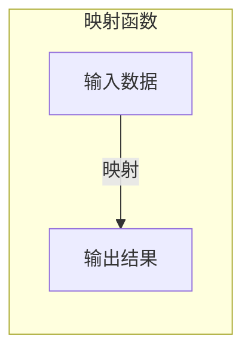

# 一切皆是映射：AI在金融领域的应用探究

## 1. 背景介绍

### 1.1 金融行业的挑战

金融行业一直是高度复杂和规范化的领域。随着全球经济的不断发展和金融市场的日益活跃,金融机构面临着诸多挑战,例如:

- 海量数据处理
- 风险管理与合规性
- 客户需求个性化
- 投资组合优化
- 欺诈检测

### 1.2 人工智能的崛起

近年来,人工智能(AI)技术取得了长足的进步,尤其是在机器学习和深度学习领域。AI系统展现出卓越的数据处理能力、模式识别能力和决策能力,为解决金融行业的诸多难题提供了新的途径。

### 1.3 AI与金融的融合

AI与金融的结合,催生了一个全新的研究领域——金融科技(FinTech)。AI技术在金融领域的应用不断深入,包括:

- 智能投资顾问
- 风险建模与管理
- 反欺诈监测
- 客户关系管理
- 算法交易

## 2. 核心概念与联系

### 2.1 映射的概念

在数学和计算机科学中,映射(Mapping)是一种将一个集合的元素与另一个集合的元素相关联的过程。更广义地说,映射描述了两个对象之间的关系。

在AI与金融的结合中,映射扮演着核心角色。我们可以将金融数据、市场信息等输入映射到AI模型中,模型则输出相应的决策或预测。这种输入到输出的转换过程,实际上就是一种映射关系。

### 2.2 AI算法中的映射

大多数AI算法都可以看作是一种映射函数,它将输入数据映射到期望的输出。以监督学习为例,我们利用已标注的训练数据集,使算法学习输入与输出之间的映射关系,从而对新的未知数据进行预测。

无监督学习、强化学习等其他AI范式,也都涉及将输入映射到特定的输出空间。不同的是,它们所学习的映射关系来自于不同的数据来源和目标函数。



### 2.3 AI在金融中的映射应用

AI在金融领域的应用,可以被视为构建各种映射函数的过程:

- 股票预测: 将历史股价、财务数据等映射到未来股价走势
- 客户分析: 将客户信息映射到潜在需求或者风险水平
- 交易决策: 将市场数据映射到最优的买卖时机和策略
- 欺诈检测: 将交易记录映射到欺诈可能性评分

通过学习这些复杂的映射关系,AI系统能够提供有价值的见解和决策支持,提高金融机构的运营效率和风险管理能力。

## 3. 核心算法原理具体操作步骤  

AI在金融领域的应用通常涉及以下几种核心算法:

### 3.1 机器学习算法

#### 3.1.1 监督学习

监督学习算法通过学习已标注的训练数据,建立输入特征与目标输出之间的映射关系。在金融领域中,监督学习可应用于以下任务:

1. **回归任务**
    - 股票价格预测
    - 贷款风险评估
    - 资产估值

2. **分类任务**  
    - 客户分类与营销
    - 欺诈检测
    - 信用评级

常用的监督学习算法包括线性回归、逻辑回归、决策树、随机森林、支持向量机等。

#### 3.1.2 无监督学习

无监督学习算法则从未标注的原始数据中发现内在模式和结构,常用于以下金融任务:

1. **聚类分析**
    - 客户细分
    - 异常检测
    - 投资组合优化

2. **降维与可视化**
    - 风险曲面可视化
    - 高维数据压缩

3. **关联规则挖掘**
    - 交易模式发现
    - 推荐系统

常见的无监督算法有K-Means聚类、层次聚类、主成分分析(PCA)、关联规则挖掘等。

#### 3.1.3 强化学习

强化学习算法通过与环境的交互,学习映射状态到行为的最优策略,以maximizeize长期累积回报。在金融领域,强化学习可应用于:

1. **算法交易**
    - 基于市场数据,自动决策买卖时机和数量

2. **投资组合管理**  
    - 动态调整投资组合,平衡风险和收益

3. **资产配置**
    - 根据投资目标和风险偏好,分配资产

常用的强化学习算法包括Q-Learning、策略梯度、Actor-Critic等。

### 3.2 深度学习算法

深度学习算法利用多层神经网络,自动从原始数据中提取特征,并学习输入到输出的复杂映射关系。在金融领域,深度学习可应用于:

1. **时间序列预测**
    - 利用循环神经网络(RNN)、长短期记忆网络(LSTM)等模型预测股价、汇率等时序数据

2. **文本分析**
    - 使用卷积神经网络(CNN)、Transformer等模型分析新闻、社交媒体等非结构化文本数据,用于情感分析、事件驱动策略等

3. **图像识别**
    - 应用于票据识别、签名验证等金融场景

4. **生成对抗网络(GAN)**
    - 生成合成数据增强训练集
    - 模拟金融风险情景

深度学习模型能够自动提取高阶特征,捕捉复杂的非线性映射关系,在许多金融任务上展现出优异的性能。

### 3.3 算法组合

除了单一算法,我们还可以将多种算法进行组合,构建复杂的混合模型,以获得更好的性能和泛化能力。例如:

- 将聚类算法与分类算法相结合,先对数据进行细分,再对每个子群体构建分类器
- 使用Boosting或Stacking等集成学习方法,将多个基学习器的预测结果进行组合
- 将深度学习模型与传统机器学习模型相结合,形成混合智能系统

通过算法组合,我们可以充分利用各种算法的优势,构建出更加强大和鲁棒的AI系统,为金融领域提供更精准的决策支持。

## 4. 数学模型和公式详细讲解举例说明

在AI算法中,数学模型和公式扮演着至关重要的角色。它们为算法提供了理论基础,并指导了算法的设计和优化。以下是一些在金融AI应用中常见的数学模型和公式:

### 4.1 线性回归

线性回归是最基本的监督学习算法之一,它试图找到一个最佳拟合的线性方程,将输入特征映射到连续的目标变量。线性回归的数学模型可表示为:

$$y = w_0 + w_1x_1 + w_2x_2 + \cdots + w_nx_n$$

其中$y$是目标变量,$x_i$是输入特征,$w_i$是对应的权重系数。通过最小化均方误差等损失函数,我们可以学习到最优的权重参数$w$。

线性回归在金融领域中有着广泛的应用,例如股票价格预测、资产估值等。尽管简单,但它为更复杂的非线性模型奠定了基础。

### 4.2 逻辑回归

逻辑回归是一种广泛使用的分类算法,它将输入特征映射到0到1之间的概率值,表示实例属于正类的可能性。逻辑回归模型的数学形式为:

$$P(y=1|x) = \sigma(w_0 + w_1x_1 + w_2x_2 + \cdots + w_nx_n)$$

其中$\sigma(z) = 1 / (1 + e^{-z})$是Sigmoid函数,将线性组合映射到(0,1)范围内。通过最大似然估计等方法,我们可以学习到最优的权重参数$w$。

逻辑回归在金融领域中可用于客户分类、欺诈检测、信用评级等二分类任务。它也可以推广到多分类问题,例如客户细分。

### 4.3 支持向量机(SVM)

支持向量机是另一种常用的监督学习模型,它试图找到一个最优超平面,将不同类别的实例最大程度地分开。对于线性可分的情况,SVM的数学模型为:

$$\begin{align}
\min_{w,b} \quad & \frac{1}{2}\|w\|^2 \\
\text{s.t.} \quad & y_i(w^Tx_i + b) \geq 1, \quad i=1,\ldots,n
\end{align}$$

其中$w$是超平面的法向量,$b$是偏移量。对于线性不可分的情况,我们可以引入核技巧,将数据映射到更高维的特征空间。

SVM在金融领域中可用于各种分类任务,如信用评级、欺诈检测等。它还可以用于回归问题,即支持向量回归(SVR)。

### 4.4 主成分分析(PCA)

主成分分析是一种常用的无监督降维技术,它通过正交变换将原始特征映射到一组相互正交的主成分上,从而达到降维的目的。PCA的数学模型为:

$$\begin{align}
\max_{u_1,\ldots,u_d} \quad & \sum_{i=1}^d \text{Var}(u_i^TX) \\
\text{s.t.} \quad & u_i^Tu_j = 0, \quad i \neq j
\end{align}$$

其中$u_i$是第$i$个主成分的方向向量,$\text{Var}(u_i^TX)$表示投影到$u_i$方向上的方差。

在金融领域,PCA可用于降低风险数据的维度,提高模型的计算效率和可解释性。它还可以用于数据可视化,将高维数据投影到二维或三维空间进行观察。

### 4.5 马尔可夫决策过程(MDP)

马尔可夫决策过程是强化学习中的一种核心数学模型,它描述了智能体与环境之间的交互过程。MDP可以形式化为一个元组$(S, A, P, R, \gamma)$,其中:

- $S$是状态集合
- $A$是动作集合
- $P(s'|s,a)$是状态转移概率
- $R(s,a,s')$是即时奖励函数
- $\gamma \in [0,1)$是折现因子

强化学习算法的目标是找到一个最优策略$\pi^*$,使得在MDP中的累积折现奖励最大化:

$$\pi^* = \arg\max_\pi \mathbb{E}\left[\sum_{t=0}^\infty \gamma^t R(s_t, a_t, s_{t+1})\right]$$

其中$s_t$和$a_t$分别是第$t$个时刻的状态和动作。

在算法交易和投资组合管理等金融应用中,MDP可以用于建模市场环境,智能体则是交易代理,通过与市场交互来学习最优的交易策略。

以上只是金融AI应用中的一小部分数学模型和公式。随着AI技术的不断发展,更多的数学工具和理论将被引入,为金融领域带来新的洞见和创新。

## 5. 项目实践:代码实例和详细解释说明

为了更好地理解AI在金融领域的应用,我们将通过一个实际项目案例,展示如何使用Python及相关库构建一个简单的股票价格预测模型。

### 5.1 数据准备

我们将使用Python的`yfinance`库从雅虎财经获取历史股票数据。以苹果公司(AAPL)为例:

```python
import yfinance as yf

# 获取苹果公司2015年至今的历史股价数据
aapl = yf.Ticker("AAPL")
data = aapl.history(period="max")

# 查看数据
print(data.head())
```

输出结果将显示包含开盘价、收盘价、最高价、最低价等字段的数据框。

### 5.2 特征工程

接下来,我们需要从原始数据中提取有用的特征,作为模型的输入。常用的特征包括移动平均线、技术指标等:

```python
import ta

# 计算30