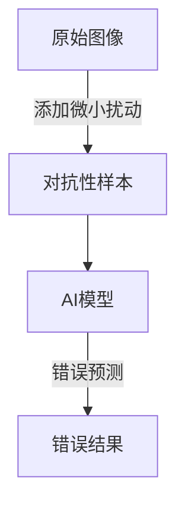
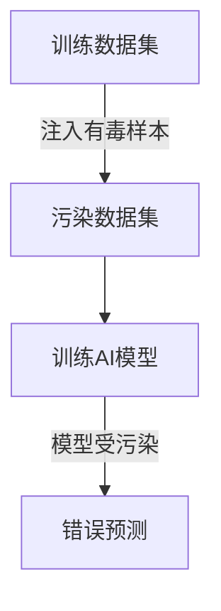
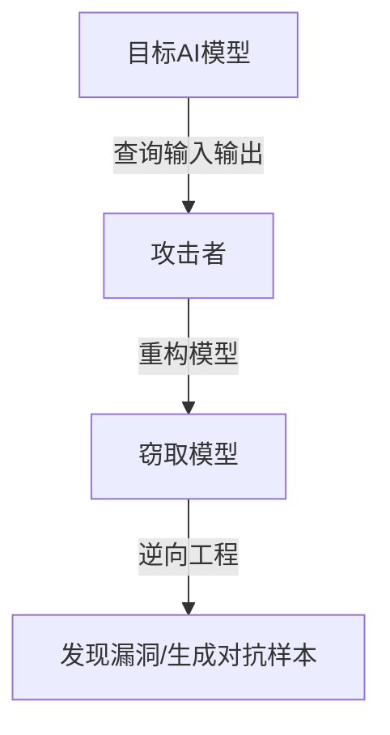

# 一切皆是映射：AI安全：如何保护智能系统不被攻击

## 1.背景介绍

### 1.1 人工智能的崛起

人工智能(AI)技术在过去几年中取得了长足的进步,渗透到了我们生活的方方面面。从语音助手到自动驾驶汽车,从医疗诊断到金融风险评估,AI系统正在改变着我们的工作和生活方式。然而,随着AI系统的广泛应用,确保其安全性和可靠性变得至关重要。

### 1.2 AI安全的重要性

AI系统的失效或被恶意攻击可能会带来灾难性的后果。想象一下,如果一个自动驾驶汽车的感知系统被攻击,导致它无法正确识别红绿灯或行人,后果将不堪设想。同样,如果一个用于医疗诊断的AI系统被篡改,它可能会给出错误的诊断结果,危及患者的生命。因此,保护AI系统免受攻击,确保其安全运行,已经成为一个迫在眉睫的问题。

### 1.3 AI安全的挑战

然而,确保AI系统的安全并非一蹴而就。AI系统通常是高度复杂的,涉及大量的数据、模型和算法。攻击者可能会利用AI系统的弱点,例如对抗性样本、数据中毒或模型窃取等手段,来破坏或操纵AI系统的行为。此外,AI系统通常是黑盒模型,其内部工作机制对人类来说是不透明的,这使得发现和修复安全漏洞变得更加困难。

## 2.核心概念与联系

### 2.1 对抗性样本

对抗性样本(Adversarial Examples)是指经过精心设计的输入数据,它们看起来与正常输入几乎没有区别,但可以欺骗AI模型,导致其做出错误的预测或决策。对抗性样本可以通过添加微小的扰动来生成,这些扰动对人眼来说是不可察觉的,但对AI模型来说却可能产生巨大影响。

例如,在图像分类任务中,对抗性样本可能是在原始图像上添加了一些人眼难以察觉的噪声,但这些噪声会导致AI模型将一只熊猫错误地识别为一辆汽车。

### 2.2 数据中毒

数据中毒(Data Poisoning)攻击是指在AI系统的训练数据中注入有害或误导性的样本,从而影响模型的学习过程,使其在部署时产生不可预测或有害的行为。

例如,在一个用于垃圾邮件检测的AI系统中,攻击者可以在训练数据中注入一些看似正常的电子邮件,但实际上包含了隐藏的恶意代码或链接。如果AI系统被这些有毒数据污染,它可能会将真正的垃圾邮件误判为正常邮件,从而导致安全漏洞。

### 2.3 模型窃取

模型窃取(Model Extraction)攻击是指攻击者试图重构或复制一个AI模型,而无需访问原始训练数据或模型参数。这种攻击可能会导致知识产权被盗用,或者被用于生成对抗性样本等恶意目的。

例如,攻击者可以通过查询一个在线API服务的输入和输出,来逐步重建该服务背后的AI模型。一旦获得了模型的近似复制品,攻击者就可以对其进行逆向工程,寻找漏洞或生成对抗性样本。

### 2.4 AI安全防御

为了应对上述威胁,需要采取多种防御措施来保护AI系统的安全。这些措施包括但不限于:

- 对抗性训练(Adversarial Training):在训练过程中引入对抗性样本,提高模型对扰动的鲁棒性。
- 输入验证(Input Validation):对输入数据进行检查和过滤,排除可疑或有害的数据。
- 模型压缩和混淆(Model Compression and Obfuscation):通过压缩和混淆模型,增加窃取模型的难度。
- 安全监控和响应(Secure Monitoring and Response):持续监控AI系统的行为,一旦发现异常立即采取响应措施。

## 3.核心算法原理具体操作步骤

### 3.1 对抗性训练

对抗性训练是一种有效的防御对抗性样本攻击的方法。它的基本思想是在训练过程中引入对抗性样本,迫使模型学习到对抗性扰动的鲁棒性。具体操作步骤如下:

1. 生成对抗性样本:使用对抗样本生成算法(如FGSM、PGD等)在原始训练数据上添加扰动,生成对抗性样本。
2. 训练模型:将原始训练数据和生成的对抗性样本一同输入模型进行训练。
3. 计算损失:计算模型在原始数据和对抗性样本上的损失函数。
4. 更新模型参数:使用优化算法(如梯度下降)更新模型参数,最小化损失函数。
5. 迭代训练:重复步骤1-4,直到模型在对抗性样本上的准确率达到满意程度。

对抗性训练可以提高模型对扰动的鲁棒性,但也可能导致模型在原始数据上的性能下降。因此,需要在鲁棒性和准确性之间权衡。

### 3.2 输入验证

输入验证是防御数据中毒攻击的一种有效方法。它的目标是在输入数据进入AI系统之前,对其进行检查和过滤,排除可疑或有害的数据。具体操作步骤如下:

1. 数据清洗:对输入数据进行预处理,去除异常值、缺失值等噪声数据。
2. 特征检测:提取输入数据的特征,并与已知的正常数据特征进行比对,识别异常特征。
3. 异常检测:使用统计或机器学习模型,对输入数据进行异常检测,标记可疑数据。
4. 数据过滤:根据异常检测的结果,过滤或删除可疑数据,只允许正常数据进入AI系统。
5. 持续监控:持续监控输入数据的质量,及时发现和处理新的攻击手段。

输入验证可以有效防止有毒数据进入AI系统,但也可能导致一些正常数据被误判为异常而被过滤掉。因此,需要权衡安全性和数据覆盖率。

### 3.3 模型压缩和混淆

模型压缩和混淆是防御模型窃取攻击的一种方法。它的目标是通过压缩和混淆模型,增加窃取模型的难度,从而保护模型的知识产权和安全性。具体操作步骤如下:

1. 模型压缩:使用模型压缩技术(如知识蒸馏、剪枝等)将原始模型压缩为一个更小、更高效的模型,同时保持性能。
2. 模型混淆:对压缩后的模型进行混淆,使其内部结构和参数变得难以理解和解释。
3. 模型保护:将混淆后的模型进行加密或水印保护,防止被盗用或篡改。
4. 安全部署:在受信任的环境中部署受保护的模型,限制外部访问。
5. 持续监控:持续监控模型的使用情况,及时发现和处理任何可疑活动。

模型压缩和混淆可以增加窃取模型的难度,但也可能导致模型性能下降。因此,需要在安全性和性能之间权衡。此外,混淆技术也可能被攻击者逆向破解,因此需要持续更新和改进。

## 4.数学模型和公式详细讲解举例说明

### 4.1 对抗性样本生成

对抗性样本生成是一个优化问题,目标是找到一个最小的扰动,使得原始样本在经过扰动后被错误分类。常用的对抗样本生成算法包括快速梯度符号法(FGSM)和投射梯度下降法(PGD)等。

#### 4.1.1 快速梯度符号法(FGSM)

FGSM是一种简单但有效的对抗样本生成算法。它的基本思想是沿着损失函数梯度的方向移动原始样本,使得扰动后的样本被错误分类。

对于一个输入样本 $x$,其对应的真实标签为 $y$,模型的损失函数为 $J(\theta, x, y)$,其中 $\theta$ 为模型参数。FGSM生成的对抗样本 $x^{adv}$ 可以表示为:

$$x^{adv} = x + \epsilon \cdot \text{sign}(\nabla_x J(\theta, x, y))$$

其中 $\epsilon$ 是扰动的大小,通常是一个较小的常数,用于控制扰动的强度。$\text{sign}(\cdot)$ 是符号函数,它将梯度的每个元素保留其符号(+1或-1),从而使扰动具有相同的方向。

FGSM的优点是计算简单高效,但它只考虑了单步扰动,因此可能不够强大。

#### 4.1.2 投射梯度下降法(PGD)

PGD是一种更强大的对抗样本生成算法,它通过多步迭代来生成对抗样本。PGD的基本思想是在每一步迭代中,沿着损失函数梯度的方向移动样本,并将样本投射回到一个允许的扰动范围内。

对于一个输入样本 $x$,其对应的真实标签为 $y$,模型的损失函数为 $J(\theta, x, y)$,PGD生成的对抗样本 $x^{adv}$ 可以表示为:

$$x^{adv}_0 = x$$
$$x^{adv}_{n+1} = \Pi_{\epsilon}(x^{adv}_n + \alpha \cdot \text{sign}(\nabla_x J(\theta, x^{adv}_n, y)))$$

其中 $\alpha$ 是步长,控制每一步迭代的扰动大小。$\Pi_{\epsilon}(\cdot)$ 是一个投射函数,它将扰动后的样本投射回到一个允许的扰动范围内,通常是一个 $\ell_\infty$ 球体或 $\ell_2$ 球体。

PGD通过多步迭代,可以生成更强大的对抗样本,但计算成本也更高。

### 4.2 对抗性训练

对抗性训练是一种提高模型对抗性样本鲁棒性的有效方法。它的基本思想是在训练过程中引入对抗性样本,迫使模型学习到对抗性扰动的鲁棒性。

对于一个输入样本 $x$,其对应的真实标签为 $y$,模型的损失函数为 $J(\theta, x, y)$,对抗性训练的目标是最小化以下损失函数:

$$\min_\theta \mathbb{E}_{(x, y) \sim D} \left[ \max_{\delta \in \Delta} J(\theta, x + \delta, y) \right]$$

其中 $D$ 是训练数据的分布,$ \Delta$ 是允许的扰动范围,通常是一个 $\ell_\infty$ 球体或 $\ell_2$ 球体。内层的最大化问题是生成对抗样本,外层的最小化问题是优化模型参数,使得模型在对抗样本上的损失最小化。

对抗性训练可以通过多种方法来实现,例如FGSM对抗训练、PGD对抗训练等。这些方法的区别在于对内层最大化问题的求解方式不同。

#### 4.2.1 FGSM对抗训练

FGSM对抗训练是一种简单的对抗性训练方法,它使用FGSM生成对抗样本,然后将这些对抗样本与原始样本一同