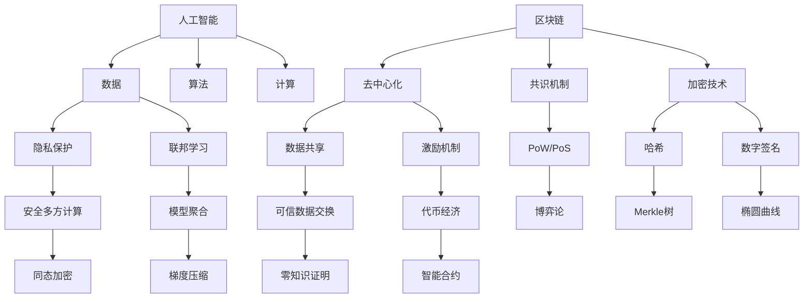

# 一切皆是映射：AI的去中心化：区块链技术的融合

## 1. 背景介绍
### 1.1 人工智能的发展现状
#### 1.1.1 人工智能技术的快速进步
#### 1.1.2 人工智能在各行业的广泛应用
#### 1.1.3 人工智能发展面临的挑战
### 1.2 区块链技术的兴起
#### 1.2.1 区块链的概念与特点 
#### 1.2.2 区块链技术的发展历程
#### 1.2.3 区块链在各领域的应用探索
### 1.3 AI与区块链融合的意义
#### 1.3.1 AI与区块链融合的必要性
#### 1.3.2 AI与区块链融合的潜在优势
#### 1.3.3 AI与区块链融合面临的机遇与挑战

## 2. 核心概念与联系
### 2.1 映射的概念
#### 2.1.1 映射的数学定义
#### 2.1.2 映射在计算机科学中的应用
#### 2.1.3 映射思想在AI和区块链中的体现
### 2.2 去中心化的内涵
#### 2.2.1 中心化与去中心化的区别
#### 2.2.2 去中心化在区块链中的实现
#### 2.2.3 去中心化对AI发展的启示
### 2.3 AI与区块链的关键联系
#### 2.3.1 数据共享与隐私保护
#### 2.3.2 激励机制与共识算法
#### 2.3.3 分布式计算与存储

## 3. 核心算法原理具体操作步骤
### 3.1 区块链中的共识算法
#### 3.1.1 工作量证明(PoW)
#### 3.1.2 权益证明(PoS)
#### 3.1.3 授权股权证明(DPoS)
### 3.2 智能合约的运作原理
#### 3.2.1 智能合约的定义与特点
#### 3.2.2 智能合约的执行流程
#### 3.2.3 智能合约在AI中的应用
### 3.3 联邦学习算法
#### 3.3.1 联邦学习的概念
#### 3.3.2 联邦学习的训练过程
#### 3.3.3 联邦学习在隐私保护中的优势

## 4. 数学模型和公式详细讲解举例说明
### 4.1 区块链中的密码学原理
#### 4.1.1 哈希函数
#### 4.1.2 非对称加密
#### 4.1.3 数字签名
### 4.2 博弈论在共识算法中的应用
#### 4.2.1 纳什均衡
#### 4.2.2 博弈论在PoW中的应用
#### 4.2.3 博弈论在PoS中的应用
### 4.3 联邦学习中的优化算法
#### 4.3.1 梯度下降法
#### 4.3.2 随机梯度下降法
#### 4.3.3 联邦平均算法(FedAvg)

## 5. 项目实践：代码实例和详细解释说明
### 5.1 基于以太坊的智能合约开发
#### 5.1.1 Solidity语言简介
#### 5.1.2 智能合约的编写与部署
#### 5.1.3 智能合约的交互与测试
### 5.2 联邦学习框架的使用
#### 5.2.1 TensorFlow Federated介绍
#### 5.2.2 联邦学习模型的构建
#### 5.2.3 联邦学习的训练与评估
### 5.3 区块链与AI结合的案例分析
#### 5.3.1 去中心化的数据共享平台
#### 5.3.2 基于区块链的AI模型市场
#### 5.3.3 联邦学习在医疗领域的应用

## 6. 实际应用场景
### 6.1 供应链管理
#### 6.1.1 供应链中的信任问题
#### 6.1.2 区块链在供应链溯源中的应用
#### 6.1.3 AI在供应链优化中的应用
### 6.2 金融服务
#### 6.2.1 去中心化金融(DeFi)的兴起
#### 6.2.2 AI在金融风险控制中的应用
#### 6.2.3 区块链与AI在金融领域的融合案例
### 6.3 医疗健康
#### 6.3.1 医疗数据的隐私保护
#### 6.3.2 区块链在医疗数据共享中的应用
#### 6.3.3 AI在医疗诊断和药物开发中的应用

## 7. 工具和资源推荐
### 7.1 区块链开发工具
#### 7.1.1 以太坊开发框架Truffle
#### 7.1.2 超级账本(Hyperledger)
#### 7.1.3 去中心化应用(DApp)开发工具
### 7.2 人工智能开发工具
#### 7.2.1 TensorFlow
#### 7.2.2 PyTorch
#### 7.2.3 Keras
### 7.3 学习资源
#### 7.3.1 在线课程平台
#### 7.3.2 技术博客与社区
#### 7.3.3 开源项目与案例

## 8. 总结：未来发展趋势与挑战
### 8.1 AI与区块链融合的发展趋势
#### 8.1.1 隐私保护与数据共享的平衡
#### 8.1.2 去中心化AI的探索
#### 8.1.3 区块链与AI在更多领域的融合应用
### 8.2 面临的挑战
#### 8.2.1 技术标准的制定
#### 8.2.2 法律法规的完善
#### 8.2.3 人才培养与跨领域合作
### 8.3 展望未来
#### 8.3.1 AI与区块链融合的远景
#### 8.3.2 技术创新与商业模式的变革
#### 8.3.3 构建信任、安全、高效的智能化未来

## 9. 附录：常见问题与解答
### 9.1 区块链的可扩展性问题
### 9.2 AI模型的可解释性问题
### 9.3 去中心化与监管的平衡
### 9.4 AI与区块链融合的安全风险
### 9.5 跨链互操作性的实现

人工智能和区块链,作为当前最具颠覆性和变革性的两大技术,正在加速融合,彼此赋能,释放出巨大的创新潜力。一方面,区块链为人工智能提供了可信的数据基础、激励机制和去中心化的计算范式;另一方面,人工智能为区块链赋予了更强大的智能化能力,提升了效率和安全性。两者的结合,正在重塑我们对数据、智能、信任的理解,并为未来智能化社会的构建奠定基础。

在这个融合的过程中,映射的思想贯穿始终。无论是区块链中交易与区块之间的映射,还是人工智能中数据与模型之间的映射,抑或是现实世界与数字世界之间的映射,映射的本质都是建立不同事物之间的对应关系,实现信息的传递和价值的流通。通过映射,我们可以将复杂的现实问题转化为可计算、可优化的数学模型,并借助区块链和人工智能技术来高效求解。

同时,去中心化的理念也是区块链与人工智能融合的重要基石。传统的人工智能系统往往依赖于中心化的数据存储和计算,存在单点故障、数据垄断等风险。而区块链提供了一种去中心化的数据共享和激励机制,使得多方可以在保护隐私的前提下安全地共享数据,并获得相应的激励。这为人工智能的训练提供了更加丰富、多元的数据来源,同时也促进了人工智能模型的公平性和可信性。

未来,随着技术的不断成熟和应用的深入,AI与区块链的融合必将催生出更多创新的应用场景和商业模式。在供应链管理、金融服务、医疗健康等领域,二者的结合将带来效率的提升、成本的降低和信任的重塑。同时,这也对技术标准、法律法规、人才培养等方面提出了新的要求,需要产学研各界的共同努力。

展望未来,AI与区块链的融合将引领我们走向一个更加智能、更加安全、更加高效的时代。在这个过程中,我们需要秉持开放、包容、创新的态度,在合作中探索,在实践中完善,共同构建一个值得信赖的智能化未来。一切皆是映射,让我们携手,用技术的力量,映射出一个更加美好的世界。

作者：禅与计算机程序设计艺术 / Zen and the Art of Computer Programming