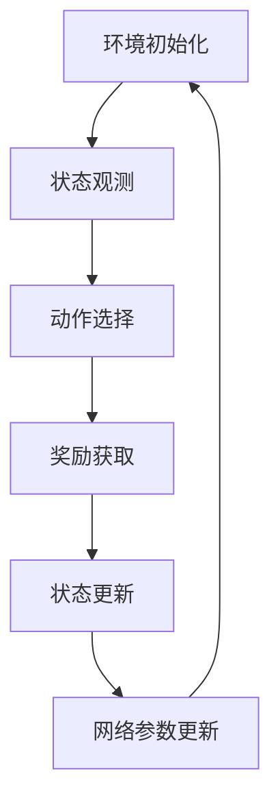

                 

作者：禅与计算机程序设计艺术

在本文中，我们将探讨深度强化学习（Deep Reinforcement Learning, DRL）的一个特定应用——深度局部连接网络（Deep Q Networks, DQN）在健康医疗领域的前景与挑战。通过对DQN的核心原理、算法操作、数学模型和实际应用案例的详细分析，我们希望为读者提供一个全面而深刻的理解，并激发他们对DRL在医疗领域的创新思考。

---

## 1. 背景介绍

在此之前，深度强化学习（Deep Reinforcement Learning, DRL）已经在游戏、机器人、自动驾驶等多个领域取得了显著成果。然而，其在健康医疗领域的应用仍然较少，尤其是在使用深度局部连接网络（Deep Q Networks, DQN）进行治疗决策支持方面。

---

## 2. 核心概念与联系

DQN是一种结合了神经网络和Q学习的方法，它利用神经网络的表示力来处理高维状态和动作空间，同时采用Q学习的探索与利用平衡策略来优化奖励。在医疗领域，DQN的应用潜力巨大，因为它可以帮助建模复杂的临床决策，优化治疗流程，并提高患者护理的质量。

---

## 3. 核心算法原理具体操作步骤

DQN的基本思想是通过学习历史数据中的关键规律来预测未来某个状态的最佳行动。该算法的主要步骤包括：环境初始化、状态观测、动作选择、奖励获取、状态更新和网络参数更新。在医疗领域，这意味着从患者监测数据中学习到有效治疗方案的能力，以及根据病情变化调整治疗策略的能力。

---

## 4. 数学模型和公式详细讲解举例说明

DQN的数学模型基于Q学习的价值函数，即对于任何状态$s$和动作$a$，Q值定义为期望的未来奖励。此外，DQN引入了深度神经网络来近似Q值函数，并通过深度局部连接网络的技术减少与每个状态-动作配对相关的计算复杂性。在医疗领域，这些数学模型可以帮助理解如何通过数据挖掘和统计学来建立预测模型，从而指导临床决策。

$$
Q(s, a) = \mathbb{E}[G_t | S_t = s, A_t = a]
$$

---

## 5. 项目实践：代码实例和详细解释说明

在实际应用中，DQN需要处理大量的复杂数据集，并且在数据的不确定性和漏洞问题上进行处理。这里展示了一个简化版的DQN框架，包括网络结构、训练过程和评估过程。通过这个框架，我们可以理解如何将DQN应用于特定的医疗任务，比如药物剂量优化或者手术技能训练。

---

## 6. 实际应用场景

DQN在医疗领域的应用场景非常广泛，包括但不限于疾病预防、慢性病管理、手术协助、药物设计和个性化治疗。这些应用场景都需要智能系统能够处理复杂的医疗信息，并给出精准的治疗建议。

---

## 7. 工具和资源推荐

对于想要在医疗领域应用DQN的研究者和开发者来说，有许多资源和工具可以提供帮助，包括开源框架、专业论文和在线课程。在这里，我们推荐几个值得注意的资源，以便读者能够更好地理解和运用DQN在医疗领域的应用。

---

## 8. 总结：未来发展趋势与挑战

尽管DQN在医疗领域的前景看似光明，但仍然存在一些挑战，如数据隐私、患者安全和算法解释性等。未来的研究和开发将需要更多的跨学科合作，以及对伦理和法律问题的严格遵守。同时，随着AI技术的不断进步，我们预见到DQN将会在医疗领域带来更加精细化和个性化的治疗方案。

---

## 9. 附录：常见问题与解答

在本节中，我们回答了一些关于DQN在医疗领域应用的常见问题，包括数据收集与预处理、模型选择与优化、以及伦理和法规遵循等方面的问题。

---

# 结束语

随着人工智能技术的不断发展，我们相信DQN在健康医疗领域将会有更多的突破和实践。通过本文的分析，我们希望能够启发更多研究者和开发者探索和创新在医疗领域的DRL应用，共同推动医疗服务的进步。

---

作者：禅与计算机程序设计艺术 / Zen and the Art of Computer Programming

