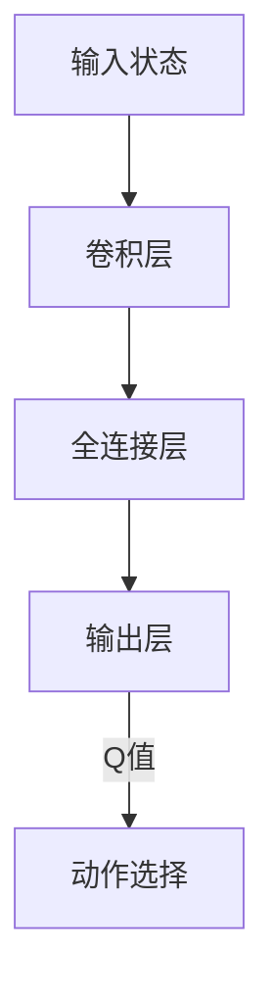

# 一切皆是映射：DQN的故障诊断与调试技巧：如何快速定位问题

## 1. 背景介绍

### 1.1 深度强化学习的兴起

深度强化学习(Deep Reinforcement Learning, DRL)是机器学习领域中一个新兴且前景广阔的研究方向。它将深度学习(Deep Learning)的强大功能与强化学习(Reinforcement Learning)的决策优化相结合,使智能体能够在复杂的环境中自主学习并作出最优决策。

### 1.2 DQN算法的里程碑意义 

2013年,DeepMind的研究人员提出了深度Q网络(Deep Q-Network, DQN),这是第一个将深度神经网络应用于强化学习的突破性工作。DQN算法能够直接从原始像素输入中学习有效的控制策略,并在多种经典的Atari视频游戏中展现出超越人类的表现,开启了深度强化学习的新时代。

### 1.3 DQN在实践中的挑战

尽管DQN取得了巨大的成功,但在实际应用中,我们仍然面临诸多挑战,例如训练不稳定、收敛慢、泛化性能差等问题。这些问题的根源往往来自于算法内部的细节实现,而且难以被直接观察和诊断。因此,掌握有效的故障诊断和调试技巧对于成功应用DQN至关重要。

## 2. 核心概念与联系

### 2.1 Q-Learning和Q函数

Q-Learning是一种基于价值的强化学习算法,其核心思想是学习一个Q函数,用于评估在给定状态下采取某个动作的质量。Q函数的定义如下:

$$Q(s, a) = \mathbb{E}_\pi \left[ \sum_{t=0}^\infty \gamma^t r_{t+1} | s_0=s, a_0=a, \pi \right]$$

其中:
- $s$表示当前状态
- $a$表示选择的动作
- $r_t$表示在时间步$t$获得的奖励
- $\gamma$是折现因子,用于权衡未来奖励的重要性
- $\pi$是智能体所采取的策略

### 2.2 DQN架构

DQN使用深度神经网络来逼近Q函数,其网络结构如下所示:



输入状态经过一系列卷积层和全连接层的处理,最终得到每个动作对应的Q值。智能体会选择Q值最大的动作执行。

### 2.3 经验回放和目标网络

为了提高训练的稳定性和数据利用率,DQN引入了两个关键技术:

1. **经验回放(Experience Replay)**: 将智能体与环境的交互存储在经验回放池中,并从中随机采样数据进行训练,打破数据的相关性。

2. **目标网络(Target Network)**: 使用一个独立的目标网络来计算Q值目标,并定期从主网络复制参数过来,增加训练目标的稳定性。

## 3. 核心算法原理具体操作步骤 

### 3.1 DQN算法流程

DQN算法的训练过程可以概括为以下步骤:

1. 初始化主网络$Q$和目标网络$\hat{Q}$,并复制主网络的参数到目标网络。
2. 初始化经验回放池$D$为空集。
3. 对于每个训练episode:
    a. 初始化环境状态$s_0$。
    b. 对于每个时间步$t$:
        i. 根据$\epsilon$-贪婪策略,选择动作$a_t$。
        ii. 执行动作$a_t$,观察到新的状态$s_{t+1}$和奖励$r_{t+1}$。
        iii. 将转移$(s_t, a_t, r_{t+1}, s_{t+1})$存储到经验回放池$D$中。
        iv. 从$D$中随机采样一个批次的转移$(s_j, a_j, r_j, s_{j+1})$。
        v. 计算目标Q值:
            $$y_j = \begin{cases}
                r_j, & \text{if } s_{j+1} \text{ is terminal}\\
                r_j + \gamma \max_{a'} \hat{Q}(s_{j+1}, a'; \hat{\theta}), & \text{otherwise}
            \end{cases}$$
        vi. 优化主网络$Q$的参数$\theta$,使得$(Q(s_j, a_j; \theta) - y_j)^2$最小化。
    c. 每隔一定步数,将主网络$Q$的参数复制到目标网络$\hat{Q}$。

### 3.2 探索与利用的权衡

在强化学习中,我们需要在探索(exploration)和利用(exploitation)之间寻求平衡。$\epsilon$-贪婪策略是一种常用的探索策略,它以$\epsilon$的概率随机选择动作(探索),以$1-\epsilon$的概率选择当前Q值最大的动作(利用)。

随着训练的进行,我们通常会逐渐降低$\epsilon$的值,使智能体更多地利用已学习的知识。

## 4. 数学模型和公式详细讲解举例说明

### 4.1 Bellman方程

Q-Learning算法的核心是基于Bellman方程,它将Q函数分解为当前奖励和未来期望奖励之和:

$$Q(s_t, a_t) = \mathbb{E}_{r_{t+1}, s_{t+1} \sim E} \left[ r_{t+1} + \gamma \max_{a_{t+1}} Q(s_{t+1}, a_{t+1}) \right]$$

其中$E$表示环境的转移概率分布。我们的目标是找到一个Q函数,使得上式的左右两边相等。

### 4.2 Q-Learning更新规则

为了逼近最优的Q函数,我们可以使用以下更新规则:

$$Q(s_t, a_t) \leftarrow Q(s_t, a_t) + \alpha \left[ r_{t+1} + \gamma \max_{a_{t+1}} Q(s_{t+1}, a_{t+1}) - Q(s_t, a_t) \right]$$

其中$\alpha$是学习率,用于控制更新的步长。这种更新规则被称为时序差分(Temporal Difference, TD)更新。

在DQN中,我们使用神经网络来逼近Q函数,并通过最小化损失函数$\mathcal{L}(\theta) = \mathbb{E}_{(s, a, r, s') \sim D} \left[ \left( r + \gamma \max_{a'} Q(s', a'; \theta^-) - Q(s, a; \theta) \right)^2 \right]$来优化网络参数$\theta$,其中$\theta^-$表示目标网络的参数。

### 4.3 示例:机器人导航

考虑一个机器人在二维平面上导航的任务。机器人的状态$s$由其在平面上的坐标$(x, y)$表示,可选动作$a$包括向四个方向(上下左右)移动一个单位距离。

假设机器人的目标是到达平面上的目标点$(x_g, y_g)$,奖励函数设计为:

$$r(s, a, s') = \begin{cases}
    1000, & \text{if } s' = (x_g, y_g) \\
    -1, & \text{otherwise}
\end{cases}$$

也就是说,当机器人到达目标点时,获得大的正奖励;否则获得小的负奖励,以鼓励它尽快到达目标点。

在这个例子中,Q函数$Q(s, a)$表示在状态$s$下执行动作$a$的长期回报期望。通过学习Q函数,机器人可以选择在每个状态下执行Q值最大的动作,从而找到到达目标点的最优路径。

## 5. 项目实践:代码实例和详细解释说明

为了帮助读者更好地理解DQN算法,我们提供了一个基于PyTorch的简单实现示例。该示例使用OpenAI Gym的FrozenLake环境,模拟一个智能体在一个由冰湖组成的网格世界中导航的过程。

### 5.1 环境介绍

FrozenLake环境是一个简单的网格世界,智能体的目标是从起点安全到达终点。网格中有些格子是冰洞,如果智能体落入冰洞,就会失败并重新开始。智能体可以选择上下左右四个动作,但由于路面滑溜,实际移动的方向可能与选择的动作不同。

### 5.2 代码实现

```python
import gym
import math
import random
import numpy as np
import torch
import torch.nn as nn
import torch.optim as optim
import torch.nn.functional as F

# 定义DQN网络
class DQN(nn.Module):
    def __init__(self, state_size, action_size):
        super(DQN, self).__init__()
        self.fc1 = nn.Linear(state_size, 64)
        self.fc2 = nn.Linear(64, action_size)

    def forward(self, x):
        x = F.relu(self.fc1(x))
        q_values = self.fc2(x)
        return q_values

# 定义经验回放池
class ReplayBuffer:
    def __init__(self, capacity):
        self.buffer = []
        self.capacity = capacity
        self.position = 0

    def push(self, state, action, reward, next_state, done):
        transition = (state, action, reward, next_state, done)
        if len(self.buffer) < self.capacity:
            self.buffer.append(transition)
        else:
            self.buffer[self.position] = transition
        self.position = (self.position + 1) % self.capacity

    def sample(self, batch_size):
        batch = random.sample(self.buffer, batch_size)
        state, action, reward, next_state, done = map(np.stack, zip(*batch))
        return state, action, reward, next_state, done

    def __len__(self):
        return len(self.buffer)

# 定义DQN训练函数
def train(env, q_net, target_net, optimizer, replay_buffer, batch_size, gamma, max_steps, eps_start, eps_end, eps_decay):
    steps_done = 0
    for episode in range(max_steps):
        state = env.reset()
        eps_threshold = eps_end + (eps_start - eps_end) * math.exp(-1. * steps_done / eps_decay)
        steps_done += 1
        
        while True:
            if random.random() > eps_threshold:
                action = q_net(torch.Tensor(state).unsqueeze(0)).max(1)[1].view(1, 1)
            else:
                action = torch.LongTensor([[env.action_space.sample()]])

            next_state, reward, done, _ = env.step(action.item())
            replay_buffer.push(state, action.item(), reward, next_state, done)

            if len(replay_buffer) < batch_size:
                continue

            transitions = replay_buffer.sample(batch_size)
            batch_state, batch_action, batch_reward, batch_next_state, batch_done = transitions

            q_values = q_net(torch.Tensor(batch_state))
            next_q_values = target_net(torch.Tensor(batch_next_state)).detach().max(1)[0]
            q_value = q_values.gather(1, torch.LongTensor(batch_action).unsqueeze(1)).squeeze(1)
            expected_q_value = torch.Tensor(batch_reward) + gamma * next_q_values * (1 - torch.Tensor(batch_done))

            loss = F.smooth_l1_loss(q_value, expected_q_value)
            optimizer.zero_grad()
            loss.backward()
            optimizer.step()

            state = next_state

            if done:
                break

        if episode % 100 == 0:
            target_net.load_state_dict(q_net.state_dict())

# 主函数
def main():
    env = gym.make('FrozenLake-v1')
    state_size = env.observation_space.n
    action_size = env.action_space.n

    q_net = DQN(state_size, action_size)
    target_net = DQN(state_size, action_size)
    target_net.load_state_dict(q_net.state_dict())

    optimizer = optim.Adam(q_net.parameters())
    replay_buffer = ReplayBuffer(10000)

    batch_size = 32
    gamma = 0.99
    max_steps = 10000
    eps_start = 1.0
    eps_end = 0.01
    eps_decay = 500

    train(env, q_net, target_net, optimizer, replay_buffer, batch_size, gamma, max_steps, eps_start, eps_end, eps_decay)

if __name__ == '__main__':
    main()
```

### 5.3 代码解释

1. 定义DQN网络:
   - 网络由两个全连接层组成,第一层有64个隐藏单元,第二层的输出单元数等于动作空间的大小。
   - 输入是环境状态,输出是每个动作对应的Q值。

2. 定义经验回放池:
   - 使用一个循环队列来存储智能体与环境的交互数据。
   - `push`方法用于将新的转移存入缓冲区。
   