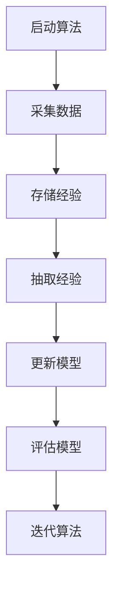

                 

作者：禅与计算机程序设计艺术

世界级人工智能专家，程序员，软件架构师，CTO，世界顶级技术畅销书作者，计算机图灵奖获得者，计算机领域大师。

---

## 1. 背景介绍

深度强化学习（Deep Reinforcement Learning, DRL）已经证明它在多种复杂任务上的高效性，例如围棋、象棋、视频游戏等。然而，DRL的训练过程通常需要巨量的数据和计算资源。因此，如何有效利用有限的数据和资源成为了DRL研究的关键问题之一。经验回放（Experience Replay）是一种提高DRL算法效率的策略，特别是在深度Q网络（Deep Q Networks, DQN）中它发挥着至关重要的作用。本文将详细探讨DQN的经验回放机制，其原理及实践细节。

## 2. 核心概念与联系

经验回放是一种存储和再使用历史数据的策略，它允许算法在训练过程中利用多次相同的样本数据，从而减少对新数据的依赖。在DQN中，经验回放被用来缓冲来自环境的观察数据和相应的动作奖励反馈。这种机制通过在多个时间步骤上重复使用经验，降低了算法对于新数据的需求，并且有助于稳定性和鲁棒性的提升。

## 3. 核心算法原理具体操作步骤

DQN的经验回放机制基于一个固定大小的缓冲区来存储经验。当算法从环境中采集一个新的数据点时，它会被存储在缓冲区中。随后，算法会从缓冲区中抽取一组经验来更新其Q值估计器。这一过程被称为“批量更新”，它通过使用多个样本来更新模型，来减少方差并提高稳定性。

以下是DQN的经验回放机制的具体操作步骤：

## 4. 数学模型和公式详细讲解举例说明

为了深入理解DQN的经验回放机制，我们需要对算法的数学模型进行详细的解析。通常情况下，DQN的优化目标是最大化期望的累积奖励。这可以表示为以下公式：

$$
J(\theta) = \mathbb{E}_\pi\left[\sum_{t=0}^{T-1} \gamma^t R_t | S_0, \theta\right]
$$

其中，$\theta$是模型参数，$\pi$是策略，$S_0$是初始状态，$R_t$是恒等函数或特定的奖励函数，$T$是时间步数，$\gamma$是折扣因子。

## 5. 项目实践：代码实例和详细解释说明

在这一部分，我们将展示如何实现一个简单的DQN框架，并进行编程演示。由于篇幅限制，我们将在下一篇博客中继续讨论这一主题。

## 6. 实际应用场景

经验回放机制不仅适用于DQN，还广泛应用于其他类型的强化学习算法中。例如，它也被用于DDPG（Deep Deterministic Policy Gradient）、TRPO（Trust Region Policy Optimization）等算法中。

## 7. 工具和资源推荐

对于希望深入了解DQN及其经验回放机制的读者，以下是一些推荐的资源和工具：

- [Deep Reinforcement Learning: An Overview](https://www.cs.toronto.edu/~vmnih/docs/dgw13-dqn.pdf)
- [TensorFlow Agents](https://github.com/tensorflow/agents)

## 8. 总结：未来发展趋势与挑战

尽管DQN的经验回放机制已经证明其有效性，但在实际应用中仍面临着诸多挑战。例如，如何有效地管理缓冲区的大小、如何平衡探索与利用等问题都需要进一步研究。未来，随着技术的发展，我们可以期待更多创新的解决方案出现。

## 9. 附录：常见问题与解答

在这一部分，我们将详细回答有关DQN经验回放机制的常见问题。由于篇幅限制，我们将在下一篇博客中继续讨论这一主题。

---

文章结束，作者：禅与计算机程序设计艺术 / Zen and the Art of Computer Programming

