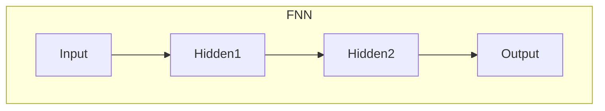
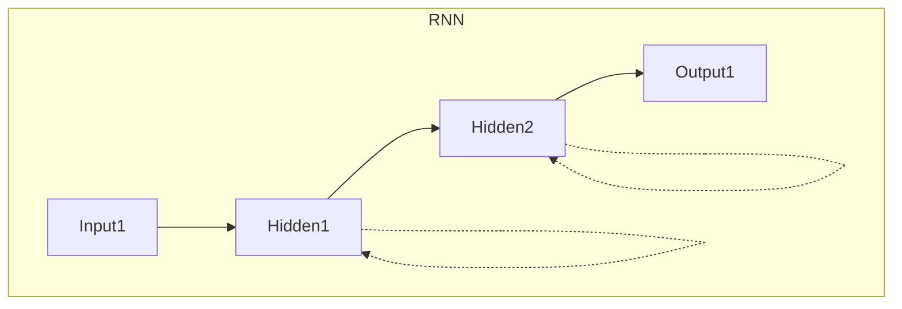
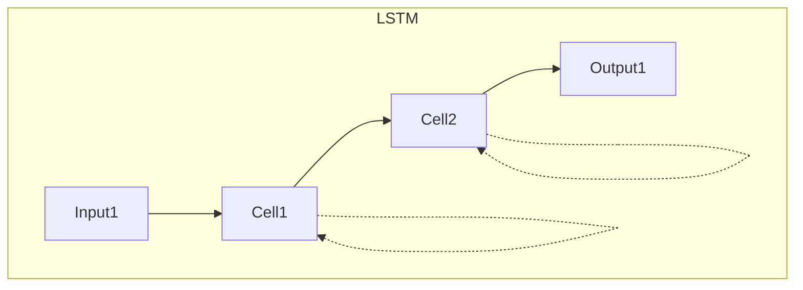

# 一切皆是映射：从生物神经到人工神经网络的演变

## 1. 背景介绍

### 1.1 神经元的奥秘

人类大脑是一个神奇的器官,由数十亿个神经元组成。神经元是大脑的基本计算单元,通过电化学信号相互连接,形成复杂的神经网络。这种网络结构使大脑能够执行各种认知功能,如感知、学习、记忆、推理和决策等。

神经元的工作原理就像一个微型电路,接收来自其他神经元的输入信号,进行加权求和运算,如果总输入超过一定阈值,就会产生动作电位(类似于0/1开关),并将这个信号传递给连接的下游神经元。

### 1.2 人工神经网络的崛起

受生物神经系统的启发,人工神经网络(Artificial Neural Networks, ANNs)应运而生。它是一种由人工神经元互连而成的计算模型,旨在模拟生物神经系统的工作方式。

虽然最早的人工神经网络可以追溯到20世纪40年代,但直到近年来,由于算力的飞速提升和大数据的涌现,人工神经网络才真正展现出强大的能力,在计算机视觉、自然语言处理、推荐系统等领域取得了突破性进展。

## 2. 核心概念与联系

### 2.1 神经元与人工神经元

生物神经元和人工神经元在本质上是相似的,都是一种加权求和计算单元。然而,它们在结构和工作机制上也存在一些差异:

- 结构差异:生物神经元是一种高度复杂的细胞,具有树突、细胞体和轴突等结构;而人工神经元则是一个简化的数学模型,通常只包含权重向量、偏置项和激活函数。

- 连接方式:生物神经元通过突触连接形成网络;人工神经元则是通过全连接或稀疏连接的方式相互连接。

- 学习机制:生物神经元通过调节突触强度来学习;人工神经元则通过反向传播等算法来调整权重和偏置,实现监督或非监督学习。

尽管存在差异,但人工神经元的设计思想源于对生物神经元的模拟和抽象,二者在基本计算原理上保持一致。

### 2.2 神经网络与人工神经网络

神经网络和人工神经网络都是由大量神经元(或人工神经元)相互连接而成的复杂系统。它们具有以下共同特点:

- 分布式并行处理:信息通过多个神经元同时处理,而不是依赖单一处理单元。
- 自适应学习能力:通过调整连接强度(突触权重或人工权重),网络可以从数据中学习模式。
- 容错性:网络具有一定的容错能力,即使部分神经元损坏,也可以继续工作。
- 非线性映射能力:通过非线性激活函数,网络可以近似任意复杂的非线性映射。

然而,人工神经网络也有其独特之处,例如可以设计各种不同的网络结构(如前馈网络、循环网络等)、可以使用不同的学习算法(如反向传播、对比散度等)、可以通过GPU/TPU等硬件加速训练等。

### 2.3 映射的概念

无论是生物神经网络还是人工神经网络,它们的本质都是一种映射(mapping)过程。所谓映射,就是将输入数据(如图像、语音等)映射到输出数据(如分类标签、回归值等)的过程。

这种映射过程可以表示为一个函数 $y=f(x)$,其中 $x$ 表示输入, $y$ 表示输出, $f$ 则是神经网络所学习的映射函数。神经网络通过调整内部参数(权重和偏置),使得 $f(x)$ 能够很好地拟合训练数据,从而实现对新数据的泛化。

因此,无论是生物神经系统还是人工神经网络,都可以被视为一种高度复杂、非线性的映射系统,将感知信息映射为认知输出。这种映射思想贯穿于神经网络的方方面面,是理解其工作原理的核心。

## 3. 核心算法原理具体操作步骤

### 3.1 前馈神经网络

前馈神经网络(Feedforward Neural Network, FNN)是最基本也是最常见的人工神经网络结构。它由输入层、隐藏层和输出层组成,信息只在单一方向传播,没有反馈连接。

前馈神经网络的核心算法步骤如下:

1. 初始化网络权重和偏置,通常使用小的随机值。
2. 对于每个训练样本 $(x, y)$:
    - 前向传播:将输入 $x$ 传播至输出层,获得预测输出 $\hat{y}$。
    - 计算损失函数 $L(y, \hat{y})$,如均方误差或交叉熵损失。
3. 反向传播:
    - 计算输出层误差,并依次向前传播至隐藏层。
    - 利用链式法则,计算每个权重的梯度。
4. 使用优化算法(如梯度下降)更新权重和偏置。
5. 重复步骤2-4,直至收敛或达到最大迭代次数。

通过以上步骤,前馈神经网络可以从数据中学习到输入和输出之间的映射关系。然而,由于网络结构的局限性,它只能对固定长度的输入进行映射,无法处理序列数据。

### 3.2 循环神经网络

为了解决序列数据处理的问题,循环神经网络(Recurrent Neural Network, RNN)应运而生。它引入了循环连接,使得网络能够对序列数据进行建模。

RNN的核心算法步骤如下:

1. 初始化网络权重和隐藏状态。
2. 对于每个时间步 $t$:
    - 前向传播:将输入 $x_t$ 和上一时间步隐藏状态 $h_{t-1}$ 传播至当前隐藏状态 $h_t$ 和输出 $y_t$。
    - 计算损失函数 $L(y_t, \hat{y}_t)$。
3. 反向传播通过时间(BPTT):
    - 计算每个时间步的误差梯度。
    - 利用链式法则,计算每个权重的梯度。
4. 使用优化算法更新权重和偏置。
5. 重复步骤2-4,直至收敛或达到最大迭代次数。

RNN通过引入循环连接,能够捕捉序列数据中的长期依赖关系。然而,在实践中,RNN容易遇到梯度消失或爆炸的问题,导致无法有效学习长序列。

### 3.3 长短期记忆网络

为了解决RNN的梯度问题,长短期记忆网络(Long Short-Term Memory, LSTM)被提出。它引入了门控机制和记忆单元,使网络能够更好地捕捉长期依赖关系。

LSTM的核心算法步骤如下:

1. 初始化网络权重、隐藏状态和记忆单元。
2. 对于每个时间步 $t$:
    - 前向传播:将输入 $x_t$ 和上一时间步隐藏状态 $h_{t-1}$ 传播至当前隐藏状态 $h_t$、记忆单元 $c_t$ 和输出 $y_t$。
    - 计算损失函数 $L(y_t, \hat{y}_t)$。
3. 反向传播通过时间(BPTT):
    - 计算每个时间步的误差梯度。
    - 利用链式法则,计算每个权重的梯度。
4. 使用优化算法更新权重和偏置。
5. 重复步骤2-4,直至收敛或达到最大迭代次数。

LSTM通过门控机制和记忆单元,能够有效地捕捉长期依赖关系,从而解决了RNN的梯度问题。它在自然语言处理、语音识别等序列建模任务中表现出色。

## 4. 数学模型和公式详细讲解举例说明

### 4.1 人工神经元模型

人工神经元是人工神经网络的基本计算单元,其数学模型可以表示为:

$$
y = \phi\left(\sum_{i=1}^{n}w_ix_i + b\right)
$$

其中:

- $x_i$ 表示第 $i$ 个输入;
- $w_i$ 表示与第 $i$ 个输入相关的权重;
- $b$ 表示偏置项;
- $\phi$ 表示激活函数,引入非线性;
- $y$ 表示神经元的输出。

常用的激活函数包括sigmoid函数、tanh函数和ReLU函数等。

### 4.2 前馈神经网络模型

前馈神经网络由多个神经元层组成,每一层的输出作为下一层的输入。对于一个具有 $L$ 层的前馈网络,其数学模型可以表示为:

$$
\begin{aligned}
h^{(1)} &= \phi^{(1)}(W^{(1)}x + b^{(1)}) \\
h^{(2)} &= \phi^{(2)}(W^{(2)}h^{(1)} + b^{(2)}) \\
&\vdots \\
y &= \phi^{(L)}(W^{(L)}h^{(L-1)} + b^{(L)})
\end{aligned}
$$

其中:

- $x$ 表示输入;
- $h^{(l)}$ 表示第 $l$ 层的隐藏层输出;
- $W^{(l)}$ 和 $b^{(l)}$ 分别表示第 $l$ 层的权重矩阵和偏置向量;
- $\phi^{(l)}$ 表示第 $l$ 层的激活函数;
- $y$ 表示网络的最终输出。

通过调整每一层的权重和偏置,前馈神经网络可以学习到输入和输出之间的复杂映射关系。

### 4.3 循环神经网络模型

循环神经网络的数学模型可以表示为:

$$
\begin{aligned}
h_t &= \phi_h(W_{hx}x_t + W_{hh}h_{t-1} + b_h) \\
y_t &= \phi_y(W_{yh}h_t + b_y)
\end{aligned}
$$

其中:

- $x_t$ 表示时间步 $t$ 的输入;
- $h_t$ 表示时间步 $t$ 的隐藏状态;
- $y_t$ 表示时间步 $t$ 的输出;
- $W_{hx}$、$W_{hh}$、$W_{yh}$ 分别表示输入到隐藏层、隐藏层到隐藏层、隐藏层到输出层的权重矩阵;
- $b_h$、$b_y$ 分别表示隐藏层和输出层的偏置向量;
- $\phi_h$、$\phi_y$ 分别表示隐藏层和输出层的激活函数。

循环神经网络通过引入循环连接,能够捕捉序列数据中的长期依赖关系。然而,在实践中,它容易遇到梯度消失或爆炸的问题,导致无法有效学习长序列。

### 4.4 长短期记忆网络模型

为了解决循环神经网络的梯度问题,长短期记忆网络(LSTM)引入了门控机制和记忆单元,其数学模型可以表示为:

$$
\begin{aligned}
f_t &= \sigma(W_f[h_{t-1}, x_t] + b_f) & \text{(forget gate)} \\
i_t &= \sigma(W_i[h_{t-1}, x_t] + b_i) & \text{(input gate)} \\
\tilde{c}_t &= \tanh(W_c[h_{t-1}, x_t] + b_c) & \text{(candidate memory cell)} \\
c_t &= f_t \odot c_{t-1} + i_t \odot \tilde{c}_t & \text{(memory cell)} \\
o_t &= \sigma(W_o[h_{t-1