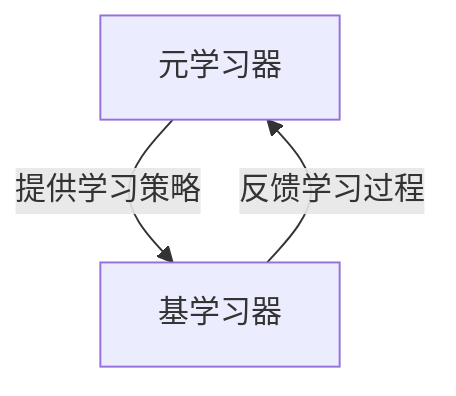
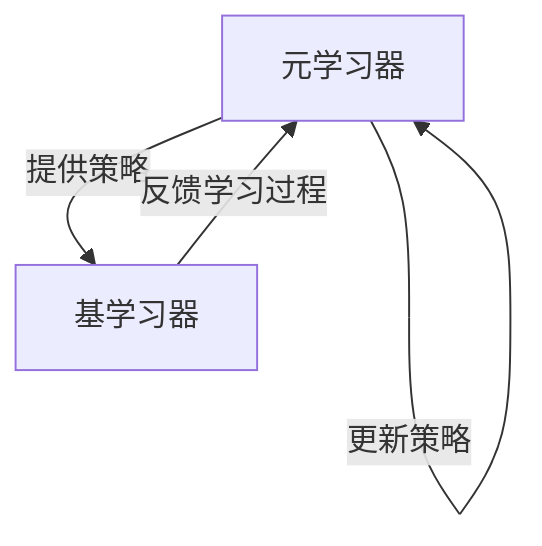

# 一切皆是映射：利用元学习解决非平稳环境下的学习问题

## 1.背景介绍

### 1.1 非平稳环境的挑战

在当今快节奏的数字时代，我们所面临的环境正在不断变化和演进。传统的机器学习算法往往假设训练数据和测试数据来自相同的分布,但在实际应用中,这种假设常常不成立。例如,在自然语言处理任务中,语言模式会随着时间而变化;在计算机视觉领域,相机传感器的升级会导致图像分布发生变化;在推荐系统中,用户偏好会随着时间而改变。这种分布变化被称为"非平稳环境"(non-stationary environment),给机器学习系统的泛化能力带来了巨大挑战。

### 1.2 元学习的崛起

为了应对非平稳环境带来的挑战,元学习(meta-learning)作为一种新兴的机器学习范式应运而生。元学习的核心思想是"学习如何学习"(learning to learn),即通过在一系列相关但不同的任务上进行训练,获得一种可迁移的学习能力,从而在遇到新的任务时能够快速适应和学习。这种学习方式类似于人类的学习过程,我们通过不断积累经验,形成一种通用的学习能力,使我们能够高效地学习新事物。

### 1.3 元学习的应用前景

元学习在诸多领域展现出了巨大的应用潜力,如机器人控制、人工智能辅助系统、持续学习等。其中,将元学习应用于非平稳环境下的学习问题是一个备受关注的热点领域。通过元学习,我们可以构建具有强大适应能力的智能系统,使其能够在动态变化的环境中持续学习和优化,从而更好地服务于现实世界的复杂应用场景。

## 2.核心概念与联系

### 2.1 任务与环境

在元学习的框架中,我们将学习过程划分为一系列相关但不同的任务(tasks)。每个任务都是在特定的环境(environment)中进行的,环境决定了任务的数据分布和目标函数。在非平稳环境下,不同任务之间的环境会发生变化,导致数据分布和目标函数也随之改变。

我们的目标是通过在一系列源任务(source tasks)上进行训练,获得一种可迁移的学习能力,使得在遇到新的目标任务(target task)时,能够快速适应新的环境,实现有效的知识迁移和快速学习。

### 2.2 元学习器与基学习器

在元学习框架中,通常包含两个关键组件:元学习器(meta-learner)和基学习器(base-learner)。

- 基学习器:负责在特定任务上进行实际的学习和预测,通常是一个可参数化的机器学习模型,如神经网络或决策树等。
- 元学习器:负责从源任务中学习一种可迁移的学习策略,并将这种策略应用于新的目标任务,指导基学习器快速适应新环境。

元学习器和基学习器之间存在着紧密的交互关系。元学习器通过观察基学习器在源任务上的学习过程,提取出一种通用的学习策略;而基学习器则利用元学习器提供的策略,在新的目标任务上快速适应和学习。

### 2.3 内循环与外循环

元学习过程通常被划分为两个循环:内循环(inner loop)和外循环(outer loop)。

- 内循环:在每个源任务上,基学习器根据元学习器提供的策略进行学习和更新,以适应当前任务的环境。
- 外循环:元学习器观察基学习器在所有源任务上的学习过程,并根据这些经验更新自身的策略,以提高在新任务上的适应能力。

通过内外循环的交替迭代,元学习系统可以逐步提高在非平稳环境下的学习能力,实现有效的知识迁移和快速适应。

## 3.核心算法原理具体操作步骤

### 3.1 基于优化的元学习算法

基于优化的元学习算法(Optimization-Based Meta-Learning)是一类广为人知的元学习方法,其核心思想是将元学习过程建模为一个双层优化问题。在这种方法中,元学习器的目标是找到一个好的初始化参数,使得基学习器在源任务上只需进行少量梯度更新,就能够快速适应新的环境。

以MAML(Model-Agnostic Meta-Learning)算法为例,其具体操作步骤如下:

1. 初始化元学习器的参数 $\theta$
2. 对于每个源任务 $\mathcal{T}_i$:
    a. 从任务 $\mathcal{T}_i$ 中采样支持集(support set) $\mathcal{D}_i^{tr}$ 和查询集(query set) $\mathcal{D}_i^{val}$
    b. 计算基学习器在支持集上的损失函数 $\mathcal{L}_{\mathcal{T}_i}(\theta)$
    c. 通过梯度下降更新基学习器的参数 $\phi_i = \theta - \alpha \nabla_\theta \mathcal{L}_{\mathcal{T}_i}(\theta)$ (内循环)
    d. 计算基学习器在查询集上的损失函数 $\mathcal{L}_{\mathcal{T}_i}(\phi_i)$
3. 更新元学习器的参数 $\theta \leftarrow \theta - \beta \nabla_\theta \sum_i \mathcal{L}_{\mathcal{T}_i}(\phi_i)$ (外循环)
4. 重复步骤2和3,直到收敛

通过这种双层优化过程,元学习器可以找到一个好的初始化参数 $\theta$,使得基学习器只需进行少量梯度更新,就能够快速适应新的目标任务。

### 3.2 基于度量的元学习算法

另一类广为人知的元学习算法是基于度量的方法(Metric-Based Meta-Learning),其核心思想是学习一个好的表示空间,使得相似的任务在该空间中彼此靠近,从而实现有效的知识迁移。

以匹配网络(Matching Networks)算法为例,其具体操作步骤如下:

1. 初始化编码器网络 $f_\phi$ 和关系模块 $g_\theta$
2. 对于每个源任务 $\mathcal{T}_i$:
    a. 从任务 $\mathcal{T}_i$ 中采样支持集 $\mathcal{D}_i^{tr}$ 和查询集 $\mathcal{D}_i^{val}$
    b. 对于每个查询样本 $x_q$:
        i. 计算 $x_q$ 与支持集中每个样本 $x_s$ 的相似度 $c(x_q, x_s) = g_\theta(f_\phi(x_q), f_\phi(x_s))$
        ii. 根据相似度和支持集标签计算 $x_q$ 的预测标签
    c. 计算查询集上的损失函数 $\mathcal{L}_{\mathcal{T}_i}$
3. 更新编码器和关系模块的参数 $\phi, \theta \leftarrow \phi - \alpha \nabla_\phi \sum_i \mathcal{L}_{\mathcal{T}_i}, \theta - \beta \nabla_\theta \sum_i \mathcal{L}_{\mathcal{T}_i}$
4. 重复步骤2和3,直到收敛

通过这种方式,匹配网络可以学习到一个好的表示空间,使得相似的任务在该空间中彼此靠近,从而实现有效的知识迁移和快速适应。

## 4.数学模型和公式详细讲解举例说明

### 4.1 梯度下降和元梯度

在基于优化的元学习算法中,我们需要计算基学习器在源任务上的损失函数梯度,并通过梯度下降进行参数更新。这个过程可以用以下公式表示:

$$
\phi_i = \theta - \alpha \nabla_\theta \mathcal{L}_{\mathcal{T}_i}(\theta)
$$

其中,$ \theta $是元学习器的参数,$ \phi_i $是基学习器在任务$ \mathcal{T}_i $上的参数,$ \alpha $是学习率,$ \mathcal{L}_{\mathcal{T}_i}(\theta) $是基学习器在任务$ \mathcal{T}_i $上的损失函数。

在外循环中,我们需要计算元学习器的梯度,即所谓的"元梯度"(meta-gradient),并更新元学习器的参数。这个过程可以用以下公式表示:

$$
\theta \leftarrow \theta - \beta \nabla_\theta \sum_i \mathcal{L}_{\mathcal{T}_i}(\phi_i)
$$

其中,$ \beta $是元学习率,$ \mathcal{L}_{\mathcal{T}_i}(\phi_i) $是基学习器在任务$ \mathcal{T}_i $上的查询集损失函数。

需要注意的是,在计算元梯度时,我们需要考虑基学习器参数$ \phi_i $对元学习器参数$ \theta $的依赖关系,这就需要使用链式法则进行求导。具体来说,我们有:

$$
\nabla_\theta \mathcal{L}_{\mathcal{T}_i}(\phi_i) = \nabla_{\phi_i} \mathcal{L}_{\mathcal{T}_i}(\phi_i) \cdot \nabla_\theta \phi_i
$$

将$ \phi_i $的表达式代入,我们可以得到:

$$
\nabla_\theta \mathcal{L}_{\mathcal{T}_i}(\phi_i) = \nabla_{\phi_i} \mathcal{L}_{\mathcal{T}_i}(\phi_i) \cdot \left(I - \alpha \nabla_\theta^2 \mathcal{L}_{\mathcal{T}_i}(\theta)\right)
$$

这个公式揭示了元梯度的计算方式,它不仅依赖于基学习器在查询集上的损失梯度$ \nabla_{\phi_i} \mathcal{L}_{\mathcal{T}_i}(\phi_i) $,还依赖于基学习器在支持集上的二阶导数$ \nabla_\theta^2 \mathcal{L}_{\mathcal{T}_i}(\theta) $。这种二阶导数项的存在,使得元梯度的计算比普通梯度下降更加复杂,但也正是这种高阶信息,使得元学习器能够更好地捕捉任务之间的相似性和差异性,从而实现有效的知识迁移。

### 4.2 相似度度量

在基于度量的元学习算法中,我们需要定义一个相似度度量函数,用于衡量查询样本与支持集样本之间的相似程度。常见的相似度度量函数包括欧几里得距离、余弦相似度等。

以欧几里得距离为例,相似度度量函数可以表示为:

$$
d(x_q, x_s) = \left\lVert f_\phi(x_q) - f_\phi(x_s) \right\rVert_2
$$

其中,$ f_\phi $是编码器网络,用于将原始输入$ x $映射到一个表示空间。相似度度量函数计算查询样本$ x_q $和支持集样本$ x_s $在表示空间中的欧几里得距离,距离越小,则相似度越高。

在匹配网络算法中,相似度度量函数被进一步嵌入到关系模块$ g_\theta $中,用于计算查询样本与支持集样本之间的相似度分数:

$$
c(x_q, x_s) = g_\theta(f_\phi(x_q), f_\phi(x_s))
$$

根据这个相似度分数,我们可以计算查询样本$ x_q $的预测标签,例如通过加权平均支持集标签的方式:

$$
\hat{y}_q = \sum_{x_s \in \mathcal{D}^{tr}} c(x_q, x_s) y_s
$$

通过学习合适的编码器网络$ f_\phi $和关系模块$ g_\theta $,匹配网络可以获得一个好的表示空间和相似度度量,从而实现有效的知识迁移和快速适应。

## 5.项目实践：代码实例和详细解释说明

为了更好地理解元学习算法的实现细节,我们将以MAML算法为例,提供一个简单的PyTorch代码