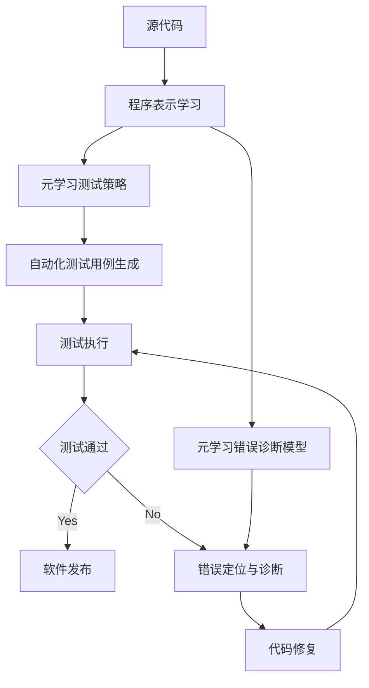

# 一切皆是映射：基于元学习的软件测试和调试

## 1. 背景介绍
### 1.1 软件测试和调试的重要性
软件测试和调试是软件开发生命周期中至关重要的环节。随着软件系统日益复杂，确保软件质量和可靠性变得越来越具有挑战性。传统的软件测试和调试方法面临着效率低下、覆盖不全面、依赖人工经验等问题。因此,亟需探索新的思路和技术来应对这些挑战。

### 1.2 元学习的兴起
近年来,以元学习(Meta-Learning)为代表的机器学习范式受到广泛关注。元学习旨在学习如何学习,通过在任务集上训练模型,使其能够快速适应新的任务。这种学习范式为解决软件测试和调试中的难题提供了新的思路。

### 1.3 映射的普适性
映射(Mapping)是数学和计算机科学中一个基本而普适的概念。从本质上看,程序可以看作是输入到输出的一种映射。而软件测试和调试的过程,就是去发现和修正这个映射中的错误和缺陷。因此,将元学习与映射的思想结合,有望为软件测试和调试开辟新的道路。

## 2. 核心概念与联系
### 2.1 元学习
元学习是一种让机器学习算法能够自我改进的学习范式。其核心思想是学习如何学习,即通过学习一系列任务,总结出一种快速学习新任务的方法。元学习可以分为三个层次:
- 学习算法:如何选择和优化学习算法
- 学习策略:如何选择训练样本、调整超参数
- 学习表示:如何学习更好的特征表示

### 2.2 软件测试
软件测试是在规定的条件下对程序进行操作,以发现程序错误、衡量软件质量、评估软件是否能满足设计要求的过程。其主要目的包括:
- 发现缺陷:发现软件中潜在的错误和缺陷
- 验证需求:验证软件是否满足预期的功能和性能需求
- 建立信心:通过全面的测试建立对软件质量的信心

### 2.3 软件调试
软件调试是定位和修复软件缺陷的过程。当软件测试发现错误时,调试就是要找出错误的根源并加以修正。调试的主要活动包括:
- 错误定位:通过分析错误症状、检查代码等方式定位错误
- 错误诊断:分析错误产生的原因,找出错误的根源
- 错误修正:修改代码,消除错误,使程序恢复正常

### 2.4 元学习与软件测试调试的联系
元学习为软件测试和调试提供了一种全新的思路。传统的软件测试和调试高度依赖人工设计测试用例和人工分析错误,而元学习可以自动学习测试策略和错误诊断知识。通过学习大量项目的测试和调试经验,元学习可以总结出一套有效的测试和调试方法,并将其应用到新的项目中。

同时,元学习中学习表示的思想启发我们,可以学习程序执行的高层次表示,从而更容易发现潜在的错误模式。学习算法的选择和优化,也为设计高效的自动化测试和调试算法提供了新的思路。

## 3. 核心算法原理具体操作步骤
本节介绍基于元学习的软件测试和调试的核心算法原理和具体操作步骤。整体流程如下:



### 3.1 程序表示学习
第一步是学习程序的高层次表示。传统的程序表示如抽象语法树(AST)虽然精确但是缺乏语义信息。我们可以使用图神经网络(GNN)来学习程序的语义表示。具体步骤如下:
1. 将源代码解析为AST
2. 将AST转化为图结构数据
3. 使用GNN学习节点的嵌入表示
4. 使用图级别的池化操作得到整个程序的表示向量

通过这种方式,我们可以将程序映射到一个语义丰富的向量空间中,为后续的测试策略学习和错误诊断奠定基础。

### 3.2 元学习测试策略
有了程序的表示向量后,我们可以使用元学习来学习测试策略。具体来说,我们收集大量历史项目的测试数据,包括程序表示、测试覆盖率、发现的错误等,构成一个元学习任务集。然后使用如MAML等元学习算法来训练一个测试策略模型。

训练好的测试策略模型可以根据新程序的表示快速生成针对性的测试用例。生成测试用例的过程可以看作是程序表示到测试输入的一个映射。通过元学习,我们可以学习到一个泛化性强的测试输入生成映射。

### 3.3 元学习错误诊断模型
除了生成测试用例,我们还希望自动诊断发现的错误并定位错误根源。同样,我们可以将错误诊断看作是一个映射学习问题。我们收集历史项目中的错误样本,包括错误程序的表示、错误症状、错误类型和位置等,构建一个错误诊断的元学习任务集。

然后使用元学习算法如Prototypical Networks来训练一个错误诊断模型。该模型可以根据新发现错误的症状,快速与已知的错误原型进行匹配,从而诊断出最可能的错误类型和位置。整个过程可以看作是错误症状到错误原型的一个映射。

### 3.4 自动化测试与错误修复
有了元学习的测试策略模型和错误诊断模型,我们就可以实现自动化的软件测试和调试。

对于一个新的待测程序,首先学习其语义表示向量,然后使用测试策略模型生成一系列针对性的测试用例。执行这些测试用例,如果发现错误,则使用错误诊断模型进行错误定位和诊断。根据诊断结果,自动或半自动地修复代码中的错误。修复后的代码再次经过测试,直到通过所有测试用例。

整个过程可以不断迭代,持续提升软件质量。同时,每次测试和调试的结果都可以反馈到元学习任务集中,用于改进元学习模型,实现测试和调试能力的持续进化。

## 4. 数学模型和公式详细讲解举例说明
本节我们详细讲解元学习软件测试和调试中涉及的几个关键数学模型和公式。

### 4.1 图神经网络(GNN)
GNN是一类专门处理图结构数据的神经网络模型。给定一个图$G=(V,E)$,其中$V$是节点集合,$E$是边集合。GNN可以学习每个节点$v\in V$的嵌入表示$h_v$。以最简单的GCN(Graph Convolutional Network)为例,其前向传播公式为:

$$h_v^{(l+1)} = \sigma(\sum_{u\in N(v)} \frac{1}{c_{uv}} W^{(l)}h_u^{(l)} + b^{(l)})$$

其中$h_v^{(l)}$表示节点$v$在第$l$层的嵌入表示,$N(v)$是$v$的邻居节点集合,$c_{uv}$是归一化常数(通常取$\sqrt{|N(u)||N(v)|}$),$ W^{(l)}$和$b^{(l)}$是第$l$层的权重矩阵和偏置项,$\sigma$是激活函数(如ReLU)。

通过多层GCN的堆叠,可以学习节点的高层次表示。在程序表示学习中,我们可以将AST转化为图,然后使用GNN来学习每个节点(如语句、变量)的语义表示。

### 4.2 元学习算法MAML
MAML(Model-Agnostic Meta-Learning)是一种经典的元学习算法。假设我们有一个任务集$\mathcal{T}$,每个任务$\mathcal{T}_i$包含一个训练集$D_i^{train}$和测试集$D_i^{test}$。MAML的目标是学习一个初始化参数$\theta$,使得对于新任务,只需要在$D_i^{train}$上进行少量梯度下降就可以快速适应。

MAML的训练过程如下:
1. 随机初始化参数$\theta$
2. 对每个任务$\mathcal{T}_i$:
   - 在$D_i^{train}$上计算梯度:$g_i=\nabla_\theta \mathcal{L}_{\mathcal{T}_i}(f_\theta)$
   - 计算适应后的参数:$\theta_i'=\theta-\alpha g_i$
   - 在$D_i^{test}$上计算损失:$\mathcal{L}_{\mathcal{T}_i}(f_{\theta_i'})$
3. 更新$\theta\leftarrow \theta-\beta\nabla_\theta \sum_{\mathcal{T}_i\sim p(\mathcal{T})} \mathcal{L}_{\mathcal{T}_i}(f_{\theta_i'})$
4. 重复步骤2-3直到收敛

其中$\alpha$和$\beta$是超参数,分别控制任务内和任务间的学习率。$f_\theta$表示参数为$\theta$的模型。

在软件测试中,我们可以将每个历史项目看作一个任务,项目的训练集包含部分测试用例,测试集包含剩余的测试用例。通过MAML,我们可以学习到一个良好的初始化测试模型,在新项目上可以快速适应并生成有效的测试用例。

### 4.3 Prototypical Networks
Prototypical Networks是一种基于度量的元学习算法,常用于少样本分类任务。给定一个支撑集$S=\{(x_i,y_i)\}$,其中$x_i$是输入,$y_i$是类别标签。Prototypical Networks的核心思想是为每个类别学习一个原型向量$c_k$,然后基于查询样本$\hat{x}$与各个原型向量的距离进行分类。

每个类别的原型向量计算公式为:

$$c_k=\frac{1}{|S_k|}\sum_{(x_i,y_i)\in S_k} f_\phi(x_i)$$

其中$S_k$是类别$k$的样本集合,$f_\phi$是嵌入函数(如CNN),将输入映射到嵌入空间。

对于查询样本$\hat{x}$,其属于类别$k$的概率为:

$$p(y=k|\hat{x})=\frac{\exp(-d(f_\phi(\hat{x}),c_k))}{\sum_{k'} \exp(-d(f_\phi(\hat{x}),c_{k'}))}$$

其中$d$是距离函数(如欧氏距离)。

在错误诊断中,我们可以将每种已知的错误类型看作一个类别,错误样本的程序表示看作输入。通过Prototypical Networks,我们可以学习每种错误类型的原型向量。对于新发现的错误,我们计算其程序表示与各个错误原型的距离,从而诊断出最可能的错误类型。

## 5. 项目实践：代码实例和详细解释说明
下面我们通过一个简单的示例来演示如何使用Python实现基于元学习的软件测试和调试。

### 5.1 程序表示学习
首先,我们使用GNN来学习程序的表示向量。假设我们已经将程序解析为AST并转化为图结构数据。我们使用PyTorch Geometric库来实现GNN:

```python
import torch
from torch_geometric.nn import GCNConv, global_mean_pool

class GNNEncoder(torch.nn.Module):
    def __init__(self, in_channels, hidden_channels, out_channels):
        super(GNNEncoder, self).__init__()
        self.conv1 = GCNConv(in_channels, hidden_channels)
        self.conv2 = GCNConv(hidden_channels, out_channels)

    def forward(self, x, edge_index, batch):
        x = self.conv1(x, edge_index).relu()
        x = self.conv2(x, edge_index)
        x = global_mean_pool(x, batch)