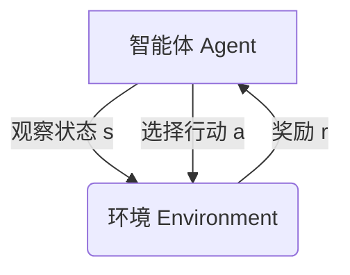

# 一切皆是映射：强化学习与神经网络的结合

## 1. 背景介绍

### 1.1 强化学习与神经网络的重要性

在当今的人工智能领域,强化学习和神经网络无疑是两大核心技术。强化学习旨在通过与环境的交互来学习最优策略,而神经网络则擅长从大量数据中提取有价值的特征和模式。将这两种技术相结合,不仅能够充分利用神经网络强大的特征提取能力,还可以借助强化学习的决策优化能力,从而在复杂的决策过程中获得更好的性能。

### 1.2 传统方法的局限性

传统的强化学习算法,如Q-Learning和Sarsa,在处理高维状态空间和动作空间时往往会遇到维数灾难的问题。此外,这些算法通常需要手工设计状态特征,难以捕捉环境的复杂性。而神经网络则可以自动从原始数据中学习特征表示,避免了手工设计特征的繁琐过程。

### 1.3 结合的契机

近年来,深度学习技术的飞速发展为将强化学习与神经网络相结合提供了有利条件。深度神经网络能够有效处理高维输入,并且具有强大的特征提取能力。同时,并行计算硬件的进步也为训练大型神经网络提供了必要的计算能力。

## 2. 核心概念与联系

### 2.1 强化学习概述

强化学习是一种基于环境交互的学习范式,其目标是通过试错来发现最优策略。在强化学习中,智能体(Agent)与环境(Environment)进行交互,根据当前状态选择行动,并从环境中获得相应的奖励或惩罚。通过不断尝试和学习,智能体逐步优化其策略,以期获得最大的累积奖励。



### 2.2 神经网络概述

神经网络是一种受生物神经系统启发的机器学习模型,擅长从大量数据中自动学习特征表示。神经网络由多层神经元组成,每个神经元接收来自前一层的输入,经过非线性变换后传递给下一层。通过反向传播算法,神经网络可以自动调整内部参数,以最小化预测误差。


### 2.3 强化学习与神经网络的结合

将强化学习与神经网络相结合,可以克服各自的局限性。神经网络可以作为强化学习智能体的函数逼近器,用于估计状态价值函数或状态-行动价值函数。这样一来,智能体就无需手工设计状态特征,而是可以直接从原始数据中自动学习特征表示。同时,神经网络的强大非线性映射能力也有助于捕捉复杂环境的本质特征。

```mermaid
graph TD
    A[环境 Environment] -->|状态 s| B(神经网络 Neural Network)
    B -->|价值估计 Q(s,a)| C[强化学习算法 RL Algorithm]
    C -->|行动 a| A
```

## 3. 核心算法原理具体操作步骤

### 3.1 深度Q网络(Deep Q-Network, DQN)

深度Q网络是将强化学习与神经网络相结合的经典算法之一。它使用一个深度神经网络来逼近状态-行动价值函数 $Q(s, a)$,并通过Q-Learning算法来更新网络参数。算法的具体步骤如下:

1. 初始化神经网络参数 $\theta$,以及经验回放池 $D$。
2. 对于每个时间步 $t$:
    - 根据当前策略 $\pi = \arg\max_a Q(s_t, a; \theta)$ 选择行动 $a_t$。
    - 执行行动 $a_t$,观察到新状态 $s_{t+1}$ 和奖励 $r_t$。
    - 将转移 $(s_t, a_t, r_t, s_{t+1})$ 存储到经验回放池 $D$ 中。
    - 从 $D$ 中随机采样一个小批量数据 $B$。
    - 计算目标值 $y_j = \begin{cases}r_j & \text{if } s_j \text{ is terminal} \\ r_j + \gamma \max_{a'} Q(s_{j+1}, a'; \theta^-) & \text{otherwise}\end{cases}$
    - 更新网络参数 $\theta$ 以最小化损失函数 $L(\theta) = \mathbb{E}_{(s, a, r, s')\sim B}\left[(y - Q(s, a; \theta))^2\right]$。
3. 重复步骤 2,直到收敛。

### 3.2 深度确定性策略梯度(Deep Deterministic Policy Gradient, DDPG)

DDPG是一种用于连续动作空间的Actor-Critic算法,它将确定性策略梯度算法与深度神经网络相结合。算法包含两个神经网络:Actor网络用于生成行动,Critic网络用于评估状态-行动对的价值。算法步骤如下:

1. 初始化Actor网络参数 $\theta^\mu$、Critic网络参数 $\theta^Q$,以及目标网络参数 $\theta^{\mu'}, \theta^{Q'}$。
2. 对于每个时间步 $t$:
    - 根据当前策略 $a_t = \mu(s_t | \theta^\mu) + \mathcal{N}_t$ 选择行动,其中 $\mathcal{N}_t$ 为探索噪声。
    - 执行行动 $a_t$,观察到新状态 $s_{t+1}$ 和奖励 $r_t$。
    - 将转移 $(s_t, a_t, r_t, s_{t+1})$ 存储到经验回放池 $D$ 中。
    - 从 $D$ 中随机采样一个小批量数据 $B$。
    - 更新Critic网络参数 $\theta^Q$ 以最小化损失函数 $L = \mathbb{E}_{(s, a, r, s')\sim B}\left[(Q(s, a | \theta^Q) - y)^2\right]$,其中 $y = r + \gamma Q'(s', \mu'(s'|\theta^{\mu'})|\theta^{Q'})$。
    - 更新Actor网络参数 $\theta^\mu$ 以最大化 $J \approx \mathbb{E}_{s\sim B}[Q(s, \mu(s|\theta^\mu)|\theta^Q)]$。
    - 软更新目标网络参数 $\theta^{\mu'}, \theta^{Q'}$。
3. 重复步骤 2,直到收敛。

### 3.3 异步优势Actor-Critic(Asynchronous Advantage Actor-Critic, A3C)

A3C是一种并行的Actor-Critic算法,它采用异步更新的方式,可以有效利用多核CPU或GPU进行加速训练。算法的核心思想是使用多个智能体同时与环境交互,并将它们的经验汇总到一个共享的神经网络中进行训练。具体步骤如下:

1. 初始化全局网络参数 $\theta, \theta_v$,分别表示策略网络和价值网络。
2. 创建 $N$ 个智能体,每个智能体 $i$ 拥有自己的环境副本。
3. 对于每个智能体 $i$:
    - 重置环境,获取初始状态 $s_0$。
    - 获取来自全局网络的当前参数 $\theta', \theta_v'$。
    - 执行 $T_\text{max}$ 个时间步:
        - 根据策略 $\pi(a_t|s_t; \theta')$ 选择行动 $a_t$。
        - 执行行动 $a_t$,观察到新状态 $s_{t+1}$ 和奖励 $r_t$。
        - 计算优势函数估计值 $A(s_t, a_t) = r_t + \gamma V(s_{t+1}; \theta_v') - V(s_t; \theta_v')$。
        - 累积梯度 $d\theta' = d\theta' + \nabla_{\theta'} \log \pi(a_t|s_t; \theta')A(s_t, a_t)$ 和 $d\theta_v' = d\theta_v' + \partial(r_t + \gamma V(s_{t+1}; \theta_v') - V(s_t; \theta_v'))^2/\partial\theta_v'$。
    - 将梯度 $d\theta', d\theta_v'$ 应用到全局网络参数 $\theta, \theta_v$ 上。
4. 重复步骤 3,直到收敛。

## 4. 数学模型和公式详细讲解举例说明

### 4.1 马尔可夫决策过程(Markov Decision Process, MDP)

强化学习问题通常被建模为马尔可夫决策过程(MDP),它是一种离散时间随机控制过程。MDP由一个五元组 $(S, A, P, R, \gamma)$ 定义,其中:

- $S$ 是状态集合
- $A$ 是行动集合
- $P(s'|s, a)$ 是状态转移概率,表示在状态 $s$ 下执行行动 $a$ 后转移到状态 $s'$ 的概率
- $R(s, a, s')$ 是奖励函数,表示在状态 $s$ 下执行行动 $a$ 后转移到状态 $s'$ 所获得的奖励
- $\gamma \in [0, 1)$ 是折现因子,用于权衡即时奖励和长期奖励的重要性

在MDP中,智能体的目标是找到一个策略 $\pi: S \rightarrow A$,使得期望的累积折现奖励最大化:

$$
J(\pi) = \mathbb{E}_\pi\left[\sum_{t=0}^\infty \gamma^t R(s_t, a_t, s_{t+1})\right]
$$

其中,期望是关于状态序列 $s_0, s_1, \ldots$ 和行动序列 $a_0, a_1, \ldots$ 计算的,这两个序列分别由初始状态分布 $p(s_0)$ 和策略 $\pi$ 决定。

### 4.2 价值函数和Q-函数

为了评估一个策略的好坏,我们引入了价值函数和Q-函数的概念。

**状态价值函数** $V^\pi(s)$ 表示在状态 $s$ 下遵循策略 $\pi$ 所能获得的期望累积奖励:

$$
V^\pi(s) = \mathbb{E}_\pi\left[\sum_{t=0}^\infty \gamma^t R(s_t, a_t, s_{t+1}) | s_0 = s\right]
$$

**状态-行动价值函数** $Q^\pi(s, a)$ 表示在状态 $s$ 下执行行动 $a$,然后遵循策略 $\pi$ 所能获得的期望累积奖励:

$$
Q^\pi(s, a) = \mathbb{E}_\pi\left[\sum_{t=0}^\infty \gamma^t R(s_t, a_t, s_{t+1}) | s_0 = s, a_0 = a\right]
$$

价值函数和Q-函数满足以下递推关系式,也称为Bellman方程:

$$
\begin{aligned}
V^\pi(s) &= \sum_{a \in A} \pi(a|s) Q^\pi(s, a) \\
Q^\pi(s, a) &= \mathbb{E}_{s' \sim P(\cdot|s, a)}\left[R(s, a, s') + \gamma V^\pi(s')\right] \\
&= \sum_{s' \in S} P(s'|s, a) \left[R(s, a, s') + \gamma V^\pi(s')\right]
\end{aligned}
$$

### 4.3 策略梯度算法

策略梯度算法是一种直接优化策略 $\pi_\theta$ 的方法,其中 $\theta$ 表示策略的参数。具体来说,我们希望找到一组参数 $\theta$,使得目标函数 $J(\pi_\theta)$ 最大化。根据策略梯度定理,目标函数的梯度可以表示为:

$$
\nabla_\theta J(\pi_\theta) = \mathbb{E}_{\pi_\theta}\left[\nabla_\theta \log \pi_\theta(a|s) Q^{\pi_\theta}(s, a)\right]
$$

因此,我们可以通过梯度上升法来更新策略参数:

$$
\theta \leftarrow \theta + \alpha \nabla_\theta J(\pi_\theta)
$$

其中 $\alpha$ 是学习率。

在实践中,我们通常使用一种叫做优势函数(Advantage Function)的技巧来减小方差。优势函