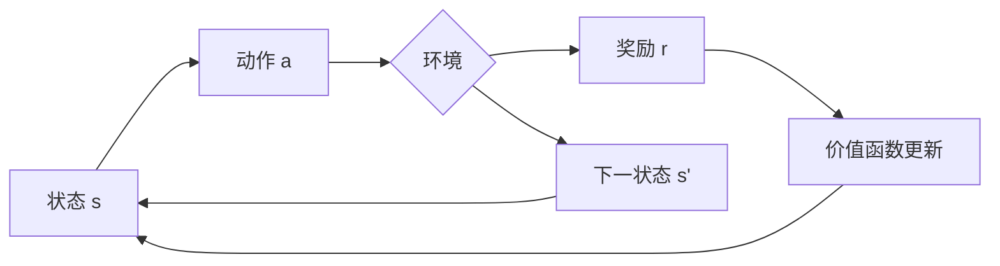

# 一切皆是映射：强化学习的基础概念与核心算法

## 1. 背景介绍
### 1.1 强化学习的起源与发展
#### 1.1.1 强化学习的起源
#### 1.1.2 强化学习的发展历程
#### 1.1.3 强化学习的现状与未来

### 1.2 强化学习的定义与特点  
#### 1.2.1 强化学习的定义
#### 1.2.2 强化学习的主要特点
#### 1.2.3 强化学习与其他机器学习范式的区别

### 1.3 强化学习的应用领域
#### 1.3.1 游戏领域的应用
#### 1.3.2 机器人控制的应用  
#### 1.3.3 推荐系统与智能决策的应用

## 2. 核心概念与联系
### 2.1 马尔可夫决策过程(MDP)
#### 2.1.1 状态空间与动作空间
#### 2.1.2 转移概率与奖励函数
#### 2.1.3 策略与价值函数

### 2.2 探索与利用的权衡
#### 2.2.1 探索的必要性
#### 2.2.2 ε-贪婪策略
#### 2.2.3 上置信区间算法(UCB)

### 2.3 值函数逼近与策略梯度
#### 2.3.1 值函数逼近的概念
#### 2.3.2 线性值函数逼近
#### 2.3.3 策略梯度算法

### 2.4 强化学习中的泛化与迁移
#### 2.4.1 特征工程与表示学习
#### 2.4.2 多任务强化学习
#### 2.4.3 元强化学习



## 3. 核心算法原理具体操作步骤
### 3.1 值迭代算法
#### 3.1.1 值迭代算法的原理
#### 3.1.2 值迭代算法的伪代码
#### 3.1.3 值迭代算法的收敛性证明

### 3.2 策略迭代算法
#### 3.2.1 策略评估与策略提升
#### 3.2.2 策略迭代算法的伪代码  
#### 3.2.3 策略迭代算法的收敛性分析

### 3.3 时序差分学习(TD)
#### 3.3.1 Sarsa算法
#### 3.3.2 Q-learning算法
#### 3.3.3 TD(λ)算法

### 3.4 蒙特卡洛树搜索(MCTS) 
#### 3.4.1 MCTS的四个阶段
#### 3.4.2 UCT算法
#### 3.4.3 AlphaGo中的MCTS

## 4. 数学模型和公式详细讲解举例说明
### 4.1 贝尔曼方程
#### 4.1.1 状态值函数的贝尔曼方程
$$V(s)=\max_{a} \sum_{s',r}p(s',r|s,a)[r+\gamma V(s')]$$
#### 4.1.2 动作值函数的贝尔曼方程  
$$Q(s,a)=\sum_{s',r}p(s',r|s,a)[r+\gamma \max_{a'}Q(s',a')]$$
#### 4.1.3 贝尔曼方程在值迭代中的应用

### 4.2 策略梯度定理
#### 4.2.1 策略梯度定理的陈述与证明
$$\nabla_{\theta}J(\theta)=\mathbb{E}_{\tau \sim p_{\theta}(\tau)}[\sum_{t=0}^{T}\nabla_{\theta}\log\pi_{\theta}(a_t|s_t)Q^{\pi_{\theta}}(s_t,a_t)]$$
#### 4.2.2 REINFORCE算法
#### 4.2.3 Actor-Critic算法

### 4.3 函数逼近器的损失函数
#### 4.3.1 均方误差损失
$$L(\theta)=\mathbb{E}_{s \sim \rho^{\pi_{\theta}},a \sim \pi_{\theta}}[(Q_{\theta}(s,a)-Q^{\pi_{\theta}}(s,a))^2]$$
#### 4.3.2 Huber损失
$$L_{\delta}(x)=\begin{cases} \frac{1}{2}x^2 & \text{if } |x| \leq \delta \\ \delta(|x|-\frac{1}{2}\delta) & \text{otherwise} \end{cases}$$
#### 4.3.3 交叉熵损失
$$H(p,q)=-\sum_{x} p(x)\log q(x)$$

## 5. 项目实践：代码实例和详细解释说明
### 5.1 基于OpenAI Gym的强化学习环境
#### 5.1.1 安装与配置OpenAI Gym
#### 5.1.2 经典控制问题：CartPole
#### 5.1.3 Atari游戏：Breakout

### 5.2 DQN算法实现
#### 5.2.1 经验回放(Experience Replay)
```python
class ReplayBuffer:
    def __init__(self, capacity):
        self.buffer = deque(maxlen=capacity)
    
    def push(self, state, action, reward, next_state, done):
        self.buffer.append((state, action, reward, next_state, done))
    
    def sample(self, batch_size):
        experiences = random.sample(self.buffer, batch_size)
        states, actions, rewards, next_states, dones = zip(*experiences)
        return states, actions, rewards, next_states, dones
```
#### 5.2.2 目标网络(Target Network)
```python
self.target_net = copy.deepcopy(self.policy_net)
self.target_net.load_state_dict(self.policy_net.state_dict())
self.target_net.eval()
```
#### 5.2.3 训练循环与损失函数
```python
for i in range(num_episodes):
    state = env.reset()
    for t in range(max_steps):
        action = self.select_action(state)
        next_state, reward, done, _ = env.step(action)
        self.memory.push(state, action, reward, next_state, done)
        state = next_state

        if done:
            break
        
        if len(self.memory) < batch_size:
            continue
            
        states, actions, rewards, next_states, dones = self.memory.sample(batch_size)
        
        Q_targets_next = self.target_net(next_states).detach().max(1)[0].unsqueeze(1)
        Q_targets = rewards + (gamma * Q_targets_next * (1 - dones))
        Q_expected = self.policy_net(states).gather(1, actions)
        
        loss = F.mse_loss(Q_expected, Q_targets)
        self.optimizer.zero_grad()
        loss.backward()
        self.optimizer.step()
```

### 5.3 策略梯度算法实现
#### 5.3.1 REINFORCE算法
```python
def train(self, num_episodes, max_steps, gamma, lr):
    optimizer = optim.Adam(self.policy.parameters(), lr=lr)
    
    for i in range(num_episodes):
        state = self.env.reset()
        log_probs = []
        rewards = []
        
        for t in range(max_steps):
            action, log_prob = self.select_action(state)
            state, reward, done, _ = self.env.step(action)
            log_probs.append(log_prob)
            rewards.append(reward)
            
            if done:
                break
        
        discounts = [gamma ** i for i in range(len(rewards) + 1)]
        R = sum([r * d for r, d in zip(rewards, discounts)])
        
        policy_loss = []
        for log_prob in log_probs:
            policy_loss.append(-log_prob * R)
        policy_loss = torch.cat(policy_loss).sum()
        
        optimizer.zero_grad()
        policy_loss.backward()
        optimizer.step()
```
#### 5.3.2 Actor-Critic算法
```python
def train(self, num_episodes, max_steps, gamma, lr_actor, lr_critic):
    actor_optimizer = optim.Adam(self.actor.parameters(), lr=lr_actor)
    critic_optimizer = optim.Adam(self.critic.parameters(), lr=lr_critic)
    
    for i in range(num_episodes):
        state = self.env.reset()
        log_probs = []
        values = []
        rewards = []
        
        for t in range(max_steps):
            action, log_prob = self.select_action(state)
            value = self.critic(state)
            
            state, reward, done, _ = self.env.step(action)
            
            log_probs.append(log_prob)
            values.append(value)
            rewards.append(reward)
            
            if done:
                break
        
        returns = []
        R = 0
        for r in reversed(rewards):
            R = r + gamma * R
            returns.insert(0, R)
        returns = torch.tensor(returns)
        
        log_probs = torch.cat(log_probs)
        values = torch.cat(values)
        
        advantage = returns - values
        actor_loss = -(log_probs * advantage.detach()).mean()
        critic_loss = advantage.pow(2).mean()
        
        actor_optimizer.zero_grad()
        critic_optimizer.zero_grad()
        actor_loss.backward()
        critic_loss.backward()
        actor_optimizer.step()
        critic_optimizer.step()
```

## 6. 实际应用场景
### 6.1 智能体游戏对战
#### 6.1.1 AlphaGo与AlphaZero
#### 6.1.2 Dota2与星际争霸
#### 6.1.3 德州扑克与桥牌

### 6.2 自动驾驶与机器人控制 
#### 6.2.1 端到端的自动驾驶模型
#### 6.2.2 机器人运动规划与控制
#### 6.2.3 仿真环境中的强化学习训练

### 6.3 推荐系统与智能决策
#### 6.3.1 基于强化学习的推荐算法
#### 6.3.2 广告投放策略优化
#### 6.3.3 智能客服与对话系统

## 7. 工具和资源推荐
### 7.1 强化学习框架
#### 7.1.1 OpenAI Gym
#### 7.1.2 Google Dopamine
#### 7.1.3 DeepMind TRFL

### 7.2 开源项目与教程
#### 7.2.1 OpenAI Baselines
#### 7.2.2 Stable Baselines
#### 7.2.3 RLlib

### 7.3 学习资源
#### 7.3.1 《Reinforcement Learning: An Introduction》
#### 7.3.2 David Silver的强化学习课程
#### 7.3.3 《Deep Reinforcement Learning Hands-On》

## 8. 总结：未来发展趋势与挑战
### 8.1 强化学习的研究前沿
#### 8.1.1 基于模型的强化学习
#### 8.1.2 分层强化学习
#### 8.1.3 强化学习与因果推断

### 8.2 强化学习面临的挑战
#### 8.2.1 样本效率与探索
#### 8.2.2 奖励稀疏与延迟
#### 8.2.3 安全性与鲁棒性

### 8.3 强化学习的未来展望
#### 8.3.1 强化学习与神经科学
#### 8.3.2 强化学习在工业界的应用
#### 8.3.3 通用人工智能的实现路径

## 9. 附录：常见问题与解答
### 9.1 如何选择合适的状态表示和特征工程？
### 9.2 如何设计有效的奖励函数？
### 9.3 如何处理连续动作空间？
### 9.4 如何加速强化学习算法的收敛？
### 9.5 如何解决探索与利用的权衡问题？

作者：禅与计算机程序设计艺术 / Zen and the Art of Computer Programming