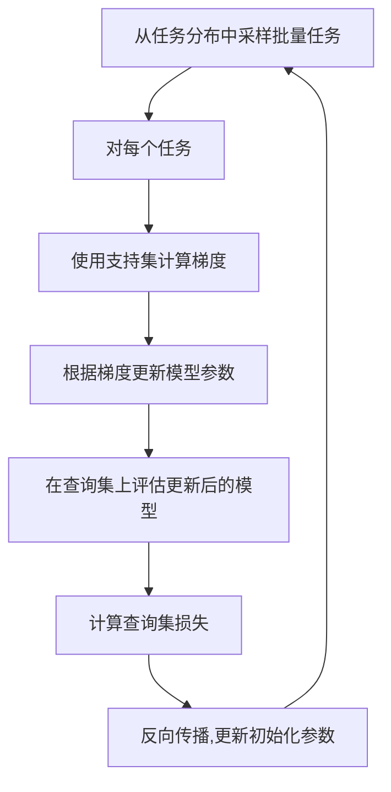
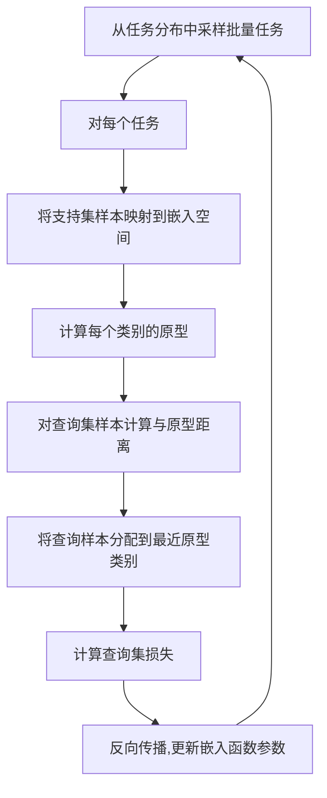

# 一切皆是映射：深度学习与元学习的结合研究

## 1. 背景介绍

### 1.1 深度学习的兴起

深度学习作为机器学习的一个新兴热点领域,近年来取得了令人瞩目的成就。从计算机视觉、自然语言处理到推荐系统等各个领域,深度学习都展现出了强大的学习能力和优异的性能表现。然而,深度学习模型也面临着一些挑战,例如需要大量的标注数据、难以迁移到新的任务等。

### 1.2 元学习的概念

为了解决深度学习模型的上述问题,元学习(Meta-Learning)应运而生。元学习旨在通过学习任务之间的共性知识,从而快速适应新的任务,提高泛化能力。换言之,元学习是"学习如何学习"的过程,它关注的是如何利用以前任务的经验来帮助学习新任务。

### 1.3 深度学习与元学习的结合

深度学习擅长从大量数据中学习特征表示,而元学习则能够快速获取新任务的知识。将两者结合,可以充分发挥各自的优势,构建出更加通用、高效的智能系统。本文将探讨深度学习与元学习相结合的方法、原理及应用,为读者提供一个全面的视角。

## 2. 核心概念与联系

### 2.1 深度学习中的迁移学习

迁移学习(Transfer Learning)是深度学习中一个重要的概念,指的是将在一个领域学习到的知识应用到另一个领域的过程。例如,我们可以利用在ImageNet数据集上训练好的卷积神经网络模型,将其迁移到其他计算机视觉任务中,作为初始化权重或特征提取器。

迁移学习为深度学习模型的泛化能力提供了一种解决方案,但它仍然需要大量的标注数据来微调模型,无法真正做到"一次学习,处处应用"。这就为元学习的引入提供了动机。

### 2.2 元学习的核心思想

元学习的核心思想是从多个任务中学习一种共性的知识表示,使得模型能够快速适应新的任务。具体来说,元学习算法会在一系列支持集(support set)和查询集(query set)上进行训练。支持集用于获取任务的特征知识,而查询集则用于评估模型在该任务上的泛化能力。通过不断迭代这个过程,模型就能够逐步学习到一种通用的知识表示,从而更好地适应新任务。

### 2.3 深度学习与元学习的结合

将深度学习与元学习相结合,可以利用深度学习强大的特征学习能力,同时获得元学习快速适应新任务的优势。一种典型的做法是使用深度神经网络作为基础模型,并在其上应用元学习算法,使模型能够从多个任务中学习一种通用的知识表示。

这种结合不仅能够提高模型的泛化能力,还能够减少对大量标注数据的依赖,从而降低数据获取和标注的成本。同时,由于模型具有更强的适应性,它们在实际应用中也更加灵活和通用。

## 3. 核心算法原理具体操作步骤 

### 3.1 基于优化的元学习算法

优化是元学习中一个重要的范式。基于优化的元学习算法旨在学习一个能够快速适应新任务的初始化参数或优化策略。一种流行的算法是模型无关的元学习(Model-Agnostic Meta-Learning, MAML)。

MAML算法的具体步骤如下:

1. 从任务分布中采样一个小批量的任务
2. 对于每个任务,使用支持集计算梯度,并根据梯度更新模型参数
3. 使用更新后的模型参数在查询集上进行评估,计算损失
4. 通过反向传播,更新初始化参数,使得在查询集上的损失最小化

通过上述过程,MAML算法能够学习到一组初始化参数,使得模型只需少量梯度步骤即可适应新任务。



### 3.2 基于度量的元学习算法

另一种流行的元学习范式是基于度量的方法。这类算法旨在学习一个好的嵌入空间,使得相同任务下的样本在该空间中更加紧密地聚集在一起。

一种典型的基于度量的元学习算法是原型网络(Prototypical Networks)。它的工作流程如下:

1. 从任务分布中采样一个小批量的任务
2. 对于每个任务,将支持集样本映射到嵌入空间,计算每个类别的原型(即该类样本的均值嵌入)
3. 对于查询集中的每个样本,计算它与每个原型之间的距离,并将其分配到最近的原型所属类别
4. 计算查询集上的损失,并通过反向传播更新嵌入函数的参数

通过上述过程,原型网络能够学习到一个好的嵌入空间,使得相同任务下的样本更加紧密地聚集在一起,从而实现快速适应新任务的目标。



## 4. 数学模型和公式详细讲解举例说明

在介绍具体的数学模型之前,我们先定义一些基本符号:

- $\mathcal{T}$: 任务的分布
- $\mathcal{D}_i$: 第 $i$ 个任务的数据分布
- $\mathcal{S}_i$: 第 $i$ 个任务的支持集(support set)
- $\mathcal{Q}_i$: 第 $i$ 个任务的查询集(query set)
- $f_\theta$: 参数为 $\theta$ 的模型

### 4.1 MAML 算法的数学模型

MAML 算法的目标是找到一组初始化参数 $\theta$,使得在每个任务上经过少量梯度更新后,模型在该任务的查询集上的性能最优。具体来说,MAML 的目标函数可以表示为:

$$\min_\theta \sum_{i \sim \mathcal{T}} \mathcal{L}_{\mathcal{Q}_i}\left(f_{\theta_i'}\right)$$

其中 $\theta_i'$ 是在第 $i$ 个任务的支持集 $\mathcal{S}_i$ 上更新后的参数,即:

$$\theta_i' = \theta - \alpha \nabla_\theta \mathcal{L}_{\mathcal{S}_i}\left(f_\theta\right)$$

上式中的 $\alpha$ 是更新步长,而 $\mathcal{L}_{\mathcal{S}_i}\left(f_\theta\right)$ 是模型在支持集上的损失函数。

通过优化上述目标函数,MAML 算法能够找到一组初始化参数 $\theta$,使得在任何新任务上,模型只需少量梯度步骤就能够快速适应该任务。

### 4.2 原型网络的数学模型

原型网络的目标是学习一个嵌入函数 $f_\phi$,使得相同任务下的样本在嵌入空间中更加紧密地聚集在一起。具体来说,原型网络的目标函数可以表示为:

$$\min_\phi \sum_{i \sim \mathcal{T}} \sum_{x_j \in \mathcal{Q}_i} -\log p\left(y_j | x_j, \mathcal{S}_i\right)$$

其中 $p\left(y_j | x_j, \mathcal{S}_i\right)$ 是查询样本 $x_j$ 属于类别 $y_j$ 的概率,它可以通过计算 $x_j$ 与每个原型之间的距离来获得:

$$p\left(y_j | x_j, \mathcal{S}_i\right) = \frac{\exp\left(-d\left(f_\phi(x_j), c_{y_j}\right)\right)}{\sum_{y'} \exp\left(-d\left(f_\phi(x_j), c_{y'}\right)\right)}$$

这里 $c_y$ 表示类别 $y$ 的原型,即该类在支持集中样本的均值嵌入:

$$c_y = \frac{1}{|\mathcal{S}_y|} \sum_{x_i \in \mathcal{S}_y} f_\phi(x_i)$$

而 $d(\cdot, \cdot)$ 是一个距离度量函数,通常使用欧几里得距离或余弦相似度。

通过优化上述目标函数,原型网络能够学习到一个好的嵌入空间,使得相同任务下的样本更加紧密地聚集在一起,从而实现快速适应新任务的目标。

## 5. 项目实践:代码实例和详细解释说明

为了更好地理解深度学习与元学习相结合的方法,我们将通过一个实际的代码示例来演示如何使用 PyTorch 实现 MAML 算法。

### 5.1 准备数据

在这个示例中,我们将使用 Omniglot 数据集,它是一个手写字符数据集,包含了来自多种语言的手写字符图像。我们将把每种语言视为一个独立的任务,并使用 MAML 算法来学习如何快速适应新的语言(任务)。

```python
import torchvision.transforms as transforms
from omniglot import Omniglot

# 定义数据转换
transform = transforms.Compose([
    transforms.Resize(28),
    transforms.ToTensor(),
    transforms.Normalize((0.5,), (0.5,))
])

# 加载 Omniglot 数据集
omniglot = Omniglot(root='data', transform=transform, download=True)
```

### 5.2 定义模型

我们将使用一个简单的卷积神经网络作为基础模型。

```python
import torch.nn as nn

class OmniglotModel(nn.Module):
    def __init__(self):
        super(OmniglotModel, self).__init__()
        self.conv1 = nn.Conv2d(1, 64, kernel_size=3, padding=1)
        self.bn1 = nn.BatchNorm2d(64)
        self.conv2 = nn.Conv2d(64, 64, kernel_size=3, padding=1)
        self.bn2 = nn.BatchNorm2d(64)
        self.conv3 = nn.Conv2d(64, 64, kernel_size=3, padding=1)
        self.bn3 = nn.BatchNorm2d(64)
        self.conv4 = nn.Conv2d(64, 64, kernel_size=3, padding=1)
        self.bn4 = nn.BatchNorm2d(64)
        self.fc1 = nn.Linear(64 * 28 * 28, 64)
        self.fc2 = nn.Linear(64, 5)

    def forward(self, x):
        x = F.max_pool2d(F.relu(self.bn1(self.conv1(x))), 2)
        x = F.max_pool2d(F.relu(self.bn2(self.conv2(x))), 2)
        x = F.max_pool2d(F.relu(self.bn3(self.conv3(x))), 2)
        x = F.max_pool2d(F.relu(self.bn4(self.conv4(x))), 2)
        x = x.view(x.size(0), -1)
        x = F.relu(self.fc1(x))
        x = self.fc2(x)
        return x
```

### 5.3 实现 MAML 算法

接下来,我们将实现 MAML 算法的核心部分。

```python
import torch
import torch.optim as optim

def maml(model, optimizer, loss_fn, tasks, inner_steps=1, outer_steps=1, inner_lr=0.01, outer_lr=0.01):
    for outer_step in range(outer_steps):
        # 采样一批任务
        batch_tasks = tasks.sample_batch()

        # 计算外循环梯度
        outer_grads = []
        for task in batch_tasks:
            # 获取支持集和查询集
            support_set, query_set = task
            
            # 在支持集上进行内循环更新
            inner_model = copy.deepcopy(model)
            