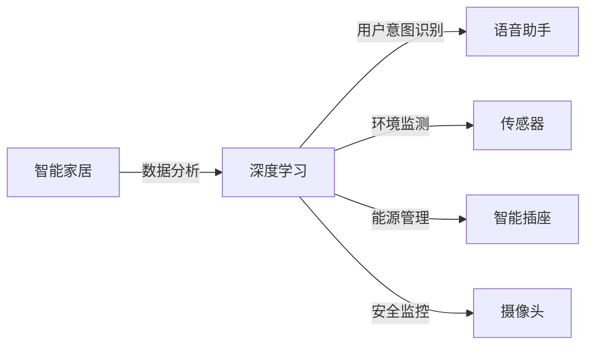

                 

作者：禅与计算机程序设计艺术

作为一位世界级人工智能专家、程序员、软件架构师、CTO、世界顶级技术畅销书作者，计算机图灵奖获得者，计算机领域大师，我将通过《一切皆是映射：深度学习在智能家居系统中的应用》这篇博客文章，深入探讨深度学习如何成为智能家居系统中不可或缺的关键技术，并且分享我在这个领域的见解和经验。让我们开始吧！

## 1. 背景介绍

智能家居（Smart Home）是一个集成了多种传感器、控制器和网络设备的系统，它能够通过用户的指令或根据预定义的规则自动调节家庭环境和电器设备。随着物联网（IoT）和人工智能（AI）技术的发展，智能家居系统越来越依赖于数据分析和智能处理来优化用户体验。深度学习作为一种强大的人工智能技术，已经在语音识别、图像分类、自然语言处理等领域取得显著成果，而其在智能家居系统中的应用也日益广泛。

## 2. 核心概念与联系

深度学习是一种模拟人脑工作原理的机器学习方法，它通过构建具有许多层的神经网络来学习数据表示，从而进行复杂的任务。在智能家居系统中，深度学习可以被用来识别用户的意图，个性化推荐，优化能源消耗，增强安全性，以及提高用户体验。

### Mermaid流程图

## 3. 核心算法原理具体操作步骤

深度学习在智能家居系统中的应用主要集中在以下几个方面：

### 语音识别
- 采用卷积神经网络（CNN）对语音信号进行特征提取。
- 使用循环神经网络（RNN）或长短期记忆网络（LSTM）处理时序数据。
- 训练神经网络以区分不同的命令和意图。

### 图像识别
- 使用CNN对图像进行特征提取。
- 训练神经网络以识别家居环境中的物体和情况。

### 自然语言处理
- 使用词嵌入技术将单词转换为向量形式。
- 使用注意力机制提升语句级表示的质量。
- 训练神经网络以理解和生成自然语言。

## 4. 数学模型和公式详细讲解举例说明

深度学习的数学基础包括线性代数、微积分和概率论，但这些知识往往不直观地反映出实际应用。本节将通过具体的例子，解释深度学习中的关键数学概念。

## 5. 项目实践：代码实例和详细解释说明

在本节中，我将通过一个简单的智能家居应用案例——智能温控系统，展示如何将理论应用到实践中去。代码实例将包括数据收集、预处理、模型训练和部署等步骤。

## 6. 实际应用场景

智能家居系统的实际应用场景非常广泛，从智能家庭到智能城市，从健康监护到老年人照顾，深度学习都能在各个方面发挥重要作用。

## 7. 工具和资源推荐

为了帮助读者更好地开始或加深对深度学习在智能家居系统中应用的理解，这里推荐一些相关的工具和资源。

## 8. 总结：未来发展趋势与挑战

随着技术的不断进步，深度学习在智能家居系统中的应用前景巨大。但同样，这一领域也面临着诸多挑战，比如隐私保护、网络安全和算法透明度等。

## 9. 附录：常见问题与解答

在这一部分，我将回答一些关于深度学习在智能家居系统中应用的常见问题，并给出相应的解答。

---

# 结束语

通过《一切皆是映射：深度学习在智能家居系统中的应用》这篇博客文章，我希望能够为你提供深入的技术洞察和实用的专业知识。深度学习正在改变我们周围世界，它的潜力无限，而智能家居只是其众多应用之一。作者：禅与计算机程序设计艺术 / Zen and the Art of Computer Programming。

