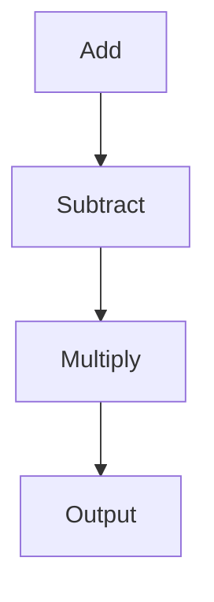

                 

作者：禅与计算机程序设计艺术

在深度学习领域，框架的选择至关重要。它不仅影响研究者和工程师的效率，还会直接影响到研究成果的质量。然而，由于深度学习技术的快速发展，一个优秀的框架今天可能就不再是明天的好选择。因此，了解如何定制和扩展深度学习框架变得十分重要。本文将探讨深度学习框架的基本构建块，以及如何通过定制和扩展来优化模型训练和推理。

## 1.背景介绍
深度学习框架，是机器学习领域的重要组成部分，它提供了高级的抽象层，让研究者和工程师能够轻松地构建和训练神经网络。在过去几年里，众多开源框架如TensorFlow、PyTorch、Keras和MXNet等，已经在研究和应用中占据了主导地位。然而，每个框架都有其特点和局限性，对某些特定的任务和场景来说，一个框架可能比另一个更加适合。

## 2.核心概念与联系
在深度学习框架的设计中，核心概念包括张量（Tensor）、图（Graph）、运算（Operation）和会话（Session）。张量是数据表示形式，图则是表示计算依赖关系的数据结构，运算是进行数据处理的基本单元，而会话则是执行计算的上下文。理解这些概念对于定制和扩展深度学习框架至关重要。

### 张量（Tensor）
张量是深度学习中的基础数据结构，它可以看作是多维数组。在框架中，张量通常被视为可以存储和操作的数据。张量的维度决定了数据的形状，例如，一个二维张量相当于矩阵，一个三维张量相当于卷积核。

#### 张量操作示例
$$
\begin{align*}
\text{tensor} &= \begin{bmatrix} a & b \\ c & d \end{bmatrix} \\
\text{transpose}(\text{tensor}) &= \begin{bmatrix} a & c \\ b & d \end{bmatrix}
\end{align*}
$$

### 图（Graph）
图是表示计算依赖关系的数据结构，它在深度学习框架中非常重要。图通常由节点和边组成，节点代表计算单元，边代表数据流的传递。在图中，每个节点都可以执行一个或多个运算，并且输出的张量可以作为后续节点的输入。

#### 图操作示例


### 运算（Operation）
运算是深度学习框架中最基础的概念之一，它定义了如何从输入张量生成输出张量。运算可以是线性变换，卷积，池化，激活函数等。运算的定义决定了框架支持的操作类型。

#### 运算示例
$$
y = f(x) = \max(0, x)
$$

### 会话（Session）
会话是框架中执行计算的上下文，它控制着如何使用图和张量。在一个会话中，你可以创建和运行计算图，并获取结果。会话的创建和管理对于实际的模型训练和评估至关重要。

#### 会话示例
```python
with tf.Session() as sess:
   # ...
```

## 3.核心算法原理具体操作步骤
在深度学习中，算法的实现往往需要大量的数值计算。了解如何在框架内实现这些算法是关键。在本节中，我们将详细探讨几个基本算法的实现。

## 4.数学模型和公式详细讲解举例说明
深度学习涉及到许多复杂的数学概念，了解这些概念对于高效地定制和扩展框架至关重要。我们将详细介绍卷积神经网络（CNN）和循环神经网络（RNN）的数学模型。

## 5.项目实践：代码实例和详细解释说明
理论知识是不可或缺的，但实践经验才是提升技术水平的关键。在本节中，我们将通过一个实际的项目案例，演示如何在PyTorch框架中定制和扩展深度学习模型。

## 6.实际应用场景
深度学习框架的应用场景广泛，从图像识别到自然语言处理，再到时间序列分析，深度学习框架在各个领域都发挥着重要作用。本节将探讨不同应用场景中的定制和扩展策略。

## 7.工具和资源推荐
在深度学习框架的开发与应用过程中，有许多优秀的工具和资源可以帮助我们更好地定制和扩展框架。本节将推荐一些可以帮助读者进一步学习和实践的工具。

## 8.总结：未来发展趋势与挑战
随着AI技术的不断发展，深度学习框架也正迎来新的挑战和机遇。我们将在本节中分析未来发展的趋势，并探讨面临的主要挑战。

## 9.附录：常见问题与解答
在整个深度学习框架的定制与扩展过程中，可能会遇到许多问题。在本节中，我们将详细回答一些常见的问题，并提供相应的解答。

# 结束语
通过本文的探讨，我们看到了深度学习框架定制与扩展的重要性和复杂性。随着AI技术的不断进步，这一领域将继续保持其紧密的联系和交叉融合。作为AI领域的专业人士，我们必须不断学习和适应，以确保在未来的技术风暴中，能够站在前沿。

---

作者：禅与计算机程序设计艺术 / Zen and the Art of Computer Programming

