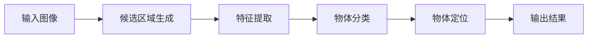

# 一切皆是映射：物体检测与识别：AI的视觉能力

## 1. 背景介绍
### 1.1 人工智能的视觉感知
#### 1.1.1 视觉感知的重要性
#### 1.1.2 计算机视觉的发展历程
#### 1.1.3 物体检测与识别的应用价值

### 1.2 物体检测与识别的挑战
#### 1.2.1 视觉场景的复杂性
#### 1.2.2 物体的多样性与变化性
#### 1.2.3 实时性与精度的平衡

## 2. 核心概念与联系
### 2.1 图像表示与特征提取
#### 2.1.1 图像的数字化表示
#### 2.1.2 图像特征的类型与提取方法
#### 2.1.3 特征表示的优化与选择

### 2.2 物体检测的基本流程
#### 2.2.1 候选区域生成
#### 2.2.2 特征提取与表示
#### 2.2.3 分类器设计与训练

### 2.3 物体识别的关键技术
#### 2.3.1 深度学习在物体识别中的应用
#### 2.3.2 卷积神经网络的结构与优化
#### 2.3.3 迁移学习与域适应

### 2.4 检测与识别的融合方法
#### 2.4.1 两阶段检测器
#### 2.4.2 单阶段检测器
#### 2.4.3 基于区域建议的识别方法

## 3. 核心算法原理具体操作步骤
### 3.1 传统的物体检测算法
#### 3.1.1 Viola-Jones人脸检测
#### 3.1.2 HOG特征+SVM分类器
#### 3.1.3 DPM(Deformable Part Models)

### 3.2 基于深度学习的物体检测算法
#### 3.2.1 R-CNN系列算法
#### 3.2.2 YOLO系列算法
#### 3.2.3 SSD算法
#### 3.2.4 RetinaNet算法

### 3.3 基于深度学习的物体识别算法
#### 3.3.1 AlexNet
#### 3.3.2 VGGNet
#### 3.3.3 GoogLeNet
#### 3.3.4 ResNet

## 4. 数学模型和公式详细讲解举例说明
### 4.1 目标函数与损失函数
#### 4.1.1 分类损失
#### 4.1.2 定位损失
#### 4.1.3 多任务损失

### 4.2 网络结构的数学表示
#### 4.2.1 卷积层
卷积运算可以表示为：

$$ y_{i,j} = \sum_{m,n} w_{m,n} \cdot x_{i+m,j+n} + b $$

其中，$y_{i,j}$ 表示输出特征图中位置 $(i,j)$ 的像素值，$w_{m,n}$ 表示卷积核的权重，$x_{i+m,j+n}$ 表示输入特征图中位置 $(i+m,j+n)$ 的像素值，$b$ 表示偏置项。

#### 4.2.2 池化层
最大池化可以表示为：

$$ y_{i,j} = \max_{m,n \in R} x_{i \cdot s + m, j \cdot s + n} $$

其中，$y_{i,j}$ 表示输出特征图中位置 $(i,j)$ 的像素值，$x_{i \cdot s + m, j \cdot s + n}$ 表示输入特征图中池化窗口 $R$ 内位置 $(i \cdot s + m, j \cdot s + n)$ 的像素值，$s$ 表示池化的步长。

#### 4.2.3 全连接层
全连接层可以表示为：

$$ y_i = \sum_j w_{ij} \cdot x_j + b_i $$

其中，$y_i$ 表示输出向量中第 $i$ 个元素的值，$w_{ij}$ 表示权重矩阵中第 $i$ 行第 $j$ 列的元素，$x_j$ 表示输入向量中第 $j$ 个元素的值，$b_i$ 表示偏置向量中第 $i$ 个元素的值。

### 4.3 反向传播与参数更新
#### 4.3.1 梯度计算
#### 4.3.2 权重更新
#### 4.3.3 优化算法

## 5. 项目实践：代码实例和详细解释说明
### 5.1 数据集准备与预处理
#### 5.1.1 PASCAL VOC数据集
#### 5.1.2 COCO数据集
#### 5.1.3 数据增强技术

### 5.2 模型构建与训练
#### 5.2.1 Faster R-CNN的实现
#### 5.2.2 YOLOv3的实现
#### 5.2.3 训练过程与参数设置

### 5.3 模型评估与优化
#### 5.3.1 评估指标：mAP
#### 5.3.2 超参数调优
#### 5.3.3 模型压缩与加速

## 6. 实际应用场景
### 6.1 智能安防
#### 6.1.1 人脸识别与追踪
#### 6.1.2 行为分析与异常检测
#### 6.1.3 车辆与车牌识别

### 6.2 无人驾驶
#### 6.2.1 道路标识检测
#### 6.2.2 行人与车辆检测
#### 6.2.3 障碍物识别与避障

### 6.3 医学影像分析
#### 6.3.1 病变区域检测
#### 6.3.2 器官与组织分割
#### 6.3.3 疾病诊断与预测

## 7. 工具和资源推荐
### 7.1 深度学习框架
#### 7.1.1 TensorFlow
#### 7.1.2 PyTorch
#### 7.1.3 Keras

### 7.2 开源库与工具
#### 7.2.1 OpenCV
#### 7.2.2 DLIB
#### 7.2.3 MMDetection

### 7.3 数据集与预训练模型
#### 7.3.1 ImageNet
#### 7.3.2 PASCAL VOC
#### 7.3.3 COCO

## 8. 总结：未来发展趋势与挑战
### 8.1 小样本学习
#### 8.1.1 少样本学习
#### 8.1.2 零样本学习
#### 8.1.3 单样本学习

### 8.2 弱监督与无监督学习
#### 8.2.1 半监督学习
#### 8.2.2 自监督学习
#### 8.2.3 无监督域适应

### 8.3 多模态融合
#### 8.3.1 图像与文本融合
#### 8.3.2 图像与点云融合
#### 8.3.3 图像与视频融合

### 8.4 可解释性与鲁棒性
#### 8.4.1 可解释性研究
#### 8.4.2 对抗攻击与防御
#### 8.4.3 模型的泛化能力

## 9. 附录：常见问题与解答
### 9.1 如何选择合适的检测算法？
### 9.2 如何处理不平衡的数据集？
### 9.3 如何提高小目标检测的精度？
### 9.4 如何加速模型的推理速度？
### 9.5 如何解决过拟合问题？

作者：禅与计算机程序设计艺术 / Zen and the Art of Computer Programming