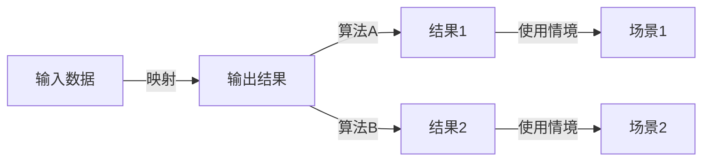

                 

作者：禅与计算机程序设计艺术

自动化的王国，其中一个核心的概念就是输入与输出的映射。这种映射不仅是AI系统的基石，也是我们理解AI如何处理数据和生成结果的关键。本文将探索这一映射的深刻含义，并通过具体案例分析，帮助读者理解如何在AI领域中运用这一理论。

## 1.背景介绍
AI系统的核心功能之一就是从输入数据中学习，然后根据这些数据生成输出结果。这个过程听起来简单，但在实际应用中却十分复杂。AI系统可以处理任何类型的数据，从图像、音频、文本到复杂的时间序列数据，甚至是混合形式的数据集。理解如何将这些复杂的数据映射到AI系统的输出是解决AI问题的关键。

## 2.核心概念与联系
在AI中，输入与输出之间的映射可以被看作是一个函数。这个函数可以是线性的，也可以非线性的，可以是局部的，也可以是全局的。理解这个映射的特性对于选择正确的算法至关重要。比如，如果映射是局部的，那么可以使用局部优化算法；如果映射是全局的，则需要全局优化算法。此外，映射的连续性、可微性和稳定性也会影响算法的选择。

## 3.核心算法原理具体操作步骤
在AI中，有许多算法都是专门设计用来处理特定类型的映射的。比如，神经网络可以很好地处理高维数据的非线性映射，而支持向量机（SVM）则更适合于线性或近似线性的映射。每个算法都有其优缺点，了解这些优缺点对于选择正确的工具至关重要。

## 4.数学模型和公式详细讲解举例说明
数学模型是理解映射的强大工具。在AI中，最常用的数学模型是线性回归、逻辑回归和决策树等。每种模型都有其假设条件和相应的数学表达式。理解这些数学公式对于调整参数和优化模型至关重要。

$$ y = \beta_0 + \beta_1x_1 + \beta_2x_2 + ... + \beta_n x_n $$

## 5.项目实践：代码实例和详细解释说明
在实际项目中，将理论应用到代码中是一项挑战。在这里，我们将通过一个具体的案例，演示如何将理论转换为实践。我们将选择一个流行的数据集，如MNIST手写数字识别数据集，并使用Python进行编程实现。

## 6.实际应用场景
AI系统的输入与输出映射在各个领域都有广泛的应用。从医疗保健到金融服务，从自然语言处理到图像识别，映射的理解都是推动这些领域发展的关键。

## 7.工具和资源推荐
在AI领域，有许多工具和资源可以帮助我们更好地理解和实践输入与输出的映射。这包括在线课程、书籍、研究论文和开源软件库。这些资源不仅提供了技术知识，还能帮助我们建立起一个良好的学习社区。

## 8.总结：未来发展趋势与挑战
随着AI技术的不断发展，输入与输出的映射将变得更加复杂。我们预见到更多的深度学习算法，更多的自适应系统，以及更智能的决策支持系统。但同时，这也带来了新的挑战，如数据隐私、算法偏见和系统安全等。

## 9.附录：常见问题与解答
在这一部分，我们将回答一些关于AI中输入与输出映射的常见问题，并提供解答。

---

作者：禅与计算机程序设计艺术 / Zen and the Art of Computer Programming

