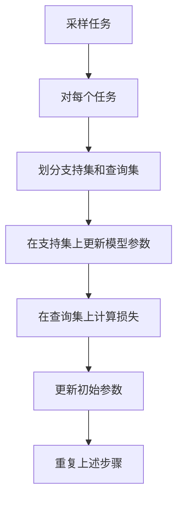
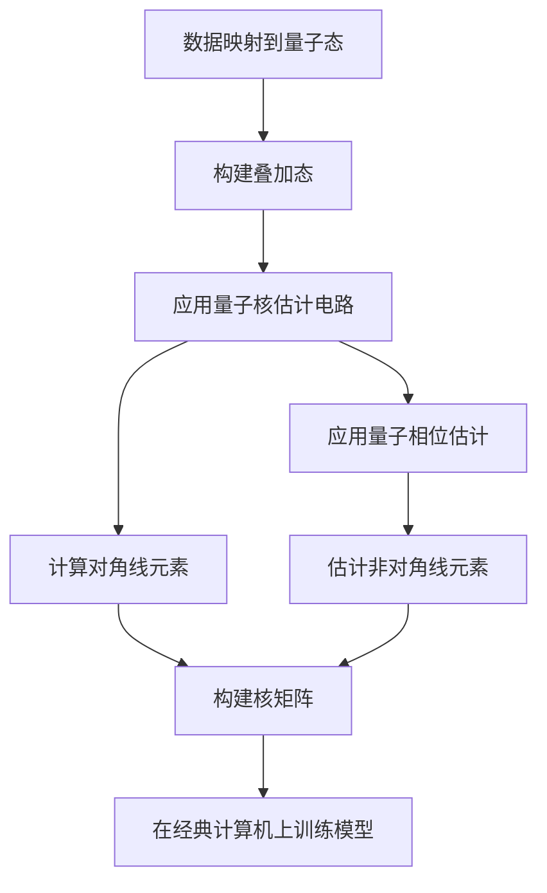

# 一切皆是映射：量子机器学习与传统元学习的融合

## 1. 背景介绍

### 1.1 机器学习的挑战

在过去的几十年里，机器学习取得了长足的进步,在计算机视觉、自然语言处理、推荐系统等诸多领域发挥着重要作用。然而,传统的机器学习方法仍然面临着一些挑战:

1. **数据饥渿**:大多数机器学习算法需要大量的训练数据,而获取高质量的标注数据往往代价高昂。
2. **泛化能力**:训练好的模型在新的环境或领域中表现往往不尽如人意,泛化能力有待提高。
3. **计算效率**:随着模型规模的增大,训练和推理的计算开销也在不断增加。

### 1.2 元学习的兴起

为了解决上述挑战,元学习(Meta-Learning)应运而生。元学习旨在从多个任务中学习元知识,从而帮助机器在新的任务上快速适应。与传统机器学习方法相比,元学习具有以下优势:

1. **数据高效**:元学习可以从少量数据中学习,减轻了对大量标注数据的依赖。
2. **泛化性强**:通过学习任务之间的共性,元学习算法能够更好地推广到新的任务。
3. **快速适应**:元学习算法可以通过少量fine-tuning即可适应新任务,大大提高了学习效率。

### 1.3 量子机器学习的兴起

另一方面,量子计算机的发展为机器学习带来了新的契机。量子计算机利用量子力学中的叠加态和纠缠态,在某些问题上可以展现出传统计算机所不具备的计算优势,被认为是下一代革命性的计算范式。

量子机器学习(Quantum Machine Learning)正是将量子计算的力量与机器学习相结合,旨在开发新的量子算法来加速和增强机器学习任务。与经典机器学习相比,量子机器学习具有以下潜在优势:

1. **计算加速**:利用量子并行性,量子算法可以加速某些机器学习任务的计算。
2. **高维特征**:量子态可以自然地表示高维特征,有助于处理高维数据。
3. **量子优化**:量子算法可以更高效地解决机器学习中的优化问题。

然而,量子机器学习目前仍处于起步阶段,理论研究和实际应用都面临诸多挑战。

## 2. 核心概念与联系

### 2.1 元学习的核心思想

元学习的核心思想是**"学习如何学习"**。具体来说,就是通过多个相关但不同的任务,学习到一种可迁移的知识表示,从而在新的任务上加快学习速度。

元学习算法通常包含两个循环:

1. **内循环(Inner Loop)**:在每个任务上进行有限步数的梯度更新,模拟快速学习的过程。
2. **外循环(Outer Loop)**:跨任务优化元学习器的参数,使得在内循环中可以快速适应新任务。

这种"学习如何学习"的思想与人类学习的方式有些类似。人类在学习新知识时,往往可以借助以前学过的知识,从而加快新知识的习得。

### 2.2 量子机器学习的核心思想

量子机器学习的核心思想是利用量子计算的独特优势来加速和增强机器学习任务。具体来说,包括以下几个方面:

1. **量子并行性**:通过量子态的叠加,可以同时处理多个输入,从而加速某些并行可行的计算。
2. **量子纠缠**:利用量子态的纠缠特性,可以高效地表示和处理高维特征。
3. **量子优化**:借助量子算法(如量子近似优化算法),可以更高效地解决机器学习中的优化问题。
4. **量子采样**:利用量子态的随机性,可以高效地进行蒙特卡罗采样,加速某些机器学习算法。

尽管量子机器学习的理论研究已经取得了一些进展,但实际应用仍面临诸多挑战,如量子硬件的噪声、量子算法的可扩展性等。

### 2.3 元学习与量子机器学习的联系

元学习和量子机器学习看似是两个独立的领域,但它们之间存在一些内在联系:

1. **高效性**:两者都旨在提高机器学习的效率,元学习通过减少数据需求,量子机器学习则通过加速计算。
2. **泛化能力**:元学习和量子机器学习都有望提高机器学习模型的泛化能力,前者通过学习任务之间的共性,后者通过高维特征表示。
3. **优化问题**:两者都涉及优化问题,元学习需要优化内外循环,量子机器学习可借助量子优化算法。

因此,将元学习与量子机器学习相结合,或许能够产生"1+1>2"的效果,进一步提升机器学习的性能。

## 3. 核心算法原理具体操作步骤 

### 3.1 元学习算法

元学习算法种类繁多,但大多数算法都遵循上述内外循环的范式。下面以一种经典的基于优化的元学习算法MAML(Model-Agnostic Meta-Learning)为例,介绍其核心原理和操作步骤。

MAML算法的目标是找到一个好的初始化参数 $\theta$,使得在每个任务上通过少量梯度更新,就可以获得一个好的模型。具体步骤如下:

1. 从任务分布 $p(\mathcal{T})$ 中采样一批任务 $\{\mathcal{T}_i\}$。
2. 对于每个任务 $\mathcal{T}_i$:
    - 将数据分为支持集(Support Set) $\mathcal{D}_i^{tr}$ 和查询集(Query Set) $\mathcal{D}_i^{val}$。
    - 在支持集上进行 $k$ 步梯度更新,获得任务特定参数:
      
      $$\theta_i' = \theta - \alpha \nabla_\theta \sum_{(x,y) \in \mathcal{D}_i^{tr}} \mathcal{L}(f_\theta(x), y)$$
      
    - 在查询集上计算任务损失:
      
      $$\mathcal{L}_i(\theta_i') = \sum_{(x,y) \in \mathcal{D}_i^{val}} \mathcal{L}(f_{\theta_i'}(x), y)$$
      
3. 更新初始参数 $\theta$,使得在所有任务上的查询集损失最小:

   $$\theta \leftarrow \theta - \beta \nabla_\theta \sum_i \mathcal{L}_i(\theta_i')$$
   
4. 重复步骤1-3,直到收敛。

通过上述操作,MAML算法可以找到一个好的初始化参数 $\theta$,使得在新的任务上,只需要少量梯度更新就可以获得一个好的模型,从而实现快速适应。

### 3.2 量子机器学习算法

量子机器学习算法的种类也很多,下面以一种经典的量子核矩阵近似算法(Quantum Kernel Matrix Approximation)为例,介绍其核心原理和操作步骤。

该算法的目标是利用量子计算加速核矩阵的计算,从而加速核方法(如支持向量机)在机器学习中的应用。具体步骤如下:

1. 将输入数据 $\{x_i\}$ 映射到量子态 $\{|\phi(x_i)\rangle\}$,构建量子态的叠加态:

   $$|\Phi\rangle = \frac{1}{\sqrt{N}} \sum_{i=1}^N |\phi(x_i)\rangle|i\rangle$$
   
2. 应用量子核估计电路,计算核矩阵的对角线元素:

   $$\text{diag}(K) = \langle\Phi|U^\dagger_kU_k|\Phi\rangle$$
   
   其中 $U_k$ 是一个量子线路,对应于核函数 $k(x, x')$。
   
3. 应用量子相位估计算法,估计非对角线元素:

   $$K_{ij} = \langle\phi(x_i)|\otimes\langle j|U_k|\Phi\rangle$$
   
4. 利用估计出的核矩阵,在经典计算机上训练核方法模型。

该算法的核心思想是利用量子态的叠加性质,同时处理多个输入数据,从而加速核矩阵的计算。理论上,该算法可以将核矩阵计算的时间复杂度从 $\mathcal{O}(N^2)$ 降低到 $\mathcal{O}(\log N)$,具有显著的加速效果。

## 4. 数学模型和公式详细讲解举例说明

### 4.1 元学习的数学模型

在形式化描述元学习的数学模型之前,首先引入一些基本概念和符号:

- 任务分布 $p(\mathcal{T})$: 所有任务的分布,每个任务 $\mathcal{T}_i$ 包含一个数据分布 $p(D|\mathcal{T}_i)$。
- 模型 $f_\theta$: 参数化的模型,其中 $\theta$ 为模型参数。
- 损失函数 $\mathcal{L}$: 用于评估模型在数据 $(x, y)$ 上的损失,如交叉熵损失。

元学习的目标是找到一个好的初始化参数 $\theta$,使得在每个任务 $\mathcal{T}_i$ 上,通过少量梯度更新就可以获得一个好的模型 $f_{\theta_i'}$,即:

$$\theta^* = \arg\min_\theta \mathbb{E}_{\mathcal{T}_i \sim p(\mathcal{T})} \left[ \min_{\theta_i'} \mathbb{E}_{(x, y) \sim p(D|\mathcal{T}_i)} \left[ \mathcal{L}(f_{\theta_i'}(x), y) \right] \right]$$

上式中的内循环 $\min_{\theta_i'} \cdots$ 对应于在每个任务上的快速适应过程,外循环 $\min_\theta \cdots$ 则是跨任务优化初始参数。

以MAML算法为例,其目标函数可以写作:

$$\theta^* = \arg\min_\theta \sum_i \sum_{(x, y) \in \mathcal{D}_i^{val}} \mathcal{L}(f_{\theta_i'}(x), y)$$

其中 $\theta_i' = \theta - \alpha \nabla_\theta \sum_{(x,y) \in \mathcal{D}_i^{tr}} \mathcal{L}(f_\theta(x), y)$ 是通过在支持集上更新得到的任务特定参数。

MAML算法通过优化上述目标函数,找到一个好的初始化参数 $\theta^*$,使得在新的任务上,只需要少量梯度更新就可以获得一个好的模型。

### 4.2 量子核矩阵近似的数学模型

量子核矩阵近似算法的核心是利用量子计算加速核矩阵的计算。下面将详细介绍其数学模型和原理。

首先,我们将输入数据 $\{x_i\}$ 映射到量子态 $\{|\phi(x_i)\rangle\}$,构建量子态的叠加态:

$$|\Phi\rangle = \frac{1}{\sqrt{N}} \sum_{i=1}^N |\phi(x_i)\rangle|i\rangle$$

其中 $|i\rangle$ 是辅助态,用于标记每个输入数据。

接下来,我们定义一个量子线路 $U_k$,对应于核函数 $k(x, x')$:

$$U_k|x\rangle|0\rangle = |x\rangle|k(x, x')\rangle$$

利用该量子线路,我们可以计算核矩阵