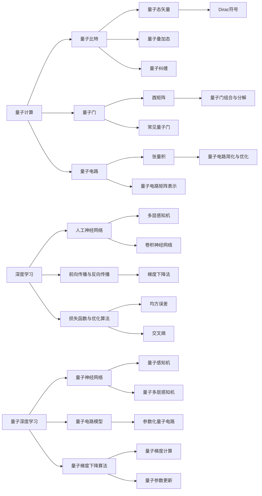

# 一切皆是映射：量子深度学习：下一代AI技术

## 1. 背景介绍
### 1.1 人工智能的发展历程
#### 1.1.1 经典人工智能阶段
#### 1.1.2 机器学习阶段  
#### 1.1.3 深度学习阶段
### 1.2 量子计算的兴起
#### 1.2.1 量子计算的概念
#### 1.2.2 量子计算的优势
#### 1.2.3 量子计算的发展现状
### 1.3 量子深度学习的提出
#### 1.3.1 量子深度学习的起源
#### 1.3.2 量子深度学习的研究意义
#### 1.3.3 量子深度学习的研究现状

## 2. 核心概念与联系
### 2.1 量子计算的基本原理
#### 2.1.1 量子比特
#### 2.1.2 量子叠加态
#### 2.1.3 量子纠缠
### 2.2 深度学习的核心思想  
#### 2.2.1 人工神经网络
#### 2.2.2 前向传播与反向传播
#### 2.2.3 损失函数与优化算法
### 2.3 量子深度学习的核心概念
#### 2.3.1 量子神经网络
#### 2.3.2 量子电路模型
#### 2.3.3 量子梯度下降算法

## 3. 核心算法原理具体操作步骤
### 3.1 量子神经网络的构建
#### 3.1.1 量子神经元模型
#### 3.1.2 量子感知机
#### 3.1.3 量子多层感知机
### 3.2 量子电路模型的实现
#### 3.2.1 量子门的选择与组合
#### 3.2.2 量子电路的设计与优化
#### 3.2.3 量子测量的实现
### 3.3 量子梯度下降算法的应用
#### 3.3.1 量子梯度计算
#### 3.3.2 量子参数更新
#### 3.3.3 量子优化策略

## 4. 数学模型和公式详细讲解举例说明
### 4.1 量子比特的数学表示
#### 4.1.1 Dirac符号
#### 4.1.2 量子态矢量
#### 4.1.3 密度矩阵
### 4.2 量子门的数学描述
#### 4.2.1 酉矩阵
#### 4.2.2 常见量子门的矩阵表示
#### 4.2.3 量子门的组合与分解
### 4.3 量子电路的数学建模
#### 4.3.1 张量积
#### 4.3.2 量子电路的矩阵表示
#### 4.3.3 量子电路的简化与优化

## 5. 项目实践：代码实例和详细解释说明
### 5.1 量子编程语言与框架
#### 5.1.1 Qiskit
#### 5.1.2 Pennylane
#### 5.1.3 Cirq
### 5.2 量子神经网络的代码实现
#### 5.2.1 量子感知机的代码实现
#### 5.2.2 量子多层感知机的代码实现
#### 5.2.3 量子卷积神经网络的代码实现
### 5.3 量子梯度下降算法的代码实现 
#### 5.3.1 参数化量子电路的构建
#### 5.3.2 量子梯度计算的实现
#### 5.3.3 量子参数更新的实现

## 6. 实际应用场景
### 6.1 量子机器学习
#### 6.1.1 量子分类器
#### 6.1.2 量子聚类
#### 6.1.3 量子生成模型
### 6.2 量子优化问题求解
#### 6.2.1 组合优化问题
#### 6.2.2 函数优化问题 
#### 6.2.3 量子近似优化算法
### 6.3 量子化学与药物发现
#### 6.3.1 分子哈密顿量的构建
#### 6.3.2 基态能量的计算
#### 6.3.3 分子性质的预测

## 7. 工具和资源推荐
### 7.1 量子计算模拟器
#### 7.1.1 Qiskit Aer
#### 7.1.2 Pennylane默认模拟器
#### 7.1.3 Cirq模拟器
### 7.2 量子计算硬件平台
#### 7.2.1 IBM Quantum Experience
#### 7.2.2 Google Quantum AI
#### 7.2.3 IonQ量子计算机
### 7.3 学习资源
#### 7.3.1 在线课程
#### 7.3.2 书籍推荐
#### 7.3.3 研究论文

## 8. 总结：未来发展趋势与挑战
### 8.1 量子深度学习的优势
#### 8.1.1 指数加速
#### 8.1.2 强表达能力
#### 8.1.3 鲁棒性
### 8.2 量子深度学习面临的挑战
#### 8.2.1 量子硬件的限制
#### 8.2.2 量子噪声与错误
#### 8.2.3 量子-经典混合模型的设计
### 8.3 未来发展方向
#### 8.3.1 大规模量子神经网络
#### 8.3.2 量子-经典混合学习范式
#### 8.3.3 量子深度强化学习

## 9. 附录：常见问题与解答
### 9.1 量子深度学习与经典深度学习的区别
### 9.2 量子深度学习的适用场景
### 9.3 量子深度学习的入门学习路径

量子深度学习是量子计算与深度学习的交叉融合，旨在利用量子计算的独特优势来增强深度学习模型的性能。传统的深度学习模型基于经典计算机，通过多层神经网络结构和梯度下降等优化算法来学习数据的内在模式和特征。然而，经典计算机在处理某些复杂问题时会遇到计算瓶颈，如指数级增长的计算复杂度和存储需求。

量子计算则提供了一种全新的计算范式，利用量子力学的基本原理，如量子叠加态和量子纠缠，来实现高效的信息处理和计算加速。量子比特作为量子计算的基本单元，可以同时处于多个状态的叠加，具有强大的并行计算能力。通过量子门操作和量子电路模型，我们可以对量子态进行精确控制和操纵，实现各种量子算法。

量子深度学习的核心思想是将量子计算的优势与深度学习的架构相结合，构建量子神经网络模型。量子神经网络采用量子电路模型来实现神经元和连接权重，通过参数化量子电路来编码输入数据和模型参数。量子感知机和量子多层感知机是量子神经网络的基本构建块，它们利用量子门操作和量子测量来实现非线性变换和信息处理。

在量子深度学习中，量子梯度下降算法扮演着关键角色。传统的梯度下降算法在计算梯度时需要对整个数据集进行多次迭代，计算复杂度较高。而量子梯度下降算法利用量子并行性和量子纠缠，可以在单次量子电路运行中同时计算所有参数的梯度，大大加速了优化过程。通过量子梯度计算和量子参数更新，我们可以高效地训练量子神经网络模型。

量子深度学习在实际应用中展现出广阔的前景。在量子机器学习领域，量子分类器、量子聚类和量子生成模型等算法可以处理高维复杂数据，实现更精确的分类、聚类和生成任务。量子优化问题求解是另一个重要应用方向，如组合优化问题和函数优化问题，量子近似优化算法可以找到近似最优解。此外，量子化学与药物发现也是量子深度学习的重要应用领域，通过构建分子哈密顿量并计算基态能量，可以预测分子的性质和设计新型药物。

尽管量子深度学习展现出巨大的潜力，但它也面临着一些挑战。当前的量子硬件还处于早期阶段，量子比特数量有限，量子噪声和错误也是不可忽视的问题。此外，如何设计高效的量子-经典混合模型，充分发挥两种计算范式的优势，也是一个重要的研究方向。未来，随着量子硬件的不断发展和算法的不断创新，量子深度学习有望实现大规模量子神经网络，开启量子-经典混合学习的新范式，并拓展到量子深度强化学习等更广阔的领域。

总之，量子深度学习作为人工智能的下一代技术，为我们提供了一个全新的视角和工具来解决复杂的机器学习问题。通过将量子计算与深度学习的优势相结合，量子深度学习有望突破经典计算的限制，实现指数级的性能提升和更强大的表达能力。随着研究的不断深入和技术的不断进步，量子深度学习必将在人工智能的发展历程中扮演越来越重要的角色，为我们开启智能时代的新篇章。

作者：禅与计算机程序设计艺术 / Zen and the Art of Computer Programming