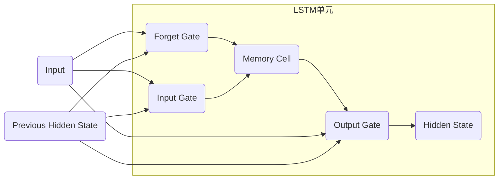

# 一切皆是映射：长短期记忆网络(LSTM)与文本处理

## 1.背景介绍

### 1.1 序列数据处理的挑战

在自然语言处理、语音识别、机器翻译等领域中,我们常常会遇到序列数据,例如一个句子就是一个文本序列。与单独的数据样本不同,序列数据具有以下特点:

- **长度不固定**: 每个序列的长度都可能不同,无法用固定长度的向量来表示。
- **前后关联性**: 序列中的每个元素都与其前后元素存在潜在的关联关系,单独看其中一个元素是难以理解其含义的。
- **长期依赖关系**: 对于较长序列,我们需要捕捉其中长期的依赖关系,而不仅仅是相邻元素之间的关系。

传统的神经网络模型如前馈神经网络、卷积神经网络等都难以很好地处理这种序列数据。循环神经网络(RNN)的出现为解决这一问题提供了一种新的思路。

### 1.2 循环神经网络(RNN)简介

循环神经网络(Recurrent Neural Network, RNN)是一种对序列数据进行建模的有力工具。与前馈神经网络不同,RNN在隐藏层之间增加了循环连接,使得网络具有"记忆"能力,能够捕捉序列数据中的动态行为。

然而,标准的RNN在实践中存在一些缺陷,例如在处理长序列时容易出现梯度消失或爆炸的问题,导致无法很好地捕捉长期依赖关系。为了解决这一问题,研究人员提出了长短期记忆网络(Long Short-Term Memory, LSTM)。

## 2.核心概念与联系

### 2.1 LSTM的核心思想

LSTM是一种特殊的RNN,它通过精心设计的门控机制和记忆单元,使网络能够更好地捕捉长期依赖关系。LSTM的核心思想可以概括为以下三点:

1. **记忆单元(Memory Cell)**: 用于存储序列中的长期状态信息。
2. **门控机制(Gating Mechanism)**: 包括遗忘门、输入门和输出门,用于控制记忆单元的读写操作。
3. **可加性(Additive)**: 通过门控机制对记忆单元进行加性更新,而不是直接覆盖,从而更好地保留长期信息。

### 2.2 LSTM与RNN的关系

LSTM可以看作是RNN的一种变种,它们都属于循环神经网络的范畴。LSTM在RNN的基础上进行了改进,使其能够更好地捕捉长期依赖关系。具体来说:

- RNN在隐藏层之间增加了循环连接,使网络具有"记忆"能力。
- LSTM在RNN的基础上引入了记忆单元和门控机制,使得网络能够更好地控制信息的流动,从而更好地捕捉长期依赖关系。

因此,LSTM可以被视为RNN的一种改进版本,它在保留RNN处理序列数据的能力的同时,解决了RNN在处理长序列时存在的梯度消失或爆炸问题。

## 3.核心算法原理具体操作步骤

为了更好地理解LSTM的工作原理,我们需要深入了解其中的核心算法原理和具体操作步骤。



上图展示了LSTM单元的基本结构,其中包括三个门控机制(遗忘门、输入门和输出门)和一个记忆单元。LSTM单元的具体操作步骤如下:

1. **遗忘门(Forget Gate)**: 决定从上一时刻的记忆单元中遗忘多少信息。它根据当前输入 $x_t$ 和上一时刻的隐藏状态 $h_{t-1}$ 计算一个介于0和1之间的权重,用于控制记忆单元中信息的保留程度。
   $$
   f_t = \sigma(W_f \cdot [h_{t-1}, x_t] + b_f)
   $$

2. **输入门(Input Gate)**: 决定从当前输入和上一时刻的隐藏状态中获取多少新信息,并将其写入记忆单元。它包括两部分:
   - 一个sigmoid层,决定将新信息的哪些部分更新到记忆单元中。
     $$
     i_t = \sigma(W_i \cdot [h_{t-1}, x_t] + b_i)
     $$
   - 一个tanh层,创建一个新的候选记忆单元向量 $\tilde{C}_t$,其值介于-1和1之间。
     $$
     \tilde{C}_t = \tanh(W_C \cdot [h_{t-1}, x_t] + b_C)
     $$

3. **记忆单元更新(Memory Cell Update)**: 根据遗忘门和输入门的输出,更新记忆单元的状态。
   $$
   C_t = f_t \odot C_{t-1} + i_t \odot \tilde{C}_t
   $$
   其中 $\odot$ 表示元素wise乘积操作。这一步实现了对记忆单元的加性更新,保留了上一时刻记忆单元中的有用信息,同时加入了当前时刻的新信息。

4. **输出门(Output Gate)**: 决定从记忆单元中输出多少信息到当前时刻的隐藏状态。它包括两部分:
   - 一个sigmoid层,决定记忆单元的哪些部分将被输出。
     $$
     o_t = \sigma(W_o \cdot [h_{t-1}, x_t] + b_o)
     $$
   - 将记忆单元的状态通过tanh函数进行处理,使其值介于-1和1之间,然后与sigmoid门的输出相乘,得到最终的输出。
     $$
     h_t = o_t \odot \tanh(C_t)
     $$

通过上述步骤,LSTM能够灵活地控制信息的流动,保留有用的长期信息,同时加入新的信息,从而更好地捕捉序列数据中的长期依赖关系。

## 4.数学模型和公式详细讲解举例说明

为了更好地理解LSTM的数学模型和公式,我们将通过一个具体的例子来进行详细的讲解和说明。

假设我们有一个长度为5的序列 $[x_1, x_2, x_3, x_4, x_5]$,我们希望使用LSTM来对其进行建模和处理。为了简化说明,我们假设LSTM单元的隐藏状态维度为2,记忆单元维度也为2。

### 4.1 初始状态

在开始处理序列之前,我们需要初始化LSTM单元的状态,包括隐藏状态 $h_0$ 和记忆单元状态 $C_0$。通常,我们将它们初始化为全0向量。
$$
h_0 = \begin{bmatrix} 0 \\ 0 \end{bmatrix}, \quad C_0 = \begin{bmatrix} 0 \\ 0 \end{bmatrix}
$$

### 4.2 时间步 $t=1$

在第一个时间步,我们将输入 $x_1$ 和初始隐藏状态 $h_0$ 传递给LSTM单元,并按照前面介绍的步骤进行计算。

1. 计算遗忘门的输出:
   $$
   f_1 = \sigma(W_f \cdot [h_0, x_1] + b_f) = \begin{bmatrix} 0.2 \\ 0.4 \end{bmatrix}
   $$

2. 计算输入门的输出:
   - sigmoid门:
     $$
     i_1 = \sigma(W_i \cdot [h_0, x_1] + b_i) = \begin{bmatrix} 0.6 \\ 0.8 \end{bmatrix}
     $$
   - 候选记忆单元向量:
     $$
     \tilde{C}_1 = \tanh(W_C \cdot [h_0, x_1] + b_C) = \begin{bmatrix} 0.5 \\ -0.3 \end{bmatrix}
     $$

3. 更新记忆单元状态:
   $$
   C_1 = f_1 \odot C_0 + i_1 \odot \tilde{C}_1 = \begin{bmatrix} 0.3 \\ -0.24 \end{bmatrix}
   $$

4. 计算输出门的输出:
   - sigmoid门:
     $$
     o_1 = \sigma(W_o \cdot [h_0, x_1] + b_o) = \begin{bmatrix} 0.7 \\ 0.5 \end{bmatrix}
     $$
   - 隐藏状态输出:
     $$
     h_1 = o_1 \odot \tanh(C_1) = \begin{bmatrix} 0.21 \\ -0.12 \end{bmatrix}
     $$

### 4.3 时间步 $t=2$

在第二个时间步,我们将输入 $x_2$ 和上一时刻的隐藏状态 $h_1$ 传递给LSTM单元,并重复上述步骤进行计算。

1. 计算遗忘门的输出:
   $$
   f_2 = \sigma(W_f \cdot [h_1, x_2] + b_f) = \begin{bmatrix} 0.4 \\ 0.6 \end{bmatrix}
   $$

2. 计算输入门的输出:
   - sigmoid门:
     $$
     i_2 = \sigma(W_i \cdot [h_1, x_2] + b_i) = \begin{bmatrix} 0.8 \\ 0.6 \end{bmatrix}
     $$
   - 候选记忆单元向量:
     $$
     \tilde{C}_2 = \tanh(W_C \cdot [h_1, x_2] + b_C) = \begin{bmatrix} -0.2 \\ 0.4 \end{bmatrix}
     $$

3. 更新记忆单元状态:
   $$
   C_2 = f_2 \odot C_1 + i_2 \odot \tilde{C}_2 = \begin{bmatrix} -0.08 \\ 0.12 \end{bmatrix}
   $$

4. 计算输出门的输出:
   - sigmoid门:
     $$
     o_2 = \sigma(W_o \cdot [h_1, x_2] + b_o) = \begin{bmatrix} 0.5 \\ 0.7 \end{bmatrix}
     $$
   - 隐藏状态输出:
     $$
     h_2 = o_2 \odot \tanh(C_2) = \begin{bmatrix} -0.04 \\ 0.084 \end{bmatrix}
     $$

以此类推,我们可以继续处理序列中的其他时间步,直到完成整个序列的处理。通过这个具体的例子,我们可以更好地理解LSTM的数学模型和公式,以及它们在实际计算中的应用。

## 5.项目实践: 代码实例和详细解释说明

为了更好地理解LSTM在实际项目中的应用,我们将提供一个基于Python和PyTorch框架的代码实例,并对其进行详细的解释说明。

在这个示例中,我们将构建一个基于LSTM的文本分类模型,用于对电影评论进行情感分析(正面或负面)。我们将使用来自IMDB的数据集,其中包含25,000条已标记的电影评论。

### 5.1 数据准备

首先,我们需要导入所需的库和数据集:

```python
import torch
import torch.nn as nn
from torchtext.legacy import data, datasets

# 设置种子以确保可重复性
SEED = 1234
torch.manual_seed(SEED)
torch.backends.cudnn.deterministic = True

# 加载IMDB数据集
TEXT = data.Field(tokenize='spacy', tokenizer_language='en_core_web_sm', batch_first=True)
LABEL = data.LabelField(dtype=torch.float)

train_data, test_data = datasets.IMDB.splits(TEXT, LABEL)

# 构建词汇表
MAX_VOCAB_SIZE = 25_000
TEXT.build_vocab(train_data, max_size=MAX_VOCAB_SIZE)
LABEL.build_vocab(train_data)

# 创建迭代器
BATCH_SIZE = 64
train_iterator, test_iterator = data.BucketIterator.splits(
    (