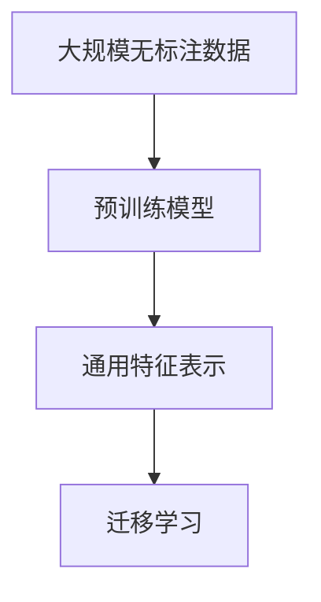
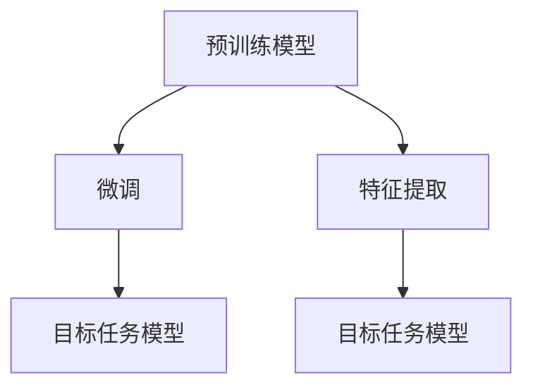
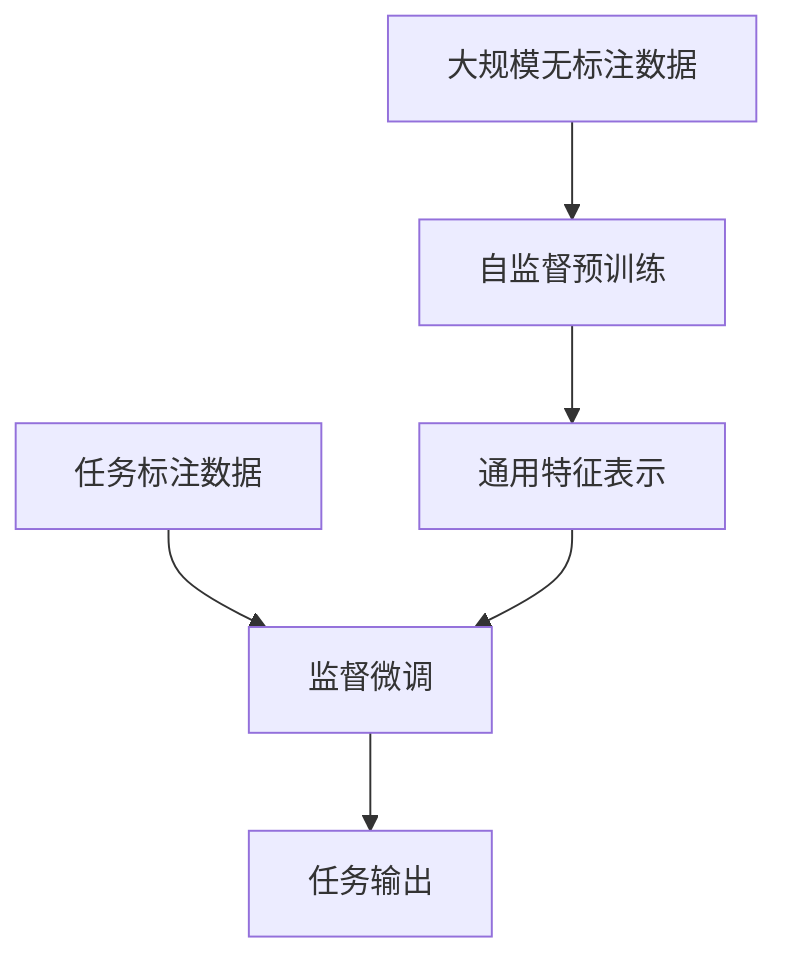
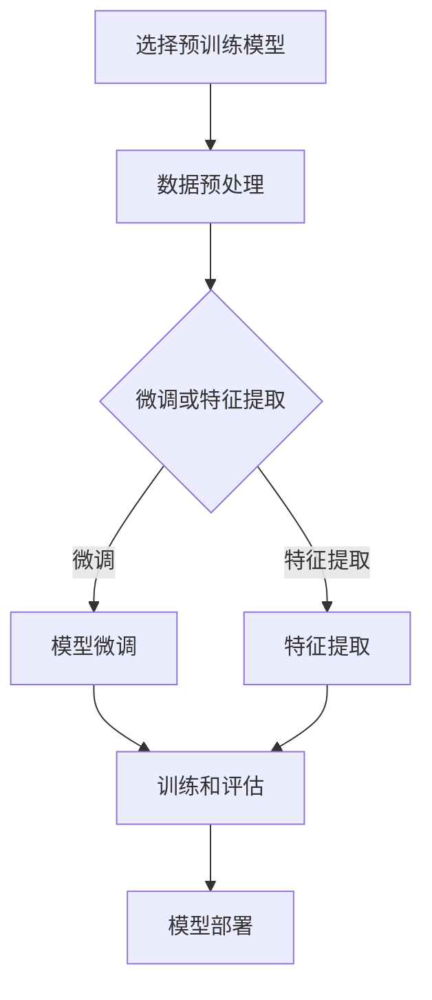

# 一切皆是映射：预训练深度模型与迁移学习

## 1. 背景介绍

### 1.1 深度学习的兴起

近年来，深度学习在计算机视觉、自然语言处理、语音识别等领域取得了令人瞩目的成就。这种基于人工神经网络的机器学习技术能够从大量数据中自动学习特征表示,并展现出超越传统机器学习算法的强大能力。

### 1.2 数据饥渴和计算瓶颈

然而,训练一个深度神经网络需要大量的标注数据和计算资源,这对于许多应用领域来说是一个巨大的挑战。从头开始训练一个复杂的深度模型不仅耗时耗力,而且需要大量的人力和财力投入。

### 1.3 迁移学习的概念

为了解决这一难题,研究人员提出了迁移学习(Transfer Learning)的概念。迁移学习的核心思想是利用在源领域学习到的知识来帮助目标领域的任务学习,从而减少对大量标注数据的需求,提高模型的泛化能力。

## 2. 核心概念与联系

### 2.1 预训练模型

预训练模型是迁移学习的基础。它是在大规模无标注数据上预先训练的深度神经网络模型,学习到了通用的特征表示。这些预训练模型可以被视为知识库,其中蕴含着丰富的语义和视觉信息。



### 2.2 微调和特征提取

在迁移学习中,有两种常见的方法来利用预训练模型:

1. **微调(Fine-tuning)**: 将预训练模型作为初始化权重,在目标任务的数据上进行进一步训练和调整模型参数。这种方法能够充分利用预训练模型的知识,并针对具体任务进行优化。

2. **特征提取(Feature Extraction)**: 将预训练模型的部分层(通常是卷积层或编码器层)固定,只训练最后几层(通常是全连接层或解码器层)。这种方法利用预训练模型提取通用特征,同时降低了模型参数的数量,从而减少了计算资源的需求。



### 2.3 领域适应性

迁移学习的另一个关键概念是领域适应性。由于源领域和目标领域之间可能存在分布差异,直接应用预训练模型可能会导致性能下降。因此,需要采取一些策略来缓解这种差异,如域适应、样本选择和数据增强等技术。

## 3. 核心算法原理具体操作步骤

### 3.1 预训练模型训练

预训练模型的训练过程通常分为两个阶段:

1. **自监督预训练**: 在大规模无标注数据上进行自监督学习,学习通用的特征表示。常见的自监督学习任务包括掩码语言模型(Masked Language Modeling)、下一句预测(Next Sentence Prediction)、图像去噪(Denoising Autoencoders)等。

2. **监督微调**: 在特定任务的标注数据上进行监督微调,将通用特征表示映射到具体的任务输出。这个阶段可以根据任务的不同采用不同的损失函数和优化策略。



### 3.2 迁移学习流程

在实际应用中,迁移学习的流程如下:

1. **选择合适的预训练模型**: 根据任务的特点,选择在相似领域预训练的模型,如自然语言处理任务可选择BERT、计算机视觉任务可选择ResNet等。

2. **数据预处理**: 将目标任务的数据进行适当的预处理,使其符合预训练模型的输入格式。

3. **模型微调或特征提取**: 根据任务的复杂程度和可用数据量,决定采用微调还是特征提取的方式。

4. **训练和评估**: 在目标任务的数据上训练模型,并进行评估和调优。

5. **模型部署**: 将训练好的模型部署到实际的应用系统中。



## 4. 数学模型和公式详细讲解举例说明

### 4.1 自监督预训练任务

自监督预训练任务的目标是学习通用的特征表示,而不依赖于任何人工标注的数据。常见的自监督预训练任务包括:

1. **掩码语言模型(Masked Language Modeling, MLM)**: 在输入序列中随机掩码一部分词元,模型需要预测被掩码的词元。损失函数为:

$$\mathcal{L}_\text{MLM} = -\sum_{i=1}^{n} \log P(x_i | \mathbf{x}_\text{masked})$$

其中 $n$ 是被掩码词元的数量, $\mathbf{x}_\text{masked}$ 是掩码后的输入序列。

2. **下一句预测(Next Sentence Prediction, NSP)**: 给定两个句子,模型需要预测它们是否属于同一个文档。损失函数为:

$$\mathcal{L}_\text{NSP} = -\log P(y | \mathbf{x}_1, \mathbf{x}_2)$$

其中 $y$ 是标签(同一文档或不同文档), $\mathbf{x}_1$ 和 $\mathbf{x}_2$ 是两个输入句子。

3. **去噪自编码器(Denoising Autoencoders, DAE)**: 给定一个噪声输入图像,模型需要重构原始的清晰图像。损失函数为:

$$\mathcal{L}_\text{DAE} = \|\mathbf{x} - \text{DAE}(\tilde{\mathbf{x}})\|_2^2$$

其中 $\mathbf{x}$ 是原始图像, $\tilde{\mathbf{x}}$ 是噪声输入图像, $\text{DAE}(\cdot)$ 是去噪自编码器模型。

通过优化这些自监督预训练任务的损失函数,模型可以学习到通用的特征表示,为后续的迁移学习任务打下基础。

### 4.2 微调和特征提取

在迁移学习中,微调和特征提取是两种常见的方法。它们的数学表示如下:

1. **微调**: 将预训练模型的参数 $\theta_\text{pre}$ 作为初始化,在目标任务的数据上进行进一步训练,优化目标任务的损失函数 $\mathcal{L}_\text{task}$:

$$\theta^* = \arg\min_\theta \mathcal{L}_\text{task}(\theta; \mathcal{D}_\text{task})$$

其中 $\theta^*$ 是优化后的模型参数, $\mathcal{D}_\text{task}$ 是目标任务的数据集。

2. **特征提取**: 将预训练模型的部分层(如卷积层或编码器层)固定为 $f_\text{pre}$,只训练最后几层(如全连接层或解码器层) $g_\theta$,优化目标任务的损失函数:

$$\theta^* = \arg\min_\theta \mathcal{L}_\text{task}(g_\theta \circ f_\text{pre}; \mathcal{D}_\text{task})$$

其中 $\circ$ 表示函数组合, $f_\text{pre}$ 是固定的预训练模型层, $g_\theta$ 是需要训练的最后几层。

通过微调或特征提取,预训练模型的知识可以被转移到目标任务中,从而提高模型的性能和泛化能力。

## 5. 项目实践: 代码实例和详细解释说明

在这一部分,我们将通过一个实际的代码示例来展示如何在PyTorch中实现迁移学习。我们将使用预训练的ResNet-50模型,并在CIFAR-10数据集上进行微调和特征提取。

### 5.1 导入所需库

```python
import torch
import torchvision
import torchvision.transforms as transforms
import torch.nn as nn
import torch.optim as optim
```

### 5.2 数据预处理

```python
# 定义数据转换
transform = transforms.Compose([
    transforms.Resize(256),
    transforms.CenterCrop(224),
    transforms.ToTensor(),
    transforms.Normalize(mean=[0.485, 0.456, 0.406], std=[0.229, 0.224, 0.225])
])

# 加载CIFAR-10数据集
trainset = torchvision.datasets.CIFAR10(root='./data', train=True, download=True, transform=transform)
trainloader = torch.utils.data.DataLoader(trainset, batch_size=32, shuffle=True, num_workers=2)

testset = torchvision.datasets.CIFAR10(root='./data', train=False, download=True, transform=transform)
testloader = torch.utils.data.DataLoader(testset, batch_size=32, shuffle=False, num_workers=2)
```

### 5.3 加载预训练模型

```python
# 加载预训练的ResNet-50模型
model = torchvision.models.resnet50(pretrained=True)

# 冻结卷积层参数
for param in model.parameters():
    param.requires_grad = False
```

### 5.4 微调模型

```python
# 替换最后一层全连接层
num_ftrs = model.fc.in_features
model.fc = nn.Linear(num_ftrs, 10)  # 10个类别

# 定义损失函数和优化器
criterion = nn.CrossEntropyLoss()
optimizer = optim.SGD(model.fc.parameters(), lr=0.001, momentum=0.9)

# 训练模型
for epoch in range(10):
    running_loss = 0.0
    for inputs, labels in trainloader:
        optimizer.zero_grad()
        outputs = model(inputs)
        loss = criterion(outputs, labels)
        loss.backward()
        optimizer.step()
        running_loss += loss.item()
    print(f'Epoch {epoch+1} loss: {running_loss / len(trainloader)}')

# 评估模型
correct = 0
total = 0
with torch.no_grad():
    for inputs, labels in testloader:
        outputs = model(inputs)
        _, predicted = torch.max(outputs.data, 1)
        total += labels.size(0)
        correct += (predicted == labels).sum().item()

print(f'Accuracy: {100 * correct / total}%')
```

### 5.5 特征提取

```python
# 冻结卷积层参数
for param in model.parameters():
    param.requires_grad = False

# 定义新的全连接层
num_ftrs = model.fc.in_features
model.fc = nn.Linear(num_ftrs, 10)  # 10个类别

# 定义损失函数和优化器
criterion = nn.CrossEntropyLoss()
optimizer = optim.SGD(model.fc.parameters(), lr=0.001, momentum=0.9)

# 训练模型
for epoch in range(10):
    running_loss = 0.0
    for inputs, labels in trainloader:
        optimizer.zero_grad()
        with torch.no_grad():
            features = model.conv1(inputs)
            features = model.bn1(features)
            features = model.relu(features)
            features = model.maxpool(features)
            features = model.layer1(features)
            features = model.layer2(features)
            features = model.layer3(features)
            features = model.layer4(features)
            features = model.avgpool(features)
            features = torch.flatten(features, 1)
        outputs = model.fc(features)
        loss = criterion(outputs, labels)
        loss.backward()
        optimizer.step()
        running_loss += loss.item()
    print(f'Epoch {epoch+1} loss: {running_loss / len(trainloader)}')

# 评估模型
correct = 0
total = 0
with torch.no_grad():
    for inputs, labels in testloader:
        features = model.conv1(inputs)
        features = model.bn1(features)
        features = model.relu(features)
        features = model.maxpool(features)
        features = model.layer1(features)
        features = model.layer2(features)
        features = model.layer3(features)
        features = model.layer4(features)
        features = model.avgpool(features)
        features = torch.flatten(features, 1)
        outputs = model.fc(features)
        _, predicted = torch.max(outputs.data, 1)
        total += labels.size(0)
        correct += (predicted == labels).sum().item()

print(f'Accuracy: {100 * correct / total}%')
```

在这个示例中,我们首先加载预训练的ResNet-50模型,并对其进行微