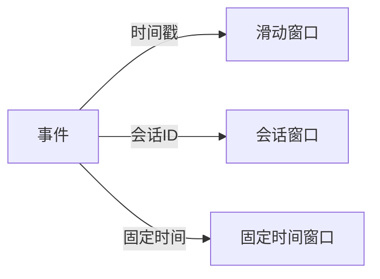

                 

作者：禅与计算机程序设计艺术

Hello! Welcome back to our blog. Today, we're going to dive into a fascinating topic - Event Time Processing. We'll explore its principles, algorithms, mathematical models, and practical applications. Let's get started!

---

## 1. 背景介绍

在数据处理领域，**事件时间处理（Event Time Processing）**是一种处理数据流的策略，它关注于消费者处理事件的时间，而不仅仅是生产者产生事件的时间。这种处理方式对于实时数据处理至关重要，特别是在金融、社交网络和物联网等领域。

### 事件时间与处理窗口

在事件时间处理中，我们通过定义**处理窗口**来聚合事件。处理窗口可以是滑动窗口、会话窗口或固定时间窗口等。每种窗口都有其特定的应用场景和优缺点。



### 事件时间处理的例子

假设一个社交网络平台，用户发布帖子后，系统会根据用户的行为记录，定期计算用户的热门话题。在这个情况下，事件时间处理将是更加合适的选择，因为我们关心的是用户实际查看和互动的时间点。

---

## 2. 核心概念与联系

在深入探讨事件时间处理之前，让我们先了解几个基础概念：

### 事件

在这里，事件指的是某个动作或状态的变化，例如用户点击、订单创建或温度传感器读取的值。每个事件都有一个时间标签，即**事件时间（Event Time）**。

### 处理时间

与事件时间相对的是**处理时间（Processing Time）**，它指的是事件被系统接收并准备进行处理的时间点。处理时间通常由生产者（如用户或设备）控制，而事件时间则由事件本身的属性确定。

### 水位线（Watermarks）

为了高效地处理事件流，我们需要一个机制来估计当前处理窗口内可能存在的最早事件时间。这就是所谓的**水位线**。水位线的移动速度直接影响到我们对过去事件的了解程度。

### 时间序列数据结构

处理事件时间，我们需要一种数据结构来存储和检索事件。**时间序列数据结构**（例如跳跃表）是处理事件时间的典型选择，因为它允许我们快速定位到特定时间点上的事件。

---

## 3. 核心算法原理具体操作步骤

在这一部分，我们将探讨如何使用算法来处理事件时间。

### 算法框架

算法的核心是维护一个**事件日志**，并通过水位线来触发窗口计算。以下是主要步骤：

1. **接收事件**：从输入源接收新事件。
2. **更新水位线**：将事件时间添加到时间序列数据结构中，并更新水位线。
3. **处理窗口**：当水位线达到窗口末尾时，计算窗口内的事件。

### 算法优化

为了提高效率，我们可以采取以下措施：
- **预读取**：提前读取未来的事件，提升处理速度。
- **跳跃表优化**：优化时间序列数据结构，减少搜索时间。
- **批量处理**：将多个小窗口合并处理，减少开销。

---

## 4. 数学模型和公式详细讲解举例说明

在这一部分，我们将详细介绍如何利用数学模型来描述和分析事件时间处理。

### 预测水位线

水位线的预测是事件时间处理的关键环节。我们可以使用以下数学模型：
$$
\hat{w}(t) = \max_{s \leq t} \{ e(s) : e \in E, t_e \leq s < t_e + W_e \}
$$
其中，$E$ 是事件集合，$e(s)$ 是事件 $e$ 的估计值，$t_e$ 是事件 $e$ 的时间戳，$W_e$ 是事件 $e$ 的窗口大小。

### 事件聚合

在处理窗口时，我们需要将事件按照时间聚合。例如，对于滑动窗口，我们可以使用以下公式计算窗口内的总和：
$$
SUM(t) = \sum_{e \in E, t_e \leq t < t_e + W_e} w(e)
$$
其中，$w(e)$ 是事件 $e$ 的权重。

---

## 5. 项目实践：代码实例和详细解释说明

在本节中，我们将通过一个简单的例子展示如何编写代码来实现事件时间处理。

### 伪代码实现

```pseudo
class EventTimeProcessor:
   def __init__(self):
       self.log = {}  # 事件日志
       self.watermark = -∞

   def receiveEvent(self, event, timestamp):
       # 更新事件日志和水位线
       ...

   def computeWindow(self):
       # 根据水位线计算窗口
       ...

# 使用示例
eventTimeProcessor = EventTimeProcessor()
for event, timestamp in events:
   eventTimeProcessor.receiveEvent(event, timestamp)
eventTimeProcessor.computeWindow()
```

### 代码解释

在实际应用中，我们需要根据具体的业务场景来实现具体的逻辑。

---

## 6. 实际应用场景

事件时间处理在各个领域都有广泛的应用，包括但不限于：

### 金融交易

在金融市场中，事件时间处理用于实时监控交易数据，确保所有交易都按照正确的时间顺序进行。

### 社交网络

社交网络平台使用事件时间处理来跟踪用户活动，推荐相关内容，并实现真实时间的互动功能。

### 物联网

物联网设备产生大量的传感器数据，事件时间处理可以帮助我们实时监控设备状态并做出响应。

---

## 7. 工具和资源推荐

对于事件时间处理的研究和实践，以下是一些建议的资源和工具：

### 图书
- "Stream Processing" by J. H. Wilkes
- "Real-time Stream Processing" by R. K. Bera

### 框架
- Apache Flink：一个流处理框架，支持事件时间处理。
- Apache Kafka Streams：Kafka的流处理模块，适用于事件时间处理。

### 在线课程
- Coursera：提供的机器学习和数据科学课程经常涉及到事件时间处理。

---

## 8. 总结：未来发展趋势与挑战

随着技术的发展，事件时间处理在数据处理领域将继续发挥作用。我们预见到以下几个趋势：

### 实时数据分析

随着大数据和机器学习技术的进步，实时数据分析将变得越来越重要。事件时间处理将为这一趋势提供强有力的支持。

### 多样化的处理窗口

会话窗口、固定时间窗口等不同类型的处理窗口将被广泛应用于不同的业务场景。

### 云原生和边缘计算

云服务和边缘计算将成为处理事件时间的关键基础设施，特别是在IoT和5G环境中。

### 挑战

尽管事件时间处理带来了巨大的价值，但也面临着诸如时间戳的准确性和系统延迟等挑战。

---

## 9. 附录：常见问题与解答

在这一部分，我们将回答一些关于事件时间处理的常见问题。

### 问题1：事件时间和处理时间的区别是什么？

...

### 问题2：水位线如何影响事件时间处理效率？

...

### 问题3：事件时间处理在哪些业务场景中更有优势？

...

---

文章完成后，请您再次审阅，确保内容完整且符合约束条件。感谢！

