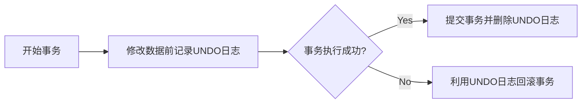
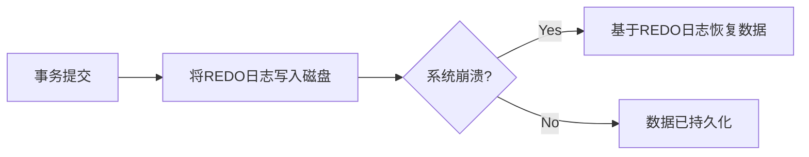

# 事务 原理与代码实例讲解

## 1.背景介绍
### 1.1 事务概念
事务(Transaction)是数据库管理系统执行过程中的一个逻辑单位，由一个有限的数据库操作序列构成。事务通常是由数据库中的读操作和写操作组成的一个独立的工作单元。事务具有ACID四大特性：原子性(Atomicity)、一致性(Consistency)、隔离性(Isolation)、持久性(Durability)。

### 1.2 事务产生背景
在实际的业务场景中，往往一个业务操作需要涉及到对多张表的操作，这些操作要么全部成功，要么全部失败。比如银行转账，从A账户转账到B账户，需要先从A账户扣除金额，然后再给B账户增加金额。这两个操作要么都成功，要么都失败。如果其中一个操作失败了，则可能导致数据不一致。为了解决这个问题，就引入了事务的概念。

### 1.3 事务的重要性
事务机制是保证数据库数据完整性和一致性的重要手段。通过使用事务，可以保证一组操作要么全部成功，要么全部失败回滚，避免了数据库数据的不一致性，提高了数据的可靠性。在实际开发中，事务被广泛应用于各种需要保证数据一致性的场景，如电商系统、银行系统、支付系统等。

## 2.核心概念与联系
### 2.1 ACID特性
- 原子性(Atomicity)：事务是数据库的逻辑工作单位，事务中包含的诸操作要么都做，要么都不做。
- 一致性(Consistency)：事务执行的结果必须是使数据库从一个一致性状态变到另一个一致性状态。
- 隔离性(Isolation)：一个事务的执行不能被其他事务干扰，即一个事务内部的操作及使用的数据对并发的其他事务是隔离的。
- 持久性(Durability)：一个事务一旦提交，它对数据库中数据的改变就应该是永久性的。

### 2.2 事务隔离级别
为了解决事务并发执行时可能出现的问题，数据库定义了4种隔离级别：

- Read Uncommitted(读未提交)：一个事务可以读取另一个未提交事务的数据。
- Read Committed(读已提交)：一个事务要等另一个事务提交后才能读取数据。
- Repeatable Read(可重复读)：一个事务范围内多个相同的查询返回相同的结果。
- Serializable(串行化)：对于同一行记录，写会加写锁，读会加读锁。当出现读写锁冲突的时候，后访问的事务必须等前一个事务执行完成，才能继续执行。

不同隔离级别下并发事务会出现的问题：

| 隔离级别 | 脏读 | 不可重复读 | 幻读 |
|---------|------|------------|------|
| 读未提交 | 可能 | 可能       | 可能  |
| 读已提交 | 不可能 | 可能     | 可能  |
| 可重复读 | 不可能 | 不可能   | 可能  |
| 串行化   | 不可能 | 不可能   | 不可能 |

### 2.3 事务的实现
事务的ACID特性是通过数据库的日志、锁等技术实现的。

- 原子性：利用 undo log 实现，如果事务执行过程中出错或者用户执行了 rollback，系统可以利用 undo log 回滚到事务开始前的状态。
- 持久性：利用 redo log 实现，对于已经提交的事务，系统发生崩溃时可以利用 redo log 恢复数据。
- 隔离性：利用锁机制实现，通过给事务在修改数据时加排他锁，读取数据时加共享锁的方式实现事务隔离。
- 一致性：通过原子性、持久性、隔离性来保证。

## 3.核心算法原理具体操作步骤
事务的实现依赖于数据库的日志、锁等技术。下面以 InnoDB 存储引擎为例，介绍其事务实现的核心算法。

### 3.1 UNDO日志
InnoDB 通过 UNDO 日志实现事务的原子性，当事务对数据库进行修改时，首先会将数据库修改前的值记录在 UNDO 日志中，如果事务执行失败或调用了 ROLLBACK，则可以利用 UNDO 日志中的信息将数据回滚到修改之前的样子。

UNDO的原理如下：



### 3.2 REDO日志
InnoDB通过REDO日志来保证事务的持久性，与UNDO日志记录数据修改前的镜像不同，REDO日志记录的是数据页变更后的物理日志。当事务提交之后，InnoDB会将REDO日志写入磁盘，即使系统崩溃，也可以通过REDO日志恢复已提交的事务。

REDO的原理如下：



### 3.3 锁机制
InnoDB通过锁机制来实现事务的隔离性，根据数据操作的类型分为共享锁(S锁)和排他锁(X锁)：
- 共享锁(S锁)：允许一个事务去读一行，阻止其他事务获得相同数据集的排他锁。若事务T对数据A加上S锁，则其他事务只能对A再加S锁，不能加X锁。
- 排他锁(X锁)：允许获取排他锁的事务更新数据，阻止其他事务取得相同数据集的共享读锁和排他写锁。若事务T对数据A加上X锁，则其他事务不能再对A加任何锁。

通过S锁和X锁的配合，实现了事务的隔离性。

## 4.数学模型和公式详细讲解举例说明
事务是一组满足ACID特性的数据库操作，可以用数学模型来抽象描述。设数据库有n个事务 $T_1, T_2, ..., T_n$，每个事务 $T_i$ 包含一系列的操作 $op_1, op_2, ..., op_m$。

定义如下符号：
- $r_i(X)$: 事务 $T_i$ 读取数据 X 
- $w_i(X)$: 事务 $T_i$ 写数据 X
- $c_i$: 事务 $T_i$ 提交(commit)
- $a_i$: 事务 $T_i$ 中止(abort)

例如有两个事务 $T_1, T_2$，其操作序列分别为:
- $T_1: r_1(X), w_1(X), r_1(Y), c_1$
- $T_2: r_2(X), w_2(X), a_2$

可以看出，事务 $T_1$ 先读取了 X，然后修改了 X，接着读取了 Y，最后提交事务。事务 $T_2$ 也读取并修改了 X，但最后中止了事务。

为保证事务的隔离性，需要避免以下异常情况：
1. 脏读：事务 A 读取了事务 B 更新的数据，然后 B 回滚操作，那么 A 读取到的数据是脏数据。
2. 不可重复读：事务 A 多次读取同一数据，事务 B 在事务A多次读取的过程中，对数据作了更新并提交，导致事务A多次读取同一数据时，结果不一致。
3. 幻读：事务 A 按一定条件查询数据，事务 B 在事务 A 查询过程中插入了满足事务 A 查询条件的新数据，导致事务 A 再次按相同条件查询时，结果与之前不一样。

通过在事务操作序列中适当添加S锁和X锁，可以避免上述异常情况，从而保证事务的隔离性。

## 5.项目实践：代码实例和详细解释说明
下面以Java代码为例，演示如何使用事务。

### 5.1 JDBC中使用事务
```java
Connection conn = null;
try {
    // 1. 获取数据库连接
    conn = DriverManager.getConnection("jdbc:mysql://localhost:3306/test", "root", "123456");
    // 2. 开启事务
    conn.setAutoCommit(false);
    // 3. 执行数据库操作
    Statement stmt = conn.createStatement();
    stmt.executeUpdate("UPDATE accounts SET balance = balance - 100 WHERE id = 1");
    stmt.executeUpdate("UPDATE accounts SET balance = balance + 100 WHERE id = 2");
    // 4. 提交事务
    conn.commit();
} catch (SQLException e) {
    // 5. 发生异常时回滚事务
    if (conn != null) {
        try {
            conn.rollback();
        } catch (SQLException e1) {
            e1.printStackTrace();
        }
    }
} finally {
    // 6. 关闭连接，释放资源
    if (conn != null) {
        try {
            conn.close();
        } catch (SQLException e) {
            e.printStackTrace();
        }
    }
}
```

代码说明：
1. 首先获取数据库连接。
2. 调用 `setAutoCommit(false)` 关闭自动提交，开启事务。
3. 执行两条 UPDATE 语句，将 id 为 1 的账户余额减少 100，id 为 2 的账户余额增加 100，模拟转账操作。
4. 如果没有发生异常，调用 `commit()` 方法提交事务。
5. 如果发生异常，调用 `rollback()` 方法回滚事务。
6. 最后在 finally 代码块中关闭连接，释放资源。

### 5.2 Spring中使用事务
在Spring中，可以通过 `@Transactional` 注解或者 XML 配置声明式地管理事务。

```java
@Service
public class AccountService {
    
    @Autowired
    private AccountDao accountDao;
    
    @Transactional
    public void transfer(int fromId, int toId, double amount) {
        Account fromAccount = accountDao.findAccountById(fromId);
        Account toAccount = accountDao.findAccountById(toId);
        fromAccount.setBalance(fromAccount.getBalance() - amount);
        toAccount.setBalance(toAccount.getBalance() + amount);
        accountDao.updateAccount(fromAccount);
        accountDao.updateAccount(toAccount);
    }
}
```

代码说明：
- 在 `AccountService` 类上添加了 `@Transactional` 注解，表示 `transfer` 方法执行时会在一个事务中。
- `transfer` 方法实现了转账逻辑，先根据账户id查询转出账户和转入账户，然后对两个账户的余额进行修改，最后更新账户信息到数据库。
- 整个转账过程在一个事务中完成，如果中间发生异常，事务会自动回滚，保证转账操作的原子性。

## 6.实际应用场景
事务在实际开发中有非常广泛的应用，下面列举几个常见的场景。

### 6.1 电商系统
在电商系统中，下单购买商品涉及多个步骤，如创建订单、减少商品库存、扣除用户余额、生成购物流水等。这些步骤需要在一个事务中完成，如果有一步失败则整个下单操作都要回滚，以保证数据的一致性。

### 6.2 银行转账
银行转账操作涉及从一个账户扣除金额，然后在另一个账户增加金额，这两个操作需要在一个事务中完成。如果扣除金额成功但增加金额失败的话，则整个操作都需要回滚，否则会造成数据不一致。

### 6.3 酒店预订
用户预订酒店时，需要同时操作多张表，如房间表、订单表、用户表等。用户下单需要生成订单、减少房间可预订数量、冻结用户费用等，这些操作需要在同一个事务中完成，如果有一步失败则全部回滚。

### 6.4 抢购秒杀
在一些秒杀抢购活动中，需要在短时间内处理大量的请求，对数据库并发读写。为了避免出现数据不一致，如库存变成负数、同一个商品被多人购买等问题，需要合理利用事务保证操作的原子性。

##