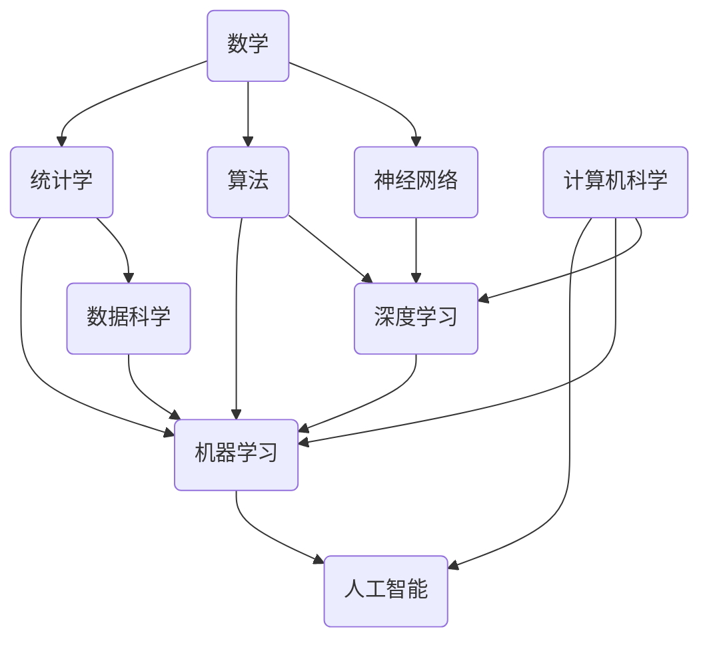

# 人工智能(AI)原理与代码实战案例讲解

## 1. 背景介绍

人工智能(Artificial Intelligence, AI)是当代最具颠覆性和影响力的技术之一。它旨在赋予机器智能,使其能够模仿或超越人类在特定任务上的认知能力。随着算力的不断提升和大数据时代的到来,人工智能技术正在飞速发展,并被广泛应用于各个领域,如计算机视觉、自然语言处理、机器学习、决策系统等,为我们的生活带来了巨大的变革。

### 1.1 人工智能的发展历程

人工智能的概念可以追溯到20世纪40年代,当时一些先驱者提出了"智能机器"的设想。1956年,约翰·麦卡锡在达特茅斯学院的一次研讨会上正式提出了"人工智能"这一术语。此后,人工智能经历了几个重要的发展阶段:

- 1950s-1960s: 人工智能的孕育期,主要集中在博弈问题、符号推理等领域。
- 1970s-1980s: 知识工程和专家系统的兴起,人工智能开始应用于一些特定领域。
- 1990s-2000s: 机器学习和神经网络的发展,人工智能开始具备一定的学习能力。
- 2010s至今: 深度学习的崛起,人工智能取得了令人瞩目的进展,在语音识别、图像识别等领域表现出色。

### 1.2 人工智能的重要性

人工智能技术的发展正在深刻影响着我们的生活、工作和社会。它为我们提供了新的解决方案和机遇,同时也带来了一些挑战和风险。人工智能的重要性主要体现在以下几个方面:

1. 提高效率和生产力
2. 优化决策和预测
3. 促进创新和发现
4. 改善人机交互体验
5. 推动社会可持续发展

然而,我们也需要警惕人工智能可能带来的一些潜在风险,如隐私和安全问题、技术失业、算法偏差等,并采取适当的措施来应对这些挑战。

## 2. 核心概念与联系

在探讨人工智能的原理和实践之前,我们需要了解一些核心概念及其相互关系。这些概念构成了人工智能的基础框架,对于理解和应用人工智能至关重要。

### 2.1 机器学习

机器学习(Machine Learning)是人工智能的一个重要分支,它赋予计算机系统从数据中学习和改进的能力,而无需显式编程。机器学习算法可以从大量数据中识别模式,并使用这些模式进行预测或决策。

常见的机器学习任务包括:

- 监督学习(分类、回归)
- 无监督学习(聚类、降维)
- 强化学习(决策、控制)

### 2.2 深度学习

深度学习(Deep Learning)是机器学习的一个子领域,它基于人工神经网络,通过对数据的表示学习,解决复杂的任务。深度学习模型可以自动从原始数据中提取特征,并在多个非线性转换层中学习这些特征的高级抽象表示。

常见的深度学习模型包括:

- 卷积神经网络(CNN)
- 递归神经网络(RNN)
- 长短期记忆网络(LSTM)
- 生成对抗网络(GAN)
- 变分自编码器(VAE)

### 2.3 数据科学

数据科学(Data Science)是一门跨学科领域,它结合了统计学、机器学习、编程和领域知识,旨在从数据中提取有价值的见解和知识。数据科学为人工智能提供了必要的数据基础和分析工具。

数据科学的关键步骤包括:

1. 数据采集和预处理
2. 数据探索和可视化
3. 特征工程和选择
4. 建模和评估
5. 部署和维护

### 2.4 算法

算法是人工智能和机器学习的核心,它们提供了解决问题的具体步骤和方法。算法可以分为不同的类别,如监督学习算法(如决策树、支持向量机)、无监督学习算法(如聚类算法、降维算法)、深度学习算法(如梯度下降、反向传播)等。

### 2.5 统计学

统计学为机器学习和人工智能提供了理论基础和分析工具。统计学概念如概率论、假设检验、回归分析等,在机器学习模型的构建、评估和优化中发挥着重要作用。

### 2.6 计算机科学

计算机科学是人工智能的基础,它提供了必要的算力、数据处理能力和编程工具。计算机科学的核心概念,如算法设计、数据结构、编程语言、系统架构等,对于实现高效和可扩展的人工智能系统至关重要。

### 2.7 数学

数学是人工智能和机器学习的理论基础。线性代数、微积分、优化理论、概率论等数学分支在人工智能模型的构建和优化中扮演着重要角色。

## 3. 核心算法原理具体操作步骤

在人工智能领域,有许多核心算法被广泛应用。这些算法背后的原理和操作步骤对于理解和实现人工智能系统至关重要。让我们探讨一些最常见和最有影响力的算法。

### 3.1 线性回归

线性回归是一种监督学习算法,用于预测连续值的目标变量。它通过找到最佳拟合直线(或超平面)来描述自变量和因变量之间的线性关系。

线性回归算法的具体操作步骤如下:

1. 收集数据
2. 准备数据(缺失值处理、特征缩放等)
3. 将数据集划分为训练集和测试集
4. 导入线性回归模型
5. 在训练集上训练模型
6. 在测试集上评估模型性能
7. 使用模型进行预测

线性回归算法的核心思想是通过最小化残差平方和(RSS)来找到最佳拟合线,其中残差是观测值与预测值之间的差值。

$$
RSS = \sum_{i=1}^{n}(y_i - \hat{y}_i)^2
$$

其中 $y_i$ 是第 $i$ 个观测值, $\hat{y}_i$ 是对应的预测值。

### 3.2 逻辑回归

逻辑回归是一种用于分类任务的监督学习算法。它通过估计事件发生的概率,将输入数据映射到离散的类别标签。

逻辑回归算法的具体操作步骤如下:

1. 收集数据
2. 准备数据(缺失值处理、特征编码等)
3. 将数据集划分为训练集和测试集
4. 导入逻辑回归模型
5. 在训练集上训练模型
6. 在测试集上评估模型性能
7. 使用模型进行分类预测

逻辑回归算法的核心思想是通过对数几率(log-odds)来建模事件发生的概率。对数几率是事件发生概率与不发生概率之比的对数值。

$$
\log\left(\frac{p}{1-p}\right) = \beta_0 + \beta_1x_1 + \beta_2x_2 + \cdots + \beta_nx_n
$$

其中 $p$ 是事件发生的概率, $x_i$ 是第 $i$ 个特征, $\beta_i$ 是对应的系数。

### 3.3 决策树

决策树是一种监督学习算法,可用于分类和回归任务。它通过构建一个树状模型来表示数据,每个内部节点代表一个特征,每个分支代表该特征的一个值,最终到达叶节点时得到预测结果。

决策树算法的具体操作步骤如下:

1. 收集数据
2. 准备数据(缺失值处理、特征编码等)
3. 将数据集划分为训练集和测试集
4. 导入决策树模型
5. 在训练集上训练模型(构建决策树)
6. 在测试集上评估模型性能
7. 使用模型进行预测

决策树算法的核心思想是通过信息增益或基尼不纯度来选择最优特征,从而构建决策树。信息增益衡量了使用特征后,数据的不确定性减少的程度。

$$
\text{Information Gain}(S, A) = \text{Entropy}(S) - \sum_{v \in \text{Values}(A)} \frac{|S_v|}{|S|} \text{Entropy}(S_v)
$$

其中 $S$ 是当前数据集, $A$ 是特征, $S_v$ 是根据特征 $A$ 的值 $v$ 划分的子集。

### 3.4 K-均值聚类

K-均值聚类是一种无监督学习算法,用于将数据集划分为 K 个簇。它通过迭代优化簇中心位置,最小化数据点与其所属簇中心的距离平方和。

K-均值聚类算法的具体操作步骤如下:

1. 选择 K 个初始簇中心
2. 将每个数据点分配给最近的簇中心
3. 重新计算每个簇的中心点
4. 重复步骤 2 和 3,直到簇中心不再发生变化

K-均值聚类算法的目标是最小化以下目标函数:

$$
J = \sum_{i=1}^{K} \sum_{x \in C_i} \left\lVert x - \mu_i \right\rVert^2
$$

其中 $K$ 是簇的数量, $C_i$ 是第 $i$ 个簇, $\mu_i$ 是第 $i$ 个簇的中心点。

### 3.5 主成分分析

主成分分析(Principal Component Analysis, PCA)是一种无监督学习算法,用于降维和数据可视化。它通过找到数据的主要方向(主成分),将高维数据投影到低维空间,同时尽量保留数据的方差。

主成分分析算法的具体操作步骤如下:

1. 标准化数据
2. 计算协方差矩阵
3. 计算协方差矩阵的特征值和特征向量
4. 选择前 $k$ 个最大特征值对应的特征向量作为主成分
5. 将原始数据投影到主成分空间

主成分分析的核心思想是找到一组正交基向量,使得投影到这些基向量上的数据方差最大。第一主成分是具有最大方差的方向,第二主成分是与第一主成分正交且具有次大方差的方向,以此类推。

### 3.6 梯度下降

梯度下降是一种优化算法,在机器学习和深度学习中被广泛应用于模型参数的优化。它通过沿着目标函数的负梯度方向更新参数,逐步减小目标函数的值,从而找到最优解。

梯度下降算法的具体操作步骤如下:

1. 初始化模型参数
2. 计算目标函数的梯度
3. 根据学习率更新参数
4. 重复步骤 2 和 3,直到收敛或达到最大迭代次数

梯度下降算法的核心公式如下:

$$
\theta_{t+1} = \theta_t - \eta \nabla_\theta J(\theta_t)
$$

其中 $\theta_t$ 是第 $t$ 次迭代的参数, $\eta$ 是学习率, $\nabla_\theta J(\theta_t)$ 是目标函数 $J$ 关于参数 $\theta_t$ 的梯度。

### 3.7 反向传播

反向传播(Backpropagation)是一种用于训练人工神经网络的算法,它通过计算误差函数关于网络权重的梯度,并利用梯度下降法更新权重,从而最小化误差函数。

反向传播算法的具体操作步骤如下:

1. 前向传播:输入数据通过网络进行前向计算,得到输出
2. 计算输出层误差
3. 反向传播误差:从输出层开始,计算每一层的误差梯度
4. 更新