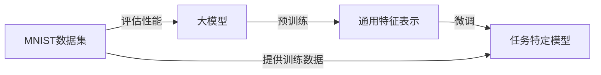

# 从零开始大模型开发与微调：MNIST数据集的特征和标签介绍

## 1. 背景介绍
### 1.1 大模型与微调的重要性
近年来,随着人工智能技术的飞速发展,大模型(Large Model)在各个领域取得了令人瞩目的成就。大模型是指参数量巨大、结构复杂的深度学习模型,通常在海量数据上进行预训练,具有强大的特征提取和表示学习能力。然而,面对特定的任务和场景,直接使用通用的大模型可能无法达到理想的效果。这时,我们需要在大模型的基础上进行微调(Fine-tuning),使其更好地适应具体任务的需求。

### 1.2 MNIST数据集的重要地位
在大模型开发与微调的过程中,选择合适的数据集至关重要。MNIST(Modified National Institute of Standards and Technology)数据集是一个经典的手写数字识别数据集,广泛应用于机器学习和深度学习领域。它包含了大量的手写数字图像及其对应的标签,是研究图像分类和识别算法的理想选择。深入了解MNIST数据集的特征和标签,对于开发高性能的大模型具有重要意义。

### 1.3 本文的目的和结构
本文旨在为读者提供一个全面的指南,介绍如何从零开始进行大模型的开发与微调,并以MNIST数据集为例,详细阐述其特征和标签的特点。通过本文,读者将掌握大模型开发与微调的基本流程,了解MNIST数据集的结构和应用,为后续的实践奠定坚实的基础。

本文的结构如下:
- 第二部分介绍大模型开发与微调的核心概念及其联系。
- 第三部分详细阐述大模型开发与微调的核心算法原理和具体操作步骤。  
- 第四部分深入探讨MNIST数据集的数学模型和公式,并给出详细的举例说明。
- 第五部分提供项目实践的代码实例,并对其进行详细的解释说明。
- 第六部分介绍大模型在实际应用场景中的案例和经验。
- 第七部分推荐相关的工具和资源,方便读者进一步学习和实践。
- 第八部分总结全文,展望大模型的未来发展趋势与面临的挑战。
- 第九部分列出常见问题与解答,为读者答疑解惑。

## 2. 核心概念与联系
### 2.1 大模型的定义与特点
大模型是指参数量巨大(通常在亿级以上)、结构复杂的深度学习模型。与传统的小型模型相比,大模型具有更强的表示学习能力,能够从海量数据中自动提取高层次的特征。大模型的主要特点包括:

1. 参数量巨大:大模型通常包含数以亿计的参数,远超传统模型。
2. 结构复杂:大模型采用深度神经网络结构,包含多个隐藏层,能够建模复杂的非线性关系。
3. 预训练与微调:大模型通常先在大规模无标注数据上进行预训练,学习通用的特征表示,再针对具体任务进行微调。
4. 泛化能力强:得益于其强大的特征提取能力,大模型具有优秀的泛化性能,能够适应不同的任务和场景。

### 2.2 微调的定义与作用
微调(Fine-tuning)是指在预训练的大模型基础上,针对特定任务进行进一步的训练和优化。具体而言,微调过程通常包括以下步骤:

1. 在大模型的基础上,根据任务需求调整模型的输入输出层。
2. 使用任务相关的有标注数据对模型进行训练,更新模型参数。
3. 通过调整学习率、正则化等超参数,控制模型的优化过程,避免过拟合。
4. 评估微调后模型在任务上的性能,必要时进行多次迭代优化。

微调的主要作用是使预训练的大模型更好地适应具体任务的需求,提高模型在特定场景下的性能。通过微调,我们可以在相对较小的数据集上快速获得高质量的模型,避免了从头训练模型的巨大开销。

### 2.3 MNIST数据集的基本情况
MNIST数据集是一个经典的手写数字识别数据集,由美国国家标准与技术研究所(NIST)收集整理而成。它包含了60,000张训练图像和10,000张测试图像,每张图像都是28x28像素的灰度图,表示一个手写数字(0~9)。MNIST数据集的主要特点包括:

1. 数据规模适中:相比ImageNet等大型数据集,MNIST的规模相对较小,便于快速实验和调试。
2. 数据质量高:MNIST数据集经过了人工筛选和标注,数据质量较高,噪声较少。
3. 任务明确:MNIST数据集的任务是识别手写数字,属于典型的多分类问题,易于理解和建模。
4. 应用广泛:MNIST数据集在机器学习和深度学习领域得到了广泛应用,是许多算法和模型的基准测试数据集。

### 2.4 大模型、微调与MNIST数据集的联系
大模型、微调与MNIST数据集之间存在着紧密的联系。一方面,我们可以利用MNIST数据集来评估大模型的性能,验证其特征提取和表示学习能力。通过在MNIST上进行微调,我们可以快速构建高精度的手写数字识别模型,展示大模型的威力。另一方面,MNIST数据集也为研究大模型的微调方法提供了理想的实验平台。我们可以在MNIST上探索不同的微调策略,如何选择合适的学习率、正则化方法等,为其他任务的微调提供借鉴。

下图展示了大模型、微调与MNIST数据集之间的关系:

## 3. 核心算法原理具体操作步骤
### 3.1 大模型的预训练算法
大模型的预训练通常采用无监督学习的方式,在大规模无标注数据上学习通用的特征表示。常用的预训练算法包括:

1. 自编码器(Autoencoder):通过重构输入数据,学习数据的低维表示。
2. 变分自编码器(Variational Autoencoder, VAE):在自编码器的基础上引入变分推断,学习数据的概率分布。
3. 生成对抗网络(Generative Adversarial Network, GAN):通过生成器和判别器的对抗学习,生成与真实数据分布相似的样本。
4. 语言模型(Language Model):在大规模文本数据上训练,学习词嵌入和上下文表示。
5. 掩码语言模型(Masked Language Model):随机掩盖输入文本的部分词汇,预测被掩盖的词,如BERT模型。

以BERT模型为例,其预训练的具体步骤如下:

1. 构建输入:将文本数据转换为词嵌入表示,添加位置编码和段落编码。
2. 掩码语言模型:随机掩盖一定比例(如15%)的词汇,用 [MASK] 标记替换。
3. 前向传播:将掩码后的输入送入Transformer编码器,得到每个位置的隐藏状态。
4. 预测掩码词:在每个 [MASK] 位置,使用隐藏状态预测被掩盖的词。
5. 计算损失:使用交叉熵损失函数,比较预测结果与真实标签。
6. 反向传播:计算梯度,更新模型参数。
7. 重复步骤2-6,直到模型收敛或达到预设的迭代次数。

经过预训练,BERT模型学习到了丰富的语义表示,可以用于下游的各种自然语言处理任务。

### 3.2 微调的核心算法
在预训练的大模型基础上,微调的核心算法是有监督的梯度下降法。具体步骤如下:

1. 加载预训练模型:加载预训练得到的模型参数,作为微调的初始化。
2. 调整输入输出层:根据任务需求,调整模型的输入输出层,如增加分类器、序列标注器等。
3. 准备任务数据:将任务相关的有标注数据划分为训练集和验证集。
4. 前向传播:将训练数据送入模型,得到预测结果。
5. 计算损失:使用适合任务的损失函数,如交叉熵、平方误差等,计算预测结果与真实标签的差异。
6. 反向传播:计算损失函数关于模型参数的梯度,使用优化算法(如Adam)更新参数。
7. 评估模型:在验证集上评估模型性能,如准确率、F1分数等。
8. 调整超参数:根据验证集性能,调整学习率、正则化系数等超参数,控制模型的优化过程。
9. 重复步骤4-8,直到模型性能达到满意的水平。

微调的关键在于利用预训练模型已经学习到的通用特征表示,在较小的数据集上快速适应新的任务。通过调整模型的输入输出层和微调参数,我们可以在保留预训练知识的同时,针对性地优化模型以适应具体任务。

### 3.3 MNIST数据集上的微调实践
以MNIST手写数字识别为例,我们可以在预训练的CNN模型(如ResNet)基础上进行微调,步骤如下:

1. 加载预训练的ResNet模型,去掉最后的全连接层。
2. 在ResNet的特征提取器之后,添加一个新的全连接层,输出维度为10(对应0~9十个数字)。
3. 使用MNIST训练集对模型进行微调,调整全连接层和CNN部分参数。
4. 在MNIST测试集上评估模型性能,计算准确率。
5. 调整学习率、正则化系数等超参数,优化模型。
6. 重复步骤3-5,直到模型在测试集上达到满意的准确率。

通过在MNIST数据集上的微调实践,我们可以快速构建一个高精度的手写数字识别模型。同时,这个过程也为其他图像识别任务的微调提供了参考。

## 4. 数学模型和公式详细讲解举例说明
### 4.1 MNIST数据集的数学表示
MNIST数据集中的每张图像可以表示为一个28x28的像素矩阵 $X$,其中每个像素值范围为0~255,表示灰度强度。我们可以将图像矩阵展平为一个784维的向量 $\mathbf{x} \in \mathbb{R}^{784}$。同时,每张图像对应一个数字标签 $y \in \{0, 1, \dots, 9\}$,表示图像所代表的数字。

给定训练集 $\mathcal{D} = \{(\mathbf{x}_1, y_1), (\mathbf{x}_2, y_2), \dots, (\mathbf{x}_N, y_N)\}$,其中 $N$ 为训练样本数,我们的目标是学习一个分类器 $f(\mathbf{x}; \mathbf{\theta})$,将输入图像 $\mathbf{x}$ 映射为对应的数字标签 $y$。这里 $\mathbf{\theta}$ 表示模型的参数。

### 4.2 交叉熵损失函数
在微调过程中,我们通常使用交叉熵损失函数来衡量模型预测结果与真实标签之间的差异。对于第 $i$ 个样本 $(\mathbf{x}_i, y_i)$,交叉熵损失定义为:

$$
\ell(\mathbf{x}_i, y_i; \mathbf{\theta}) = -\sum_{j=0}^9 \mathbf{1}\{y_i = j\} \log p(y=j|\mathbf{x}_i; \mathbf{\theta})
$$

其中 $\mathbf{1}\{\cdot\}$ 为示性函数,当条件为真时取值为1,否则为0。$p(y=j|\mathbf{x}_i; \mathbf{\theta})$ 表示模型预测第 $i$ 个样本属于类别 $j$ 的概率。

在整个训练集上,我们优化模型参数 $\mathbf{\theta}$ 以最小化平均交叉