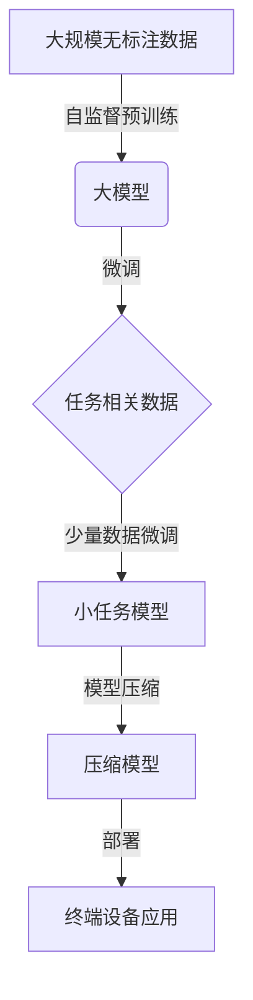

# 从零开始大模型开发与微调：tensorboardX可视化组件的使用

## 1.背景介绍

### 1.1 大模型时代的到来

近年来,人工智能领域取得了长足的进步,其中大模型(Large Model)的出现可谓是一个里程碑式的突破。大模型是指具有数十亿甚至上百亿参数的深度神经网络模型,其强大的计算能力和海量参数量使其能够在自然语言处理、计算机视觉等多个领域展现出超越人类的卓越表现。

代表性的大模型有OpenAI的GPT-3、谷歌的PaLM、DeepMind的Gopher等,它们在文本生成、问答、推理等任务上都取得了令人惊叹的成绩。大模型的出现彻底改变了人工智能的发展格局,开启了一个全新的时代。

### 1.2 大模型训练的挑战

然而,训练如此庞大的神经网络模型并非一件易事。首先,需要大量的高质量数据作为训练集,才能确保模型的泛化性能。其次,由于参数量的巨大,训练一个大模型需要强大的算力支持,通常需要耗费数周甚至数月的时间。再者,大规模并行训练带来了诸多技术挑战,如梯度同步、数据并行等。最后,大模型的推理部署也是一个难题,需要硬件和软件的支持。

### 1.3 微调技术的重要性  

针对上述挑战,微调(Fine-tuning)技术应运而生并发挥了重要作用。微调是指在一个大模型的基础上,使用与目标任务相关的数据进行额外的训练,从而将大模型"调整"为专门的小任务模型。相比从头训练,微调的优势在于:

1. 降低了数据需求,只需少量与任务相关的数据即可。
2. 减少了训练时间,利用大模型的强大迁移能力。
3. 提高了小任务的性能,大模型为小任务提供了良好的初始化。

因此,微调技术成为了大模型落地应用的重要一环,使得大模型的强大能力得以充分发挥。

## 2.核心概念与联系

### 2.1 迁移学习

微调技术的本质是一种迁移学习(Transfer Learning)方法。迁移学习指将在源领域学习到的知识迁移到目标领域,从而加速目标任务的学习过程。在大模型场景下,源领域是通过自监督方式在大量无标注数据上预训练得到的大模型;目标领域则是我们关心的具体任务,如机器翻译、文本摘要等。

通过微调,大模型在源领域学习到的通用知识得以转移到目标任务中,从而减少了目标任务所需的数据量和训练时间。同时,大模型为目标任务提供了一个良好的参数初始化,有助于提升性能。

### 2.2 模型压缩

除了微调外,模型压缩(Model Compression)也是大模型应用的一个重要技术。由于大模型庞大的参数量,直接将其部署到移动端或边缘设备是不现实的。因此需要对大模型进行压缩,以减小其存储和计算开销。

常见的模型压缩技术包括:

- 剪枝(Pruning):移除模型中不重要的权重连接
- 量化(Quantization):将权重和激活从32位浮点数压缩到较低比特
- 知识蒸馏(Knowledge Distillation):使用一个小模型去学习大模型的行为

模型压缩技术可以单独使用,也可以与微调技术相结合,共同实现大模型的高效部署。

### 2.3 Mermaid流程图

下面的Mermaid流程图展示了大模型开发的典型流程:



该流程图阐明了大模型开发中微调和模型压缩技术的重要地位,它们共同助力大模型在实际应用中的落地。

## 3.核心算法原理具体操作步骤

### 3.1 微调算法原理

微调的核心思想是在大模型的基础上,使用与目标任务相关的数据进行额外的训练,从而"调整"大模型以适应目标任务。具体来说,微调算法包括以下几个步骤:

1. **加载预训练模型**:首先加载经过自监督预训练的大模型参数,作为微调的初始化。

2. **准备微调数据**:收集与目标任务相关的少量数据,构建微调数据集。数据集的标注方式取决于任务类型,如分类、回归等。

3. **修改输出层**:根据目标任务的类型,可能需要修改大模型的输出层,使其输出维度与任务相符。

4. **微调训练**:使用微调数据集,在大模型的基础上进行有监督的微调训练。训练过程中,大模型的绝大部分参数被"冻结",只有部分层(如输出层)的参数可以被微调。

5. **模型评估**:在保留数据集上评估微调后模型的性能,确保达到预期的指标水平。

6. **模型部署**:将微调好的模型导出并部署到实际的生产环境中。

微调算法的关键在于利用大模型强大的迁移能力,通过少量任务相关数据就能将大模型"调整"为目标任务的专家模型。这种方式大大降低了数据需求,同时保留了大模型的优势。

### 3.2 模型压缩算法原理

为了实现大模型的高效部署,需要对其进行压缩。常见的模型压缩算法包括:

1. **剪枝(Pruning)算法**:
   - 原理是移除模型中不重要的权重连接,从而减小模型大小。
   - 具体步骤包括:计算权重重要性、按重要性排序、移除不重要权重。
   - 剪枝后需要对剩余权重进行微调,以恢复模型性能。

2. **量化(Quantization)算法**:
   - 原理是将原本32位浮点数的权重和激活压缩到较低比特(如8位或2位)。
   - 常用的量化方法有均值量化、K-Means量化等。
   - 量化可在训练时或推理时进行,前者需要量化感知训练。

3. **知识蒸馏(Knowledge Distillation)算法**:
   - 原理是使用一个小模型(学生模型)去学习大模型(教师模型)的行为。
   - 具体做法是最小化学生模型与教师模型的输出之间的差异。
   - 知识蒸馏可与剪枝、量化等方法相结合,进一步压缩模型。

以上压缩算法可根据具体场景进行选择和组合,在压缩模型的同时尽量保留模型的性能水平。

## 4.数学模型和公式详细讲解举例说明

### 4.1 知识蒸馏损失函数

知识蒸馏是模型压缩中一种常用的技术,其核心思想是使用一个小模型(学生模型)去学习一个大模型(教师模型)的行为。这种思路可以形式化为一个优化目标,即最小化学生模型与教师模型之间的divergence。

最常用的divergence是KL散度,对应的知识蒸馏损失函数为:

$$\mathcal{L}_{KD}(y_s, y_t) = \tau^2 \sum_{i=1}^N y_t^{(i)} \log \frac{y_t^{(i)}}{y_s^{(i)}}$$

其中:
- $y_s$是学生模型的logits输出(未经softmax)
- $y_t$是教师模型的logits输出(未经softmax)
- $\tau$是一个温度超参数,用于"软化"logits分布
- $N$是输出logits的维度

上式的本质是使学生模型的logits分布尽可能逼近教师模型的logits分布。当$\tau=1$时,等价于最小化两个模型的交叉熵损失。

在实际应用中,知识蒸馏损失通常与传统的监督损失(如交叉熵损失)相结合,形成总的优化目标:

$$\mathcal{L}_{total} = \mathcal{L}_{CE}(y_s, y_{ground-truth}) + \lambda \mathcal{L}_{KD}(y_s, y_t)$$

其中$\lambda$是一个权重超参数,用于平衡两个损失项。

通过优化该目标函数,学生模型不仅学习了ground-truth标签,还学习了教师模型的知识,从而获得了更好的泛化能力。

### 4.2 量化感知训练

量化是模型压缩中另一种重要技术,其目标是将原本32位浮点数的权重和激活压缩到较低比特(如8位或2位),从而减小模型大小和计算开销。

然而,直接量化会导致精度损失,因此需要进行量化感知训练(Quantization-Aware Training, QAT)。QAT的核心思想是在训练过程中模拟量化的过程,使模型能够适应量化带来的数值舍入误差。

具体来说,QAT包含以下几个步骤:

1. **量化模拟**:使用量化函数$Q(x)$模拟浮点数$x$被量化到较低比特后的值。常用的量化函数有均值量化、K-Means量化等。

2. **前向传播**:在前向传播时,将权重$W$和激活$A$通过量化函数$Q(\cdot)$进行模拟量化,得到$Q(W)$和$Q(A)$,然后使用量化值进行计算。

3. **反向传播**:在反向传播时,直接对浮点数$W$和$A$进行梯度更新,而不是对量化值进行更新。这种近似方法被称为直通估计器(Straight-Through Estimator, STE)。

4. **迭代训练**:重复上述步骤,直到模型收敛。

通过QAT,模型在训练时就适应了量化带来的数值舍入误差,因此量化后的精度损失会大大降低。

QAT的数学表达如下:

在前向传播时:
$$\hat{A} = Q(W) \otimes Q(A)$$

在反向传播时:
$$\frac{\partial \mathcal{L}}{\partial W} = \frac{\partial \mathcal{L}}{\partial \hat{A}} \otimes \frac{\partial \hat{A}}{\partial A} \frac{\partial A}{\partial W}$$
$$\frac{\partial \mathcal{L}}{\partial A} = \frac{\partial \mathcal{L}}{\partial \hat{A}} \otimes \frac{\partial \hat{A}}{\partial A}$$

其中$\otimes$表示卷积或全连接运算,上式使用了STE近似。

通过QAT,模型在训练时就已经适应了量化,因此量化后的精度损失会大大降低,这对于大模型的高效部署至关重要。

## 5.项目实践:代码实例和详细解释说明

在这一部分,我们将通过一个实际的代码示例,演示如何使用PyTorch和tensorboardX对大模型进行微调并可视化训练过程。我们将使用HuggingFace的Transformers库,在GLUE数据集上对BERT模型进行微调。

### 5.1 安装依赖库

首先,我们需要安装所需的Python库:

```bash
pip install transformers tensorboardX
```

### 5.2 加载预训练模型和数据集

```python
from transformers import BertForSequenceClassification, BertTokenizer
import tensorboardX as tx

# 加载预训练BERT模型和分词器
model = BertForSequenceClassification.from_pretrained('bert-base-uncased')
tokenizer = BertTokenizer.from_pretrained('bert-base-uncased')

# 加载GLUE数据集(以MRPC数据集为例)
from datasets import load_dataset
dataset = load_dataset('glue', 'mrpc')
```

### 5.3 数据预处理

```python
def tokenize_data(examples):
    return tokenizer(examples['sentence1'], examples['sentence2'], truncation=True, padding='max_length', max_length=128)

tokenized_datasets = dataset.map(tokenize_data, batched=True)
```

### 5.4 设置训练参数并初始化TensorBoard

```python
batch_size = 16
num_epochs = 3
learning_rate = 2e-5

# 初始化TensorBoard
writer = tx.SummaryWriter()
```

### 5.5 定义训练