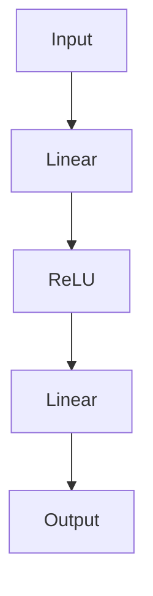

## 背景介绍

随着人工智能技术的不断发展，大型深度学习模型在各种应用场景中发挥着越来越重要的作用。PyTorch 作为一种流行的深度学习框架，已经成为许多研究人员和工程师的首选。PyTorch 2.0 是 PyTorch 的最新版本，带来了一系列新的功能和改进。我们将在本篇博客中从零开始学习 PyTorch 2.0，探讨其核心概念、算法原理、数学模型、实际应用场景等。

## 核心概念与联系

PyTorch 是一个用于深度学习的开源机器学习库，提供了一个动态计算图的定义、自动 differentiation 机制和一个可扩展的数据加载器接口。PyTorch 2.0 的核心概念包括：

1. **动态计算图**：PyTorch 使用动态计算图表示计算过程，允许在运行时调整计算图的结构。动态计算图使得模型训练和部署更加灵活。

2. **自动 differentiation**：PyTorch 提供了自动 differentiation 机制，使得计算图的梯度可以自动计算，从而实现反向传播算法。

3. **数据加载器**：PyTorch 提供了数据加载器接口，用于将数据加载到模型中，并在训练过程中进行数据增强和批量归一化等操作。

## 核心算法原理具体操作步骤

在 PyTorch 中，核心算法原理主要包括前向传播、反向传播和优化算法等。以下是具体操作步骤：

1. **前向传播**：在 PyTorch 中，前向传播是通过定义模型的 forward 方法实现的。该方法接受输入数据，并返回输出结果。

2. **反向传播**：在 PyTorch 中，反向传播是通过自动 differentiation 机制实现的。通过调用 .backward() 方法，可以计算模型的梯度。

3. **优化算法**：在 PyTorch 中，优化算法是通过定义优化器的 step 方法实现的。常见的优化算法包括 SGD、Adam 等。

## 数学模型和公式详细讲解举例说明

在 PyTorch 中，数学模型通常表示为计算图。在计算图中，每个节点表示一个操作，每个边表示操作之间的依赖关系。以下是一个简单的计算图示例：



## 项目实践：代码实例和详细解释说明

以下是一个简单的 PyTorch 2.0 项目实例，使用 Linear 和 ReLU 操作实现一个简单的神经网络。

```python
import torch
import torch.nn as nn

class SimpleNet(nn.Module):
    def __init__(self):
        super(SimpleNet, self).__init__()
        self.linear = nn.Linear(10, 5)
        self.relu = nn.ReLU()

    def forward(self, x):
        x = self.linear(x)
        x = self.relu(x)
        return x

model = SimpleNet()
input_data = torch.randn(10)
output_data = model(input_data)
print(output_data)
```

## 实际应用场景

PyTorch 2.0 可以用于各种深度学习任务，如图像识别、自然语言处理、推荐系统等。以下是一个简单的图像识别应用场景示例：


## 工具和资源推荐

在学习 PyTorch 2.0 时，可以参考以下工具和资源：

1. **官方文档**：PyTorch 的官方文档提供了详尽的教程和 API 说明，非常值得一读。

2. **教程**：网络上有许多 PyTorch 的教程，例如 [PyTorch 官网](https://pytorch.org/tutorials/) 和 [Dive into Deep Learning](http://d2l.ai/) 等。

3. **社区**：PyTorch 的社区非常活跃，可以在 [GitHub](https://github.com/pytorch/pytorch) 和 [Discord](https://discord.gg/pytorch) 等平台寻找其他学习资源和帮助。

## 总结：未来发展趋势与挑战

PyTorch 2.0 是 PyTorch 的最新版本，带来了一系列新的功能和改进。未来，PyTorch 将继续发展，提供更高效、更易用的深度学习框架。然而，PyTorch 也面临着一定的挑战，如计算资源限制、模型复杂性等。希望本篇博客能帮助你了解 PyTorch 2.0 的核心概念、算法原理、数学模型等，并为你的深度学习journey提供灵感。

## 附录：常见问题与解答

1. **如何选择优化算法？** 选择优化算法时，可以根据模型的特点和数据集的性质进行选择。常见的优化算法包括 SGD、Adam 等。可以通过实验和调参来选择合适的优化算法。

2. **如何处理过拟合问题？** 过拟合问题通常发生在训练集上表现良好的情况下，但在测试集上表现不佳。处理过拟合的方法包括增加数据集大小、数据增强、正则化等。