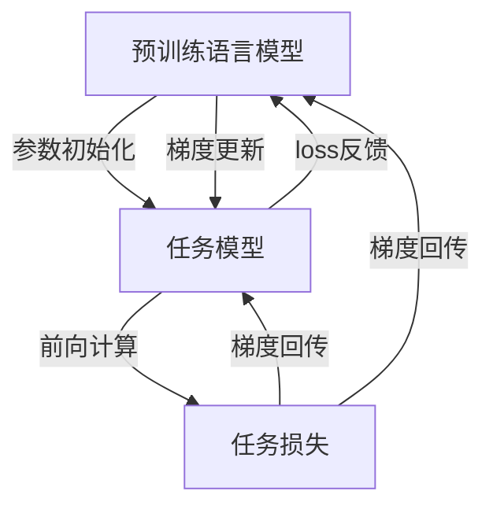

# 从零开始大模型开发与微调：单向不行，那就双向

## 1. 背景介绍
### 1.1 大模型的兴起
近年来,随着深度学习技术的飞速发展,大规模预训练语言模型(Pretrained Language Models, PLMs)已经成为自然语言处理(Natural Language Processing, NLP)领域的研究热点。从 BERT、GPT 到 GPT-3、PaLM、ChatGPT 等,大模型展现出了令人惊叹的语言理解和生成能力,在问答、对话、文本分类、命名实体识别等诸多 NLP 任务上取得了 state-of-the-art 的表现。

### 1.2 大模型面临的挑战
尽管大模型取得了瞩目的成绩,但在实际应用中仍然面临诸多挑战:
1. 计算资源要求高:训练大模型需要庞大的算力支持,动辄就需要数百块高端 GPU,这对于很多中小型企业和研究机构是难以企及的。
2. 针对特定领域效果不佳:通用大模型在特定垂直领域的表现往往不尽如人意,需要在特定领域数据上进行微调(finetune)才能达到理想的效果。
3. 模型更新迭代周期长:大模型动辄包含上百亿参数,完整训练一个新的版本往往需要数周甚至数月的时间,这导致模型更新迭代的周期很长。

### 1.3 双向微调的思路
针对上述挑战,本文提出了一种创新的"双向微调"(Bidirectional Finetuning)方法。传统的微调通常是单向的,即只调整预训练模型的参数,而保持下游任务模型固定。而双向微调则在此基础上更进一步,不仅调整预训练模型,同时也调整下游任务模型,通过双向信息流动和参数更新,使预训练模型和任务模型能够更好地适应彼此,从而达到更优的性能。

## 2. 核心概念与联系
### 2.1 预训练语言模型(PLMs)
预训练语言模型通过在大规模无标注语料上进行自监督学习,习得了丰富的语言知识,能够生成连贯流畅的文本。常见的 PLMs 包括 BERT、RoBERTa、GPT、T5 等。PLMs 相当于 NLP 任务的"初始化",后续只需在特定任务数据上微调即可。

### 2.2 微调(Finetuning)
微调是指在预训练语言模型的基础上,使用少量带标签的任务数据对模型进行二次训练,使其适应特定的下游任务。微调一般只训练很少的 epoch,学习率也较小,以防止模型遗忘预训练阶段学到的知识。

### 2.3 任务适应(Task Adaptation)  
任务适应是指预训练模型针对特定任务进行调整,以更好地完成该任务。传统的微调属于浅层次的任务适应。双向微调则更进一步,通过双向调整预训练模型和任务模型,使二者更好地适应彼此,达到深层次的任务适应。

### 2.4 核心概念之间的关系
下图展示了预训练语言模型、微调、任务适应三个核心概念之间的关系:


预训练语言模型通过微调应用到下游任务,下游任务的反馈又可以指导预训练模型的改进。双向微调则在此基础上实现了预训练模型和任务模型的深度双向适应。

## 3. 核心算法原理与操作步骤
### 3.1 双向微调的整体流程
双向微调的核心思想是在预训练模型和任务模型之间建立双向通道,使二者能够互相适应、协同优化。其主要流程如下:



1. 预训练模型的参数用于初始化任务模型。
2. 任务模型前向计算,得到任务损失。
3. 任务损失反向传播,计算预训练模型和任务模型的梯度。
4. 使用梯度下降算法更新预训练模型和任务模型的参数。
5. 重复步骤2-4,直到模型收敛或达到预设的迭代次数。

### 3.2 双向微调的关键技术
#### 3.2.1 参数共享与适配层
为了实现预训练模型和任务模型的双向适应,需要在二者之间建立一定的连接。最简单的方式是直接共享参数,即任务模型的部分或全部参数来自预训练模型。但这种粗暴的共享方式可能影响任务模型的表达能力。因此,我们引入适配层(Adapter Layer)的概念。适配层是插入在预训练模型和任务模型之间的一个薄层,可以看作是参数共享的一种柔性形式。适配层可以选择性地调整从预训练模型传递到任务模型的信息。

#### 3.2.2 联合损失函数
双向微调需要同时优化预训练模型和任务模型,因此损失函数的设计至关重要。我们采用联合损失函数的形式:

$$L = \lambda_1 L_{pretrain} + \lambda_2 L_{task} + \lambda_3 L_{adapter}$$

其中,$L_{pretrain}$是预训练模型的损失(如MLM损失),$L_{task}$是任务模型的损失(如分类交叉熵),$L_{adapter}$是适配层的损失(如L2正则)。$\lambda_1,\lambda_2,\lambda_3$是三个损失的权重系数,可以根据具体任务和数据调整。

#### 3.2.3 动态学习率调整
预训练模型和任务模型的学习速率可能不同,因此需要动态调整学习率。一种简单的策略是使用两个独立的学习率调度器,分别控制预训练模型和任务模型的学习率。更复杂的策略可以根据模型的收敛情况自适应地调整学习率。例如,当任务模型的损失下降较快时,可以适当提高预训练模型的学习率;反之则降低学习率。

### 3.3 双向微调的算法伪代码

```python
# 初始化预训练模型、任务模型和适配层
pretrain_model = PretrainModel()
task_model = TaskModel() 
adapter = Adapter()

# 定义优化器和学习率调度器
pretrain_optimizer = AdamW(pretrain_model.parameters(), lr=pretrain_lr)  
task_optimizer = AdamW(task_model.parameters(), lr=task_lr)
adapter_optimizer = AdamW(adapter.parameters(), lr=adapter_lr)
pretrain_scheduler = get_linear_schedule_with_warmup(pretrain_optimizer, num_warmup_steps, num_training_steps)
task_scheduler = get_linear_schedule_with_warmup(task_optimizer, num_warmup_steps, num_training_steps)

# 训练循环
for epoch in range(num_epochs):
    for batch in dataloader:
        # 前向计算
        pretrain_outputs = pretrain_model(batch)
        task_inputs = adapter(pretrain_outputs)
        task_outputs = task_model(task_inputs)
        
        # 计算损失
        pretrain_loss = compute_pretrain_loss(pretrain_outputs, batch)
        task_loss = compute_task_loss(task_outputs, batch)
        adapter_loss = compute_adapter_loss(adapter)
        total_loss = λ1 * pretrain_loss + λ2 * task_loss + λ3 * adapter_loss
        
        # 反向传播和参数更新
        total_loss.backward()
        pretrain_optimizer.step()
        task_optimizer.step()
        adapter_optimizer.step()
        pretrain_scheduler.step()
        task_scheduler.step()
```

## 4. 数学模型和公式详解
本节我们详细推导双向微调涉及的几个关键数学模型和公式。

### 4.1 预训练语言模型的数学描述
预训练语言模型可以看作是一个条件概率分布$P(x|c;\theta)$,其中$x$是目标文本序列,$c$是上下文信息,$\theta$是模型参数。预训练模型的目标是最大化如下似然函数:

$$\mathcal{L}(\theta)=\sum_{i=1}^{N} \log P\left(x^{(i)} | c^{(i)}; \theta\right)$$

其中$\{x^{(i)}, c^{(i)}\}_{i=1}^N$是预训练语料库。对于 BERT 等基于 Transformer 的模型,似然函数可以进一步写作:

$$\log P(x|c;\theta) = \sum_{t=1}^{T} \log P\left(x_t | x_{<t}, c; \theta\right)$$

其中$x_t$是第$t$个词,$x_{<t}$是前$t-1$个词构成的子序列。$P(x_t|x_{<t},c;\theta)$可以通过 Transformer 的 Softmax 输出层计算。

### 4.2 任务模型的数学描述
不同的下游任务有不同的数学形式,这里以文本分类任务为例。设$\mathcal{Y}$是类别集合,任务模型的目标是学习一个条件概率分布$P(y|x;\phi)$,其中$y \in \mathcal{Y}$是类别标签,$x$是输入文本,$\phi$是任务模型参数。任务模型的损失函数可以定义为交叉熵:

$$\mathcal{L}(\phi)=-\sum_{i=1}^{M} \sum_{j=1}^{|\mathcal{Y}|} y_j^{(i)} \log P\left(y_j | x^{(i)}; \phi\right)$$

其中$\{x^{(i)}, y^{(i)}\}_{i=1}^M$是任务训练集,$y_j^{(i)}$是样本$i$在类别$j$上的真实标签(0或1)。

### 4.3 适配层的数学描述
适配层可以看作是一个映射函数$f(z;\psi): \mathbb{R}^d \rightarrow \mathbb{R}^{d'}$,将预训练模型的输出$z \in \mathbb{R}^d$映射到任务模型的输入空间$\mathbb{R}^{d'}$。适配层可以是线性映射:

$$f(z;\psi) = Wz + b$$

其中$W \in \mathbb{R}^{d' \times d}, b \in \mathbb{R}^{d'}$是适配层的参数。也可以使用非线性映射,如 MLP:

$$f(z;\psi) = W_2\sigma(W_1z + b_1) + b_2$$

其中$\sigma$是激活函数,如 ReLU。适配层的损失可以定义为输出的 L2 范数:

$$\mathcal{L}(\psi) = \|f(z;\psi)\|^2$$

这相当于对适配层的输出做了一个约束,防止其过度偏离预训练模型的输出。

### 4.4 联合损失函数的数学描述
结合以上三个部分,双向微调的联合损失函数可以写作:

$$\mathcal{L}(\theta, \phi, \psi) = \lambda_1 \mathcal{L}(\theta) + \lambda_2 \mathcal{L}(\phi) + \lambda_3 \mathcal{L}(\psi)$$

其中$\mathcal{L}(\theta), \mathcal{L}(\phi), \mathcal{L}(\psi)$分别是预训练模型、任务模型和适配层的损失函数。$\lambda_1, \lambda_2, \lambda_3$是权重系数,控制三个损失的相对重要性。

双向微调的目标是找到最优的参数$\theta^*, \phi^*, \psi^*$,使得联合损失函数最小化:

$$\theta^*, \phi^*, \psi^* = \arg\min_{\theta, \phi, \psi} \mathcal{L}(\theta, \phi, \psi)$$

这个优化问题可以通过梯度下降算法求解,即:

$$\theta \leftarrow \theta - \eta \nabla_\theta \mathcal{L}(\theta, \phi, \psi)$$
$$\phi \leftarrow \phi - \eta \nabla_\phi \mathcal{L}(\theta, \phi, \psi)$$
$$\psi \leftarrow \psi - \eta \nabla_\psi \mathcal{L}(\theta, \phi, \psi)$$

其中$\eta$是学习率。实践中,我们通常对三组参数使用不同的学习率,即$\eta_\theta, \eta_\phi, \eta_\psi$。

## 5. 项目实践:代码实例与详解
本节