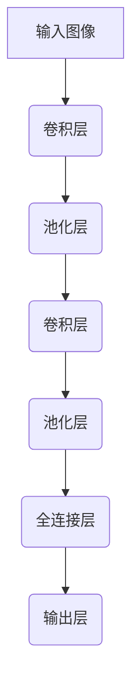

# 从零开始大模型开发与微调：卷积神经网络的原理

## 1.背景介绍

### 1.1 人工智能的发展历程

人工智能(Artificial Intelligence, AI)是当代科技发展的前沿领域,它的目标是使机器能够模仿人类的认知功能,如学习、推理、感知、行为和语言等。自20世纪50年代AI概念被正式提出以来,经历了几个重要的发展阶段。

在早期,AI主要关注符号推理、专家系统和机器学习算法。随后,统计机器学习和神经网络的兴起推动了AI的快速发展。近年来,benefiting from大规模数据、强大的计算能力和新的深度学习算法,AI取得了令人瞩目的进展,尤其是在计算机视觉、自然语言处理等领域。

### 1.2 卷积神经网络(CNN)的重要性

在AI的诸多分支中,计算机视觉是最活跃和应用最广泛的领域之一。卷积神经网络(Convolutional Neural Network, CNN)作为一种强大的深度学习模型,在计算机视觉任务中发挥着关键作用,如图像分类、目标检测、语义分割等。

CNN借鉴了生物学中视觉信息处理的层次结构,能够自动从图像数据中学习出多层次的特征表示,具有很强的泛化能力。自2012年AlexNet在ImageNet大赛中取得突破性成绩以来,CNN在计算机视觉领域占据了主导地位,成为解决视觉任务的利器。

### 1.3 大模型与微调技术

随着数据和计算能力的不断增长,深度学习模型也在变得越来越大。大模型(Large Model)通常指具有数十亿甚至上百亿参数的深度神经网络,能够学习到更丰富和复杂的特征表示。然而,训练如此庞大的模型需要消耗大量的计算资源,并且存在过拟合的风险。

为了更高效地利用大模型,微调(Fine-tuning)技术应运而生。微调的思想是:首先在大规模通用数据集上预训练一个大模型,获得良好的初始化参数;然后在特定任务的数据集上,以较小的学习率对模型进行微调,使其适应新的任务。这种迁移学习方式能够充分利用大模型强大的特征提取能力,同时避免从头训练的计算开销。

本文将重点介绍CNN的原理、大模型微调技术以及在实践中的应用,为读者提供全面的理解和指导。

## 2.核心概念与联系

### 2.1 CNN的基本架构

CNN是一种前馈神经网络,它的基本架构由多个特殊层次组成,包括卷积层(Convolutional Layer)、池化层(Pooling Layer)和全连接层(Fully Connected Layer)。这些层次协同工作,实现了从原始图像到高层语义特征的层层抽象过程。

1. **卷积层(Convolutional Layer)**是CNN的核心部分,它使用一组可学习的卷积核(Kernel)在输入数据上滑动,提取局部特征。卷积操作能够有效捕获图像的空间和结构信息。

2. **池化层(Pooling Layer)**通常在卷积层之后,对卷积层的输出进行下采样,降低数据的维度。常见的池化操作有最大池化(Max Pooling)和平均池化(Average Pooling)。池化层不仅减少了计算量,还增强了模型对平移和变形的鲁棒性。

3. **全连接层(Fully Connected Layer)**位于CNN的最后几层,将前面层的局部特征组合成全局特征表示。全连接层的每个神经元与上一层的所有神经元相连,能够学习复杂的非线性映射关系。

通过上述层次的协同作用,CNN能够自动从原始图像中学习出多层次的特征表示,最终用于解决特定的视觉任务。

### 2.2 CNN与传统机器学习的区别

与传统的机器学习方法相比,CNN具有以下几个显著优势:

1. **自动特征提取**:传统机器学习算法需要人工设计和提取特征,这是一个耗时且需要领域专业知识的过程。而CNN能够自动从原始数据中学习出多层次的特征表示,大大降低了特征工程的工作量。

2. **端到端学习**:CNN实现了从原始输入到最终输出的端到端学习,无需人为分解任务。这种一体化的方式更加高效和优雅。

3. **泛化能力强**:CNN具有多层非线性变换结构,能够学习到更加抽象和复杂的特征表示,从而获得更强的泛化能力,在新的数据上表现更加出色。

4. **适用于结构化数据**:CNN的卷积操作能够很好地捕捉图像、序列等结构化数据的局部相关性,而传统机器学习方法往往难以处理这类数据。

### 2.3 CNN在计算机视觉中的应用

CNN在计算机视觉领域有着广泛的应用,主要包括以下几个方面:

1. **图像分类(Image Classification)**:根据图像的内容对其进行分类,是CNN最初也是最主要的应用场景。著名的CNN模型如AlexNet、VGGNet、ResNet等,在ImageNet等大型数据集上取得了卓越的分类性能。

2. **目标检测(Object Detection)**:在图像中定位并识别出感兴趣的目标物体,如人脸、车辆等。著名的目标检测算法有R-CNN系列、YOLO系列和SSD等,都是建立在CNN的基础之上。

3. **语义分割(Semantic Segmentation)**:将图像中的每个像素点进行分类,实现对图像的像素级别理解。全卷积网络(Fully Convolutional Network)是语义分割任务的主流解决方案。

4. **实例分割(Instance Segmentation)**:在语义分割的基础上,进一步区分出同一类别的不同实例。Mask R-CNN是该任务的经典模型。

5. **风格迁移(Style Transfer)**:将一种图像风格迁移到另一种内容图像上,创造出独特的艺术效果。该任务依赖于CNN提取图像内容和风格特征的能力。

6. **超分辨率重建(Super-Resolution)**:从低分辨率图像生成高分辨率图像,提高图像质量。CNN能够学习图像的上采样映射,是该任务的有效解决方案。

总的来说,CNN已成为计算机视觉领域不可或缺的核心技术,在众多视觉任务中发挥着关键作用。

## 3.核心算法原理具体操作步骤

### 3.1 卷积层(Convolutional Layer)

卷积层是CNN的核心部分,它通过卷积操作在输入数据上滑动,提取局部特征。卷积层的具体操作步骤如下:

1. **初始化卷积核(Kernel)**:卷积核是一组可学习的权重参数,通常是一个小尺寸的二维矩阵(如3x3或5x5)。卷积核的数量决定了该层输出特征图的通道数。

2. **进行卷积操作**:将卷积核在输入数据(如图像或特征图)上滑动,在每个位置进行元素级乘积和求和,得到一个新的二维特征图。具体来说,假设输入数据为$X$,卷积核为$K$,卷积操作可表示为:

$$
(X * K)(i, j) = \sum_{m} \sum_{n} X(i+m, j+n) \cdot K(m, n)
$$

其中$i$和$j$是输出特征图的坐标,而$m$和$n$是卷积核的坐标。通过在整个输入数据上滑动卷积核,可以获得一个与输入数据空间维度相同的二维特征图。

3. **应用激活函数**:为了增加网络的非线性表达能力,通常在卷积操作之后应用非线性激活函数,如ReLU(Rectified Linear Unit)函数:

$$
\text{ReLU}(x) = \max(0, x)
$$

ReLU函数能够保留正值,抑制负值,增强了模型的稀疏性和非线性特性。

4. **应用池化层**:卷积层通常会接一个池化层,对特征图进行下采样,降低数据的维度。最常见的池化操作是最大池化(Max Pooling),它在每个局部区域内选取最大值作为输出。

通过上述步骤,卷积层能够从输入数据中提取出局部特征,并且通过堆叠多个卷积层,可以学习到越来越抽象和复杂的特征表示。

### 3.2 全连接层(Fully Connected Layer)

全连接层位于CNN的最后几层,它将前面层的局部特征组合成全局特征表示,用于解决特定的任务。全连接层的操作步骤如下:

1. **将特征图展平**:将卷积层输出的多个二维特征图,展平(Flatten)成一个一维向量。

2. **进行全连接操作**:全连接层的每个神经元与上一层的所有神经元相连,对应一个可学习的权重参数。全连接操作实际上是一个仿射变换(Affine Transformation),可以表示为:

$$
y = W^T x + b
$$

其中$x$是输入向量,$W$是权重矩阵,$b$是偏置向量,$y$是输出向量。

3. **应用激活函数**:与卷积层类似,全连接层的输出也需要通过非线性激活函数,如ReLU或Sigmoid函数,以增强网络的表达能力。

4. **添加dropout层(可选)**:为了防止过拟合,可以在全连接层之后添加dropout层。dropout层通过随机断开一部分神经元连接,能够有效提高模型的泛化能力。

5. **输出层**:最后一个全连接层的输出,将根据具体任务的需求进行处理。例如,在图像分类任务中,输出层通常使用Softmax函数将全连接层的输出映射到概率分布,从而得到每个类别的预测概率。

通过全连接层,CNN能够将前面层学习到的局部特征进行整合,形成全局的高层次特征表示,并最终输出对应任务的预测结果。

## 4.数学模型和公式详细讲解举例说明

在上一节中,我们介绍了CNN中卷积层和全连接层的核心操作步骤。现在,我们将更深入地探讨CNN的数学模型和公式,以加深对其原理的理解。

### 4.1 卷积操作的数学表示

卷积操作是CNN中最关键的运算,它能够有效地捕获输入数据的局部特征。假设输入数据为$X$,卷积核为$K$,卷积操作可以表示为:

$$
(X * K)(i, j) = \sum_{m} \sum_{n} X(i+m, j+n) \cdot K(m, n)
$$

其中$i$和$j$是输出特征图的坐标,而$m$和$n$是卷积核的坐标。这个公式描述了卷积核在输入数据上滑动,在每个位置进行元素级乘积和求和的过程。

为了更好地理解卷积操作,我们来看一个具体的例子。假设输入数据$X$是一个3x3的矩阵,卷积核$K$是一个2x2的矩阵,如下所示:

$$
X = \begin{bmatrix}
1 & 2 & 3\\
4 & 5 & 6\\
7 & 8 & 9
\end{bmatrix}, \quad
K = \begin{bmatrix}
1 & 0\\
0 & 1
\end{bmatrix}
$$

我们将卷积核$K$在输入数据$X$上滑动,计算每个位置的卷积值。例如,当卷积核位于左上角时,卷积值为:

$$
(X * K)(0, 0) = 1 \cdot 1 + 2 \cdot 0 + 4 \cdot 0 + 5 \cdot 1 = 6
$$

依次类推,我们可以得到整个输出特征图:

$$
X * K = \begin{bmatrix}
6 & 8 & 9\\
16 & 17 & 18\\
22 & 24 & 27
\end{bmatrix}
$$

可以看出,卷积操作能够捕获输入数据的局部模式,并生成一个新的特征图。通过堆叠多个卷积层,CNN可