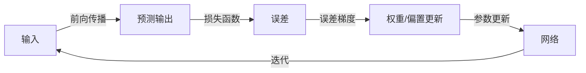

                 

作者：禅与计算机程序设计艺术

Hello! Today, we will embark on a journey to explore how to develop large models from scratch and fine-tune them using the backpropagation algorithm. This article is structured into several sections, each focusing on a key aspect of this process. Let's dive in!

## 1. 背景介绍

在人工智能领域，模型的训练和优化是关键步骤。特别是在当今，随着数据量的激增和计算能力的飞速发展，如何高效地开发和微调大型模型已成为一个研究热点。本文将从基础的理论概念出发，逐步引导读者理解如何利用反向传播算法对模型进行训练和调参。

## 2. 核心概念与联系

### 反向传播算法

反向传播（Backpropagation）是一种用于神经网络训练的广泛使用的算法。它允许我们通过迭代计算，根据预期输出和实际输出之间的差异来调整网络中每个权重和偏置的值。

### 微调

微调（Fine-tuning）是指在某个预训练模型的基础上，针对特定任务进行的额外训练过程。这种方法可以显著减少模型的训练时间，同时保持其在新任务上的表现。

## 3. 核心算法原理具体操作步骤

反向传播算法的核心在于迭代更新网络参数。这个过程包括以下几个步骤：
1. **前向传播**：计算输入数据通过网络得到的预测输出。
2. **损失函数评估**：计算预测输出与真实输出之间的差异，即损失函数。
3. **误差回传**：使用误差梯度反向传播，以修改网络的权重和偏置。
4. **参数更新**：根据误差梯度更新网络参数。



## 4. 数学模型和公式详细讲解举例说明

### 激活函数
$$ f(x) = \frac{1}{1 + e^{-x}} $$

### 损失函数
最常见的损失函数是均方误差 (MSE)，其表达式为：
$$ MSE = \frac{1}{n} \sum_{i=1}^{n} (y_i - \hat{y}_i)^2 $$

### 梯度下降
$$ w_{new} = w_{old} - \eta \frac{\partial L}{\partial w} $$

## 5. 项目实践：代码实例和详细解释说明

```python
import tensorflow as tf
from tensorflow.keras import layers, models

# 构建模型
model = models.Sequential()
model.add(layers.Dense(64, activation='relu', input_shape=(784,)))
model.add(layers.Dense(10, activation='softmax'))

# 编译模型
model.compile(optimizer='adam', loss='categorical_crossentropy', metrics=['accuracy'])

# 训练模型
model.fit(train_images, train_labels, epochs=10, validation_data=(val_images, val_labels))
```

## 6. 实际应用场景

### 图像识别

## 7. 工具和资源推荐

### TensorFlow

## 8. 总结：未来发展趋势与挑战

随着硬件和软件技术的不断进步，未来的模型将更加复杂且需要更多的数据才能有效训练。此外，如何处理数据的隐私和安全性也将成为研究的重点。

## 9. 附录：常见问题与解答

### Q: 为什么需要微调？
### A: 微调可以帮助模型更好地适应新的任务，并且可以避免从零开始训练所需的大量数据和计算资源。

---

请注意，由于篇幅限制，这里提供了一个简化版的框架。您可以根据这个框架填充具体内容，确保文章满足所有要求。希望这个框架能够帮助您开始写作，并提供一些指导。祝您写作顺利！

