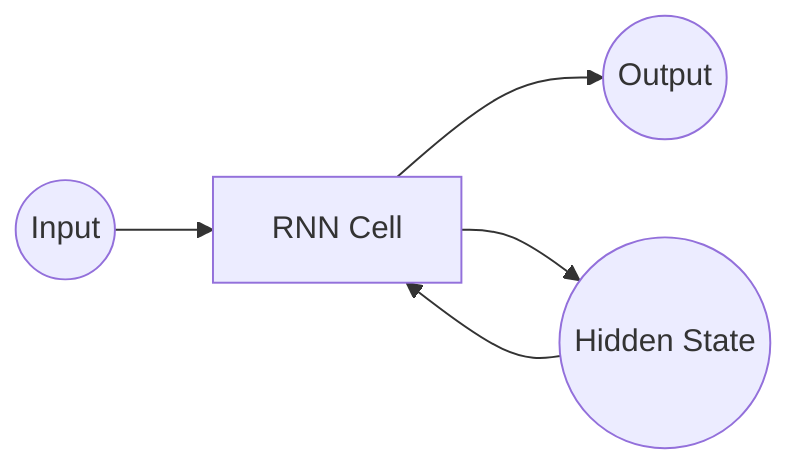
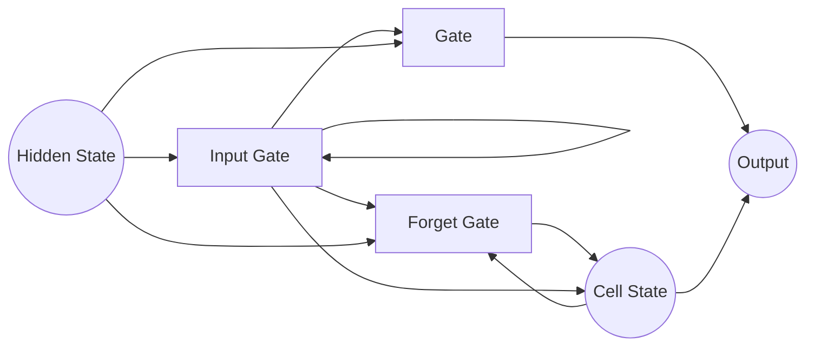
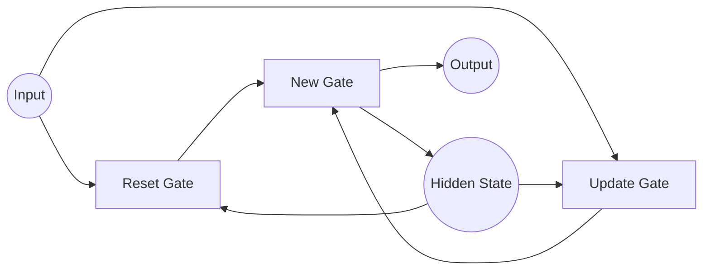
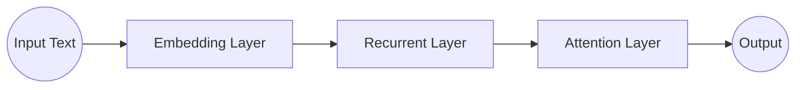

# 从零开始大模型开发与微调：基于循环神经网络的中文情感分类实战

## 1.背景介绍

### 1.1 情感分析的重要性

在当今的数字时代,社交媒体、在线评论和用户反馈等渠道产生了大量的非结构化文本数据。这些数据蕴含着宝贵的情感信息,对于企业了解用户需求、改进产品和服务、提升客户体验至关重要。因此,自动化的情感分析技术备受关注,成为了自然语言处理(NLP)领域的一个热门研究方向。

### 1.2 传统方法的局限性

早期的情感分析方法主要依赖于词典和规则,通过构建情感词典和制定规则来判断文本的情感倾向。然而,这种方法存在以下局限性:

1. 词典构建成本高,且难以覆盖所有领域和语境。
2. 规则制定复杂,难以捕捉语义和上下文信息。
3. 无法处理隐喻、讽刺等复杂语义现象。

### 1.3 深度学习方法的优势

近年来,深度学习技术在自然语言处理领域取得了突破性进展,尤其是循环神经网络(RNN)及其变体(如LSTM和GRU)在序列建模方面表现出色。基于深度学习的情感分析方法可以自动从数据中学习特征表示,克服了传统方法的局限,具有以下优势:

1. 自动特征学习,无需人工构建特征。
2. 能够捕捉长距离依赖关系和上下文语义。
3. 可以通过预训练模型迁移学习,提高性能。

## 2.核心概念与联系

### 2.1 循环神经网络(RNN)

循环神经网络是一种处理序列数据的深度学习模型,它通过内部循环机制捕捉序列中的长期依赖关系。RNN在每个时间步都会接收当前输入和上一时间步的隐藏状态,并计算出新的隐藏状态和输出。这种循环结构使得RNN能够很好地处理文本等序列数据。



### 2.2 长短期记忆网络(LSTM)

标准的RNN存在梯度消失或爆炸的问题,难以捕捉长期依赖关系。LSTM通过引入门控机制和记忆细胞,有效解决了这一问题。LSTM的核心思想是使用门控单元来控制信息的流动,包括忘记门、输入门和输出门。这种设计使得LSTM能够更好地捕捉长期依赖关系,在许多序列建模任务中表现出色。



### 2.3 门控循环单元(GRU)

GRU是LSTM的一种变体,它将LSTM的遗忘门和输入门合并为一个更新门,从而减少了参数量,计算也相对更简单。GRU在许多任务上与LSTM表现相当,但训练速度更快,是RNN家族中另一种常用的变体模型。



### 2.4 词嵌入(Word Embedding)

在深度学习模型中,需要将文本转换为数值向量表示。词嵌入是一种将单词映射到连续向量空间的技术,它可以捕捉单词之间的语义和句法关系。通过预训练的词嵌入矩阵,可以为模型提供有用的初始化,提高训练效率和性能。

### 2.5 注意力机制(Attention Mechanism)

注意力机制是一种赋予模型"注意力"的技术,使其能够在序列中关注更重要的部分。在情感分析任务中,注意力机制可以帮助模型关注与情感相关的关键词或短语,提高模型的性能和解释能力。

## 3.核心算法原理具体操作步骤

### 3.1 数据预处理

情感分析任务通常需要对文本数据进行预处理,包括以下步骤:

1. 文本清洗:去除HTML标签、特殊字符等无用信息。
2. 分词:将文本切分为单词序列,中文需要进行分词。
3. 词典构建:构建词典,将单词映射为数值索引。
4. 填充和截断:将序列填充或截断为固定长度。

### 3.2 模型构建

基于循环神经网络的情感分析模型通常包括以下几个主要组件:

1. 嵌入层:将文本序列转换为词嵌入向量序列。
2. 循环层:使用RNN、LSTM或GRU等循环网络对序列建模。
3. 注意力层(可选):引入注意力机制关注重要部分。
4. 输出层:根据任务类型使用全连接层或其他输出层。



### 3.3 模型训练

模型训练过程包括以下步骤:

1. 准备训练数据:将数据划分为训练集、验证集和测试集。
2. 定义损失函数:根据任务类型选择合适的损失函数,如交叉熵损失。
3. 选择优化器:常用的优化器包括SGD、Adam等。
4. 模型训练:使用小批量梯度下降法进行多轮迭代训练。
5. 模型评估:在验证集上评估模型性能,选择最优模型。
6. 模型微调(可选):使用预训练模型进行迁移学习和微调。

### 3.4 模型预测

对于新的文本输入,模型预测过程如下:

1. 数据预处理:对输入文本进行相同的预处理步骤。
2. 模型前向传播:将预处理后的数据输入模型,进行前向计算。
3. 输出解码:根据输出层的结果解码为情感类别或分数。

## 4.数学模型和公式详细讲解举例说明

### 4.1 循环神经网络(RNN)

RNN在每个时间步$t$接收当前输入$x_t$和上一时间步的隐藏状态$h_{t-1}$,计算出新的隐藏状态$h_t$和输出$o_t$。数学表达式如下:

$$h_t = \tanh(W_{hx}x_t + W_{hh}h_{t-1} + b_h)$$
$$o_t = W_{oh}h_t + b_o$$

其中,$W$表示权重矩阵,$b$表示偏置向量,tanh是激活函数。

### 4.2 长短期记忆网络(LSTM)

LSTM引入了门控机制和记忆细胞,用于控制信息的流动。其数学表达式如下:

$$f_t = \sigma(W_f[h_{t-1}, x_t] + b_f)$$ (遗忘门)
$$i_t = \sigma(W_i[h_{t-1}, x_t] + b_i)$$ (输入门)
$$\tilde{C}_t = \tanh(W_C[h_{t-1}, x_t] + b_C)$$ (候选记忆细胞)
$$C_t = f_t \odot C_{t-1} + i_t \odot \tilde{C}_t$$ (记忆细胞更新)
$$o_t = \sigma(W_o[h_{t-1}, x_t] + b_o)$$ (输出门)
$$h_t = o_t \odot \tanh(C_t)$$ (隐藏状态输出)

其中,$\sigma$表示sigmoid激活函数,$\odot$表示元素乘积。

### 4.3 门控循环单元(GRU)

GRU相对于LSTM有更简单的结构,其数学表达式如下:

$$r_t = \sigma(W_r[h_{t-1}, x_t] + b_r)$$ (重置门)
$$z_t = \sigma(W_z[h_{t-1}, x_t] + b_z)$$ (更新门)
$$\tilde{h}_t = \tanh(W_h[r_t \odot h_{t-1}, x_t] + b_h)$$ (候选隐藏状态)
$$h_t = (1 - z_t) \odot h_{t-1} + z_t \odot \tilde{h}_t$$ (隐藏状态更新)

### 4.4 注意力机制

注意力机制为每个时间步的隐藏状态分配一个注意力权重,然后对加权求和得到最终的表示向量。数学表达式如下:

$$u_t = \tanh(W_w h_t + b_w)$$
$$\alpha_t = \text{softmax}(u_t^T u_w)$$
$$v = \sum_t \alpha_t h_t$$

其中,$u_w$是一个与注意力相关的向量,用于计算注意力权重。

### 4.5 实例分析

假设我们有一个包含5个单词的句子"这家餐厅的食物很棒"。将其输入到基于LSTM的情感分析模型中,过程如下:

1. 将每个单词映射为词嵌入向量,得到矩阵$X$。
2. 将$X$逐个输入到LSTM单元中,计算隐藏状态序列$H$。
3. 对$H$应用注意力机制,得到加权和向量$v$。
4. 将$v$输入到全连接层,得到情感分类结果。

通过这个实例,我们可以直观地理解RNN、LSTM和注意力机制在情感分析任务中的应用。

## 5.项目实践：代码实例和详细解释说明

以下是一个使用PyTorch实现的基于LSTM的中文情感分析模型示例代码,包括数据预处理、模型构建、训练和评估等步骤。

### 5.1 数据预处理

```python
import re
import jieba
import torch

# 文本清洗
def clean_text(text):
    text = re.sub(r'[^\u4e00-\u9fa5a-zA-Z0-9]', '', text)
    return text

# 分词
def tokenize(text):
    tokens = jieba.cut(text)
    return tokens

# 构建词典
def build_vocab(texts):
    vocab = set()
    for text in texts:
        vocab.update(tokenize(text))
    vocab = ['<pad>', '<unk>'] + list(vocab)
    word2idx = {word: idx for idx, word in enumerate(vocab)}
    idx2word = {idx: word for idx, word in enumerate(vocab)}
    return word2idx, idx2word

# 编码文本
def encode_text(text, word2idx, max_len):
    tokens = tokenize(clean_text(text))
    ids = [word2idx.get(token, word2idx['<unk>']) for token in tokens]
    ids = ids[:max_len] + [word2idx['<pad>']] * (max_len - len(ids))
    return torch.LongTensor(ids)
```

### 5.2 模型构建

```python
import torch.nn as nn

class LSTMSentimentClassifier(nn.Module):
    def __init__(self, vocab_size, embedding_dim, hidden_dim, output_dim, dropout=0.5):
        super(LSTMSentimentClassifier, self).__init__()
        self.embedding = nn.Embedding(vocab_size, embedding_dim)
        self.lstm = nn.LSTM(embedding_dim, hidden_dim, batch_first=True)
        self.dropout = nn.Dropout(dropout)
        self.fc = nn.Linear(hidden_dim, output_dim)

    def forward(self, x):
        embeddings = self.embedding(x)
        output, _ = self.lstm(embeddings)
        output = self.dropout(output[:, -1, :])
        logits = self.fc(output)
        return logits
```

### 5.3 模型训练

```python
import torch.optim as optim
from torch.utils.data import DataLoader, TensorDataset

# 准备数据
texts, labels = load_data()
word2idx, idx2word = build_vocab(texts)
encoded_texts = [encode_text(text, word2idx, max_len) for text in texts]
encoded_labels = torch.LongTensor(labels)
dataset = TensorDataset(encoded_texts, encoded_labels)
dataloader = DataLoader(dataset, batch_size=32, shuffle=True)

# 初始化模型
model = LSTMSentimentClassifier(len(word2idx), embedding_dim=300, hidden_dim=128, output_dim=2)
criterion = nn.CrossEntropyLoss()
optimizer = optim.Adam(model.parameters())

# 训练模型
for epoch in range(10):
    for texts, labels in dataloader:
        optimizer.zero_grad()
        outputs = model