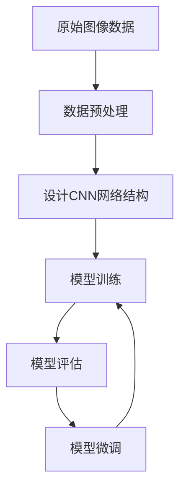

# 从零开始大模型开发与微调：实战：基于卷积的MNIST手写体分类

## 1.背景介绍

### 1.1 手写体识别的重要性

在当今数字时代,手写体识别技术在多个领域发挥着重要作用。从银行支票的自动处理,到邮政编码的自动识别,再到数字化文档管理等,手写体识别技术都扮演着关键角色。尤其是随着移动设备和平板电脑的普及,手写输入逐渐成为人机交互的重要方式,高精度的手写体识别技术也变得越来越重要。

### 1.2 MNIST数据集

MNIST(Mixed National Institute of Standards and Technology)数据集是手写体识别领域最著名和最广泛使用的数据集之一。它包含了60,000个训练图像和10,000个测试图像,每个图像是28x28像素的手写数字图像。尽管MNIST数据集相对简单,但它为初学者提供了一个很好的入门实践,同时也是检验新算法性能的重要基准。

### 1.3 卷积神经网络在手写体识别中的应用

传统的机器学习算法在处理手写体识别任务时存在一些局限性,如特征工程复杂、泛化能力差等。而卷积神经网络(Convolutional Neural Networks, CNN)由于其在图像处理领域的卓越表现,成为解决手写体识别问题的有力工具。CNN能够自动学习图像的特征表示,并对图像进行分类,从而避免了手工设计特征的繁琐过程。

## 2.核心概念与联系

### 2.1 卷积神经网络概述

卷积神经网络是一种前馈神经网络,它的人工神经元可以响应一部分覆盖范围内的周围数据,对于大型图像处理有出色表现。CNN包括卷积层、池化层和全连接层等关键组件。

#### 2.1.1 卷积层

卷积层是CNN的核心部分,它通过卷积操作提取输入数据的特征。卷积操作使用一个小的权重矩阵(称为卷积核或滤波器)在输入数据上滑动,计算加权和,生成一个特征映射。

#### 2.1.2 池化层

池化层通常在卷积层之后,它对卷积层的输出进行下采样,减小数据量,同时保留重要特征。常用的池化操作包括最大池化和平均池化。

#### 2.1.3 全连接层

全连接层类似于传统的神经网络,它将前面卷积层和池化层提取的高级特征进行整合,并输出最终的分类结果。

### 2.2 MNIST手写体识别任务

MNIST手写体识别任务的目标是将给定的28x28像素手写数字图像正确分类为0到9这10个数字类别中的一个。这需要CNN模型能够从原始像素数据中自动提取有区分度的特征,并基于这些特征进行分类。

### 2.3 核心算法流程

针对MNIST手写体识别任务,基于卷积神经网络的核心算法流程包括:

1. 数据预处理:将原始图像数据进行归一化等预处理,以适应神经网络的输入要求。
2. 网络模型设计:设计合适的CNN网络结构,包括卷积层、池化层和全连接层等。
3. 模型训练:使用训练数据对CNN模型进行训练,通过反向传播算法不断调整模型参数,使其能够很好地拟合训练数据。
4. 模型评估:在测试数据集上评估训练好的模型性能,计算分类准确率等指标。
5. 模型微调:根据评估结果,通过调整超参数、增加训练数据等方式对模型进行进一步优化。



## 3.核心算法原理具体操作步骤

### 3.1 卷积层原理

卷积层的核心操作是卷积(convolution),它使用一个小的权重矩阵(卷积核)在输入数据上滑动,计算加权和,生成一个特征映射。具体步骤如下:

1. 初始化卷积核权重,通常使用小的随机值。
2. 在输入数据上滑动卷积核,对每个位置进行元素级乘积和求和,得到一个新的特征值。
3. 对新的特征值施加激活函数(如ReLU),得到最终的特征映射。
4. 通过反向传播算法更新卷积核权重。

卷积操作可以提取输入数据的局部特征,并在整个输入数据上共享权重,从而大大减少了网络参数量。此外,通过堆叠多个卷积层,CNN可以逐层提取更高级、更抽象的特征表示。

### 3.2 池化层原理

池化层对卷积层的输出进行下采样,减小数据量,同时保留重要特征。常用的池化操作包括最大池化和平均池化。

最大池化的具体步骤:

1. 选择一个池化窗口大小(如2x2)。
2. 在输入特征映射上滑动池化窗口,对每个窗口取最大值作为输出特征值。

最大池化可以保留特征映射中的最显著信号,同时降低对平移和扭曲的敏感性。

### 3.3 全连接层原理

全连接层类似于传统的神经网络,它将前面卷积层和池化层提取的高级特征进行整合,并输出最终的分类结果。

全连接层的工作原理:

1. 将前一层的特征映射拉平为一维向量。
2. 将该向量与全连接层的权重矩阵相乘,再加上偏置项。
3. 对乘积结果施加激活函数(如Softmax),得到最终的类别概率输出。

在训练过程中,全连接层的权重也通过反向传播算法进行更新。

## 4.数学模型和公式详细讲解举例说明

### 4.1 卷积运算

卷积运算是卷积神经网络的核心数学运算。设输入特征映射为$I$,卷积核权重为$K$,则卷积运算可以表示为:

$$
(I * K)(i,j) = \sum_{m}\sum_{n}I(i+m,j+n)K(m,n)
$$

其中$i,j$表示输出特征映射的位置,$m,n$表示卷积核的大小。

例如,对于一个3x3的输入特征映射和一个2x2的卷积核,卷积运算可以计算如下:

```
输入特征映射 I:
[[1, 0, 1], 
 [2, 1, 0],
 [0, 1, 1]]

卷积核权重 K:
[[1, 0],
 [0, 1]]
 
卷积运算结果:
[[3, 2], 
 [3, 2]]
```

### 4.2 最大池化

最大池化可以用如下公式表示:

$$
\text{max\_pool}(X)_{i,j} = \max_{m,n}X_{i+m,j+n}
$$

其中$X$是输入特征映射,$i,j$表示输出位置,$m,n$表示池化窗口的大小。

例如,对于一个4x4的输入特征映射,使用2x2的最大池化窗口,计算结果如下:

```
输入特征映射 X:
[[1, 3, 2, 0],
 [0, 2, 0, 3], 
 [1, 2, 1, 0],
 [0, 0, 1, 2]]
 
最大池化结果:
[[3, 3],
 [2, 2]]
```

### 4.3 全连接层与Softmax

全连接层的数学模型可以表示为:

$$
y = f(Wx + b)
$$

其中$x$是输入特征向量,$W$是权重矩阵,$b$是偏置向量,$f$是激活函数。

对于多分类问题,通常使用Softmax函数作为全连接层的输出激活函数,将输出值映射到(0,1)之间,并且所有输出值之和为1,可以被解释为预测每个类别的概率。Softmax函数定义如下:

$$
\text{softmax}(x_i) = \frac{e^{x_i}}{\sum_{j}e^{x_j}}
$$

## 5.项目实践:代码实例和详细解释说明

以下是使用PyTorch框架实现基于卷积神经网络的MNIST手写体识别的代码示例,并对关键步骤进行了详细解释。

### 5.1 导入所需库

```python
import torch
import torchvision
import torchvision.transforms as transforms
import torch.nn as nn
import torch.nn.functional as F
import torch.optim as optim
```

### 5.2 加载和预处理MNIST数据集

```python
# 下载MNIST数据集
train_dataset = torchvision.datasets.MNIST(root='./data', train=True, transform=transforms.ToTensor(), download=True)
test_dataset = torchvision.datasets.MNIST(root='./data', train=False, transform=transforms.ToTensor())

# 创建数据加载器
train_loader = torch.utils.data.DataLoader(dataset=train_dataset, batch_size=64, shuffle=True)
test_loader = torch.utils.data.DataLoader(dataset=test_dataset, batch_size=64, shuffle=False)
```

这里使用PyTorch内置的`torchvision.datasets.MNIST`模块下载MNIST数据集,并使用`transforms.ToTensor()`将图像数据转换为PyTorch张量。然后创建数据加载器,方便后续的批量训练和测试。

### 5.3 定义卷积神经网络模型

```python
class ConvNet(nn.Module):
    def __init__(self):
        super(ConvNet, self).__init__()
        # 卷积层
        self.conv1 = nn.Conv2d(1, 10, kernel_size=5)
        self.conv2 = nn.Conv2d(10, 20, kernel_size=5)
        # 最大池化层
        self.pool = nn.MaxPool2d(2, 2)
        # 全连接层
        self.fc1 = nn.Linear(320, 50)
        self.fc2 = nn.Linear(50, 10)

    def forward(self, x):
        # 卷积层
        x = self.pool(F.relu(self.conv1(x)))
        x = self.pool(F.relu(self.conv2(x)))
        # 拉平并传入全连接层
        x = x.view(-1, 320)
        x = F.relu(self.fc1(x))
        x = self.fc2(x)
        return x

model = ConvNet()
```

这里定义了一个简单的卷积神经网络模型`ConvNet`。它包含两个卷积层、两个最大池化层和两个全连接层。在`forward`函数中,输入数据依次通过卷积层、激活函数(ReLU)、池化层,最后拉平为一维向量,传入全连接层进行分类。

### 5.4 定义损失函数和优化器

```python
criterion = nn.CrossEntropyLoss()
optimizer = optim.SGD(model.parameters(), lr=0.01, momentum=0.5)
```

这里使用交叉熵损失函数`nn.CrossEntropyLoss()`作为模型的损失函数,并使用随机梯度下降(SGD)优化器`optim.SGD()`进行模型参数的更新。

### 5.5 模型训练

```python
num_epochs = 5

for epoch in range(num_epochs):
    for i, (images, labels) in enumerate(train_loader):
        # 前向传播
        outputs = model(images)
        loss = criterion(outputs, labels)

        # 反向传播和优化
        optimizer.zero_grad()
        loss.backward()
        optimizer.step()

        if (i + 1) % 100 == 0:
            print(f'Epoch [{epoch+1}/{num_epochs}], Step [{i+1}/{len(train_loader)}], Loss: {loss.item():.4f}')
```

这里对模型进行5个epoch的训练。在每个epoch中,遍历训练数据加载器,进行前向传播计算输出和损失,然后通过反向传播更新模型参数。每100步打印一次当前的损失值。

### 5.6 模型评估

```python
correct = 0
total = 0
with torch.no_grad():
    for images, labels in test_loader:
        outputs = model(images)
        _, predicted = torch.max(outputs.data, 1)
        total += labels.size(0)
        correct += (predicted == labels).sum().item()

print(f'Accuracy on test set: {100 * correct / total}%')
```

在测试阶段,遍历测试数据加载器,对每个样本进行预测,并统计预测正确的样本数。最后计算并打印测试集上的准确率。

通过上述代码示例,我们可以看到如何使用PyTorch框架实现一个基