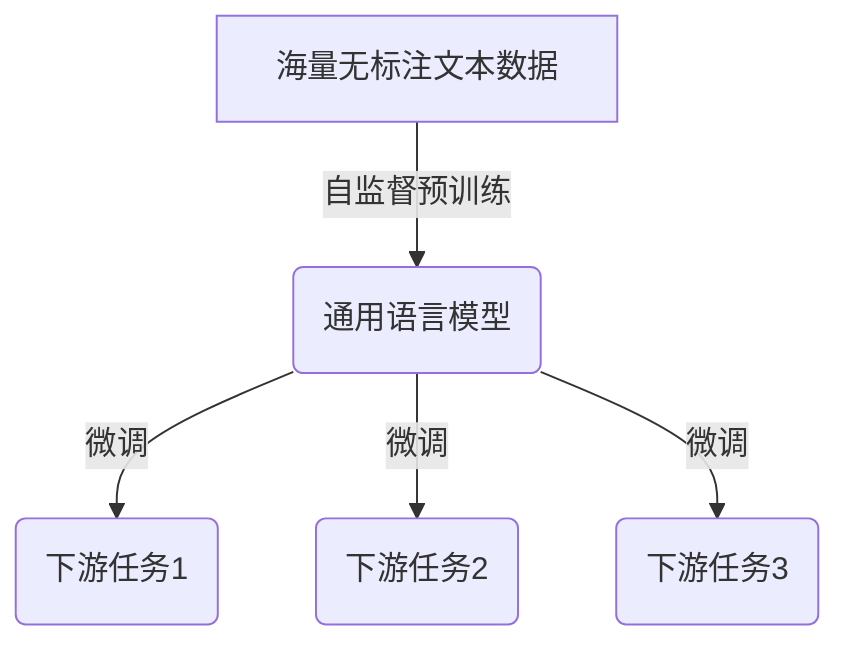
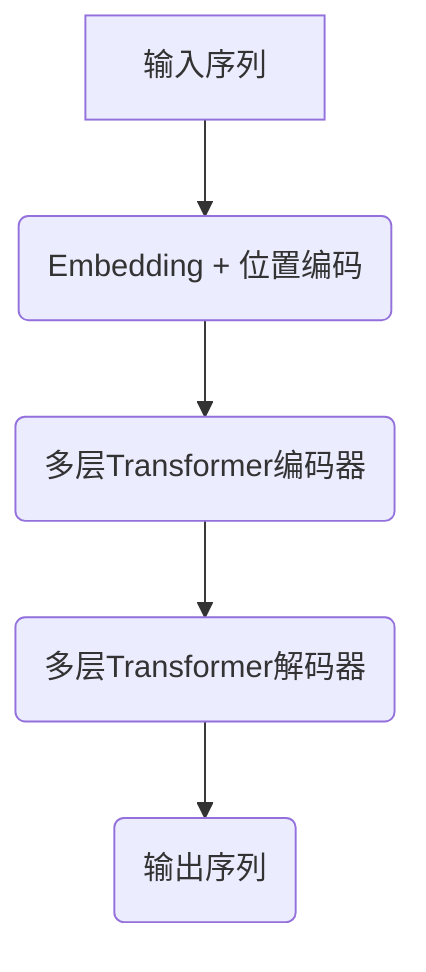
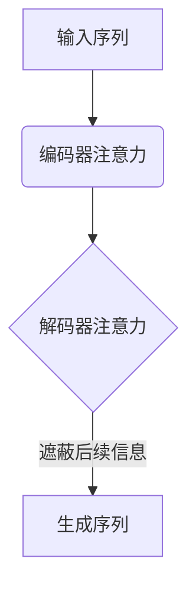

# 从零开始大模型开发与微调：最强的中文大模型—清华大学ChatGLM介绍

## 1.背景介绍

### 1.1 人工智能大模型的兴起

近年来,人工智能领域取得了长足的进步,其中大模型的出现引领了这一浪潮。大模型指的是拥有数十亿甚至上万亿参数的深度神经网络模型,通过在大规模数据集上进行预训练,可以学习到丰富的知识和语义表示能力。这些大模型在自然语言处理、计算机视觉、推理决策等各个领域展现出了强大的性能,为人工智能的发展注入了新的动力。

### 1.2 中文大模型的重要性

尽管英文大模型如GPT-3、PaLM等取得了卓越的成绩,但针对中文场景的大模型研究仍显不足。中文是世界上使用人口最多的语言之一,开发高质量的中文大模型对于服务中文用户、推动中文信息技术发展至关重要。此外,中文语言的特殊性也为大模型建模带来了新的挑战,如字词分割、多义性等,需要特殊的建模方法来应对。

### 1.3 ChatGLM的重大突破

在这一背景下,清华大学计算机系和人工智能研究院联合发布了ChatGLM(Chat Generative Pre-trained Transformer)——一个全新的对话型大模型,在中文对话能力、知识覆盖广度和计算效率等多个维度实现了重大突破。作为首个公开发布的百亿参数级别的中文对话大模型,ChatGLM将为中文人工智能研究和应用开辟新的道路。

## 2.核心概念与联系

### 2.1 大模型预训练范式

大模型通常采用自监督预训练的方式进行建模。具体来说,模型会在海量无标注文本数据上进行预训练,学习文本中的统计规律和语义知识,获得通用的语言表示能力。之后可以将这个通用模型在下游任务数据上进行微调,快速迁移到特定的应用场景。这种预训练-微调范式大大减少了人工标注数据的需求,是大模型可以高效学习的关键。



### 2.2 生成式大模型

现有的大模型可以分为两大类:生成式模型和判别式模型。生成式模型旨在生成新的文本序列,常用于文本生成、对话交互等任务。而判别式模型则专注于对给定文本进行分类、标注等预测操作。ChatGLM作为一个对话型大模型,属于生成式模型的范畴。

### 2.3 Transformer结构

Transformer是当前主流的序列建模神经网络结构,也是ChatGLM等大模型的核心组件。Transformer通过自注意力机制捕捉输入序列中元素之间的长程依赖关系,同时利用位置编码注入位置信息,从而实现对序列的高效建模。多层Transformer编码器和解码器的叠加使模型具备了强大的表示学习能力。



## 3.核心算法原理具体操作步骤

### 3.1 自回归语言模型

ChatGLM采用了自回归语言模型的建模方式。在对话生成任务中,模型会根据当前的对话历史,预测下一个token的概率分布,并从中采样获得新的token,循环往复直到生成完整的回复。这种生成式建模范式赋予了模型在语义和逻辑上更加连贯和一致的生成能力。

$$P(y|x) = \prod_{t=1}^{T}P(y_t|y_{<t}, x)$$

其中$x$为输入序列(对话历史),$y$为待生成的目标序列(回复)。

### 3.2 因果注意力掩码

为了保证模型不会违反因果原则利用将来的信息,Transformer解码器中采用了因果注意力掩码机制。具体来说,在计算每个位置的注意力时,都会将该位置之后的信息完全遮蔽,从而确保模型只依赖当前和过去的信息进行预测。



### 3.3 Beam Search解码

在生成对话回复时,直接贪婪搜索并不是一个很好的策略,因为它很容易陷入局部最优解。为此,ChatGLM采用了Beam Search解码算法,在每一步保留概率最高的若干个候选序列,并并行延展这些候选序列,最终从中选出概率最大的序列作为输出。Beam Search通过有限的并行探索,显著提高了生成质量。

### 3.4 提示学习范式

ChatGLM引入了提示学习(Prompt Learning)的范式,通过设计人工编写的文本提示,指导模型朝特定的方向生成回复。例如在对话开头给出"我是一名客服人员,很高兴为您服务"的提示,可以让模型生成更贴合客服场景的回复。提示学习赋予了大模型出色的指令跟随能力和领域适配性。

## 4.数学模型和公式详细讲解举例说明

### 4.1 Transformer模型

Transformer模型是ChatGLM的核心部件,其中自注意力机制是关键。给定一个长度为n的序列$X = (x_1, x_2, ..., x_n)$,我们计算每个位置$x_i$与其他位置的关联程度:

$$\text{Attention}(Q, K, V) = \text{softmax}(\frac{QK^T}{\sqrt{d_k}})V$$

其中$Q, K, V$分别为Query、Key和Value,均由输入$X$通过不同的线性映射得到。$d_k$为缩放因子,防止点积的方差过大导致梯度不稳定。

多头注意力机制可以从不同的子空间捕捉序列关系:

$$\text{MultiHead}(Q, K, V) = \text{Concat}(head_1, ..., head_h)W^O$$
$$\text{where } head_i = \text{Attention}(QW_i^Q, KW_i^K, VW_i^V)$$

### 4.2 预训练目标

ChatGLM的预训练目标是最大化左右上下文的互信息,即给定左右上下文,模型需要准确预测中间的token。这种"填空"式的目标可以同时学习双向语义表示和生成式建模能力。

$$\max_\theta \sum_{t=1}^T \log P_\theta(x_t | x_{\neg t})$$

其中$x_{\neg t}$表示除$x_t$之外的所有上下文token。

### 4.3 生成式交叉注意力

在生成对话回复时,模型需要同时关注对话历史和当前已生成的部分回复,以保证上下文一致性。为此,ChatGLM采用了生成式交叉注意力机制,将编码器和解码器的注意力计算耦合在一起:

$$\text{Attention}_\text{dec}(Q, K_\text{enc}, V_\text{enc}, K_\text{dec}, V_\text{dec})$$
$$= \text{softmax}(\frac{QK_\text{enc}^T}{\sqrt{d_k}} + \frac{QK_\text{dec}^T}{\sqrt{d_k}})(V_\text{enc} \oplus V_\text{dec})$$

其中编码器部分捕捉对话历史信息,解码器部分关注已生成的回复。

## 5.项目实践:代码实例和详细解释说明

以下是使用Pytorch实现ChatGLM的简化版本代码,包括模型定义、预训练和生成部分。

```python
import torch
import torch.nn as nn

# Transformer模型定义
class TransformerEncoder(nn.Module):
    ...

class TransformerDecoder(nn.Module):
    ...
    
class ChatGLM(nn.Module):
    def __init__(self, enc_vocab_size, dec_vocab_size, ...):
        ...
        
    def forward(self, enc_input, dec_input, ...):
        ...
        
# 预训练
model = ChatGLM(...)
criterion = nn.CrossEntropyLoss()
optimizer = torch.optim.Adam(model.parameters(), lr=1e-4)

for epoch in range(num_epochs):
    for enc_inputs, dec_inputs, dec_outputs in data_loader:
        ...
        optimizer.zero_grad()
        outputs = model(enc_inputs, dec_inputs)
        loss = criterion(outputs.view(-1, dec_vocab_size), dec_outputs.view(-1))
        loss.backward()
        optimizer.step()
        
# 生成
model.eval()
enc_inputs = ... # 对话历史
dec_inputs = torch.tensor([[BOS_TOKEN]]) # 开头标记

for step in range(max_len): # 自回归生成
    outputs = model(enc_inputs, dec_inputs)
    next_token = outputs[:, -1].max(dim=-1)[1] # 贪婪搜索
    dec_inputs = torch.cat([dec_inputs, next_token.unsqueeze(-1)], dim=-1) # 更新输入
    if next_token == EOS_TOKEN: # 终止条件
        break
        
print("Generated: ", tokenizer.decode(dec_inputs.squeeze().tolist()))
```

上述代码首先定义了Transformer编码器、解码器和整体ChatGLM模型。在预训练阶段,我们最小化模型对下一个token的交叉熵损失。而在生成时,则采用自回归的方式,基于已生成的部分序列和对话历史,预测并添加新的token,直到生成完整序列。

需要注意的是,实际的ChatGLM模型会更加复杂和强大,上述代码仅为简化说明。真实系统中还需要处理输入/输出处理、注意力掩码、Beam Search解码等模块。

## 6.实际应用场景

### 6.1 智能对话系统

ChatGLM最直接的应用场景就是智能对话系统。无论是面向通用领域的问答助手,还是特定行业的智能客服系统,ChatGLM都可以为用户提供高质量的对话交互体验。借助大模型的知识理解和生成能力,系统可以自动解答复杂问题、处理多轮对话、给出合理建议等。

### 6.2 内容创作辅助

作为生成式大模型,ChatGLM可以为内容创作者提供强有力的辅助,例如主题构思、文案创作、文本续写等。借助模型生成的内容素材,创作者可以节省大量时间和精力,提高工作效率。同时模型也可以作为创作伙伴,与人类写作者进行头脑风暴和互动,产生更多创新思路。

### 6.3 教育智能辅导

ChatGLM强大的知识理解和表达能力,使其可以作为教育领域的智能辅导员。学生可以就所学知识与模型进行提问和讨论,模型则会根据对话历史,生成贴合知识点和学生水平的个性化解释和辅导方案。此外,模型也可以为教师减轻备课和批改作业的工作量。

### 6.4 其他潜在应用

除上述场景外,ChatGLM还可以在诸多领域发挥作用,如智能写作助手、多语种机器翻译、知识问答系统、智能决策辅助等。未来,大模型将会深入渗透到人类生活和工作的方方面面,为人类的智能化服务。

## 7.工具和资源推荐

### 7.1 ChatGLM官方代码库

ChatGLM项目代码已在Github上开源,地址为https://github.com/THUDM/ChatGLM-6B 。该代码库包含了模型训练代码、预训练权重、示例数据等,为开发者和研究者提供了完整的复现环境。

### 7.2 Hugging Face Spaces

Hugging Face是一个流行的开源AI社区,提供了大量预训练模型和工具。ChatGLM也在Hugging Face Spaces上发布了在线Demo,用户可以直接在网页上与模型进行对话交互,体验其强大功能。Demo地址为https://huggingface.co/spaces/THUDM/ChatGLM-6B。

### 7.3 开源预训练模型

除了ChatGLM本身,开源社区中还有许多优秀的中文预训练模型可供使用,如哈工大的PLATO-XL、百度的palm等。研究者