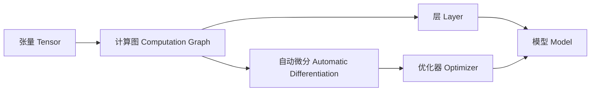

# 从零开始大模型开发与微调：自定义神经网络框架的基本设计

## 1. 背景介绍

### 1.1 大模型的兴起与发展
近年来,随着计算能力的提升和训练数据的丰富,大规模预训练语言模型(Pre-trained Language Models,PLMs)取得了突破性进展。从 BERT、GPT-2 到 GPT-3,再到最新的 ChatGPT 等大模型,它们在自然语言处理(NLP)领域掀起了一场革命。这些模型通过在海量无标注语料上进行自监督预训练,学习到了丰富的语言知识和常识,可以应用于各种下游 NLP 任务,实现了前所未有的性能提升。

### 1.2 大模型微调的必要性
尽管预训练大模型展现出了强大的语言理解和生成能力,但它们通常是在通用语料上训练的,对于特定领域的任务,还需要进行针对性的微调(Fine-tuning)才能发挥最佳效果。微调是利用预训练模型作为初始化参数,在特定任务的标注数据集上进一步训练模型,使其适应目标任务。通过微调,可以显著提升模型在垂直领域的性能表现。

### 1.3 自定义神经网络框架的意义
目前主流的深度学习框架如 TensorFlow、PyTorch 等,虽然功能强大,但也存在一定的局限性。它们通常为通用目的而设计,包含大量的组件和抽象,学习曲线较为陡峭。而且在一些特殊场景下,使用这些框架可能无法完全满足需求。因此,从零开始实现一个定制化的神经网络框架,不仅有助于加深对深度学习内部原理的理解,还可以根据实际需求进行灵活的设计和优化,打造出高效、轻量级的模型训练和推理系统。

## 2. 核心概念与联系

### 2.1 张量(Tensor)
张量是神经网络计算的基本数据结构,可以看作是一个多维数组。标量(scalar)、向量(vector)、矩阵(matrix)都是张量的特殊形式。张量具有形状(shape)、数据类型(dtype)等属性。神经网络的输入、参数、中间计算结果都以张量的形式存在。

### 2.2 计算图(Computation Graph) 
计算图是描述神经网络数学计算过程的有向无环图(DAG)。图中的节点表示算子操作(如加法、乘法、卷积等),边表示张量在节点间的流动。通过构建计算图,可以清晰地表达前向传播和反向传播的过程,并实现自动微分机制。

### 2.3 自动微分(Automatic Differentiation)
自动微分是深度学习框架的核心功能之一,它根据计算图自动推导出损失函数对各个参数的梯度。主要分为前向模式和反向模式两种。反向模式更适合于参数较多的深度神经网络,也称为反向传播算法。通过自动微分,开发者只需要定义前向计算过程,框架就能自动生成梯度计算代码,极大地简化了模型训练。

### 2.4 层(Layer)和模型(Model)
层是神经网络的基本组成单元,执行特定的数学变换,如全连接层(fully-connected layer)、卷积层(convolutional layer)、循环层(recurrent layer)等。通过组合不同的层,搭建出完整的神经网络模型。模型以层为基础,同时还包括损失函数、优化算法等其他组件,代表了端到端的学习系统。

### 2.5 优化器(Optimizer)
优化器用于更新模型参数,使损失函数最小化。主流的优化算法有随机梯度下降(SGD)及其变体,如 Momentum、Adagrad、RMSprop、Adam 等。不同的优化器在参数更新策略上有所区别,适用于不同的场景。选择合适的优化器对训练效果和收敛速度有重要影响。

### 2.6 张量、计算图、自动微分、层和模型、优化器之间的关系
下图展示了这些核心概念之间的联系:

张量是神经网络计算的基本单元,层和模型都是基于张量构建的。计算图描述了张量之间的数学运算,并通过自动微分机制计算梯度。层将若干操作封装为可复用的模块,组合层可以搭建出完整的模型。优化器利用自动微分得到的梯度,更新模型参数。它们相互配合,共同构成了神经网络框架的核心。

## 3. 核心算法原理具体操作步骤

### 3.1 前向传播
前向传播是将输入数据通过神经网络的层层变换,得到输出结果的过程。对于一个 L 层的神经网络,前向传播可以表示为:

$$
\begin{aligned}
\mathbf{z}^{[1]} &= \mathbf{W}^{[1]}\mathbf{x} + \mathbf{b}^{[1]} \\
\mathbf{a}^{[1]} &= \sigma(\mathbf{z}^{[1]}) \\
\mathbf{z}^{[2]} &= \mathbf{W}^{[2]}\mathbf{a}^{[1]} + \mathbf{b}^{[2]} \\ 
\mathbf{a}^{[2]} &= \sigma(\mathbf{z}^{[2]}) \\
&\cdots \\
\mathbf{z}^{[L]} &= \mathbf{W}^{[L]}\mathbf{a}^{[L-1]} + \mathbf{b}^{[L]} \\
\mathbf{\hat{y}} &= \mathbf{a}^{[L]} = \sigma(\mathbf{z}^{[L]}) 
\end{aligned}
$$

其中, $\mathbf{W}^{[l]}, \mathbf{b}^{[l]}$ 是第 $l$ 层的权重和偏置参数, $\mathbf{z}^{[l]}, \mathbf{a}^{[l]}$ 分别表示第 $l$ 层的加权输入和激活值, $\sigma$ 是激活函数, $\mathbf{\hat{y}}$ 是网络的输出。

前向传播的具体步骤如下:
1. 将输入 $\mathbf{x}$ 送入网络的第一层,计算加权输入 $\mathbf{z}^{[1]}$ 和激活值 $\mathbf{a}^{[1]}$。
2. 将 $\mathbf{a}^{[1]}$ 作为下一层的输入,重复步骤1,计算 $\mathbf{z}^{[2]}$ 和 $\mathbf{a}^{[2]}$。 
3. 依次向前传播,直到最后一层,得到网络输出 $\mathbf{\hat{y}}$。
4. 使用损失函数 $J(\mathbf{\hat{y}},\mathbf{y})$ 评估网络输出与真实标签 $\mathbf{y}$ 的差异。

### 3.2 反向传播
反向传播是一种高效计算损失函数梯度的算法,利用链式法则自底向上逐层传递梯度。对于 L 层网络,反向传播过程可以表示为:

$$
\begin{aligned}
\frac{\partial J}{\partial \mathbf{z}^{[L]}} &= \frac{\partial J}{\partial \mathbf{a}^{[L]}} \odot \sigma'(\mathbf{z}^{[L]}) \\
\frac{\partial J}{\partial \mathbf{W}^{[L]}} &= \frac{\partial J}{\partial \mathbf{z}^{[L]}} \mathbf{a}^{[L-1]T} \\
\frac{\partial J}{\partial \mathbf{b}^{[L]}} &= \frac{\partial J}{\partial \mathbf{z}^{[L]}} \\
\frac{\partial J}{\partial \mathbf{a}^{[L-1]}} &= \mathbf{W}^{[L]T} \frac{\partial J}{\partial \mathbf{z}^{[L]}} \\
&\cdots \\  
\frac{\partial J}{\partial \mathbf{z}^{[1]}} &= \frac{\partial J}{\partial \mathbf{a}^{[1]}} \odot \sigma'(\mathbf{z}^{[1]}) \\
\frac{\partial J}{\partial \mathbf{W}^{[1]}} &= \frac{\partial J}{\partial \mathbf{z}^{[1]}} \mathbf{x}^T \\ 
\frac{\partial J}{\partial \mathbf{b}^{[1]}} &= \frac{\partial J}{\partial \mathbf{z}^{[1]}}
\end{aligned}
$$

其中 $\odot$ 表示 Hadamard 乘积(逐元素相乘), $\sigma'$ 是激活函数的导数。

反向传播的具体步骤如下:
1. 计算损失函数 $J$ 对网络输出 $\mathbf{\hat{y}}$ 的梯度 $\frac{\partial J}{\partial \mathbf{a}^{[L]}}$。
2. 利用链式法则,计算损失函数对最后一层加权输入 $\mathbf{z}^{[L]}$ 的梯度 $\frac{\partial J}{\partial \mathbf{z}^{[L]}}$。
3. 根据 $\frac{\partial J}{\partial \mathbf{z}^{[L]}}$,计算损失函数对最后一层权重 $\mathbf{W}^{[L]}$ 和偏置 $\mathbf{b}^{[L]}$ 的梯度。
4. 计算损失函数对倒数第二层激活值 $\mathbf{a}^{[L-1]}$ 的梯度 $\frac{\partial J}{\partial \mathbf{a}^{[L-1]}}$。
5. 重复步骤2-4,逐层向前传递梯度,直到第一层,得到所有参数的梯度。

### 3.3 参数更新
在获得模型参数的梯度后,优化器根据特定的更新策略调整参数值,以最小化损失函数。以最基本的 SGD 优化器为例,参数更新公式为:

$$
\begin{aligned}
\mathbf{W}^{[l]} &:= \mathbf{W}^{[l]} - \alpha \frac{\partial J}{\partial \mathbf{W}^{[l]}} \\
\mathbf{b}^{[l]} &:= \mathbf{b}^{[l]} - \alpha \frac{\partial J}{\partial \mathbf{b}^{[l]}}
\end{aligned}
$$

其中 $\alpha$ 是学习率超参数,控制每次更新的步长。

参数更新的具体步骤如下:
1. 选择合适的学习率 $\alpha$。
2. 对于网络的每一层 $l$,利用反向传播得到的梯度 $\frac{\partial J}{\partial \mathbf{W}^{[l]}}, \frac{\partial J}{\partial \mathbf{b}^{[l]}}$。
3. 根据更新公式,更新权重 $\mathbf{W}^{[l]}$ 和偏置 $\mathbf{b}^{[l]}$。
4. 重复步骤2-3,直到所有层的参数都更新完毕。

## 4. 数学模型和公式详细讲解举例说明

### 4.1 线性变换
线性变换是神经网络中最基本的数学操作,对输入张量进行加权求和。设输入张量为 $\mathbf{x} \in \mathbb{R}^{n}$,权重矩阵为 $\mathbf{W} \in \mathbb{R}^{m \times n}$,偏置向量为 $\mathbf{b} \in \mathbb{R}^{m}$,线性变换的输出 $\mathbf{z} \in \mathbb{R}^{m}$ 为:

$$\mathbf{z} = \mathbf{W}\mathbf{x} + \mathbf{b}$$

例如,对于输入向量 $\mathbf{x} = \begin{bmatrix} 1 \\ 2 \\ 3 \end{bmatrix}$,权重矩阵 $\mathbf{W} = \begin{bmatrix} 0.1 & 0.2 & 0.3 \\ 0.4 & 0.5 & 0.6 \end{bmatrix}$,偏置向量 $\mathbf{b} = \begin{bmatrix} 1 \\ 2 \end{bmatrix}$,线性变换的结果为:

$$
\mathbf{z} = \begin{bmatrix} 
0.1 & 0.2 & 0.3 \\
0.4 & 0.5 & 0.6
\