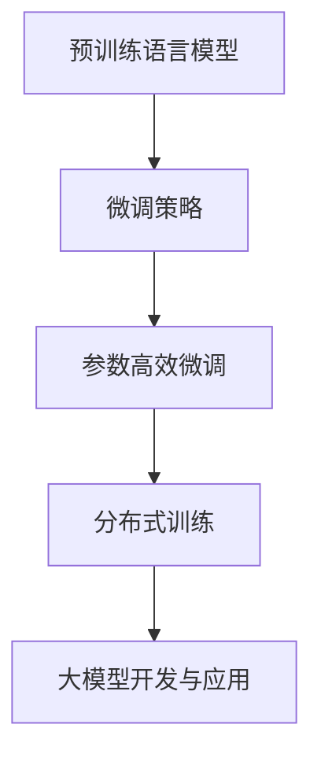

# 从零开始大模型开发与微调：选择PyTorch 2.0实战框架

## 1.背景介绍

### 1.1 大模型时代的到来

近年来,大型语言模型(Large Language Models, LLMs)在自然语言处理(NLP)领域掀起了一场革命。这些模型通过在海量文本数据上进行预训练,学习到了丰富的语言知识和上下文理解能力,从而在下游任务中表现出色。典型代表包括GPT-3、BERT、XLNet等。

随着模型规模和参数量的不断增长,大模型展现出了惊人的泛化能力,可以应对多种NLP任务,例如机器翻译、问答系统、文本摘要等。然而,训练如此庞大的模型需要耗费大量的计算资源,对于普通开发者而言,成本和技术门槛都很高。

### 1.2 微调大模型的重要性

虽然从头训练大模型存在挑战,但我们可以利用已有的预训练模型,通过在特定数据集上进行微调(fine-tuning),将通用的语言模型知识转移到特定的下游任务中。这种"预训练 + 微调"的范式大大降低了开发成本,使得大模型的能力可以被更广泛地应用。

微调过程通常只需调整模型的部分参数,相比从头训练,计算资源消耗大幅降低。同时,由于利用了预训练模型的先验知识,往往可以在较小的任务数据集上取得不错的效果。

### 1.3 PyTorch 2.0: 大模型开发的利器

PyTorch作为领先的深度学习框架之一,其2.0版本针对大规模模型训练进行了多方面的优化和增强。PyTorch 2.0不仅提供了高效的内存管理和分布式训练支持,还引入了新的编程范式和工具,简化了大模型开发的流程。

本文将重点介绍如何利用PyTorch 2.0进行大模型的微调,探讨相关的核心概念、算法原理和实践技巧,为读者提供一个完整的大模型开发和应用指南。

## 2.核心概念与联系

### 2.1 预训练语言模型

预训练语言模型(Pre-trained Language Model, PLM)是指在大规模文本语料库上预先训练的语言模型。这些模型通过自监督学习的方式,捕捉语言的统计规律和语义信息,形成通用的语言表示。常见的预训练目标包括:

1. **Masked Language Modeling (MLM)**: 模型需要预测被掩码的词。
2. **Next Sentence Prediction (NSP)**: 模型需要判断两个句子是否相关。
3. **Causal Language Modeling (CLM)**: 模型需要预测下一个词。

经过预训练后,这些模型可以作为强大的初始化权重,为下游任务提供有价值的语言先验知识。

### 2.2 微调策略

微调是将预训练模型应用到特定任务的关键步骤。常见的微调策略包括:

1. **全模型微调(Full Model Fine-tuning)**: 对整个预训练模型的所有参数进行微调。通常适用于数据量较大的情况。
2. **前馈层微调(Prefix Tuning)**: 只微调预训练模型的前馈层参数,保持其他参数不变。适用于数据量较小的场景。
3. **提示学习(Prompt Learning)**: 将任务描述作为提示,连接到输入序列中,让模型直接生成所需的输出。无需微调模型参数。

不同的微调策略在效果、计算成本和内存占用上存在权衡,需要根据具体任务和资源情况进行选择。

### 2.3 参数高效微调

由于大模型参数量巨大,全模型微调往往需要大量计算资源。为了提高效率,PyTorch 2.0引入了多种参数高效微调技术:

1. **低秩分解(Low-Rank Decomposition)**: 将大型矩阵分解为低秩形式,减小参数量。
2. **量化(Quantization)**: 将浮点数参数量化为低精度整数,节省内存和计算。
3. **渐进式神经架构搜索(Progressive Neural Architecture Search, PNAS)**: 自动搜索高效的神经网络架构。

这些技术可以显著降低微调的计算和内存开销,使大模型在有限资源下也能高效训练。

### 2.4 分布式训练

对于超大规模模型,单机训练往往无法满足需求。PyTorch 2.0提供了强大的分布式训练支持,包括:

1. **数据并行(Data Parallelism)**: 将批次数据分散到多个GPU上进行并行计算。
2. **模型并行(Model Parallelism)**: 将模型层分散到多个GPU上,实现层级并行。
3. **流水线并行(Pipeline Parallelism)**: 将不同的模型层分配到不同的加速器上,实现流水线式并行。

通过合理利用多GPU资源,可以显著缩短大模型的训练时间。

### 2.5 核心概念关系

上述核心概念之间存在紧密的联系,如下所示:

预训练语言模型为大模型开发提供了基础;不同的微调策略决定了如何将预训练知识转移到下游任务;参数高效微调技术使微调过程更加高效;分布式训练则支持了超大规模模型的训练。这些概念的有机结合,最终实现了高效的大模型开发与应用。

## 3.核心算法原理具体操作步骤

### 3.1 预训练语言模型原理

预训练语言模型的核心思想是通过自监督学习,从大量无标注文本数据中捕捉语言的统计规律和语义信息。常见的预训练目标包括Masked Language Modeling (MLM)和Next Sentence Prediction (NSP)。

#### 3.1.1 Masked Language Modeling

MLM的目标是预测被掩码的词。具体操作步骤如下:

1. 从语料库中随机采样一个序列。
2. 在序列中随机选择15%的词作为预测目标,将它们替换为特殊的[MASK]标记。
3. 将掩码后的序列输入到预训练模型中,模型需要预测被掩码的词。
4. 计算预测值与真实值之间的交叉熵损失,并通过梯度下降算法更新模型参数。

MLM任务可以让模型学习到双向的语境信息,从而形成更加准确和通用的语言表示。

#### 3.1.2 Next Sentence Prediction

NSP的目标是判断两个句子是否相关。具体操作步骤如下:

1. 从语料库中随机采样一对句子,标记为IsNext或NotNext。
2. 将两个句子的表示连接起来,输入到预训练模型中。
3. 模型需要预测这两个句子是否为连续的句子对。
4. 计算二分类损失,并通过梯度下降算法更新模型参数。

NSP任务可以帮助模型捕捉句子之间的关系和语义连贯性,提高对上下文的理解能力。

### 3.2 微调策略原理

微调是将预训练模型应用到特定任务的关键步骤。不同的微调策略原理如下:

#### 3.2.1 全模型微调

全模型微调的原理是对预训练模型的所有参数进行微调,使其适应特定的下游任务。具体操作步骤如下:

1. 准备下游任务的训练数据集。
2. 将预训练模型作为初始化权重,添加任务相关的输出层。
3. 在下游任务数据集上进行常规的监督训练,计算任务损失。
4. 通过梯度下降算法更新整个模型的所有参数。

全模型微调可以充分利用预训练模型的知识,但需要较大的计算资源。适用于数据量较大的情况。

#### 3.2.2 前馈层微调

前馈层微调的原理是只微调预训练模型的前馈层参数,保持其他参数不变。具体操作步骤如下:

1. 准备下游任务的训练数据集。
2. 将预训练模型作为初始化权重,但仅允许前馈层参数进行微调。
3. 在下游任务数据集上进行监督训练,计算任务损失。
4. 通过梯度下降算法仅更新前馈层的参数。

前馈层微调的计算成本较低,适用于数据量较小的场景。但由于参数受限,效果可能不如全模型微调。

#### 3.2.3 提示学习

提示学习的原理是将任务描述作为提示,连接到输入序列中,让模型直接生成所需的输出,无需微调模型参数。具体操作步骤如下:

1. 设计与任务相关的提示模板,如"问题:{问题描述} 答案:"。
2. 将提示模板与下游任务的输入序列拼接。
3. 将拼接后的序列输入到预训练模型中,模型会直接生成所需的输出。
4. 根据生成的输出与标签计算损失,但不更新模型参数。

提示学习的优点是无需微调,计算成本低,但需要设计高质量的提示模板,且效果可能不如微调策略。

### 3.3 参数高效微调算法

由于大模型参数量巨大,全模型微调往往需要大量计算资源。PyTorch 2.0引入了多种参数高效微调算法,可以显著降低微调的计算和内存开销。

#### 3.3.1 低秩分解

低秩分解的核心思想是将大型矩阵分解为低秩形式,从而减小参数量。具体操作步骤如下:

1. 对预训练模型的某些权重矩阵 $W \in \mathbb{R}^{m \times n}$ 进行奇异值分解 (SVD):

$$W = U \Sigma V^T$$

其中 $U \in \mathbb{R}^{m \times m}$, $\Sigma \in \mathbb{R}^{m \times n}$, $V \in \mathbb{R}^{n \times n}$。

2. 保留 $\Sigma$ 矩阵的前 $r$ 个最大奇异值,其他奇异值置为 0,得到 $\Sigma_r$。
3. 重构低秩矩阵 $W_r = U \Sigma_r V^T$,作为原始矩阵 $W$ 的近似。

通过这种方式,可以将原始参数量 $mn$ 降低到 $m \times r + r + r \times n$,从而节省内存和计算资源。

#### 3.3.2 量化

量化的核心思想是将浮点数参数量化为低精度整数,从而节省内存和计算。具体操作步骤如下:

1. 确定量化的比特宽度,如 8 比特或 4 比特。
2. 计算模型参数的值域范围 $[v_{\min}, v_{\max}]$。
3. 将浮点数参数线性映射到整数范围 $[0, 2^{n}-1]$,其中 $n$ 为比特宽度:

$$x_q = \mathrm{round}\left(\frac{x - v_{\min}}{v_{\max} - v_{\min}} \times (2^n - 1)\right)$$

4. 在模型推理时,使用量化后的整数参数进行计算,可以显著减少内存占用和加速计算。

量化技术可以在保持模型精度的前提下,大幅降低内存和计算开销。

#### 3.3.3 渐进式神经架构搜索

渐进式神经架构搜索 (PNAS) 的核心思想是自动搜索高效的神经网络架构,以达到在给定计算资源下获得最佳性能的目标。具体操作步骤如下:

1. 定义搜索空间,包括可选的操作(如卷积、池化等)和连接方式。
2. 使用强化学习或进化算法等方法,在搜索空间中探索不同的架构组合。
3. 评估每个候选架构的性能和计算成本,根据目标函数(如精度与延迟的加权和)选择最优架构。
4. 在目标任务上训练和部署选定的高效架构。

PNAS可以自动发现满足特定资源约束的高效模型架构,从而降低微调的计算开销。

通过上述参数高效微调算法的应用,我们可以在有限的计算资源下,高效地对大型预训练模型进行微调,实现更