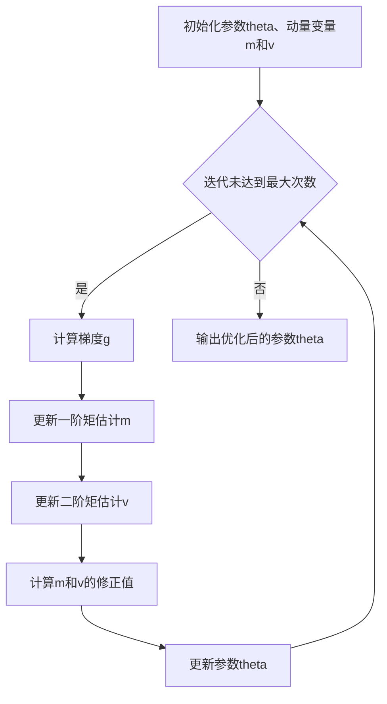

# 优化算法：Adam 原理与代码实例讲解

## 1. 背景介绍

### 1.1 机器学习中的优化算法

在机器学习领域,优化算法扮演着至关重要的角色。机器学习的本质就是通过优化某个目标函数(如损失函数),来寻找最优的模型参数。而优化算法则是驱动这一过程的核心引擎。

### 1.2 Adam 优化算法的诞生

传统的优化算法如梯度下降法(Gradient Descent)、随机梯度下降法(SGD)等虽然简单有效,但在实际应用中仍存在一些不足,如收敛速度慢、容易陷入局部最优等。为了克服这些问题,学者们提出了许多改进算法。Adam(Adaptive Moment Estimation)就是其中的佼佼者,由 Diederik Kingma 和 Jimmy Ba 在 2014 年提出。

### 1.3 Adam 的优势

Adam 集成了多种优化算法的优点,如 AdaGrad 和 RMSProp。它能自适应地调整学习率,加速收敛;同时还具有良好的数值稳定性。这使得 Adam 在各种深度学习任务中大放异彩,成为最受欢迎的优化算法之一。

## 2. 核心概念与联系

### 2.1 梯度(Gradient)

梯度是机器学习优化的核心概念。对于一个目标函数 $J(\theta)$,其中 $\theta$ 为待优化的参数向量,梯度 $\nabla J(\theta)$ 指向函数值增长最快的方向。在优化过程中,我们希望沿着负梯度方向更新参数,以最小化目标函数。

### 2.2 学习率(Learning Rate)

学习率决定了每次参数更新的步长。选择合适的学习率至关重要:太小会导致收敛缓慢,太大则可能错过最优解。传统算法通常使用固定的学习率,而 Adam 能够自适应地调整学习率。

### 2.3 自适应学习率

与传统的 SGD 不同,Adam 为每个参数维护了自己的学习率。这种自适应能力源于对梯度一阶矩(均值)和二阶矩(方差)的估计。直观地说,参数的更新幅度与其不确定性成正比:不确定性大的参数更新幅度大,反之亦然。

### 2.4 动量(Momentum) 

动量方法借鉴了物理中的惯性概念,在更新参数时不仅考虑当前梯度,还利用了过去梯度的信息。这有助于加速收敛并跳出局部最优。Adam 使用了两个动量变量来跟踪梯度的一阶矩和二阶矩。

## 3. 核心算法原理具体操作步骤

### 3.1 参数初始化

首先,我们初始化待优化的参数 $\theta$,以及两个动量变量 $m$ (一阶矩)和 $v$ (二阶矩)。通常将它们初始化为 0 向量。同时设定学习率 $\alpha$、一阶矩衰减率 $\beta_1$、二阶矩衰减率 $\beta_2$ 和平滑项 $\epsilon$。

### 3.2 迭代更新

在每次迭代 $t$ 中,执行以下步骤:

1. 计算目标函数关于当前参数的梯度 $g_t=\nabla J(\theta_t)$。

2. 更新一阶矩估计: $m_t=\beta_1 \cdot m_{t-1}+(1-\beta_1) \cdot g_t$。这实际上是梯度的指数加权平均。

3. 更新二阶矩估计: $v_t=\beta_2 \cdot v_{t-1}+(1-\beta_2) \cdot g_t^2$。注意这里用到了梯度的平方。

4. 由于 $m_t$ 和 $v_t$ 被初始化为 0,在迭代初期它们会向 0 偏置。为了抵消这种偏置,计算它们的修正值:
   
   $\hat{m}_t=\frac{m_t}{1-\beta_1^t}$
   
   $\hat{v}_t=\frac{v_t}{1-\beta_2^t}$

5. 根据以上修正值,更新参数:

   $\theta_{t+1}=\theta_t-\frac{\alpha}{\sqrt{\hat{v}_t}+\epsilon} \cdot \hat{m}_t$

   其中 $\epsilon$ 是一个很小的常数,用于数值稳定性。

6. 重复步骤 1~5,直到满足停止条件(如达到预设的迭代次数或目标函数值变化很小)。

### 3.3 Adam 算法流程图



## 4. 数学模型和公式详细讲解举例说明

### 4.1 目标函数

假设我们要优化的目标函数是均方误差(MSE):

$$J(\theta)=\frac{1}{n}\sum_{i=1}^n(y_i-\hat{y}_i)^2$$

其中 $y_i$ 是第 $i$ 个样本的真实值,$\hat{y}_i$ 是模型预测值,它是参数 $\theta$ 的函数。

### 4.2 梯度计算

在每次迭代中,我们需要计算目标函数关于当前参数的梯度。对于 MSE,梯度为:

$$\nabla J(\theta)=\frac{2}{n}\sum_{i=1}^n(\hat{y}_i-y_i)\nabla \hat{y}_i$$

如果模型是线性的,即 $\hat{y}_i=\theta^Tx_i$,则:

$$\nabla J(\theta)=\frac{2}{n}X^T(X\theta-y)$$

其中 $X$ 是输入特征矩阵,$y$ 是真实值向量。

### 4.3 动量更新

接下来,我们更新动量变量 $m$ 和 $v$。设当前迭代次数为 $t$,则:

$$m_t=\beta_1 \cdot m_{t-1}+(1-\beta_1) \cdot g_t$$
$$v_t=\beta_2 \cdot v_{t-1}+(1-\beta_2) \cdot g_t^2$$

通常取 $\beta_1=0.9$,$\beta_2=0.999$。

### 4.4 参数更新

最后,我们根据修正后的动量变量更新参数:

$$\theta_{t+1}=\theta_t-\frac{\alpha}{\sqrt{\hat{v}_t}+\epsilon} \cdot \hat{m}_t$$

其中:
$$\hat{m}_t=\frac{m_t}{1-\beta_1^t}$$
$$\hat{v}_t=\frac{v_t}{1-\beta_2^t}$$

$\epsilon$ 通常取 $10^{-8}$。学习率 $\alpha$ 需要根据具体问题调节,常见取值如 $0.001$。

## 5. 项目实践：代码实例和详细解释说明

下面是用 Python 实现 Adam 优化算法的示例代码:

```python
import numpy as np

class Adam:
    def __init__(self, lr=0.001, beta1=0.9, beta2=0.999, epsilon=1e-8):
        self.lr = lr
        self.beta1 = beta1
        self.beta2 = beta2
        self.epsilon = epsilon
        self.m = None
        self.v = None
        self.t = 0

    def update(self, params, grads):
        if self.m is None:
            self.m = [np.zeros_like(p) for p in params]
            self.v = [np.zeros_like(p) for p in params]

        self.t += 1
        lr_t = self.lr * np.sqrt(1.0 - self.beta2**self.t) / (1.0 - self.beta1**self.t)

        for i in range(len(params)):
            self.m[i] += (1 - self.beta1) * (grads[i] - self.m[i])
            self.v[i] += (1 - self.beta2) * (grads[i]**2 - self.v[i])

            params[i] -= lr_t * self.m[i] / (np.sqrt(self.v[i]) + self.epsilon)

        return params
```

这个 `Adam` 类的构造函数接受学习率 `lr`、一阶矩衰减率 `beta1`、二阶矩衰减率 `beta2` 和平滑项 `epsilon` 作为超参数。`m` 和 `v` 分别存储每个参数的一阶矩和二阶矩估计,初始化为 `None`。`t` 记录迭代次数。

`update` 方法接受当前参数 `params` 和梯度 `grads`,执行一次 Adam 更新。首先判断 `m` 和 `v` 是否为 `None`,如果是则将它们初始化为与参数形状相同的 0 数组。

然后,根据当前迭代次数 `t` 计算学习率的衰减值 `lr_t`。接下来,对每个参数及其对应的梯度,更新一阶矩估计 `m` 和二阶矩估计 `v`。注意这里直接在原估计上做更新,节省了存储空间。

最后,根据更新后的 `m` 和 `v`,对每个参数进行更新。为了数值稳定性,分母加上了平滑项 `epsilon`。

使用这个 `Adam` 优化器的示例如下:

```python
# 待优化的参数
params = [np.random.randn(10, 1), np.random.randn(1)]

# 创建 Adam 优化器 
optimizer = Adam(lr=0.01)

# 迭代 1000 次
for t in range(1000):
    # 假设 grads 是当前参数的梯度
    grads = compute_gradients(params)
    
    # 调用 Adam 优化器的 update 方法更新参数
    params = optimizer.update(params, grads)
```

## 6. 实际应用场景

Adam 优化算法在深度学习中得到了广泛应用,尤其是在以下场景:

### 6.1 图像分类

在图像分类任务中,我们通常使用卷积神经网络(CNN)作为模型。CNN 包含大量参数,使用 Adam 优化器可以加速训练过程,提高分类精度。例如,在 ImageNet 数据集上训练 ResNet 模型时,Adam 是首选的优化算法。

### 6.2 自然语言处理

自然语言处理任务如机器翻译、情感分析等通常采用循环神经网络(RNN)或 Transformer 等模型。这些模型同样包含大量参数,使用 Adam 优化器可以显著提升训练效率和模型性能。例如,谷歌的 BERT 模型就是使用 Adam 训练的。

### 6.3 生成对抗网络

生成对抗网络(GAN)由生成器和判别器两部分组成,训练过程中两者互相博弈。使用 Adam 优化器可以帮助 GAN 更快地达到平衡,生成更加逼真的样本。例如,StyleGAN 模型使用 Adam 优化器训练,可以生成高质量的人脸图像。

## 7. 工具和资源推荐

### 7.1 深度学习框架

主流的深度学习框架如 TensorFlow、PyTorch、Keras 等都内置了 Adam 优化器,使用非常方便。以 PyTorch 为例:

```python
import torch.optim as optim

# 假设 model 是已定义好的神经网络
optimizer = optim.Adam(model.parameters(), lr=0.001)
```

### 7.2 学习资源

- 论文原文:《Adam: A Method for Stochastic Optimization》
- 机器学习优化算法综述:《An overview of gradient descent optimization algorithms》
- 吴恩达的深度学习教程:https://www.coursera.org/specializations/deep-learning

## 8. 总结：未来发展趋势与挑战

Adam 优化算法在实践中已经证明了其有效性和高效性,但仍有一些挑战和改进空间:

- 超参数选择:Adam 包含多个超参数,如学习率、衰减率等。如何为具体任务选择最优的超参数组合仍是一个开放问题。
- 理论分析:尽管 Adam 在实践中表现出色,但其理论收敛性质尚未得到完全证明。进一步的理论分析有助于我们更好地理解 Adam 的行为。
- 结合其他技术:Adam 可以与其他技术如学习率调度、正则化等结合,以进一步提升性能。探索这些结合的可能性是未来的一个研究方向。

总的来说,