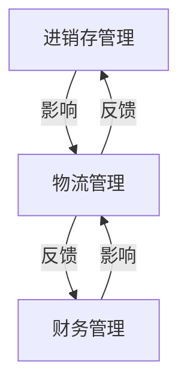

# 供应链进销存、物流、财务系统设计

## 1. 背景介绍

### 1.1 供应链管理的重要性

在当今快节奏的商业环境中，供应链管理已成为企业赖以生存和发展的关键因素。有效的供应链管理可以优化资源利用、降低运营成本、提高客户满意度,并增强企业的竞争优势。随着全球化进程的加速,供应链管理的复杂性也与日俱增,需要企业采用先进的技术和系统来应对日益严峻的挑战。

### 1.2 传统供应链管理的局限性

传统的供应链管理系统通常是孤立的、缺乏集成和自动化,导致数据不一致、响应迟缓、效率低下等问题。此外,这些系统往往无法满足现代企业对实时数据分析和决策支持的需求,难以适应快速变化的市场环境。

### 1.3 现代供应链管理系统的需求

为了提高供应链管理的效率和灵活性,企业需要一个集成的、端到端的解决方案,将进销存、物流和财务等关键流程无缝集成。这种解决方案应该具备实时数据处理、智能分析和自动化决策等先进功能,以支持敏捷的业务运营和快速响应市场变化。

## 2. 核心概念与联系

### 2.1 供应链管理的核心流程

供应链管理包括三个核心流程:进销存管理、物流管理和财务管理。

#### 2.1.1 进销存管理

进销存管理涉及商品的采购、库存控制和销售,是供应链管理的核心环节。它确保商品的及时供应,并优化库存水平,以满足客户需求并降低存货成本。

#### 2.1.2 物流管理

物流管理负责商品的运输和配送,包括订单处理、运输路线规划、车辆调度等。高效的物流管理可以缩短交货时间,提高客户满意度。

#### 2.1.3 财务管理

财务管理处理供应链中的资金流动,包括应收账款、应付账款、成本核算等。它确保资金的及时周转,并提供财务数据用于决策分析。

### 2.2 核心流程的集成

这三个核心流程紧密相连,相互影响。例如,进销存管理会影响物流需求,而物流成本又会影响财务状况。因此,将它们集成到一个统一的系统中,可以实现数据共享、流程自动化和决策优化,从而提高整个供应链的效率和灵活性。

## 3. 核心算法原理具体操作步骤

### 3.1 需求预测算法

准确预测未来需求是供应链管理的关键。常用的需求预测算法包括移动平均法、指数平滑法和回归分析法等。

#### 3.1.1 移动平均法

移动平均法使用最近 N 个时间段的实际需求计算平均值作为未来需求的预测值。其步骤如下:

1. 确定时间段数 N
2. 计算最近 N 个时间段的实际需求之和
3. 将需求之和除以 N,得到移动平均值
4. 将移动平均值作为下一个时间段的需求预测值

$$\text{预测值} = \frac{\sum\limits_{i=1}^{N}x_{t-i+1}}{N}$$

其中,$ x_t $表示第 t 个时间段的实际需求。

#### 3.1.2 指数平滑法

指数平滑法给予最新数据更大的权重,对过去数据的影响逐渐衰减。其步骤如下:

1. 确定平滑系数 $\alpha$ (0 < $\alpha$ < 1)
2. 计算初始平滑值 $S_1$,通常取第一个时间段的实际需求值
3. 对于后续时间段 t,计算平滑值 $S_t$:

$$S_t = \alpha x_{t-1} + (1 - \alpha) S_{t-1}$$

其中,$ x_{t-1} $表示第 t-1 个时间段的实际需求值。

4. 将 $S_t$ 作为第 t 个时间段的需求预测值

### 3.2 库存优化算法

库存优化算法旨在确定最佳库存水平,以满足客户需求并最小化库存成本。

#### 3.2.1 经济订货量 (EOQ) 模型

EOQ 模型通过平衡订货成本和库存持有成本来确定最优订货量。其步骤如下:

1. 确定年度需求量 D、订货成本 C 和库存持有成本 H
2. 计算最优订货量 Q*:

$$Q^* = \sqrt{\frac{2DC}{H}}$$

3. 确定重新订货点 (ROP):

$$\text{ROP} = d \times L$$

其中,d 表示每期需求量,L 表示交货延迟时间。

4. 当库存水平降至 ROP 时,下订单数量为 Q*

#### 3.2.2 周期补货系统

周期补货系统以固定时间间隔进行补货,订货量根据需求和现有库存量确定。其步骤如下:

1. 确定补货周期 T
2. 在每个周期开始时,计算订货量 Q:

$$Q = d \times T + \text{安全库存} - \text{现有库存量}$$

其中,d 表示每期需求量。

3. 下订单数量为 Q

### 3.3 车辆路线优化算法

对于物流管理,车辆路线优化算法可以有效减少运输成本和时间。

#### 3.3.1 蚁群算法

蚁群算法模拟蚂蚁寻找食物的行为,通过释放和检测信息素来寻找最优路径。其步骤如下:

1. 初始化蚂蚁群和信息素矩阵
2. 对于每只蚂蚁:
    a. 根据启发式信息和信息素浓度,选择下一个城市
    b. 完成一条路径后,更新信息素矩阵
3. 重复步骤 2,直到满足停止条件
4. 输出最优路径

#### 3.3.2 遗传算法

遗传算法通过模拟自然选择过程,不断进化出更优的解。其步骤如下:

1. 初始化种群 (一组可行解)
2. 评估每个个体的适应度 (目标函数值)
3. 选择适应度较高的个体
4. 对选定的个体进行交叉和变异,产生新一代种群
5. 重复步骤 2-4,直到满足停止条件
6. 输出最优解

## 4. 数学模型和公式详细讲解举例说明

### 4.1 需求预测模型

需求预测是供应链管理的基础,准确的预测可以优化库存水平、生产计划和运输安排。常用的需求预测模型包括移动平均法、指数平滑法和回归分析法等。

#### 4.1.1 移动平均法

移动平均法使用最近 N 个时间段的实际需求计算平均值作为未来需求的预测值。其公式为:

$$\text{预测值} = \frac{\sum\limits_{i=1}^{N}x_{t-i+1}}{N}$$

其中,$ x_t $表示第 t 个时间段的实际需求。

例如,假设最近 4 个月的需求量分别为 100、120、110 和 130,如果使用 4 期移动平均法,则下一个月的需求预测值为:

$$\text{预测值} = \frac{100 + 120 + 110 + 130}{4} = 115$$

移动平均法的优点是计算简单,缺点是对最新数据的反应较慢。

#### 4.1.2 指数平滑法

指数平滑法给予最新数据更大的权重,对过去数据的影响逐渐衰减。其公式为:

$$S_t = \alpha x_{t-1} + (1 - \alpha) S_{t-1}$$

其中,$ x_{t-1} $表示第 t-1 个时间段的实际需求值,$ S_{t-1} $表示上一个时间段的平滑值,$ \alpha $为平滑系数 (0 < $ \alpha $ < 1)。

例如,假设上个月的实际需求量为 120,上上个月的平滑值为 100,平滑系数 $ \alpha = 0.3 $,则本月的平滑值为:

$$S_t = 0.3 \times 120 + 0.7 \times 100 = 106$$

指数平滑法对最新数据的反应更快,但需要合理选择平滑系数。

### 4.2 库存优化模型

库存优化旨在确定最佳库存水平,以满足客户需求并最小化库存成本。常用的库存优化模型包括经济订货量 (EOQ) 模型和周期补货系统。

#### 4.2.1 经济订货量 (EOQ) 模型

EOQ 模型通过平衡订货成本和库存持有成本来确定最优订货量。其公式为:

$$Q^* = \sqrt{\frac{2DC}{H}}$$

其中,D 表示年度需求量,C 表示订货成本,H 表示库存持有成本。

同时,需要确定重新订货点 (ROP):

$$\text{ROP} = d \times L$$

其中,d 表示每期需求量,L 表示交货延迟时间。

例如,假设年度需求量为 10000 件,订货成本为 100 元/次,库存持有成本为 5 元/件/年,交货延迟时间为 2 周,每周需求量为 200 件,则:

$$Q^* = \sqrt{\frac{2 \times 10000 \times 100}{5}} \approx 632 \text{ 件}$$
$$\text{ROP} = 200 \times 2 = 400 \text{ 件}$$

当库存水平降至 400 件时,应下订单 632 件。

#### 4.2.2 周期补货系统

周期补货系统以固定时间间隔进行补货,订货量根据需求和现有库存量确定。其公式为:

$$Q = d \times T + \text{安全库存} - \text{现有库存量}$$

其中,d 表示每期需求量,T 表示补货周期。

例如,假设每周需求量为 200 件,补货周期为 4 周,安全库存为 100 件,现有库存量为 300 件,则:

$$Q = 200 \times 4 + 100 - 300 = 500 \text{ 件}$$

应下订单 500 件。

### 4.3 车辆路线优化模型

对于物流管理,车辆路线优化可以有效减少运输成本和时间。常用的优化模型包括蚁群算法和遗传算法等。

#### 4.3.1 蚁群算法

蚁群算法模拟蚂蚁寻找食物的行为,通过释放和检测信息素来寻找最优路径。其转移概率公式为:

$$p_{ij}^k(t) = \begin{cases}
\frac{[\tau_{ij}(t)]^\alpha[\eta_{ij}]^\beta}{\sum\limits_{l \in N_i^k}[\tau_{il}(t)]^\alpha[\eta_{il}]^\beta}, & j \in N_i^k\\
0, & \text{otherwise}
\end{cases}$$

其中,$ p_{ij}^k(t) $表示第 k 只蚂蚁在时刻 t 从城市 i 转移到城市 j 的概率,$ \tau_{ij}(t) $表示边 (i,j) 上的信息素浓度,$ \eta_{ij} $表示启发式信息 (通常为距离的倒数),$ \alpha $和$ \beta $分别为信息素和启发式信息的相对重要性,$ N_i^k $表示第 k 只蚂蚁在城市 i 时尚未访问过的城市集合。

#### 4.3.2 遗传算法

遗传算法通过模拟自然选择过程,不断进化出更优的解。其适应度函数通常为目标函数的倒数或负值,以求最小化。

例如,对于旅行商问题 (TSP),适应度函数可定义为:

$$f(x) = \frac{1}{\sum\limits_{i=1}^{n}d(x_i,x_{i+1})} + \frac{1}{d(x_n,x_1)}$$

其中,x 表示一条路径 (染色体),n 表示城市数量,$ d(x_i,x_j) $表示城市 i 和城市 j 之间的距离。

通过选择、交叉和变异操作