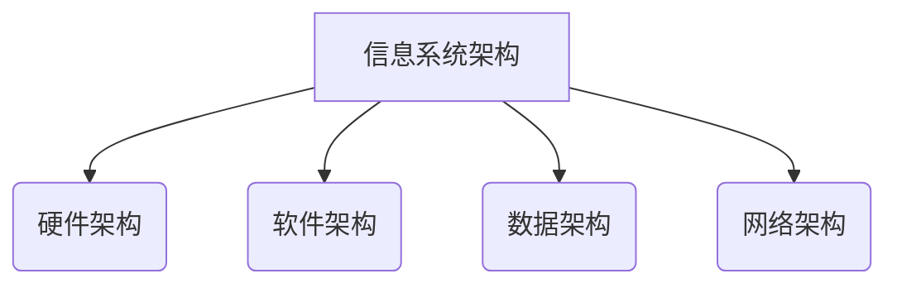
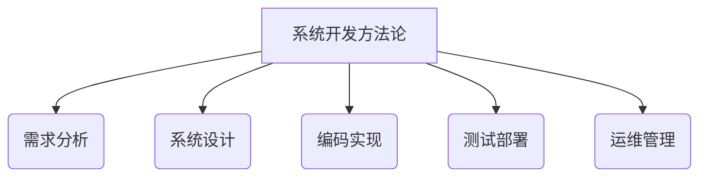
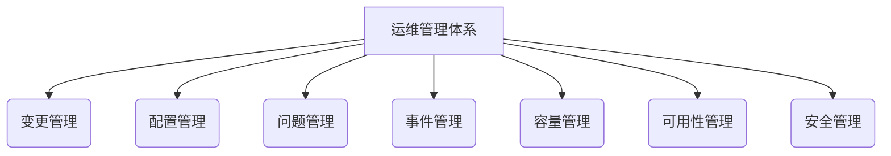
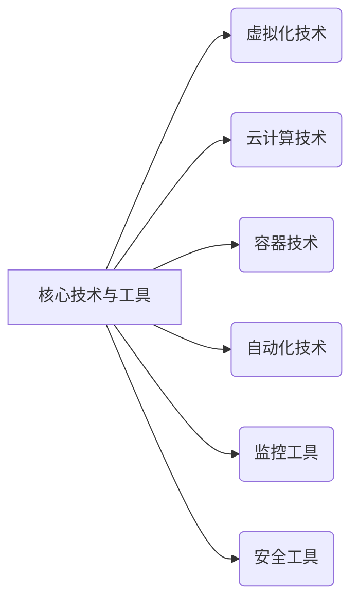

# 信息软硬件系统建设及运维管理

## 1.背景介绍

在当今数字化时代,信息系统无疑成为了各行业的核心支撑。无论是政府机构、金融企业,还是制造业、服务业,高效、可靠、安全的信息系统都是确保业务持续运转、提高竞争力的关键因素。信息系统的建设和运维管理,已经成为IT领域的重中之重。

信息系统涵盖了硬件、软件、网络、数据等多个层面,系统复杂程度不断加深。硬件设施包括服务器、存储设备、网络设备等;软件则包括操作系统、中间件、数据库、应用程序等;网络则负责不同节点之间的通信;而数据是系统运行的核心资产。各个层面的有机融合,构成了完整的信息系统。

### 1.1 信息系统建设的重要性

信息系统建设是现代企业信息化进程的重要一环,对企业的生存和发展有着深远影响:

- 提高企业运营效率,实现流程自动化、信息共享、决策支持等
- 整合企业内外部资源,打破信息孤岛,实现高效协同
- 降低企业运营成本,优化资源配置,提高生产效率
- 提升客户服务质量,增强客户体验,增强企业竞争力
- 满足法律法规要求,确保合规经营

### 1.2 信息系统运维的作用

信息系统运维管理则是保障系统高效、稳定、安全运行的基石:

- 监控系统性能,预防和处理故障,确保业务连续性
- 持续优化系统,提升运行效率,降低运维成本
- 管理变更,控制风险,保证系统可靠性和完整性
- 加强安全管理,防范内外部威胁,保护数据安全
- 制定应急预案,快速响应和恢复,降低业务中断损失

可见,信息系统建设和运维管理是现代企业信息化建设的重中之重,是企业可持续发展的重要保障。

## 2.核心概念与联系

信息系统建设和运维管理涉及诸多核心概念,这些概念相互关联、环环相扣,构成了完整的理论框架。

### 2.1 信息系统架构

信息系统架构是指系统的总体设计框架,包括硬件架构、软件架构、数据架构、网络架构等方面。架构设计直接决定了系统的性能、可扩展性、安全性等关键指标。常见的架构模式有:

- 集中式架构:单一系统集中处理所有业务
- 分布式架构:多个子系统分担不同业务
- SOA架构:面向服务,松散耦合的分布式系统
- 微服务架构:更小粒度、更高内聚的分布式架构

### 2.2 系统开发方法论

系统开发方法论指导着系统的分析、设计、实现、测试等全生命周期,保证开发质量和进度:

- 瀑布模型:线性开发流程,阶段间高度耦合
- 增量模型:以迭代的方式分期交付
- 敏捷开发:迭代、灵活的开发模式
- DevOps:开发与运维的高度协作与自动化实践

### 2.3 运维管理体系

运维管理贯穿系统全生命周期,包括:

- 变更管理:控制对系统的变更,确保变更可控
- 配置管理:跟踪和维护系统配置信息
- 问题管理:及时发现、诊断和解决系统问题
- 事件管理:监控、分析并响应各类事件
- 容量管理:规划和优化系统资源容量
- 可用性管理:提高系统可用性,最小化中断时间
- 安全管理:保护系统资产,防范安全威胁

### 2.4 核心技术与工具

多种技术与工具在信息系统建设和运维中发挥着重要作用:

- 虚拟化:提高资源利用率,实现资源动态分配
- 云计算:提供按需使用、弹性扩展的IT资源服务 
- 容器:轻量级虚拟化,实现应用环境一致性
- 自动化:通过脚本或工具实现运维流程自动化
- 监控工具:全方位监视系统运行状况
- 安全工具:实现系统加固、漏洞扫描、入侵检测等

上述核心概念相互关联、环环相扣,共同构成了信息系统建设和运维管理的完整理论框架和技术体系。

## 3.核心算法原理具体操作步骤

信息系统建设和运维管理中,有许多核心算法和流程需要重点关注。下面将详细介绍其中的几个核心算法原理及具体操作步骤。

### 3.1 负载均衡算法

负载均衡是分布式系统中的一种常用技术,用于将请求合理分配到多个服务器上,从而提高系统的响应能力和可用性。常见的负载均衡算法包括:

1. **轮询算法(Round Robin):**

   - 原理:将请求按顺序逐一分配到不同的服务器上
   - 步骤:
     1) 维护一个服务器队列,记录每个服务器的权重
     2) 按顺序逐一将请求分配给队列中的服务器
     3) 分配完最后一个服务器后,重新从第一个服务器开始分配

2. **加权轮询算法(Weighted Round Robin):**

   - 原理:根据服务器的性能为其分配不同的权重,性能越高的服务器获取更多请求
   - 步骤:
     1) 为每个服务器分配一个权重值,权重值越大,获取请求的概率越高
     2) 按权重值的大小,将请求分配给服务器
     3) 处理完一轮后,重新开始下一轮分配

3. **最小连接数算法(Least Connections):**

   - 原理:将请求分配给当前已建立连接数最少的服务器
   - 步骤:
     1) 记录每个服务器当前已建立的连接数
     2) 选择连接数最小的服务器,将新请求分配给它
     3) 如有多个服务器连接数相同,可采用轮询或随机策略

4. **源地址哈希算法(Source Hash):**

   - 原理:根据客户端IP地址的哈希值,将同一客户端的请求分配到同一台服务器上
   - 步骤:
     1) 获取客户端IP地址
     2) 计算IP地址的哈希值
     3) 根据哈希值,将请求分配到对应的服务器上

上述算法各有利弊,在实际应用中需要根据具体场景选择合适的算法,或结合多种算法的优点设计新的负载均衡策略。

### 3.2 一致性哈希算法

一致性哈希算法常用于分布式系统中实现数据的均匀分布,解决传统哈希算法在节点变化时导致大量数据重新哈希的问题。算法原理如下:

1. 将节点的IP地址或其他标识使用哈希函数映射到环形空间
2. 将数据项也使用相同的哈希函数映射到环形空间
3. 顺时针找到第一个节点,将该数据项分配给该节点

当节点加入或移除时,只有部分数据需要重新映射,大大减少了数据迁移的开销。算法具体步骤如下:

1. 定义一个环形空间,范围为 $[0, 2^{32})$
2. 使用 `MD5` 或其他哈希函数,将节点标识映射到环形空间
3. 对于每个数据项 `key`:
   - 计算 `key` 的哈希值 $hash(key)$
   - 顺时针找到第一个大于或等于 $hash(key)$ 的节点 $node_i$
   - 将 `key` 存储在 $node_i$ 上
4. 当节点加入或移除时:
   - 重新计算受影响的数据项的映射位置
   - 将数据项迁移到新的节点上

通过一致性哈希算法,可以实现数据的均匀分布,并在节点变化时只需要迁移部分数据,从而提高系统的扩展性和可用性。

### 3.3 Paxos 分布式一致性算法

在分布式系统中,由于网络通信的不确定性,不同节点之间的数据可能出现不一致的情况。Paxos 算法就是一种解决这一问题的经典分布式一致性算法。算法原理如下:

1. 在分布式系统中,存在一个 Proposer(提议者)、多个 Acceptor(决策者)和一个 Learner(学习者)
2. Proposer 向 Acceptor 发起提议,要求 Acceptor 接受该提议
3. 如果超过半数的 Acceptor 接受了提议,则该提议被批准
4. Learner 从 Acceptor 处学习到批准的提议,并执行相应操作

算法具体执行步骤如下:

1. Proposer 选择一个提议编号 $n$,向 Acceptor 发送 $Prepare(n)$ 请求
2. 如果 Acceptor 之前没有接受过编号大于 $n$ 的提议,则回复 $Promise(n, previous\_value)$
3. 如果 Proposer 收到多数 Acceptor 的 $Promise$ 响应,则发送 $Accept(n, value)$ 请求
4. 如果 Acceptor 之前没有接受过编号大于 $n$ 的提议,则接受该提议并持久化
5. 如果 Proposer 收到多数 Acceptor 的接受响应,则提议被批准
6. Learner 从 Acceptor 处学习到批准的提议值,并执行相应操作

通过两阶段的提议和批准过程,Paxos 算法保证了在存在网络分区或节点宕机的情况下,仍能达成一致的决策。该算法广泛应用于分布式系统的数据同步、元数据管理、领导者选举等场景。

上述这些核心算法,是信息系统建设和运维管理中不可或缺的基础理论和实践。掌握了这些算法原理和操作步骤,有助于我们更好地设计、实现和管理高质量的分布式信息系统。

## 4.数学模型和公式详细讲解举例说明

在信息系统建设和运维管理中,数学模型和公式扮演着重要角色,用于量化描述系统行为、优化系统配置、评估系统性能等。下面将详细介绍其中的几个典型数学模型和公式。

### 4.1 队列模型

队列理论是研究排队现象的一个重要分支,在系统性能评估和容量规划中有着广泛应用。常见的队列模型包括 M/M/1、M/G/1 和 G/G/m 等。

以 M/M/1 队列模型为例,它描述了到达过程和服务过程均服从泊松分布、单服务台的排队系统。该模型的一些核心公式如下:

1. 系统利用率 $\rho$:

$$\rho = \frac{\lambda}{\mu}$$

其中 $\lambda$ 为到达率,即单位时间内到达的请求数;$\mu$ 为服务率,即单位时间内可处理的请求数。

2. 平均队长 $L_q$:

$$L_q = \frac{\rho^2}{1-\rho}$$

3. 平均等待时间 $W_q$:

$$W_q = \frac{\rho}{\mu(1-\rho)}$$

4. 平均响应