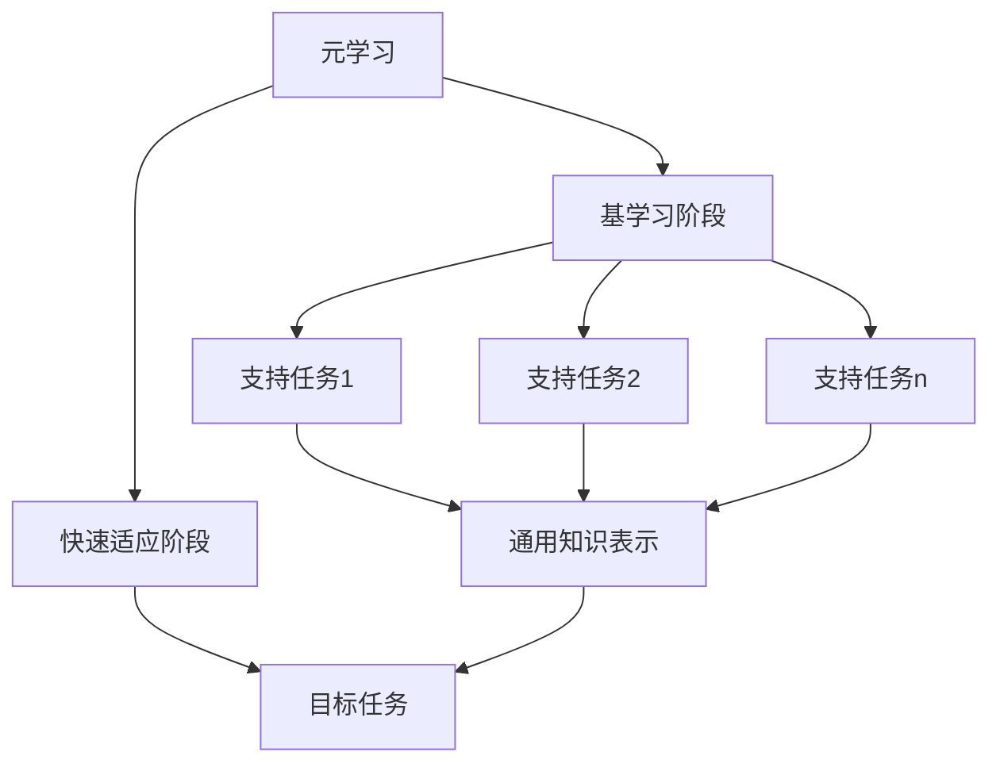

# 元学习原理与代码实战案例讲解

## 1. 背景介绍

### 1.1 什么是元学习？

元学习(Meta-Learning)是机器学习领域中一种新兴的学习范式,旨在让机器学习系统能够更快地适应新的任务和环境。传统的机器学习方法通常需要为每个新任务重新收集大量数据并从头开始训练模型,这种方式效率低下且成本高昂。相比之下,元学习试图从多个相关任务中提取出通用的知识,并将这些知识应用于新的任务,从而加快学习速度并提高数据效率。

### 1.2 元学习的重要性

在现实世界中,我们经常会遇到需要快速适应新环境和任务的情况。例如,当我们换了一份新工作,就需要学习新的技能和知识;当我们搬到一个新的城市,就需要适应新的生活方式。人类具有出色的元学习能力,可以利用以前的经验快速获取新知识。赋予机器同样的能力,将极大提高人工智能系统的适应性和通用性。

元学习在许多领域都有潜在的应用前景,如机器人控制、人工智能辅助系统、持续学习等。它有望推动人工智能系统朝着更加通用和智能的方向发展。

## 2. 核心概念与联系

### 2.1 元学习与传统机器学习的区别

传统的机器学习方法通常假设训练数据和测试数据来自同一个数据分布,并专注于在给定任务上获得最佳性能。然而,在现实世界中,我们经常会遇到新的任务和环境,这些任务和环境可能与原始训练数据存在分布偏移。

元学习则试图从多个相关任务中学习一种通用的知识表示,以便能够快速适应新的任务。它将机器学习过程分为两个阶段:基学习(Base-Learning)和快速适应(Fast Adaptation)。在基学习阶段,模型从一系列支持任务(Source Tasks)中学习一种通用的知识表示;在快速适应阶段,模型利用这种通用知识,结合少量新任务数据,快速适应新的目标任务(Target Task)。

### 2.2 元学习的主要类型

根据具体的学习方式,元学习可以分为以下几种主要类型:

1. **基于模型的元学习(Model-Based Meta-Learning)**:旨在学习一个可以快速适应新任务的模型的初始参数或优化器。代表方法有模型无关的元学习(MAML)、元学习共享网络(Meta-SGD)等。

2. **基于指标的元学习(Metric-Based Meta-Learning)**:学习一个可以测量不同任务之间相似性的指标函数,从而加快新任务的学习速度。代表方法有原型网络(Prototypical Networks)、关系网络(Relation Networks)等。

3. **基于优化的元学习(Optimization-Based Meta-Learning)**:直接学习一个可以快速优化新任务目标函数的优化算法。代表方法有LSTM元学习器(Meta-Learner LSTM)、简单神经优化器(Simple Neural Optimizer)等。

4. **基于生成模型的元学习(Generative Model-Based Meta-Learning)**:利用生成模型从任务分布中采样,并优化生成模型以生成能够快速适应新任务的模型参数。代表方法有元学习生成对抗网络(Meta-GAN)、任务嵌入生成模型(TE-GAN)等。

这些不同类型的元学习方法各有优缺点,在不同的场景下可能表现不同。选择合适的方法对于解决特定问题至关重要。

## 3. 核心算法原理具体操作步骤

在这一部分,我们将重点介绍基于模型的元学习算法MAML(Model-Agnostic Meta-Learning),它是元学习领域中最具影响力的算法之一。

### 3.1 MAML算法原理

MAML的核心思想是:在基学习阶段,通过多任务训练,寻找一个良好的模型初始参数,使得在快速适应阶段,只需少量新任务数据和少量梯度更新步骤,就能够获得一个在新任务上表现良好的模型。

具体来说,MAML将整个学习过程分为两个阶段:

1. **基学习阶段**:在这个阶段,我们从一系列支持任务中采样一批数据,并对当前模型参数进行一些梯度更新,得到一个适应于每个支持任务的模型。然后,我们将这些适应后的模型在各自的支持任务上进行评估,并将它们的损失求和作为元损失函数。通过最小化这个元损失函数,我们可以找到一个良好的初始参数,使得在快速适应阶段只需少量梯度更新就能够适应新任务。

2. **快速适应阶段**:在这个阶段,我们利用上一阶段学习到的良好初始参数,结合少量新任务数据,通过少量梯度更新步骤得到一个适应于新任务的模型。

MAML算法的优点在于,它是一种基于梯度的优化算法,可以应用于任何可微分的模型,因此具有很好的通用性。此外,由于MAML直接优化模型的初始参数,因此在快速适应阶段只需少量梯度更新步骤,就能够获得良好的性能。

### 3.2 MAML算法步骤

下面是MAML算法的具体步骤:

1. 初始化模型参数 $\theta$

2. 对于每个支持任务 $\mathcal{T}_i$:
    - 从 $\mathcal{T}_i$ 中采样一批训练数据 $\mathcal{D}_i^{tr}$ 和测试数据 $\mathcal{D}_i^{val}$
    - 计算损失函数 $\mathcal{L}_{\mathcal{T}_i}(\theta)$ 在训练数据 $\mathcal{D}_i^{tr}$ 上的值
    - 计算梯度 $\nabla_\theta \mathcal{L}_{\mathcal{T}_i}(\theta)$
    - 进行梯度更新: $\theta_i' = \theta - \alpha \nabla_\theta \mathcal{L}_{\mathcal{T}_i}(\theta)$
    - 计算更新后的模型在测试数据 $\mathcal{D}_i^{val}$ 上的损失 $\mathcal{L}_{\mathcal{T}_i}(\theta_i')$

3. 计算元损失函数:
$$\mathcal{L}_{\text{meta}}(\theta) = \sum_{\mathcal{T}_i \sim p(\mathcal{T})} \mathcal{L}_{\mathcal{T}_i}(\theta_i')$$

4. 更新模型参数:
$$\theta \leftarrow \theta - \beta \nabla_\theta \mathcal{L}_{\text{meta}}(\theta)$$

5. 重复步骤2-4,直到收敛

在快速适应阶段,我们只需要使用上述算法学习到的良好初始参数 $\theta$,结合少量新任务数据,进行少量梯度更新步骤,就能够获得一个适应于新任务的模型。

MAML算法的一个关键点是,在基学习阶段,我们并不直接最小化训练数据的损失函数,而是最小化一个元损失函数,这个元损失函数衡量的是经过少量梯度更新后,模型在测试数据上的表现。通过这种方式,MAML算法可以找到一个良好的初始参数,使得在快速适应阶段只需少量梯度更新就能够获得良好的性能。

## 4. 数学模型和公式详细讲解举例说明

在上一节中,我们介绍了MAML算法的原理和步骤。现在,我们将更加深入地探讨MAML算法的数学模型和公式。

### 4.1 问题形式化

我们将元学习问题形式化为以下形式:

给定一个任务分布 $p(\mathcal{T})$,我们的目标是找到一个模型参数 $\theta$,使得对于从 $p(\mathcal{T})$ 采样得到的任何新任务 $\mathcal{T}$,经过少量梯度更新后的模型在该任务上的性能尽可能好。

具体来说,对于每个任务 $\mathcal{T}$,我们将数据划分为两部分:支持集(Support Set) $\mathcal{D}^{tr}$ 和查询集(Query Set) $\mathcal{D}^{val}$。我们的目标是通过在支持集上进行少量梯度更新,使得模型在查询集上的损失尽可能小。

形式上,我们希望找到一个初始参数 $\theta$,使得对于任何新任务 $\mathcal{T}$,以下公式的值最小化:

$$
\min_{\phi} \mathbb{E}_{\mathcal{D}^{val} \sim \mathcal{T}} \left[ \mathcal{L}_{\mathcal{T}}(\phi) \right]
$$

其中 $\phi$ 是通过在支持集 $\mathcal{D}^{tr}$ 上进行少量梯度更新得到的参数:

$$
\phi = \theta - \alpha \nabla_\theta \mathcal{L}_{\mathcal{T}}(\theta; \mathcal{D}^{tr})
$$

这里 $\alpha$ 是学习率,控制梯度更新的步长。

### 4.2 MAML的目标函数

MAML算法的目标是找到一个良好的初始参数 $\theta$,使得对于任何新任务,经过少量梯度更新后的模型在该任务上的性能尽可能好。

因此,MAML的目标函数可以写作:

$$
\min_\theta \mathbb{E}_{\mathcal{T} \sim p(\mathcal{T})} \left[ \mathbb{E}_{\mathcal{D}^{val} \sim \mathcal{T}} \left[ \mathcal{L}_{\mathcal{T}}(\phi) \right] \right]
$$

其中 $\phi$ 是通过在支持集 $\mathcal{D}^{tr}$ 上进行梯度更新得到的参数:

$$
\phi = \theta - \alpha \nabla_\theta \mathcal{L}_{\mathcal{T}}(\theta; \mathcal{D}^{tr})
$$

由于直接优化上述目标函数比较困难,MAML算法采用了一种近似方法。具体来说,MAML将目标函数近似为:

$$
\min_\theta \sum_{\mathcal{T}_i \sim p(\mathcal{T})} \mathcal{L}_{\mathcal{T}_i}(\phi_i)
$$

其中 $\phi_i$ 是通过在支持集 $\mathcal{D}_i^{tr}$ 上进行梯度更新得到的参数:

$$
\phi_i = \theta - \alpha \nabla_\theta \mathcal{L}_{\mathcal{T}_i}(\theta; \mathcal{D}_i^{tr})
$$

这种近似方法的思想是:我们从任务分布 $p(\mathcal{T})$ 中采样一批任务,并最小化这些任务在快速适应阶段的损失之和,作为优化目标。通过这种方式,我们可以找到一个良好的初始参数 $\theta$,使得在快速适应阶段只需少量梯度更新就能够获得良好的性能。

### 4.3 MAML算法的优化过程

MAML算法的优化过程可以概括为以下步骤:

1. 从任务分布 $p(\mathcal{T})$ 中采样一批任务 $\{\mathcal{T}_1, \mathcal{T}_2, \ldots, \mathcal{T}_N\}$

2. 对于每个任务 $\mathcal{T}_i$:
    - 从 $\mathcal{T}_i$ 中采样支持集 $\mathcal{D}_i^{tr}$ 和查询集 $\mathcal{D}_i^{val}$
    - 计算损失函数 $\mathcal{L}_{\mathcal{T}_i}(\theta)$ 在支持集 $\mathcal{D}_i^{tr}$ 上的值
    - 计算梯度 $\nabla_\theta \mathcal{L}_{\mathcal{T}_i}(\theta)$
    - 进行梯度更新: $\phi_i = \theta - \alpha \nabla_\theta \mathcal{L}_{\mathcal{T}_i}(\theta)$
    - 计算更新后的模型在查询集 $\mathcal{D}_i^{val}$ 上的损失 $\mathcal{L