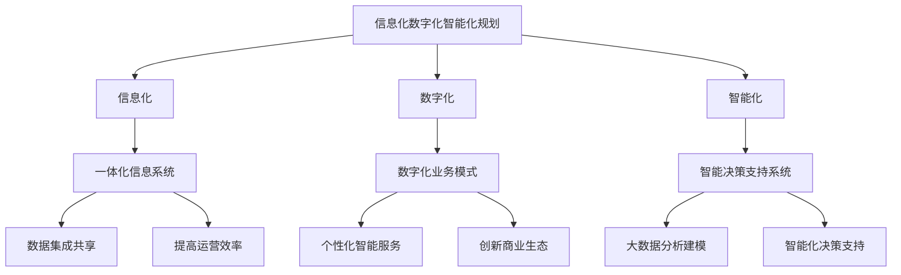

# 公司中长期信息化数字化智能化规划方案

## 1. 背景介绍

在当今数字化时代,信息技术已经成为推动企业发展的核心动力。为了保持竞争优势,公司必须制定周密的中长期信息化、数字化和智能化规划,以充分利用新兴技术的力量,提高运营效率、优化决策过程、创新商业模式,并为客户提供卓越的产品和服务体验。

本规划方案旨在为公司制定一个全面的数字化转型蓝图,明确未来3-5年的发展方向和具体实施路径。它将深入探讨信息化、数字化和智能化在公司业务各个环节中的应用,并提出切实可行的解决方案,助力公司实现高质量发展。

### 1.1 当前形势与挑战

随着新一代信息技术的不断涌现,如云计算、大数据、人工智能、物联网、5G等,给企业的运营模式、管理方式和商业生态带来了深刻的影响和变革。公司面临以下主要挑战:

- 数字化转型步伐滞后,缺乏系统化的顶层设计
- 信息系统架构陈旧,难以适应新业务需求
- 数据资源分散,无法实现高效整合与价值挖掘
- 创新能力不足,难以抓住新技术带来的机遇

### 1.2 发展机遇与必要性  

尽管面临诸多挑战,但数字化转型也为公司带来了巨大的发展机遇:

- 提高运营效率,降低运营成本
- 优化决策流程,提升决策科学性
- 创新商业模式,开拓新的增长空间
- 提升客户体验,增强客户粘性

制定中长期信息化、数字化和智能化规划,对于公司实现高质量发展至关重要。

## 2. 核心概念与联系

### 2.1 信息化

信息化是指利用现代信息技术,对企业的各项业务活动进行优化和重构,实现资源的高效配置和整合,提高企业的管理水平和运营效率。

信息化的核心是构建一体化的信息系统,覆盖企业的各个业务环节,实现数据的seamless集成和共享,为决策提供及时、准确的信息支撑。

### 2.2 数字化

数字化是指将企业的业务流程、产品和服务通过数字技术进行重塑,实现线上线下融合,打造全新的数字化运营模式和商业生态。

数字化的关键是利用新兴技术如云计算、大数据、人工智能等,对传统业务进行数字化升级,提供个性化、智能化的产品和服务,创造差异化的客户体验。

### 2.3 智能化

智能化是指在信息化和数字化的基础上,充分利用人工智能等智能技术,赋予企业"智能大脑",实现业务流程的自动化、智能化和自主决策。

智能化的核心是构建智能决策支持系统,通过大数据分析、机器学习等技术,对海量数据进行深度挖掘和建模,为管理者提供前瞻性的决策依据。



信息化、数字化和智能化相互关联、相辅相成,共同构筑企业的数字化转型之路。其中,信息化为数字化和智能化奠定了基础;数字化重塑了业务模式,创造差异化体验;而智能化则赋予企业"大脑",实现自动化决策。

## 3. 核心算法原理具体操作步骤

制定中长期信息化、数字化和智能化规划,需要遵循"统一规划、分步实施"的原则,将整个过程分为以下几个关键步骤:

### 3.1 现状评估

全面评估公司当前在信息化、数字化和智能化方面的发展现状,包括:

1. 信息系统架构及应用情况
2. 数据资源分布及利用情况 
3. 新技术应用及创新能力
4. 组织结构及人才队伍建设

识别短板和差距,为后续规划奠定基础。

### 3.2 战略制定

结合公司的发展战略和业务目标,制定中长期信息化、数字化和智能化的总体战略,明确发展方向和重点领域,包括:

1. 制定信息化、数字化和智能化的发展愿景和目标
2. 确定重点建设领域和应用场景
3. 规划技术路线和架构蓝图
4. 制定组织保障和人才培养计划

### 3.3 分步实施

将总体规划分解为多个阶段,分步骤有序实施:

1. 制定年度实施计划和路线图
2. 建设核心系统和基础设施
3. 推进数据资产整合和价值挖掘
4. 开展试点项目,积累经验并复制推广
5. 持续优化和完善,与业务同步发展

### 3.4 监控评估

建立监控评估机制,跟踪实施进度,评估阶段性成果,持续优化调整:

1. 建立关键绩效指标(KPI)体系
2. 开展定期评估,收集反馈意见
3. 识别问题与差距,制定改进措施
4. 复盘总结,提炼经验教训

通过不断的"规划-实施-评估-优化"的闭环运作,确保规划方案的高效落地。

## 4. 数学模型和公式详细讲解举例说明

在信息化、数字化和智能化规划中,需要借助多种数学模型和算法,对业务流程、决策过程等进行优化,实现自动化和智能化。以下是一些常用的模型和公式:

### 4.1 线性规划

线性规划是运筹学中的一种数学模型,用于在给定的线性约束条件下,求解某个线性目标函数的最优解。它可以应用于资源优化配置、生产计划安排等场景。

线性规划模型一般形式为:

$$
\begin{aligned}
\max \ \text{或} \ \min \quad & z = c_1x_1 + c_2x_2 + \cdots + c_nx_n \\
\text{满足约束条件:} \quad & a_{11}x_1 + a_{12}x_2 + \cdots + a_{1n}x_n \leq b_1\\
& a_{21}x_1 + a_{22}x_2 + \cdots + a_{2n}x_n \leq b_2\\
& \cdots \cdots\\
& a_{m1}x_1 + a_{m2}x_2 + \cdots + a_{mn}x_n \leq b_m\\
& x_1, x_2, \cdots, x_n \geq 0
\end{aligned}
$$

其中:
- $z$为目标函数
- $x_1, x_2, \cdots, x_n$为决策变量
- $c_1, c_2, \cdots, c_n$为决策变量的系数
- $a_{ij}$为约束条件中决策变量的系数
- $b_i$为约束条件的常数项

例如，在供应链优化中，可以使用线性规划模型，在满足原材料供给、产能、运输等约束条件下，求解产品的最优生产计划，以最小化总成本。

### 4.2 图论算法

图论是一种研究图形结构的数学理论,图论算法可以应用于网络优化、路径规划等场景。

常见的图论算法包括:

- 最短路径算法(Dijkstra, Floyd等)
- 最小生成树算法(Kruskal, Prim等)
- 最大流量算法(Ford-Fulkerson等)

以最短路径算法为例,设$G(V,E)$为一个有权图,其中$V$为顶点集合,$ \{ v_1,v_2,...,v_n\} $,$ E $为边集合。每条边$ (v_i,v_j) $有一个权重$ w(v_i,v_j) $与之相关。

Dijkstra算法可以求解从源点$s$到其他每个顶点的最短路径,算法思想为:

1. 初始化源点$s$到其他所有顶点的距离为无穷大,源点到自身的距离为0
2. 从未被访问的顶点中,选取一个距离最小的顶点$u$
3. 更新$u$的所有邻接点的距离
4. 重复步骤2和3,直到所有顶点都被访问过

该算法的时间复杂度为$O(n^2)$,适用于稠密图;对于稀疏图,可使用优化的Fibonacci堆实现,时间复杂度为$O(m\log n)$。

### 4.3 机器学习算法

机器学习算法可以从海量数据中自动发现知识,用于预测分析、智能决策等场景。常见的算法包括:

- 监督学习算法(线性回归、逻辑回归、决策树等)
- 无监督学习算法(聚类算法、关联规则挖掘等)
- 深度学习算法(卷积神经网络、递归神经网络等)

以线性回归为例,给定一个数据集$\{(x_1,y_1),(x_2,y_2),...,(x_n,y_n)\}$,其中$x_i$为特征向量,$ y_i $为标量响应值。线性回归试图学习一个线性函数:

$$
y = \theta_0 + \theta_1x_1 + \theta_2x_2 + ... + \theta_nx_n
$$

使得该线性函数能够很好地拟合给定的数据集,即最小化损失函数:

$$
J(\theta) = \frac{1}{2m}\sum_{i=1}^m(h_\theta(x^{(i)}) - y^{(i)})^2
$$

其中$h_\theta(x)$为线性函数,$ \theta=(\theta_0,\theta_1,...,\theta_n) $为待求参数。

常用的求解方法包括梯度下降法、最小二乘法等。线性回归可以应用于销售预测、需求预测等场景。

通过合理选择并应用数学模型和算法,可以极大提高公司的运营效率和决策水平。

## 5. 项目实践:代码实例和详细解释说明

为了更好地理解上述数学模型和算法的具体应用,我们以供应链优化为例,通过Python代码实现一个简单的线性规划模型。

### 5.1 问题描述

某制造企业生产两种产品A和B,利用三种原材料X、Y和Z。每单位产品A需要消耗2单位X、1单位Y和3单位Z;每单位产品B需要消耗1单位X、2单位Y和2单位Z。

企业库存的原材料分别为X=1000、Y=800、Z=1200。产品A的利润为5元/单位,产品B的利润为4元/单位。

请求解在原材料约束下,企业应该如何安排产品A和B的生产计划,以获得最大利润?

### 5.2 建立线性规划模型

引入决策变量:
- $x_1$:产品A的生产量
- $x_2$:产品B的生产量

目标函数(最大化利润):
$$\max\quad z = 5x_1 + 4x_2$$

约束条件:
- 原材料X: $2x_1 + x_2 \leq 1000$  
- 原材料Y: $x_1 + 2x_2 \leq 800$
- 原材料Z: $3x_1 + 2x_2 \leq 1200$
- 非负约束: $x_1 \geq 0, x_2 \geq 0$

### 5.3 Python代码实现

```python
from scipy.optimize import linprog

# 目标函数系数
c = [-5, -4]

# 约束条件系数矩阵
A = [[2, 1], 
     [1, 2],
     [3, 2]]
b = [1000, 800, 1200]

# 求解线性规划
res = linprog(-c, A_ub=A, b_ub=b)

# 输出结果
print(f"最优解: x1={res.x[0]}, x2={res.x[1]}")
print(f"最大利润: {-res.fun}")
```

运行结果:

```
最优解: x1=300.0,