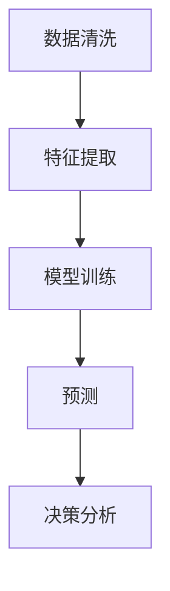

## 背景介绍

决策支持系统（Decision Support System, DSS）是指一种可以帮助决策者以有针对性的方式处理复杂决策问题的系统。自从第一台电子计算机诞生以来，DSS一直是人工智能（AI）领域的一个核心研究方向。近几年来，随着AI技术的飞速发展，DSS也进入了一个全新的革命时期。

## 核心概念与联系

DSS的核心概念是将数据处理、模型建模、决策分析等多个环节融为一体，实现从数据到洞见的转化。AI技术在DSS中的应用主要体现在以下几个方面：

1. 数据挖掘：通过机器学习和深度学习等技术，自动发现数据中的模式和规律，生成可用于决策的信息。
2. 预测分析：利用统计学和机器学习方法，对未来可能发生的事件进行预测，为决策者提供依据。
3. 优化决策：运用数学优化方法，求解决策问题中的目标函数和约束条件，生成最佳决策方案。

## 核心算法原理具体操作步骤

DSS的核心算法包括数据清洗、特征提取、模型训练和预测等环节。以下是一个简化的DSS开发流程图：



## 数学模型和公式详细讲解举例说明

在DSS中，常见的数学模型有线性回归、逻辑回归、支持向量机等。以下是一个简单的线性回归模型的数学解释：

假设我们有一组数据集 $(x_1, y_1), (x_2, y_2), \cdots, (x_n, y_n)$，其中 $x_i$ 是输入变量，$y_i$ 是输出变量。我们希望找到一个线性模型 $y = ax + b$，其中 $a$ 和 $b$ 是模型参数。为了找到最佳的参数，我们可以使用最小二乘法来最小化误差：

$$
\min_{a, b} \sum_{i=1}^n (y_i - (ax_i + b))^2
$$

通过解这个优化问题，我们可以得到线性模型的参数 $a$ 和 $b$。

## 项目实践：代码实例和详细解释说明

在本节中，我们将使用Python编程语言和Scikit-learn库来实现一个简单的DSS。我们将使用线性回归模型对房屋价格进行预测。

1. 导入所需的库

```python
import numpy as np
import pandas as pd
from sklearn.linear_model import LinearRegression
from sklearn.model_selection import train_test_split
from sklearn.metrics import mean_squared_error
```

2. 加载数据集

```python
data = pd.read_csv("housing.csv")
X = data.drop("price", axis=1)
y = data["price"]
```

3. 数据预处理

```python
X_train, X_test, y_train, y_test = train_test_split(X, y, test_size=0.2, random_state=42)
```

4. 训练模型

```python
model = LinearRegression()
model.fit(X_train, y_train)
```

5. 预测并评估模型

```python
y_pred = model.predict(X_test)
mse = mean_squared_error(y_test, y_pred)
print("MSE:", mse)
```

## 实际应用场景

DSS在各个领域都有广泛的应用，例如金融业、医疗保健、供应链管理等。以下是一个典型的DSS应用场景：

### 金融投资决策

在金融市场中，投资者需要在众多投资项目中做出决策。DSS可以帮助投资者通过分析历史数据、评估风险和收益来选择最佳投资方案。

## 工具和资源推荐

对于想要学习DSS的读者，以下是一些建议的工具和资源：

1. Python：Python是最受欢迎的编程语言之一，拥有丰富的数据处理和机器学习库，如NumPy、Pandas、Scikit-learn等。
2. 数据集：为学习DSS而提供的公开数据集，如UCI Machine Learning Repository和Kaggle数据集。
3. 在线课程：Coursera、Udacity等平台提供了许多关于DSS和AI技术的在线课程。
4. 文献：一些经典的DSS相关书籍包括《决策支持系统》（Decision Support Systems）和《人工智能：系统、设计与分析》（Artificial Intelligence: Systems, Design, and Analysis）。

## 总结：未来发展趋势与挑战

随着AI技术的不断发展，DSS将继续演进和创新。以下是未来DSS可能面临的发展趋势和挑战：

1. 数据智能化：未来DSS将更加依赖大数据和云计算技术，为决策者提供更丰富、更精确的分析结果。
2. 人工智能融合：DSS将与其他AI技术（如自然语言处理、机器学习等）深度融合，为决策提供更全面的支持。
3. 安全与隐私：随着数据量的爆炸式增长，DSS面临着数据安全和隐私保护的挑战。如何在满足决策需求的同时，确保数据安全和隐私保护，是DSS领域的重要研究方向。

## 附录：常见问题与解答

1. Q：为什么需要决策支持系统？
A：决策支持系统可以帮助决策者在复杂决策问题中快速找到解决方案，提高决策效率和质量。

2. Q：决策支持系统与数据挖掘有什么区别？
A：数据挖掘主要关注从大量数据中发现有价值的信息，而决策支持系统则关注将这些信息转化为有针对性的决策建议。

3. Q：如何选择合适的决策支持系统？
A：选择合适的DSS需要考虑多个因素，如业务需求、技术能力、成本等。读者可以参考DSS的功能、性能、易用性等方面来进行选择。

以上就是我们关于决策支持系统的AI革命的一些基本信息。希望这篇文章能够帮助读者更好地理解DSS的核心概念、原理和应用。同时，我们也希望读者能够在实际工作中充分利用DSS的优势，为决策提供更全面的支持。