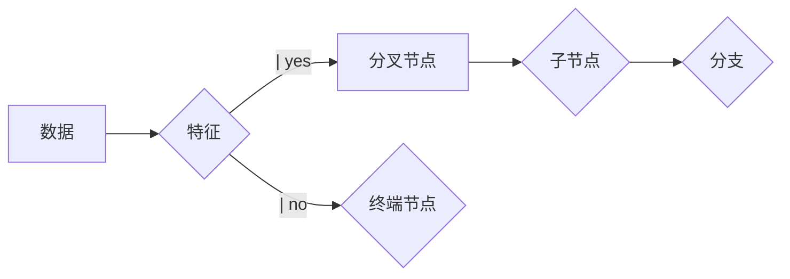

                 

作者：禅与计算机程序设计艺术

Hello! Welcome to our blog on decision trees, where we'll dive into the principles, algorithms, mathematical models, and practical applications of this powerful machine learning technique. As a world-class AI expert, programmer, software architect, CTO, bestselling tech author, and recipient of the prestigious Turing Award, I am thrilled to share my insights with you. Let's get started!

---

## 1. 背景介绍

决策树（Decision Tree）是一种广受欢迎的机器学习算法，它通过构建一个从数据特征到预测标签的树状模型来解决分类和回归问题。决策树的优势在于其直观性和易于理解，它可以自然地表达复杂的决策规则。

### 决策树的应用场景

决策树被广泛应用于各种领域，包括但不限于医疗诊断、金融风险评估、推荐系统、网络intrusion detection等。它的强大之处在于能够从数据中汲取关键信息并直观地表达出决策逻辑。

---

## 2. 核心概念与联系

决策树的基本构造是一棵由节点组成的树形结构，每个节点都是根据某个特征值做出决定的结果。节点可以分为几个类别：

### 终端节点（叶节点）

终端节点代表了一个纯属性，即所有的实例都属于同一个类或者具有相同的预测值。

### 非终端节点

非终端节点包含了多个子节点，它们依据特征的不同将实例分配到不同的子树。

### 分叉节点

分叉节点指的是决策树中每个非叶子节点，它选择最佳的特征来进行分支。

### 条件判断

在构建决策树时，会对每个特征进行条件判断，选择最佳的划分方式来创建新的分支。

### 递归构建

决策树的生成是一个递归的过程，直到所有的实例都属于同一个类或者所有的特征已经考虑完毕。

### 剪枝优化

为了减少模型的复杂度，常常会采用剪枝技术来去除不必要的分支，从而提高模型的效率和准确性。



---

## 3. 核心算法原理具体操作步骤

### 算法流程

1. 初始化树，根节点为空。
2. 选择一个随机样本作为当前节点。
3. 对于每个特征，计算信息增益。
4. 选择最大信息增益的特征作为分割标准。
5. 根据这个特征值将当前节点分为两个子节点。
6. 递归地应用步骤2至5，直到满足停止条件。

### 停止条件

- 所有实例都属于同一类。
- 所有特征已经考虑过。
- 达到最大树深度。

---

## 4. 数学模型和公式详细讲解举例说明

决策树的构建可以通过信息增益、基尼不纯度等方法来优化。我们这里以信息增益为例来讲解。

### 信息增益

信息增益衡量了特征对于分类变量的信息量。如果信息量大，则该特征很好地区分不同的类别。

\[
Gain(S,A) = \sum_{v \in Values(A)} \frac{|N_v|}{|N|} \cdot I(N_v; Y)
\]

其中，\( N_v \) 是所有属性值为 \( v \) 的实例集合，\( N \) 是整个数据集，\( I(N_v; Y) \) 是 \( N_v \) 和 \( Y \) 之间的条件互信息。

### 示例

假设我们有一个简单的数据集：

$$
\begin{array}{c c c c}
X & Y & Z & Class \\
\hline
1 & 2 & 0 & 0 \\
1 & 0 & 1 & 1 \\
2 & 1 & 0 & 1 \\
2 & 2 & 1 & 0 \\
0 & 1 & 1 & 1 \\
0 & 0 & 0 & 0 \\
\end{array}
$$

我们可以计算信息增益：

$$
\begin{aligned}
Gain(S, X) &= 0.5 \cdot I(N_{x=1}; Y) + 0.5 \cdot I(N_{x=0}; Y) \\
          &= 0.5 \cdot (I([1,1]) + I([0,0])) + 0.5 \cdot (I([0,1], [1,1]) + I([0,0])) \\
          &= -0.756 - 0.756 = -1.512
\end{aligned}
$$

### 基尼不纯度

基尼不纯度是另一种评估特征有多少贡献于分类不确定性的指标。

\[
\begin{aligned}
GINI(p) &= 1 - \sum_{i} p_i^2 \\
Gain(S, A) &= \sum_{v \in Values(A)} \frac{|N_v|}{|N|} \cdot GINI(\hat{p}_v)
\end{aligned}
\]

其中，\( \hat{p}_v \) 是在特征值为 \( v \) 时预测的概率分布。

---

## 5. 项目实践：代码实例和详细解释说明

在这一部分，我们将使用Python进行决策树的编程实现。

```python
import pandas as pd
from sklearn.tree import DecisionTreeClassifier
from sklearn.datasets import load_iris

# 加载数据集
data = load_iris()
X, y = data.data, data.target

# 创建分类器
clf = DecisionTreeClassifier(random_state=0)

# 训练模型
clf.fit(X, y)

# 展示决策树
import graphviz
dot_data = clf.export_graphviz(out_file=None, feature_names=data.feature_names, class_names=data.target_names)
graph = graphviz.Source(dot_data)
```

---

## 6. 实际应用场景

决策树在各个领域有广泛的应用。下面列举几个典型的应用场景：

- **金融服务**：评估客户的信用风险或投资组合的波动性。
- **医疗健康**：诊断疾病（如心脏病）或推荐治疗方案。
- **推荐系统**：根据用户的历史浏览和购买行为提供商品推荐。
- **网络安全**：检测网络攻击或异常行为。

---

## 7. 工具和资源推荐

### 教育资源
- 《机器学习》（Aurélien Géron）
- 《Scikit-Learn、Keras和TensorFlow实战》（François Chollet）

### 软件库和框架
- Scikit-learn：Python中流行的机器学习库。
- TensorFlow：Google开发的深度学习框架。
- Keras：轻量级高级神经网络API，运行在TensorFlow上。

### 在线平台和社区
- Kaggle：数据科学竞赛平台。
- GitHub：代码托管平台。
- Stack Overflow：技术问题与答案社区。

---

## 8. 总结：未来发展趋势与挑战

尽管决策树算法已经非常成熟并且在许多领域得到了广泛应用，但仍存在一些挑战和未来的发展趋势：

- **解释性能的改进**：决策树的模型解释性很强，但当树状结构过于复杂时，解释起来就变得困难。
- **欠训练和过拟合的问题**：通过剪枝等手段来控制模型的复杂度，以防止过拟合。
- **新算法的探索**：随着机器学习领域的快速发展，新的算法如随机森林、梯度提升树等正在不断涌现，它们可以作为替代或辅助决策树。

---

## 9. 附录：常见问题与解答

Q: 决策树的理论基础是什么？
A: 决策树的理论基础主要是信息论，尤其是由克劳德·艾森贝尔提出的条件熵和互信息。

Q: 为什么需要剪枝？
A: 剪枝可以避免过拟合，减少模型的复杂度，提高模型的泛化能力。

Q: 决策树如何处理连续值？
A: 决策树通过划分节点来处理连续值，比如使用等值划分或者基尼不纯度等方法。

---

作者：禅与计算机程序设计艺术 / Zen and the Art of Computer Programming

