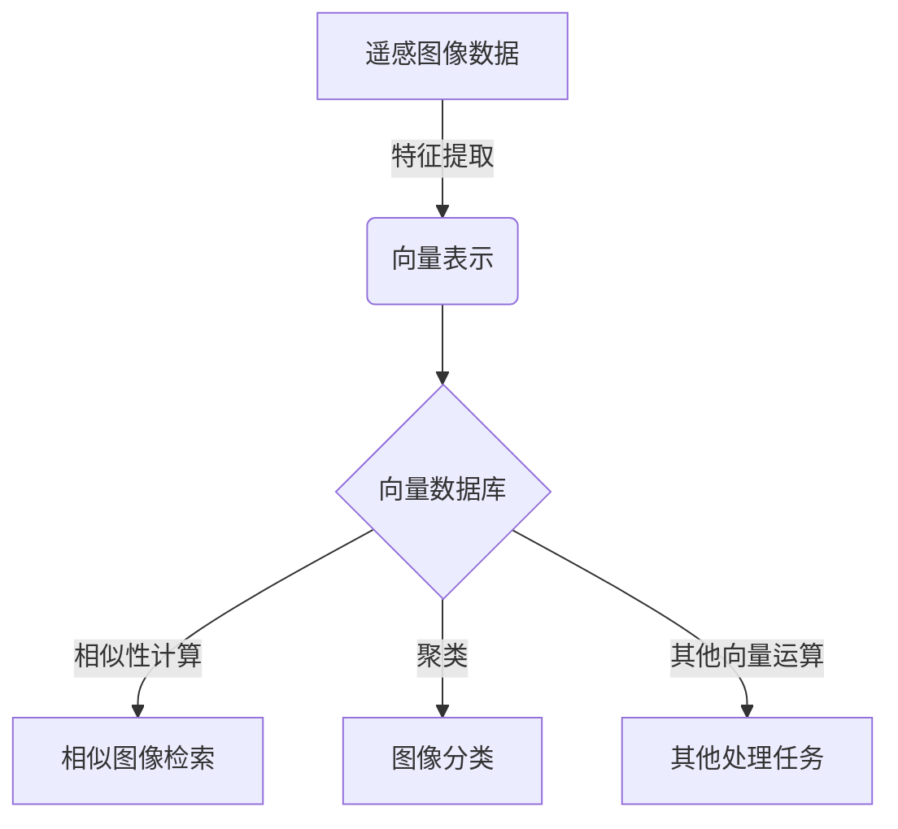

# 利用向量数据库进行高效的遥感图像处理

## 1.背景介绍

### 1.1 遥感图像处理的重要性

遥感图像处理是地理信息系统、环境监测、自然资源勘探等领域的关键技术。通过对从航空器或卫星获取的遥感图像进行处理和分析,我们可以获取地球表面的丰富信息,如地形、土地利用、植被覆盖等,为科学研究和实际应用提供重要数据支持。

### 1.2 传统遥感图像处理方法的挑战

传统的遥感图像处理方法主要依赖结构化数据库,将图像及其元数据存储为表格形式。这种方法在处理大规模高分辨率遥感数据时面临诸多挑战:

1. **数据量大**:高分辨率遥感图像数据量巨大,给存储和查询带来压力。
2. **特征提取困难**:从图像中提取有意义的特征是一个复杂的过程,需要专门的算法和模型。
3. **相似性计算低效**:基于像素值的相似性计算效率低下,难以满足实时检索需求。

### 1.3 向量数据库在遥感图像处理中的作用

向量数据库通过将高维数据(如图像)映射到向量空间,使用向量相似性来代替精确匹配,从而提供了高效的相似性搜索能力。将遥感图像数据存储在向量数据库中,可以克服传统方法的局限性,实现高效的图像检索、分类和聚类等处理任务。

## 2.核心概念与联系

### 2.1 向量空间模型

向量空间模型(Vector Space Model)是信息检索领域的一种重要模型,它将文本文档表示为一个向量,每个维度对应一个特征(如词频)。通过计算向量之间的相似度(如余弦相似度),可以有效地进行相似性匹配。

在遥感图像处理中,我们可以将图像视为一个高维向量,每个维度对应图像的一个特征(如颜色、纹理等)。通过特征提取算法,我们可以将图像映射到向量空间,从而利用向量相似性进行高效的图像处理。

### 2.2 深度学习在特征提取中的作用

传统的特征提取算法(如SIFT、HOG等)需要人工设计特征,且提取的特征往往局限于低层次的视觉特征。深度学习模型(如卷积神经网络)可以自动从数据中学习到高层次的语义特征,大大提高了特征提取的效果。

将深度学习模型与向量数据库相结合,可以充分利用深度学习模型强大的特征提取能力,将图像映射到一个语义向量空间,在该空间中进行高效的相似性计算和检索。



## 3.核心算法原理具体操作步骤

### 3.1 特征提取

将遥感图像数据输入到深度学习模型(如卷积神经网络)中,模型会自动学习图像的特征表示,并将图像映射到一个高维向量空间。这个过程称为特征提取(Feature Extraction)。

具体步骤如下:

1. 准备遥感图像数据集,包括图像和对应的标签(如地物类型)。
2. 构建深度学习模型,通常采用卷积神经网络结构。
3. 对模型进行训练,使其学习到图像的特征表示。
4. 使用训练好的模型对新的遥感图像进行特征提取,得到每个图像对应的向量表示。

### 3.2 向量数据库构建

将提取得到的图像向量存储到向量数据库中,以便进行高效的相似性计算和检索。

具体步骤如下:

1. 选择合适的向量数据库系统,如Faiss、Annoy等。
2. 将图像向量按照数据库要求的格式进行存储。
3. 对数据库进行索引构建,以加速后续的相似性计算。

### 3.3 相似性计算与检索

利用向量数据库的相似性搜索功能,可以快速找到与给定图像最相似的图像。

具体步骤如下:

1. 对查询图像进行特征提取,得到其向量表示。
2. 在向量数据库中搜索与该向量最相似的前K个向量及其对应的图像。
3. 根据相似度排序,返回最相似的图像结果。

### 3.4 图像分类与聚类

除了相似性搜索,向量数据库还可以用于图像分类和聚类等任务。

**图像分类**:

1. 准备已标注的训练数据集。
2. 对训练数据进行特征提取,得到图像向量和对应的类别标签。
3. 训练分类器模型,如支持向量机(SVM)或K-近邻(KNN)。
4. 对新图像进行特征提取,输入到训练好的分类器中,得到类别预测结果。

**图像聚类**:

1. 对所有图像进行特征提取,得到图像向量集合。
2. 在向量空间中运行聚类算法,如K-Means或DBSCAN。
3. 将聚类结果映射回原始图像,得到图像聚类结果。

## 4.数学模型和公式详细讲解举例说明

### 4.1 向量相似度计算

在向量空间模型中,向量相似度的计算是核心操作之一。常用的相似度度量包括欧氏距离、余弦相似度等。

#### 4.1.1 欧氏距离

欧氏距离(Euclidean Distance)是最直观的距离度量,它表示两个向量在空间中的直线距离。对于向量 $\vec{a}$ 和 $\vec{b}$,欧氏距离定义为:

$$d(\vec{a}, \vec{b}) = \sqrt{\sum_{i=1}^{n}(a_i - b_i)^2}$$

其中 $n$ 是向量的维数。

例如,对于两个三维向量 $\vec{a} = (1, 2, 3)$ 和 $\vec{b} = (4, 5, 6)$,它们的欧氏距离为:

$$d(\vec{a}, \vec{b}) = \sqrt{(1-4)^2 + (2-5)^2 + (3-6)^2} = \sqrt{9 + 9 + 9} = 3\sqrt{9} = 9$$

#### 4.1.2 余弦相似度

余弦相似度(Cosine Similarity)衡量两个向量的方向相似性,范围在 $[-1, 1]$ 之间。对于向量 $\vec{a}$ 和 $\vec{b}$,余弦相似度定义为:

$$\text{sim}(\vec{a}, \vec{b}) = \cos(\theta) = \frac{\vec{a} \cdot \vec{b}}{\|\vec{a}\| \|\vec{b}\|} = \frac{\sum_{i=1}^{n}a_i b_i}{\sqrt{\sum_{i=1}^{n}a_i^2} \sqrt{\sum_{i=1}^{n}b_i^2}}$$

其中 $\theta$ 是两个向量的夹角。

例如,对于两个三维向量 $\vec{a} = (1, 2, 3)$ 和 $\vec{b} = (4, 5, 6)$,它们的余弦相似度为:

$$\text{sim}(\vec{a}, \vec{b}) = \frac{1\times4 + 2\times5 + 3\times6}{\sqrt{1^2+2^2+3^2} \sqrt{4^2+5^2+6^2}} = \frac{38}{\sqrt{14} \sqrt{77}} \approx 0.9746$$

可以看出,虽然这两个向量在空间中的欧氏距离较大,但它们的方向非常相似,因此余弦相似度很高。

在遥感图像处理中,我们通常使用余弦相似度来衡量两幅图像的相似程度,因为它能很好地捕捉图像的语义相似性,而不受像素值绝对差异的影响。

### 4.2 K-Means聚类

K-Means是一种常用的无监督聚类算法,它将数据划分为K个簇,使得簇内样本相似度较高,簇间相似度较低。在向量空间中,K-Means算法的目标是最小化所有样本到其所属簇中心的距离平方和。

算法步骤如下:

1. 随机选择 K 个初始质心(cluster centroids)。
2. 对于每个样本向量 $\vec{x}$,计算它与每个质心的距离,将其归入最近的那一簇。
3. 重新计算每个簇的质心,作为该簇所有向量的均值向量。
4. 重复步骤2和3,直到质心不再发生变化或达到最大迭代次数。

质心的计算公式为:

$$\vec{c}_i = \frac{1}{|C_i|}\sum_{\vec{x} \in C_i} \vec{x}$$

其中 $C_i$ 表示第 i 个簇,包含了所有被分配到该簇的向量。

K-Means算法的优点是简单高效,但缺点是需要预先指定簇数K,且对初始质心的选择敏感。在遥感图像处理中,我们可以将K-Means聚类应用于图像分割、地物分类等任务。

## 5.项目实践:代码实例和详细解释说明

在这一部分,我们将通过一个实际的代码示例,演示如何利用向量数据库对遥感图像进行相似性搜索。我们将使用Python编程语言,并采用流行的向量数据库Faiss。

### 5.1 准备工作

首先,我们需要安装所需的Python库:

```bash
pip install faiss-gpu opencv-python
```

其中,`faiss-gpu`是Faiss的GPU加速版本,可以大幅提高相似性搜索的速度。`opencv-python`用于读取和处理图像文件。

### 5.2 特征提取

我们将使用预训练的卷积神经网络模型来提取遥感图像的特征向量。在这个示例中,我们采用了ResNet-50模型。

```python
import torch
import torchvision.models as models
import torchvision.transforms as transforms

# 加载预训练模型
model = models.resnet50(pretrained=True)
model.eval()

# 图像预处理
preprocess = transforms.Compose([
    transforms.Resize(256),
    transforms.CenterCrop(224),
    transforms.ToTensor(),
    transforms.Normalize(mean=[0.485, 0.456, 0.406], std=[0.229, 0.224, 0.225]),
])

# 特征提取函数
def extract_features(img_path):
    img = Image.open(img_path).convert('RGB')
    img_tensor = preprocess(img)
    img_tensor = img_tensor.unsqueeze(0)
    with torch.no_grad():
        features = model(img_tensor).flatten()
    return features.numpy()
```

这段代码定义了一个`extract_features`函数,它接受一个图像文件路径作为输入,返回该图像的特征向量(一个1024维的NumPy数组)。

### 5.3 构建向量数据库

接下来,我们将遥感图像的特征向量存储到Faiss向量数据库中。

```python
import faiss

# 创建向量数据库
dim = 1024  # 特征向量维度
index = faiss.IndexFlatL2(dim)  # 使用欧氏距离

# 添加图像向量
vectors = []
for img_path in image_paths:
    features = extract_features(img_path)
    vectors.append(features)
index.add(np.array(vectors))

# 构建索引
faiss.normalize_L2(index.ntotal)
index = faiss.IndexIDMap(index.ntotal)
```

这段代码首先创建了一个`IndexFlatL2`对象,用于基于欧氏距离进行相似性搜索。然后,它遍历所有图像文件,提取特征向量并添加到数据库中。最后,我们对数据库进行归一化处理,并构建索引以加速搜索。

### 5.4 相似性搜索

现在,我们可以对新的遥感图像进行相似性搜索了。

```python
# 查询图像
query_img_path = 'path/to/query/image.jpg'
query_features = extract_features(query_img_path)

# 相似性搜索
k = 5  # 返回最相似的前5个结果
distances, indices = index.search(np.array([query_features]), k)

# 显示结果
for i in range(k):
    similar_img_path = image_paths[indices[