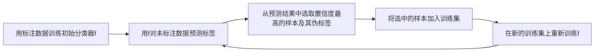
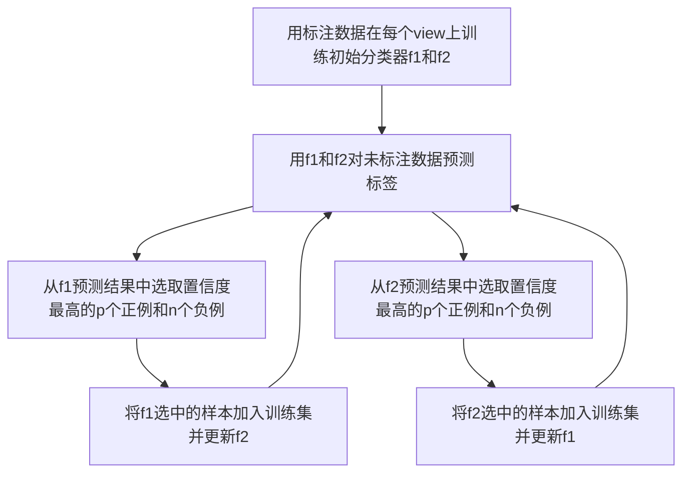

# 半监督学习(Semi-Supervised Learning) - 原理与代码实例讲解

## 1. 背景介绍

在机器学习领域,根据训练数据是否有标签,可以将学习任务分为监督学习(Supervised Learning)、无监督学习(Unsupervised Learning)和半监督学习(Semi-Supervised Learning,SSL)。半监督学习是介于监督学习和无监督学习之间的一种学习范式,它利用少量的标注数据和大量的未标注数据来训练模型。

半监督学习的研究动机主要源于两个方面:

1. 在很多现实应用中,标注数据的获取成本很高,而未标注数据相对容易获得。例如在图像识别任务中,人工标注图像需要大量的时间和精力,而未标注的图像数据在互联网上唾手可得。
2. 即使有足够的标注数据,仅利用标注数据训练的模型性能也往往不尽如人意,引入未标注数据有助于提升模型的泛化能力。

因此,半监督学习在机器学习理论研究和工业界实践中都受到了广泛关注。

### 1.1 半监督学习的定义

形式化地,半监督学习考虑如下问题设定:给定数据集$D=\{(x_1,y_1),\dots,(x_l,y_l),x_{l+1},\dots,x_{l+u}\}$,其中$\{(x_1,y_1),\dots,(x_l,y_l)\}$是标注数据,$\{x_{l+1},\dots,x_{l+u}\}$是未标注数据。目标是利用$D$来学习一个分类器$f:X\rightarrow Y$。这里$l$表示标注样本数量,$u$表示未标注样本数量,通常$u \gg l$。

### 1.2 半监督学习的分类
半监督学习大致可分为以下几类:

1. **生成式方法(Generative Methods)**:生成式方法显式或隐式地对数据的生成过程进行建模,然后基于生成模型进行推断。常见的生成式SSL方法包括高斯混合模型、朴素贝叶斯等。

2. **半监督SVM(Semi-Supervised SVM)**:半监督SVM是将SVM推广到半监督学习场景的一类方法。代表性工作包括TSVM、S3VM等。

3. **图半监督学习(Graph-based SSL)**:图半监督学习利用数据之间的相似性关系构建图,然后在图上传播标签信息。代表性方法包括Label Propagation、Label Spreading等。

4. **基于分歧的方法(Disagreement-based Methods)**:基于分歧的方法通过多个分类器在未标注数据上的分歧来挖掘未标注数据的信息。代表性方法包括Co-Training、Tri-Training等。

5. **基于一致性的方法(Consistency-based Methods)**:基于一致性的方法通过要求模型在未标注样本的扰动版本上输出一致的预测来利用未标注数据。代表性方法包括Π model、Temporal Ensembling、Mean Teacher等。

## 2. 核心概念与联系

### 2.1 监督学习、无监督学习与半监督学习

- 监督学习(Supervised Learning):训练数据由特征和标签两部分组成,目标是学习特征到标签的映射。
- 无监督学习(Unsupervised Learning):训练数据只有特征没有标签,目标是发现数据中的隐含结构和模式。
- 半监督学习(Semi-Supervised Learning):训练数据包含少量标注数据和大量未标注数据,通过同时利用两部分数据来学习模型。

可以看出,半监督学习是监督学习和无监督学习之间的一个折中。它试图利用未标注数据来弥补标注数据的不足,同时又不完全依赖无监督信息。

### 2.2 半监督学习的基本假设

半监督学习的有效性建立在一些基本假设之上,这些假设虽然并不总是成立,但在很多情况下是合理的。

1. **平滑性假设(Smoothness Assumption)**:相近的样本具有相似的输出。这意味着决策边界应该位于数据稀疏区域。

2. **聚类假设(Cluster Assumption)**:数据空间中的点构成簇,同一个簇内的样本属于同一类别。这暗示着类别边界应该位于簇与簇之间。

3. **流形假设(Manifold Assumption)**:高维数据大多分布在一个低维流形上,半监督学习应该尊重数据的内在结构。

这些假设为半监督学习算法的设计提供了指导,不同的算法对应着对不同假设的偏好。

### 2.3 半监督学习的优缺点

半监督学习的主要优势在于:

1. 减少对标注数据的依赖,节省标注成本。
2. 通过利用未标注数据,可以学到更好的数据表示,提升模型性能。

但同时,半监督学习也存在一些问题:

1. 如果未标注数据分布与标注数据差异较大,引入未标注数据反而会降低模型性能。
2. 半监督学习对超参数通常比较敏感,调参难度大。
3. 理论分析的难度大,泛化误差界难以刻画。

## 3. 核心算法原理与操作步骤

本节选取自训练(Self-Training)、Co-Training和Label Propagation三个有代表性的半监督学习算法进行讲解。

### 3.1 自训练(Self-Training)

自训练是一种简单直观的半监督学习方法,其基本思想是用单个分类器的预测结果来标注未标注样本,然后将其并入训练集迭代训练。

算法流程如下:



自训练的优点是实现简单,适用于任意的分类器。但其缺点也很明显:

1. 如果初始分类器性能较差,会将错误传播到后续迭代中。
2. 倾向于选择易分样本,对难分样本的学习能力有限。
3. 单一分类器的bias会在迭代中被放大。

### 3.2 Co-Training

Co-Training通过训练多个分类器并利用它们的"分歧"来挖掘未标注数据的信息,从而缓解自训练中单一分类器bias被放大的问题。

Co-Training的基本假设是数据有两个独立的view,每个view单独都足以学习出一个好的分类器。算法流程如下:



Co-Training的优点是:

1. 通过两个分类器互相"教学"，避免了单一分类器的bias被放大。
2. 两个分类器专注于学习不同view的信息,具有互补性。

但Co-Training也有其局限:

1. 独立的双view并不总是可用的。
2. 两个分类器的学习能力需要相当,否则性能好的分类器会被性能差的分类器拉低。

### 3.3 Label Propagation

Label Propagation基于图的思想,通过节点之间的相似性关系来传播标签信息。其背后的假设是相似的样本倾向于拥有相同的标签。

算法流程如下:

1. 用labeled和unlabeled数据构建一个图$G=(V,E)$,其中$V$为节点集,$E$为边集。边的权重$w_{ij}$表示节点$i$和$j$之间的相似度。

2. 初始化标签矩阵$Y\in\mathbb{R}^{n\times c}$,其中$Y_{ij}=1$如果样本$i$的标签为$j$,否则为0。对于未标注样本,$Y$的对应行为全0向量。

3. 迭代更新$Y$直到收敛:
$$
Y^{(t+1)} = \alpha SY^{(t)} + (1-\alpha)Y^{(0)}
$$
其中$S$是归一化的相似度矩阵,$\alpha\in(0,1)$是平滑因子。

4. 对于未标注样本$i$,其标签为$\arg\max_j Y_{ij}$。

Label Propagation的优点是:

1. 直观易懂,非参数化,不需要对数据分布做强假设。
2. 在高维、稀疏数据上表现出色。

缺点包括:

1. 计算复杂度高,不适合大规模数据。
2. 需要存储完整的相似度矩阵,内存开销大。
3. 对相似度矩阵的质量很敏感。

## 4. 数学模型与公式推导

本节以TSVM为例,介绍半监督SVM的数学模型与求解。

### 4.1 TSVM模型

TSVM(Transductive SVM)是一种经典的半监督SVM模型,其目标是在找到最大间隔超平面的同时,让未标注样本尽可能远离决策边界。形式化地,其优化目标可表示为:

$$
\begin{aligned}
\min_{w,b,\hat{y}} \quad & \frac{1}{2}\|w\|^2 + C_l\sum_{i=1}^l \xi_i + C_u \sum_{j=l+1}^{l+u} \xi_j^* \\
\text{s.t.} \quad & y_i(w^Tx_i+b) \geq 1-\xi_i, \quad i=1,\dots,l \\
& \hat{y}_j(w^Tx_j+b) \geq 1-\xi_j^*, \quad j=l+1,\dots,l+u \\
& \xi_i \geq 0, \quad i=1,\dots,l \\
& \xi_j^* \geq 0, \quad j=l+1,\dots,l+u
\end{aligned}
$$

其中$\hat{y}_j\in\{-1,1\}$是未标注样本$x_j$的伪标签,$\xi_i$和$\xi_j^*$分别是标注样本和未标注样本的松弛变量,$C_l$和$C_u$是相应的惩罚系数。

### 4.2 TSVM求解

TSVM的求解通常采用交替优化的策略:固定伪标签$\hat{y}$求解$w$和$b$,然后固定$w$和$b$更新$\hat{y}$,如此反复直至收敛。

固定$\hat{y}$时,上述问题退化为一个标准的SVM问题,可以用SMO等方法高效求解。

固定$w$和$b$时,可以简单地将未标注样本预测为距离超平面最远的类别:

$$
\hat{y}_j = \text{sgn}(w^Tx_j+b), \quad j=l+1,\dots,l+u
$$

但这种硬标签的更新方式可能会振荡不收敛,因此实践中常用软标签替代:

$$
\hat{y}_j = \frac{w^Tx_j+b}{|w^Tx_j+b|}, \quad j=l+1,\dots,l+u
$$

TSVM在标注样本较少时可以显著提升SVM的性能,但其求解是个非凸优化问题,容易陷入局部最优。此外,TSVM只能进行二分类,多分类需要组合多个二分类器。

## 5. 代码实例与讲解

下面以Label Propagation为例,给出一个半监督学习的完整Python实现。我们将在手写数字数据集MNIST上验证其有效性。

```python
import numpy as np
from sklearn import datasets
from sklearn.metrics import accuracy_score
from sklearn.semi_supervised import LabelPropagation

# 加载MNIST数据集
mnist = datasets.load_digits()
X, y = mnist.data, mnist.target

# 随机选取20个样本作为标注数据,其余作为未标注数据
n_labeled = 20
idx = np.random.choice(X.shape[0], n_labeled, replace=False)
X_labeled, y_labeled = X[idx], y[idx]
X_unlabeled, y_unlabeled = np.delete(X,idx,axis=0), np.delete(y,idx)

# 将未标注样本的标签设为-1
y_unlabeled_filled = np.full(y_unlabeled.shape, -1, np.int)

# 合并标注和未标注数据
X_train = np.vstack