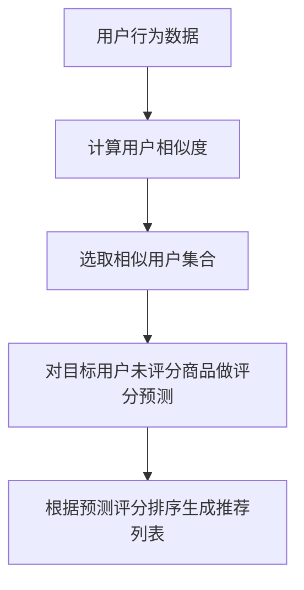

# 协同过滤 原理与代码实例讲解

## 1. 背景介绍

### 1.1 什么是协同过滤

协同过滤(Collaborative Filtering, CF)是一种基于用户行为的推荐算法,广泛应用于电子商务、在线视频、音乐流媒体等领域。它通过分析用户过去的行为记录(如浏览历史、购买记录、评分等),发现具有相似兴趣爱好的用户群体,从而为用户推荐可能感兴趣的商品或内容。

协同过滤的核心思想是"基于过去用户的行为,对未来用户的行为做出预测"。与基于内容的推荐系统不同,协同过滤更关注用户之间的相似性,而非商品本身的特征。它利用大量用户数据,通过发现用户之间的相似偏好,为目标用户推荐其他相似用户喜欢的商品。

### 1.2 协同过滤的优缺点

优点:

- 可以发现用户的隐性兴趣偏好,而非仅依赖显性评分
- 无需事先了解商品的内容特征,只需要用户行为数据
- 可以为新商品做出推荐,克服了内容相关性推荐的"冷启动"问题

缺点:  

- 对于没有任何行为记录的新用户,无法做出有效推荐(新手用户冷启动问题)
- 算法复杂度较高,需要大量用户数据支持
- 存在数据稀疏性问题,用户对商品的评分往往很少

## 2. 核心概念与联系

### 2.1 用户相似度计算

协同过滤的核心是计算用户之间的相似度。常用的相似度计算方法有:

1. **欧氏距离**

$$
sim(u,v)=\frac{1}{\sqrt{\sum_{i \in I}(r_{ui}-r_{vi})^2}}
$$

其中$I$是用户$u$和$v$都评分过的商品集合,$r_{ui}$和$r_{vi}$分别表示用户$u$和$v$对商品$i$的评分。

2. **皮尔逊相关系数**  

$$
sim(u,v)=\frac{\sum_{i \in I}(r_{ui}-\overline{r_u})(r_{vi}-\overline{r_v})}{\sqrt{\sum_{i \in I}(r_{ui}-\overline{r_u})^2}\sqrt{\sum_{i \in I}(r_{vi}-\overline{r_v})^2}}
$$

其中$\overline{r_u}$和$\overline{r_v}$分别表示用户$u$和$v$的平均评分。

3. **余弦相似度**

$$
sim(u,v)=\frac{\sum_{i \in I}r_{ui}r_{vi}}{\sqrt{\sum_{i \in I}r_{ui}^2}\sqrt{\sum_{i \in I}r_{vi}^2}}
$$

上述方法中,皮尔逊相关系数和余弦相似度考虑了用户评分的中心化,更适合于评分数据。

### 2.2 相似用户选取

计算出所有用户对之间的相似度后,需要选取与目标用户最相似的$k$个用户,作为推荐的参考用户。常用的选取策略有:

- 选取相似度最高的$k$个用户
- 设置相似度阈值,选取高于阈值的用户
- 结合上述两种方法

### 2.3 评分预测

对于目标用户未评分的商品,可以基于相似用户的评分,预测目标用户的评分:

$$
\hat{r}_{ui}=\overline{r_u}+\frac{\sum_{v \in S}sim(u,v)(r_{vi}-\overline{r_v})}{\sum_{v \in S}sim(u,v)}
$$

其中$S$是相似用户集合,$\hat{r}_{ui}$是对用户$u$对商品$i$的预测评分。

### 2.4 推荐生成

根据预测评分从高到低排序,推荐给用户前$N$个未评分的商品。

## 3. 核心算法原理具体操作步骤  

协同过滤算法的核心步骤如下:



1. **用户行为数据**:包括用户对商品的评分、购买记录、浏览历史等隐式反馈数据。

2. **计算用户相似度**:基于用户评分数据,计算所有用户对之间的相似度,常用的相似度计算方法有欧氏距离、皮尔逊相关系数和余弦相似度等。

3. **选取相似用户集合**:对于目标用户,选取与其最相似的$k$个用户作为相似用户集合,用于后续的评分预测。选取策略包括选取相似度最高的$k$个用户、设置相似度阈值等。  

4. **评分预测**:对于目标用户未评分的商品,基于相似用户集合的评分,使用加权平均的方式预测目标用户的评分。

5. **生成推荐列表**:根据预测评分从高到低排序,推荐给目标用户前$N$个未评分的商品。

## 4. 数学模型和公式详细讲解举例说明

### 4.1 用户相似度计算

协同过滤算法中,计算用户相似度是一个关键步骤。常用的用户相似度计算方法有欧氏距离、皮尔逊相关系数和余弦相似度等。

**1. 欧氏距离**

欧氏距离用于衡量两个用户评分向量之间的距离,距离越小表示两个用户越相似。公式如下:

$$
sim(u,v)=\frac{1}{\sqrt{\sum_{i \in I}(r_{ui}-r_{vi})^2}}
$$

其中$I$是用户$u$和$v$都评分过的商品集合,$r_{ui}$和$r_{vi}$分别表示用户$u$和$v$对商品$i$的评分。

**举例**:假设有两个用户$u$和$v$,他们对三个商品$A$、$B$、$C$的评分如下:

用户$u$: 商品$A$评分为4,商品$B$评分为2,商品$C$评分为5
用户$v$: 商品$A$评分为3,商品$B$评分为4,商品$C$评分为4

那么用户$u$和$v$的欧氏距离为:

$$
sim(u,v)=\frac{1}{\sqrt{(4-3)^2+(2-4)^2+(5-4)^2}}=\frac{1}{\sqrt{1+4+1}}=\frac{1}{\sqrt{6}}\approx0.41
$$

**2. 皮尔逊相关系数**

皮尔逊相关系数用于衡量两个用户评分向量之间的线性相关性,相关系数越高表示两个用户越相似。公式如下:

$$
sim(u,v)=\frac{\sum_{i \in I}(r_{ui}-\overline{r_u})(r_{vi}-\overline{r_v})}{\sqrt{\sum_{i \in I}(r_{ui}-\overline{r_u})^2}\sqrt{\sum_{i \in I}(r_{vi}-\overline{r_v})^2}}
$$

其中$\overline{r_u}$和$\overline{r_v}$分别表示用户$u$和$v$的平均评分。

**举例**:假设用户$u$和$v$的评分如上例,且用户$u$的平均评分为$\overline{r_u}=\frac{4+2+5}{3}=3.67$,用户$v$的平均评分为$\overline{r_v}=\frac{3+4+4}{3}=3.67$。

那么用户$u$和$v$的皮尔逊相关系数为:

$$
sim(u,v)=\frac{(4-3.67)(3-3.67)+(2-3.67)(4-3.67)+(5-3.67)(4-3.67)}{\sqrt{(4-3.67)^2+(2-3.67)^2+(5-3.67)^2}\sqrt{(3-3.67)^2+(4-3.67)^2+(4-3.67)^2}}\\
=\frac{0.33\times(-0.67)+(-1.67)\times0.33+1.33\times0.33}{\sqrt{2.09}\sqrt{2.09}}\approx0.5
$$

**3. 余弦相似度**

余弦相似度用于衡量两个用户评分向量之间的夹角余弦值,余弦值越大表示两个用户越相似。公式如下:

$$
sim(u,v)=\frac{\sum_{i \in I}r_{ui}r_{vi}}{\sqrt{\sum_{i \in I}r_{ui}^2}\sqrt{\sum_{i \in I}r_{vi}^2}}
$$

**举例**:假设用户$u$和$v$的评分如上例,那么用户$u$和$v$的余弦相似度为:

$$
sim(u,v)=\frac{4\times3+2\times4+5\times4}{\sqrt{4^2+2^2+5^2}\sqrt{3^2+4^2+4^2}}\\
=\frac{12+8+20}{\sqrt{41}\sqrt{41}}\approx0.86
$$

通过上述例子可以看出,不同的相似度计算方法对同一用户对有不同的相似度评估。在实际应用中,需要根据具体的数据分布和业务需求选择合适的相似度计算方法。

### 4.2 评分预测

对于目标用户未评分的商品,可以基于与其相似的用户集合,使用加权平均的方式预测目标用户的评分。公式如下:

$$
\hat{r}_{ui}=\overline{r_u}+\frac{\sum_{v \in S}sim(u,v)(r_{vi}-\overline{r_v})}{\sum_{v \in S}sim(u,v)}
$$

其中$S$是相似用户集合,$\hat{r}_{ui}$是对用户$u$对商品$i$的预测评分,$\overline{r_u}$是用户$u$的平均评分。

**举例**:假设目标用户$u$未对商品$X$评分,已知用户$u$的平均评分$\overline{r_u}=3.5$,与用户$u$最相似的两个用户$v_1$和$v_2$对商品$X$的评分分别为$r_{v_1X}=4$和$r_{v_2X}=5$,用户$v_1$和$v_2$的平均评分分别为$\overline{r_{v_1}}=3$和$\overline{r_{v_2}}=4$,用户$u$与$v_1$和$v_2$的相似度分别为$sim(u,v_1)=0.8$和$sim(u,v_2)=0.7$。

那么对用户$u$对商品$X$的预测评分为:

$$
\begin{aligned}
\hat{r}_{uX}&=\overline{r_u}+\frac{\sum_{v \in S}sim(u,v)(r_{vX}-\overline{r_v})}{\sum_{v \in S}sim(u,v)}\\
&=3.5+\frac{0.8(4-3)+0.7(5-4)}{0.8+0.7}\\
&=3.5+\frac{0.8+0.7}{1.5}\\
&=3.5+1\\
&=4.5
\end{aligned}
$$

因此,预测用户$u$对商品$X$的评分为4.5分。

通过上述公式和例子可以看出,评分预测的核心思想是利用相似用户的评分数据,结合相似度的权重,对目标用户未评分的商品做出加权平均的评分预测。

## 5. 项目实践:代码实例和详细解释说明

下面给出一个使用Python实现基于用户的协同过滤算法的示例代码,包括计算用户相似度、生成推荐列表等核心功能。

### 5.1 计算用户相似度

```python
import math

# 用户评分数据,格式为{用户:{商品:评分}}
user_ratings = {
    'A': {'a': 4, 'b': 3, 'c': 4, 'd': 3, 'e': 5},
    'B': {'a': 5, 'c': 3, 'd': 4},
    'C': {'b': 4, 'c': 4, 'd': 5, 'e': 3},
    'D': {'a': 4, 'b': 3, 'c': 3, 'd': 4, 'e': 5}
}

# 计算两个用户之间的欧氏距离
def euclidean_distance(user1, user2):
    distance = 0
    for item in user_ratings[user1]:
        if item in user_ratings[user2]:
            distance += pow(user_ratings[user1][item] - user_ratings[user2][item], 2)
    return 1 / (1 + math.sqrt(distance))

# 计算两个用户之间的皮