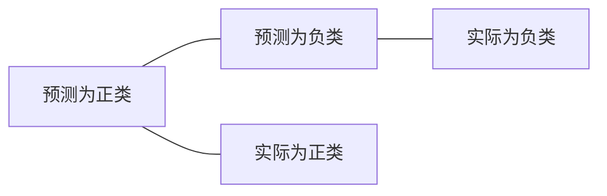

# 召回率Recall原理与代码实例讲解

## 1. 背景介绍
### 1.1 评估模型性能的重要指标
在机器学习和数据挖掘领域,评估一个模型的性能至关重要。而召回率(Recall)就是其中一个被广泛使用的评估指标。特别是在如下一些场景中,召回率尤为重要:
- 信息检索系统:搜索引擎、推荐系统等
- 医疗诊断:预测患病的可能性,漏诊的代价很高
- 欺诈检测:找出所有可疑的欺诈行为,即使误判了一些正常行为也可以接受
- 工业产品的质量检测:要尽可能检测出所有有缺陷的产品

### 1.2 理解真阳性、假阳性、真阴性、假阴性
在介绍召回率之前,我们需要先了解一些基本概念:
- 真阳性(True Positive,TP):被模型预测为正类,实际也是正类的样本
- 假阳性(False Positive,FP):被模型预测为正类,但实际是负类的样本
- 真阴性(True Negative,TN):被模型预测为负类,实际也是负类的样本
- 假阴性(False Negative,FN):被模型预测为负类,但实际是正类的样本

## 2. 核心概念与联系
### 2.1 召回率的定义
召回率(Recall)表示所有实际为正类的样本中,被模型预测为正类的比例。公式定义如下:
$$Recall = \frac{TP}{TP+FN}$$

其中:
- TP表示真阳性的数量
- FN表示假阴性的数量

### 2.2 召回率与准确率、精确率的区别
除了召回率,我们还经常用到准确率(Accuracy)和精确率(Precision)。三者的区别如下:
- 准确率:表示所有预测正确的样本(包括预测为正类和负类)占总样本的比例。
- 精确率:表示所有被预测为正类的样本中,实际为正类的比例。
- 召回率:表示所有实际为正类的样本中,被预测为正类的比例。

三者的关系可以用如下的韦恩图表示:



其中:
- 准确率关注的是A和D的并集占总样本的比例
- 精确率关注的是A和C的交集占A的比例
- 召回率关注的是A和C的交集占C的比例

### 2.3 召回率与精确率的权衡
在实际应用中,我们往往需要在召回率和精确率之间进行权衡。比如在推荐系统中:
- 追求高召回率:给用户推荐更多可能感兴趣的商品,哪怕有些推荐不那么精准
- 追求高精确率:只给用户推荐最有可能感兴趣的少数商品,确保推荐的精准度

而F1分数就是一种常用的综合考虑召回率和精确率的指标:
$$F1 = \frac{2*Precision*Recall}{Precision+Recall}$$

## 3. 核心算法原理与具体操作步骤
### 3.1 计算混淆矩阵
要计算召回率,首先需要得到混淆矩阵(Confusion Matrix),它是一个2x2的矩阵:
- 第一行表示实际为负类的样本
- 第二行表示实际为正类的样本
- 第一列表示预测为负类的样本
- 第二列表示预测为正类的样本

混淆矩阵中的四个元素分别对应TN、FP、FN和TP的数量。

### 3.2 根据混淆矩阵计算召回率
有了混淆矩阵后,就可以很容易地计算出召回率:
- 召回率 = 第二行第二列的值 / 第二行的和

### 3.3 阈值的选择
对于分类模型,我们通常会得到一个0到1之间的概率值,需要设定一个阈值来判断最终的类别。
- 阈值越高,预测为正类的样本越少,召回率越低
- 阈值越低,预测为正类的样本越多,召回率越高

所以我们需要根据具体问题,选择合适的阈值。一种常见的做法是绘制召回率-阈值曲线,观察召回率随阈值的变化趋势,然后选择一个合适的平衡点。

## 4. 数学模型和公式详细讲解举例说明
### 4.1 公式讲解
召回率的公式非常简单直观:
$$Recall = \frac{TP}{TP+FN}$$

分母$TP+FN$表示所有实际为正类的样本数量,分子$TP$表示其中被预测为正类的数量,两者相除就得到了召回率。

### 4.2 举例说明
假设我们训练了一个二分类模型,用于预测某个人是否患有某种疾病。现在我们用1000个样本来测试模型的性能,得到混淆矩阵如下:

|      | 预测为阴性 | 预测为阳性 |
|------|----------|----------|
| 实际为阴性 |    700   |    50    |
| 实际为阳性 |    20    |    230   |

可以看出:
- 总共有250个实际为阳性的样本(第二行的和)
- 其中有230个被预测为阳性,20个被预测为阴性

所以召回率为:
$$Recall = \frac{230}{230+20} = 0.92$$

这表明该模型能够找出92%的实际患病的人。

## 5. 项目实践:代码实例和详细解释说明
下面我们用Python的scikit-learn库来计算召回率。

### 5.1 生成示例数据

```python
from sklearn.datasets import make_classification
X, y = make_classification(n_samples=1000, n_classes=2, weights=[0.9, 0.1], random_state=42)
```

这里我们生成了一个包含1000个样本的二分类数据集,其中负类(标签为0)占90%,正类(标签为1)占10%。

### 5.2 拆分训练集和测试集

```python
from sklearn.model_selection import train_test_split
X_train, X_test, y_train, y_test = train_test_split(X, y, test_size=0.2, random_state=42)
```

我们将数据集拆分为训练集(80%)和测试集(20%)。

### 5.3 训练分类模型

```python
from sklearn.svm import SVC
model = SVC(kernel='linear', probability=True, random_state=42)
model.fit(X_train, y_train)
```

这里我们选择支持向量机(SVM)作为分类模型,训练时指定了概率输出,便于后续绘制召回率-阈值曲线。

### 5.4 预测概率值

```python
y_prob = model.predict_proba(X_test)[:, 1]
```

我们用训练好的模型对测试集进行预测,得到预测为正类的概率值。

### 5.5 计算召回率

```python
from sklearn.metrics import recall_score
y_pred = y_prob > 0.5
print(f'Recall: {recall_score(y_test, y_pred):.3f}')
```

这里我们先将概率值转为类别标签(阈值取0.5),然后用scikit-learn提供的recall_score函数计算召回率。

### 5.6 绘制召回率-阈值曲线

```python
from sklearn.metrics import precision_recall_curve
import matplotlib.pyplot as plt

precisions, recalls, thresholds = precision_recall_curve(y_test, y_prob)

plt.figure(figsize=(10, 6))
plt.plot(thresholds, recalls[:-1], label='Recall')
plt.xlabel('Threshold')
plt.ylabel('Recall')
plt.legend()
plt.show()
```

我们用precision_recall_curve函数计算不同阈值下的召回率,然后绘制召回率-阈值曲线。通过观察曲线,我们可以选择一个合适的阈值。

## 6. 实际应用场景
召回率在很多实际场景中都有广泛应用,下面列举几个典型的例子:

### 6.1 搜索引擎
搜索引擎的一个重要目标就是尽可能返回所有与用户查询相关的结果。这里"所有相关结果"对应着召回率的分母,而"返回的相关结果"对应着召回率的分子。所以对搜索引擎而言,召回率越高,用户体验越好。

### 6.2 推荐系统
推荐系统希望把用户可能感兴趣的物品(如商品、电影、文章等)尽可能多地推荐给用户。这里"用户感兴趣的所有物品"对应着召回率的分母,而"被推荐的感兴趣物品"对应着召回率的分子。召回率高的推荐系统,可以为用户带来更多的惊喜和发现。

### 6.3 医疗诊断
在医疗诊断中,我们希望尽可能减少漏诊,即要找出所有真正患病的人。这里"所有患病的人"对应着召回率的分母,而"被诊断为患病的人"对应着召回率的分子。召回率越高,漏诊的患者就越少。

### 6.4 垃圾邮件检测
对于垃圾邮件检测系统,我们希望尽可能多地将垃圾邮件识别出来。这里"所有的垃圾邮件"对应着召回率的分母,而"被识别为垃圾邮件的邮件"对应着召回率的分子。召回率越高,漏掉的垃圾邮件就越少。

## 7. 工具和资源推荐
- scikit-learn:Python机器学习库,提供了多种模型评估指标的计算函数,包括召回率。
- TensorFlow和PyTorch:流行的深度学习框架,也提供了一些模型评估指标的计算方法。
- Confusion Matrix:一个在线绘制混淆矩阵的工具,可以直观地显示模型的预测结果。
- Model Evaluation:scikit-learn官方文档中关于模型评估的章节,详细介绍了各种评估指标。
- An introduction to Precision, Recall and F1-Score:一篇介绍准确率、召回率和F1分数的博客文章。

## 8. 总结:未来发展趋势与挑战
### 8.1 个性化和动态调整
在推荐系统、搜索引擎等应用中,我们可能需要根据不同用户的偏好,动态调整召回率和准确率之间的平衡。比如对于对某个类别特别感兴趣的用户,我们可以适当提高该类别的召回率。这需要建立用户画像,实时跟踪用户行为,是一个很有挑战性的问题。

### 8.2 多目标优化
在某些场合,我们可能需要同时优化多个指标,比如召回率、准确率、多样性等。这就涉及到多目标优化问题,需要权衡不同指标之间的重要性,寻找最优的平衡点。

### 8.3 长尾问题
在推荐系统、搜索引擎等场景中,往往存在长尾问题,即少部分热门内容占据了大部分流量,而大量非热门内容流量很小。如何提高长尾内容的召回率,是一个值得研究的问题。

### 8.4 公平性问题
在一些敏感领域,如金融信贷、招聘等,我们不仅要关注模型的性能指标,还要考虑公平性问题。比如模型是否对不同人群有偏见,是否存在歧视。这需要从数据收集、特征工程、模型设计等各个环节来综合考虑。

## 9. 附录:常见问题与解答
### 9.1 召回率和查准率是否是一对矛盾?
召回率和查准率确实在某种程度上是矛盾的。一般来说,提高召回率会降低查准率,提高查准率会降低召回率。但是具体如何权衡,需要根据实际问题来决定。比如在医疗诊断中,我们可能更关注召回率,尽量减少漏诊;而在学术论文查重中,我们可能更关注查准率,尽量避免误判。

### 9.2 什么是PR曲线?
PR曲线(Precision-Recall Curve)是一种常用的综合评估分类模型性能的工具。它描述了在不同阈值下,查准率和召回率的变化情况。PR曲线下的面积(AUPRC)可以作为一个综合指标,面积越大表示模型性能越好。绘制PR曲线的代码示例如下:

```python
from sklearn.metrics import precision