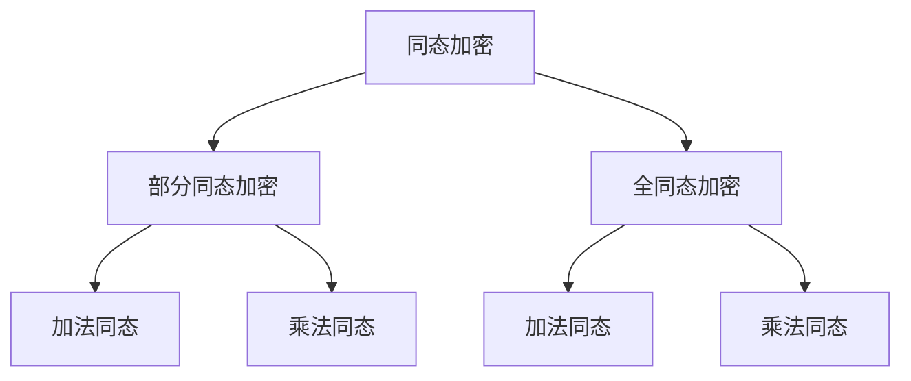
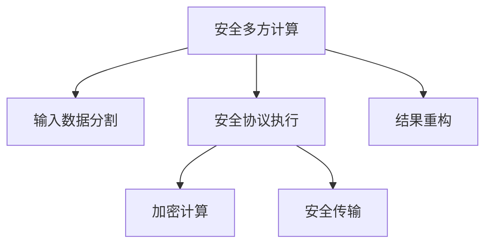

# 同态加密与安全多方计算原理与代码实战案例讲解

## 1. 背景介绍

### 1.1 隐私保护与数据安全的重要性

在当今的数字时代,数据已经成为了一种宝贵的资源。无论是个人还是企业,都在不断产生和收集大量的数据。然而,随着数据量的不断增长,如何保护这些数据的隐私和安全性也变得越来越重要。传统的数据加密方式虽然可以在一定程度上保护数据的安全性,但是在需要对加密数据进行计算和处理时,就必须先将其解密,这无疑增加了数据泄露的风险。

### 1.2 同态加密的应运而生

为了解决这一问题,同态加密(Homomorphic Encryption)应运而生。同态加密允许在不解密的情况下对加密数据进行计算和处理,从而最大限度地保护了数据的隐私和安全性。同态加密不仅可以应用于云计算、金融、医疗等领域,还可以用于安全多方计算(Secure Multi-Party Computation, SMPC),进一步增强数据隐私保护。

### 1.3 安全多方计算的概念

安全多方计算是一种加密技术,它允许多个参与方在不泄露各自的私有输入数据的情况下,共同计算出一个函数的结果。这种技术可以应用于许多场景,例如投票、拍卖、数据挖掘等,确保了参与方的隐私和数据安全。

## 2. 核心概念与联系

### 2.1 同态加密的定义

同态加密是一种特殊的加密技术,它允许在不解密的情况下对加密数据进行某些特定的运算,并且运算结果与对明文进行相同运算后再加密所得结果相同。根据支持的运算类型,同态加密可以分为部分同态加密(Partially Homomorphic Encryption, PHE)和全同态加密(Fully Homomorphic Encryption, FHE)。

部分同态加密只支持加法或乘法同态,而全同态加密则同时支持加法和乘法同态,可以执行任意复杂的计算操作。

### 2.2 安全多方计算的原理

安全多方计算的基本思想是将一个函数拆分为多个子函数,每个参与方只知道其中一个子函数,并且通过一系列安全的协议交互,最终计算出整个函数的结果,而不泄露任何参与方的私有输入数据。

安全多方计算通常包括以下几个步骤:

1. 输入数据分割
2. 安全协议执行
3. 结果重构

### 2.3 同态加密与安全多方计算的关系

同态加密和安全多方计算是两种不同但相关的技术。同态加密可以作为安全多方计算协议的一个组成部分,用于对参与方的私有输入数据进行加密,并在加密状态下执行计算操作。

通过将同态加密与安全多方计算相结合,可以实现更高级别的隐私保护和数据安全性。参与方不仅不需要泄露自己的私有输入数据,还可以在不解密的情况下对加密数据进行计算和处理,从而最大程度地减少了数据泄露的风险。

## 3. 核心算法原理具体操作步骤

### 3.1 部分同态加密算法

部分同态加密算法通常包括以下几个步骤:

1. **密钥生成(KeyGen)**: 生成公钥和私钥对。
2. **加密(Encrypt)**: 使用公钥对明文进行加密,得到密文。
3. **同态运算(Evaluate)**: 在密文上执行同态运算,得到新的密文。
4. **解密(Decrypt)**: 使用私钥对密文进行解密,得到明文结果。

以Paillier加密算法为例,其加法同态性质可以表示为:

$$
E(m_1) \oplus E(m_2) = E(m_1 + m_2)
$$

其中 $E$ 表示加密函数, $\oplus$ 表示模运算, $m_1$ 和 $m_2$ 表示明文。

### 3.2 全同态加密算法

全同态加密算法相对于部分同态加密算法更加复杂,通常包括以下几个步骤:

1. **密钥生成(KeyGen)**: 生成公钥和私钥对,以及一个额外的重新加密密钥(Relinearization Key)。
2. **加密(Encrypt)**: 使用公钥对明文进行加密,得到密文。
3. **同态运算(Evaluate)**: 在密文上执行同态运算,得到新的密文。在运算过程中,需要使用重新加密密钥对中间结果进行重新加密,以控制噪声的增长。
4. **解密(Decrypt)**: 使用私钥对密文进行解密,得到明文结果。

以BGV加密算法为例,其加法和乘法同态性质可以表示为:

$$
E(m_1) \oplus E(m_2) = E(m_1 + m_2) \\
E(m_1) \otimes E(m_2) = E(m_1 \times m_2)
$$

其中 $E$ 表示加密函数, $\oplus$ 表示模加法运算, $\otimes$ 表示模乘法运算, $m_1$ 和 $m_2$ 表示明文。

### 3.3 安全多方计算协议

安全多方计算协议通常包括以下几个步骤:

1. **输入分割**: 每个参与方将自己的私有输入数据分割成多个份额,并将其中一份发送给每个其他参与方。
2. **安全计算**: 所有参与方使用加密技术(如同态加密或秘密共享)在加密状态下执行计算操作,并交换中间结果。
3. **结果重构**: 当所有计算完成后,参与方使用重构协议从中间结果中恢复出最终的计算结果。

以基于秘密共享的安全多方计算协议为例,其基本原理可以概括为:

1. 每个参与方将自己的私有输入数据 $x_i$ 分割成 $n$ 份随机份额 $\{x_i^1, x_i^2, \dots, x_i^n\}$,其中 $\sum_{j=1}^n x_i^j = x_i$。
2. 每个参与方将自己的一份额发送给其他参与方,并收集其他参与方发送的份额。
3. 所有参与方使用这些份额在加密状态下执行计算操作,并交换中间结果。
4. 当所有计算完成后,参与方使用重构协议从中间结果中恢复出最终的计算结果。

## 4. 数学模型和公式详细讲解举例说明

### 4.1 Paillier加密算法

Paillier加密算法是一种具有加法同态性质的公钥加密算法,其数学原理基于大素数的模运算。

**密钥生成**:

1. 选择两个大质数 $p$ 和 $q$,计算 $n = pq$。
2. 计算 $\lambda = \text{lcm}(p-1, q-1)$,其中 $\text{lcm}$ 表示最小公倍数。
3. 选择一个随机数 $g$,使得 $g^{\lambda} \equiv 1 \pmod{n^2}$。
4. 计算 $\mu = (L(g^{\lambda} \bmod n^2))^{-1} \bmod n$,其中 $L(x) = \frac{x-1}{n}$。
5. 公钥为 $(n, g)$,私钥为 $(\lambda, \mu)$。

**加密**:

对于明文 $m \in \mathbb{Z}_n$,选择一个随机数 $r \in \mathbb{Z}_n^*$,计算密文 $c$ 如下:

$$
c = g^m \cdot r^n \bmod n^2
$$

**解密**:

对于密文 $c$,计算明文 $m$ 如下:

$$
m = L(c^\lambda \bmod n^2) \cdot \mu \bmod n
$$

**加法同态性质**:

设 $c_1 = g^{m_1} \cdot r_1^n \bmod n^2$ 和 $c_2 = g^{m_2} \cdot r_2^n \bmod n^2$ 分别为明文 $m_1$ 和 $m_2$ 的密文,则有:

$$
c_1 \cdot c_2 \equiv g^{m_1 + m_2} \cdot (r_1 \cdot r_2)^n \pmod{n^2}
$$

因此,密文 $c_1$ 和 $c_2$ 的乘积等于明文 $m_1$ 和 $m_2$ 之和的密文,这就是Paillier加密算法的加法同态性质。

### 4.2 BGV加密算法

BGV加密算法是一种全同态加密算法,它基于一种叫做"环"(Ring)的代数结构,可以支持任意复杂的同态运算。

**密钥生成**:

1. 选择一个环 $R = \mathbb{Z}[X] / (X^N + 1)$,其中 $N$ 是一个能被 $2$ 整除的整数。
2. 选择一个小的模数 $q$,并定义环 $R_q = R / (qR)$。
3. 选择一个随机的环元素 $s \in R_q$,作为私钥。
4. 计算 $p = s \cdot r + e$,其中 $r$ 是一个随机的环元素,而 $e$ 是一个小的噪声项。
5. 公钥为 $(p, q)$,私钥为 $s$。

**加密**:

对于明文 $m \in R_q$,选择一个随机的环元素 $u \in R_q$,计算密文 $c$ 如下:

$$
c = p \cdot u + m + e' \bmod q
$$

其中 $e'$ 是一个小的噪声项。

**解密**:

对于密文 $c$,计算明文 $m$ 如下:

$$
m = c \cdot s^{-1} \bmod q
$$

**同态运算**:

设 $c_1$ 和 $c_2$ 分别为明文 $m_1$ 和 $m_2$ 的密文,则有:

$$
c_1 + c_2 = (p \cdot u_1 + m_1 + e_1') + (p \cdot u_2 + m_2 + e_2') \equiv m_1 + m_2 \pmod{q}
$$

$$
c_1 \cdot c_2 = (p \cdot u_1 + m_1 + e_1') \cdot (p \cdot u_2 + m_2 + e_2') \equiv m_1 \cdot m_2 \pmod{q}
$$

因此,BGV加密算法同时支持加法和乘法同态性质,可以执行任意复杂的同态运算。

### 4.3 秘密共享

秘密共享是安全多方计算协议中常用的一种技术,它将一个秘密数据分割成多个份额,每个参与方只知道其中一个份额,但只有当所有份额汇总在一起时,才能重构出原始的秘密数据。

**Shamir秘密共享**:

Shamir秘密共享是一种基于多项式插值的秘密共享方案,其基本原理如下:

1. 选择一个素数 $p$,以及一个随机的 $k-1$ 次多项式 $f(x) = a_0 + a_1x + \dots + a_{k-1}x^{k-1} \bmod p$,其中 $a_0$ 是要共享的秘密数据。
2. 计算 $n$ 个点 $(x_i, y_i)$,其中 $x_i$ 是不同的非零值,而 $y_i = f(x_i)$。
3. 将每个点 $(x_i, y_i)$ 分发给对应的参与方。
4. 当需要重构秘密数据时,至少需要 $k$ 个参与方提供自己的份额,使用拉格朗日插值法计算出 $f(0) = a_0$,即原始的秘密数据。

Shamir秘密共享方案具有完美的信息理论安全性,即使有 $k-1$ 个参与方联合起来,也无法从他们的份额中推断出任何关于秘密数