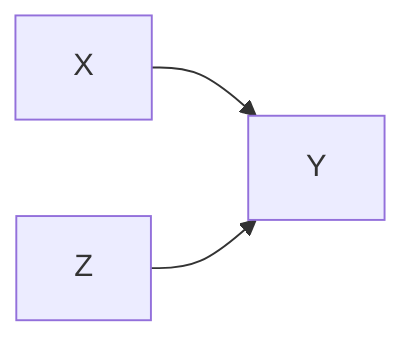
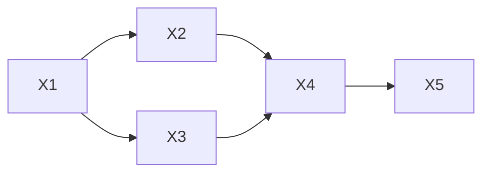

# 因果推理与因果学习原理与代码实战案例讲解

## 1.背景介绍
### 1.1 因果推理与因果学习的重要性
在人工智能和机器学习领域,因果推理与因果学习一直是一个重要而富有挑战性的课题。传统的机器学习主要关注相关性,通过大量数据训练模型来捕捉变量之间的统计关系。然而,仅仅依靠相关性并不足以真正理解事物之间的因果机制。因果推理旨在揭示变量之间的因果关系,探究在某些变量发生变化时,其他变量会如何受到影响。这对于解释现象、预测未来、制定决策都有着至关重要的意义。

### 1.2 因果推理与因果学习的应用场景
因果推理与因果学习在许多领域都有广泛的应用前景,例如:
- 医疗领域:通过分析病人的症状、体征、检查结果等信息,推断疾病的原因,预测治疗效果。  
- 经济金融:研究各种经济指标之间的因果关系,预测政策调整对经济的影响。
- 市场营销:分析用户特征与购买行为的因果关系,制定精准营销策略。
- 自然语言处理:理解词语之间的因果关联,改进文本理解和问答系统的表现。
- 智能决策:通过建立因果模型,模拟不同决策方案,选择最优决策。

### 1.3 因果推理与因果学习的研究现状
近年来,因果推理与因果学习受到学术界和工业界的广泛关注。judea pearl提出的因果计算理论为因果推理奠定了坚实的数学基础。各种因果发现算法如pc算法、fci算法不断涌现,用于从数据中学习因果图。此外,还出现了一些将深度学习与因果推理相结合的尝试,如causal vae等。但总的来说,因果推理与因果学习仍处于起步阶段,还有许多理论和实践问题有待进一步探索。

## 2.核心概念与联系
### 2.1 相关性与因果性
- 相关性:指变量之间的统计关联程度,常用pearson相关系数等来度量。相关性并不意味着因果性。
- 因果性:指一个变量的变化是导致另一个变量变化的原因。因果性蕴含相关性,但相关性不一定蕴含因果性。

### 2.2 三级因果思维
judea pearl提出了三级因果思维模型:
- 第一级(关联):仅考虑变量间的相关性,回答"what is?"的问题。
- 第二级(干预):研究在人为干预某些变量时,其他变量会如何变化,回答"what if?"的问题。 
- 第三级(反事实):探讨在与现实相反的假设情景下会发生什么,回答"why?"的问题。

### 2.3 因果图与do算子
- 因果图:用有向无环图表示变量之间的因果关系,箭头方向表示因果作用方向。
- do算子:表示对变量进行干预,切断该变量与其原因变量之间的联系。

### 2.4 结构因果模型 
结构因果模型(structural causal model,scm)由两部分组成:
- 因果图:表示变量之间的因果依赖关系。
- 结构方程:定量刻画每个变量与其直接原因变量之间的函数关系。

scm是因果推理的重要工具,可用于推断干预效应、反事实等。

## 3.核心算法原理具体操作步骤
### 3.1 pc算法
pc算法是一种基于条件独立性检验的因果发现算法,用于从观测数据中学习因果图。其基本步骤如下:
1. 初始化一个完全无向图。
2. 进行条件独立性检验,去除不独立的边。
3. 根据v型结构确定边的方向。
4. 进行可辨识性检查,输出因果图。

### 3.2 do算子计算
do算子用于计算干预效应,即在因果图中某些变量被干预到特定取值时,目标变量的概率分布。计算步骤为:
1. 在因果图中去除指向被干预变量的边。
2. 将被干预变量的取值固定为设定值。
3. 根据因果图的拓扑序,计算目标变量的条件概率分布。

### 3.3 反事实推断
反事实推断是评估"如果某些变量被设置为与现实不同的值,会发生什么"。其计算步骤为:
1. 根据观测值推断出外生变量的取值。
2. 将外生变量的取值带入反事实场景中。
3. 根据因果图和结构方程计算目标变量在反事实场景中的取值。

## 4.数学模型和公式详细讲解举例说明
### 4.1 因果贝叶斯网络
因果贝叶斯网络是结构因果模型的一种表示,由因果图和条件概率表组成。假设有因果图:

其中X、Y、Z都是二值变量,条件概率表为:

| X | Z | P(Y=1 | X, Z) |
|---|---|---------------|
| 0 | 0 | 0.2           |
| 0 | 1 | 0.7           |
| 1 | 0 | 0.4           |
| 1 | 1 | 0.9           |

则联合分布为:
$$
P(X, Y, Z) = P(X)P(Z)P(Y|X,Z)
$$

### 4.2 do算子计算公式
对于因果图:

假设我们将X干预到1,则干预后的联合分布为:
$$
P(Z, Y | do(X=1)) = P(Z)P(Y|X=1,Z) 
$$
可以看出,原先X的概率分布P(X)被删除,变为设定值1。

### 4.3 反事实推断公式
以著名的"禁烟运动"为例,假设吸烟X、肺癌Y之间存在因果关系:

现在我们观测到一个吸烟患者(X=1)最终得了肺癌(Y=1),反事实推断就是回答"如果他没有吸烟,是否会得肺癌"。设潜在结果变量为$Y_{X=0}$,则:
$$
P(Y_{X=0}=1|X=1,Y=1) = \frac{P(Y_{X=0}=1, X=1, Y=1)}{P(X=1, Y=1)}
$$
其中分子可以进一步拆解为:
$$
P(Y_{X=0}=1, X=1, Y=1) = P(X=1)P(Y_{X=0}=1|X=1)P(Y=1|X=1,Y_{X=0}=1)
$$
上式表明,反事实推断需要估计反事实中介变量$Y_{X=0}$与观测变量之间的关系,这通常需要引入一些假设。

## 5.项目实践:代码实例和详细解释说明
下面我们用python实现pc算法,从数据中学习因果图。

### 5.1 生成模拟数据
首先生成一个含有5个变量的模拟数据集,其中变量之间存在如下因果关系:


```python
import numpy as np

def generate_data(n):
    X1 = np.random.binomial(1, 0.5, n)
    X2 = np.random.binomial(1, 0.3 + 0.4*X1)
    X3 = np.random.binomial(1, 0.7*X1)
    X4 = np.random.binomial(1, 0.2 + 0.3*X2 + 0.4*X3) 
    X5 = np.random.binomial(1, 0.1 + 0.8*X4)
    return np.c_[X1, X2, X3, X4, X5]
    
data = generate_data(1000)    
```

### 5.2 条件独立性检验
pc算法的核心是条件独立性检验,这里我们使用chi2检验。

```python
from scipy.stats import chi2_contingency

def cond_indep_test(X, Y, Z, data):
    """
    条件独立性检验
    """
    if len(Z) == 0:
        table = pd.crosstab(data[:, X], data[:, Y])
    else:
        table = pd.crosstab(data[:, X], data[:, Y], data[:, Z])
        table = table.unstack(level=-1)
        
    g, p, dof, exp = chi2_contingency(table)
    return p > 0.05
```

### 5.3 pc算法实现
根据前面的步骤,实现pc算法如下:

```python
import itertools

def pc_algorithm(data):
    n = data.shape[1]
    adj_mat = np.ones((n, n))  # 邻接矩阵
    sep_set = [[set() for i in range(n)] for j in range(n)]  # 分离集
    
    l = 0
    while True:
        cont = False
        for (i, j) in itertools.combinations(range(n), 2):
            if adj_mat[i, j] == 0:
                continue
            
            for k in itertools.combinations(set(range(n)) - {i, j}, l):
                if cond_indep_test(i, j, k, data):
                    adj_mat[i, j] = adj_mat[j, i] = 0
                    sep_set[i][j] = sep_set[j][i] = set(k)
                    cont = True
                    break
                    
        l += 1
        if cont == False or l >= n:
            break
            
    # 确定边的方向 
    dag = np.tril(adj_mat)
    for (i, j) in itertools.combinations(range(n), 2):
        if adj_mat[i, j] == 1:
            for k in range(n):
                if k != i and k != j and adj_mat[k, i] == 1 and adj_mat[k, j] == 0:
                    if j not in sep_set[k][i]:
                        dag[k, j] = 0
                        
    return dag                 
```

### 5.4 因果图可视化
最后我们将学习到的因果图可视化。

```python
import networkx as nx
import matplotlib.pyplot as plt

dag = pc_algorithm(data)

G = nx.DiGraph(dag)
pos = nx.spring_layout(G) 
nx.draw_networkx_nodes(G, pos)
nx.draw_networkx_labels(G, pos)
nx.draw_networkx_edges(G, pos, arrows=True)
plt.show()
```

运行上述代码,我们得到了与真实因果图一致的结果:


可以看到,pc算法成功地从数据中学习到了变量之间的因果关系。当然,在实践中我们还需要注意一些问题,如如何选择条件独立性检验方法、如何应对数据中的噪声和缺失值等。

## 6.实际应用场景
### 6.1 基因调控网络推断
在生物学研究中,因果推理可用于推断基因调控网络。通过收集不同条件下(如敲除某些基因)的基因表达数据,使用pc算法等因果发现方法就可以推断基因之间的调控关系,揭示生物学通路。

### 6.2 广告效果评估
在在线广告中,我们希望评估广告对用户购买行为的因果效应。传统的方法是比较点击广告的用户和未点击的用户的购买转化率,但这忽略了用户点击广告的行为本身可能与购买意愿相关。因果推理方法如反事实推断,可以估计对于点击广告的用户,如果他们没有点击广告,购买概率会是多少,从而得到广告的真实贡献。

### 6.3 疾病风险预测
在医疗领域,我们常需要根据病人的各种生理指标来预测其患某种疾病的风险。但并非所有相关的生理指标都是疾病的原因,有些可能是疾病的结果。这时就需要使用因果推理,区分哪些是疾病的风险因素,哪些是早期症状,从而建立更准确的预测模型。

## 7.工具和资源推荐
- Tetrad:由CMU开发的因果建模和发现工具,包含多种因果发现算法。
- Causal Fusion:微软开发的因果推理工具包,支持多种因果效应估计方法。
- DoWhy:微软开源的Python因果推理库,实现了多种因果估计和检验方法。
- CausalNex:QuantumBlack开源的因果建模Python包,支持使用贝叶斯网络进行因果推理。
- Causality:由Judea Pearl等人编写的因果