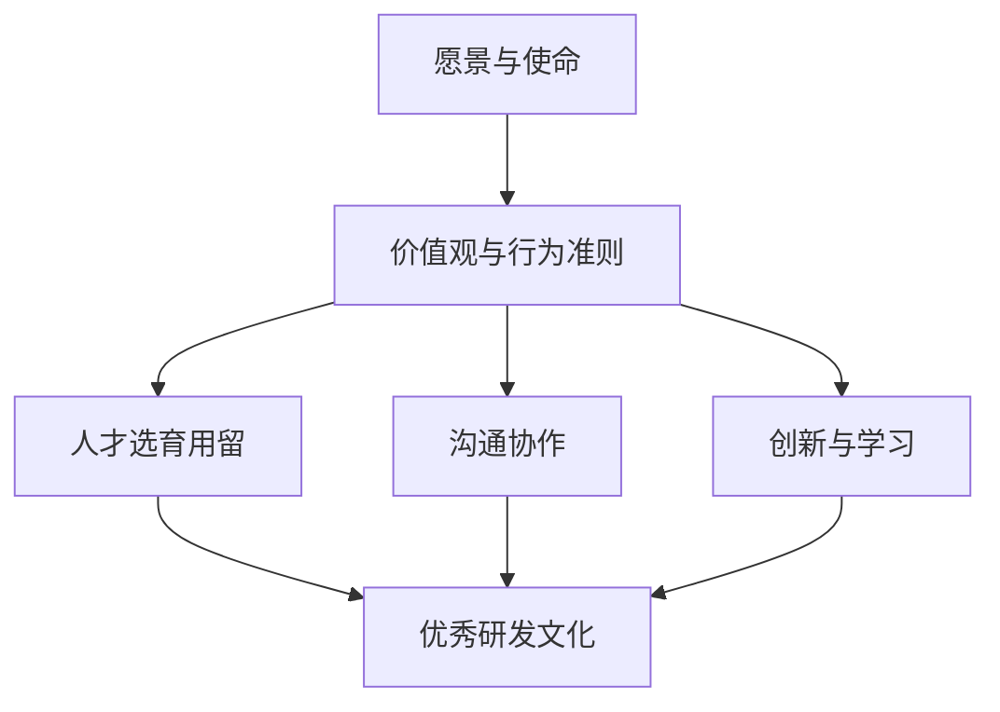

# 团队研发文化和价值观建设与传承

## 1. 背景介绍
### 1.1 研发文化的重要性
### 1.2 价值观在团队建设中的作用
### 1.3 文化传承面临的挑战

## 2. 核心概念与联系
### 2.1 研发文化的定义与内涵
### 2.2 价值观的内涵与外延  
### 2.3 文化、价值观与团队绩效的关系

## 3. 构建优秀研发文化的关键要素
### 3.1 愿景与使命
#### 3.1.1 明确团队愿景
#### 3.1.2 制定清晰使命
#### 3.1.3 愿景使命的传达与践行
### 3.2 价值观与行为准则
#### 3.2.1 界定核心价值观
#### 3.2.2 价值观的阐释与细化
#### 3.2.3 形成行为准则
### 3.3 人才选育用留
#### 3.3.1 人才选拔与价值观匹配
#### 3.3.2 人才培养与文化认同
#### 3.3.3 绩效考核与价值观践行
### 3.4 沟通协作
#### 3.4.1 高效沟通的机制与渠道
#### 3.4.2 跨部门协作的文化土壤
#### 3.4.3 团队活动与文化建设
### 3.5 创新与学习
#### 3.5.1 鼓励创新的氛围营造
#### 3.5.2 容错机制与失败文化
#### 3.5.3 持续学习的文化基因

## 4. 优秀研发文化实践案例分析
### 4.1 Google: 创新与自由
### 4.2 Netflix: 自由与责任
### 4.3 Amazon: 客户至上
### 4.4 华为: 以奋斗者为本
### 4.5 小米: 专注极致

## 5. 研发文化落地的策略与方法
### 5.1 高层领导重视与践行
### 5.2 将文化融入到制度流程中
### 5.3 设立文化传播大使
### 5.4 打造文化符号与仪式
### 5.5 故事与案例的传播分享

## 6. 研发文化传承的路径
### 6.1 导师制与传帮带
### 6.2 案例萃取与分享
### 6.3 文化故事会
### 6.4 文化认证考核
### 6.5 文化传承激励

## 7. 研发文化建设中的常见问题及对策
### 7.1 文化与业务目标的平衡
### 7.2 文化同质化问题
### 7.3 文化与个性张扬的冲突
### 7.4 分布式团队的文化融合
### 7.5 文化建设的量化考核

## 8. 未来展望：打造持续进化的学习型组织
### 8.1 学习型组织的内涵
### 8.2 组织学习的五项修炼
### 8.3 知识管理与经验萃取
### 8.4 持续改进的文化基因
### 8.5 拥抱变化,永葆活力

## 9. 附录：常见问题解答
### Q1: 如何评估研发文化建设成效？
### Q2: 面对行业变革,如何保持文化的稳定性和适应性？
### Q3: 如何处理文化建设中的反对声音？
### Q4: 快速成长的团队如何兼顾文化传承？
### Q5: 打造百年老店需要具备哪些文化基因？

优秀的研发文化和价值观是一个团队基业长青的根基。文化是软实力,也是生产力。打造优秀研发文化,需要在愿景、价值观、人才发展、沟通协作、创新学习等方面入手,并将其落实到团队日常运作的方方面面。

文化的传承需要领导重视,更需要全员参与。通过设立导师制、案例萃取分享、文化故事会等方式,让文化基因一代代传递。在继承中发展,在发展中创新,让文化在时代发展中焕发勃勃生机。

百年老店需要的是基业长青的文化。客户至上、以奋斗者为本、拥抱变化、持续学习,唯有将这些优秀文化基因镌刻于心,融入血液,团队方能基业长青,蒸蒸日上。

文化之魂,价值为舟。愿每一个奋斗在科技前线的团队,都能打造独特而优秀的文化,用文化的力量凝聚人心,成就伟业,创造辉煌!

作者：禅与计算机程序设计艺术 / Zen and the Art of Computer Programming