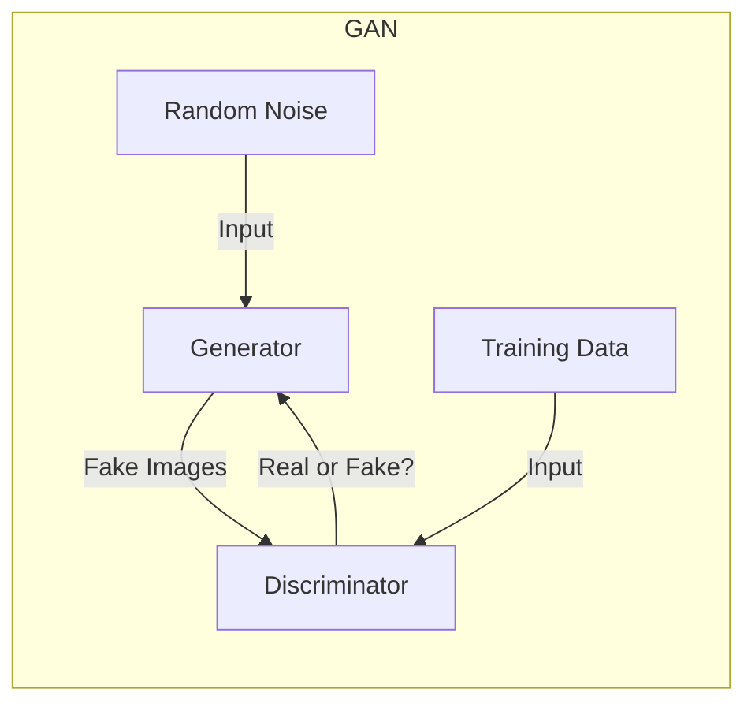
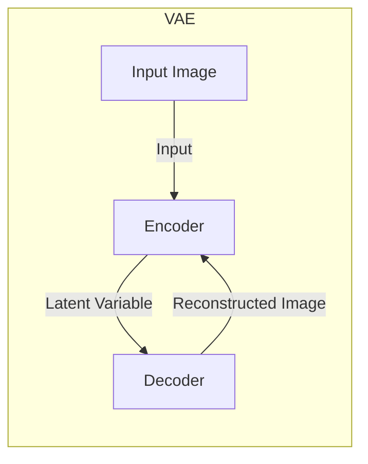
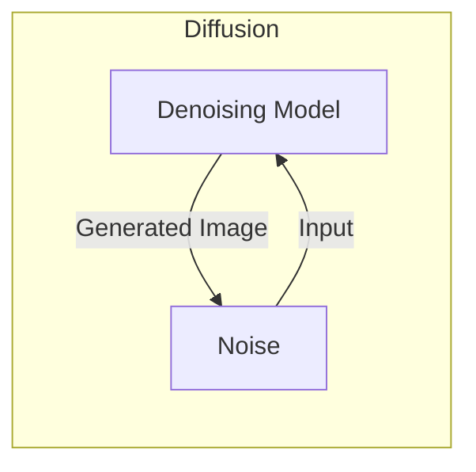

# 图像生成(Image Generation) - 原理与代码实例讲解

## 1.背景介绍

### 1.1 什么是图像生成

图像生成(Image Generation)是指利用计算机算法自动生成逼真的图像数据。随着深度学习和生成式对抗网络(Generative Adversarial Networks, GANs)技术的不断发展,图像生成已经成为计算机视觉和人工智能领域的一个热门研究方向。

图像生成技术可以广泛应用于多个领域,例如:

- 视觉艺术创作
- 游戏和虚拟现实
- 电影特效制作
- 医疗成像辅助
- 自动驾驶模拟训练

### 1.2 图像生成的挑战

尽管图像生成技术取得了长足进步,但仍然面临着诸多挑战:

- 生成图像质量不够逼真
- 缺乏多样性和创新性
- 难以控制生成图像的内容和风格
- 生成效率低下,需要大量计算资源

### 1.3 发展历程

早期的图像生成方法主要基于显式3D建模和渲染,需要大量的人工参与。随后,基于深度学习的生成模型(如VAE、GAN等)应运而生,能够直接从数据中学习生成图像,大大降低了人工参与的工作量。

近年来,Diffusion模型、DALL-E等新型图像生成模型取得了突破性进展,生成质量和多样性都有了极大提高,同时也能够实现基于文本描述的图像生成,为图像生成领域带来了新的发展机遇。

## 2.核心概念与联系

### 2.1 生成式对抗网络(GAN)

生成式对抗网络是图像生成的核心技术之一。GAN由生成器(Generator)和判别器(Discriminator)两个神经网络组成:

- 生成器从随机噪声中生成假的图像样本
- 判别器则判断输入图像是真实样本还是生成器生成的假样本

生成器和判别器相互对抗,生成器不断努力生成逼真的图像以欺骗判别器,判别器也在努力提高判别真伪的能力。这种对抗训练可以促进生成器生成质量更高的图像。



### 2.2 变分自编码器(VAE)

变分自编码器也是一种常用的生成模型,它由编码器(Encoder)和解码器(Decoder)组成:

- 编码器将输入图像编码为潜在空间的隐变量
- 解码器则从隐变量中重建图像

通过最大化训练数据的证据下界(ELBO),VAE可以学习输入数据的潜在分布,并从该分布中采样生成新图像。



### 2.3 扩散模型(Diffusion Model)

扩散模型是最新的生成模型,它通过学习从噪声到数据的逆过程来生成图像。具体来说:

1. 正向扩散过程将数据逐步加入高斯噪声
2. 逆向过程则从纯噪声开始,逐步去噪生成图像

扩散模型能够生成极高质量和多样性的图像,同时也可以实现基于文本描述的图像生成。



### 2.4 联系与区别

GAN、VAE和扩散模型都是生成模型,但在原理、训练方式和应用场景上存在差异:

- GAN通过对抗训练直接生成图像,但可能存在模式坍缩等问题
- VAE则学习数据分布,从隐空间采样生成新图像,但质量相对较低
- 扩散模型则通过学习去噪过程实现图像生成,生成质量最佳

不同模型在不同场景下各有优劣,需要根据具体需求选择合适的模型。

## 3.核心算法原理具体操作步骤

### 3.1 生成式对抗网络(GAN)

GAN的核心思想是通过生成器和判别器的对抗训练来生成逼真图像。具体训练步骤如下:

1. 初始化生成器G和判别器D的网络参数
2. 从训练数据中采样一批真实图像
3. 从噪声分布中采样一批噪声,送入生成器G生成一批假图像
4. 将真实图像和假图像混合,送入判别器D进行真伪判别
5. 计算判别器D的损失函数,更新D的参数以提高判别能力
6. 计算生成器G的损失函数,更新G的参数以提高生成质量
7. 重复3-6步骤,直至模型收敛

判别器D的损失函数通常使用交叉熵损失,生成器G的损失函数则是D对假样本的判别结果的负值。

GAN的训练过程是一个动态的对抗博弈,需要仔细调节参数和优化策略以保证训练稳定性和收敛性。

### 3.2 变分自编码器(VAE)

VAE的核心思想是将输入数据编码为隐变量的潜在分布,然后从该分布中采样生成新数据。具体步骤如下:

1. 初始化编码器E和解码器D的网络参数
2. 从训练数据中采样一批输入图像
3. 将输入图像送入编码器E,得到隐变量的均值和方差参数
4. 从隐变量的参数分布中采样隐变量z
5. 将隐变量z送入解码器D,重建输入图像
6. 计算重建损失和KL散度损失,更新E和D的参数
7. 重复3-6步骤,直至模型收敛

VAE的损失函数由重建损失和KL散度两部分组成。重建损失衡量重建图像与原始图像的差异,KL散度则约束隐变量分布与标准高斯分布的差异。

通过最小化VAE的损失函数,模型可以学习到输入数据的潜在分布,从而实现图像生成。

### 3.3 扩散模型(Diffusion Model)

扩散模型的核心思想是学习从纯噪声到数据的逆向过程,从而实现图像生成。具体步骤如下:

1. 初始化去噪模型(Denoising Model)的网络参数
2. 从训练数据中采样一批图像
3. 对每个图像执行正向扩散过程,生成不同噪声等级的扩散图像
4. 将扩散图像和对应噪声等级作为输入,送入去噪模型进行训练
5. 去噪模型的目标是从扩散图像中预测出原始图像
6. 计算预测误差损失,更新去噪模型的参数
7. 重复3-6步骤,直至模型收敛

训练完成后,可以从纯噪声开始,逐步应用去噪模型进行采样,从而生成新图像。

扩散模型的优势在于能够捕捉数据的细节和多样性,生成图像质量极高。但训练过程较为复杂,需要大量计算资源。

## 4.数学模型和公式详细讲解举例说明

### 4.1 生成式对抗网络(GAN)

GAN的目标是训练生成器G生成的图像分布$p_g$与真实数据分布$p_{data}$尽可能相近。可以通过最小化生成器G和判别器D的对抗损失函数来实现:

$$\min_G \max_D V(D,G) = \mathbb{E}_{x\sim p_{data}(x)}[\log D(x)] + \mathbb{E}_{z\sim p_z(z)}[\log(1-D(G(z)))]$$

其中:

- $x$是真实数据样本
- $z$是随机噪声
- $D(x)$表示判别器判定$x$为真实数据的概率
- $G(z)$表示生成器从噪声$z$生成的假样本

生成器G的目标是最小化$\log(1-D(G(z)))$,即让判别器D尽可能判定生成的假样本为真实数据。判别器D则是最大化$\log D(x)$和$\log(1-D(G(z)))$,即正确判别真实数据和假样本。

通过交替优化G和D的损失函数,可以促进生成器生成更加逼真的图像。

### 4.2 变分自编码器(VAE)

VAE的目标是最大化输入数据$x$的边际对数似然$\log p(x)$。由于直接优化$\log p(x)$较为困难,VAE引入了一个推理网络(编码器)$q(z|x)$来近似$p(z|x)$,并最小化这两个分布之间的KL散度:

$$\log p(x) \geq \mathbb{E}_{q(z|x)}[\log p(x|z)] - D_{KL}(q(z|x)||p(z))$$

上式右边的第一项是重建损失,第二项是KL散度损失。VAE的优化目标是最大化这个证据下界(ELBO):

$$\mathcal{L}_{VAE}(x) = \mathbb{E}_{q(z|x)}[\log p(x|z)] - D_{KL}(q(z|x)||p(z))$$

其中:

- $q(z|x)$是编码器,将输入$x$编码为隐变量$z$的分布
- $p(x|z)$是解码器,从隐变量$z$重建输入$x$
- $p(z)$是隐变量$z$的先验分布,通常设为标准高斯分布

通过最大化ELBO损失函数,VAE可以学习到输入数据的潜在分布,从而实现图像生成。

### 4.3 扩散模型(Diffusion Model)

扩散模型的核心思想是学习从噪声到数据的逆向过程。具体来说,正向扩散过程将数据$x_0$逐步加入高斯噪声,生成一系列扩散图像$x_1,x_2,...,x_T$:

$$q(x_t|x_{t-1}) = \mathcal{N}(x_t;\sqrt{1-\beta_t}x_{t-1},\beta_tI)$$

其中$\beta_1,...,\beta_T$是方差系数,控制每一步加入噪声的量。

逆向过程则是从纯噪声$x_T$开始,逐步去噪生成图像:

$$p_\theta(x_{t-1}|x_t) = \mathcal{N}(x_{t-1};\mu_\theta(x_t,t),\Sigma_\theta(x_t,t))$$

其中$\mu_\theta$和$\Sigma_\theta$是去噪模型,需要学习从$x_t$和时间步$t$预测出$x_{t-1}$的均值和方差。

去噪模型的训练目标是最小化每一步的加性高斯噪声的负对数似然:

$$\mathcal{L}_t = \mathbb{E}_{x_0,\epsilon}\Big[\|\ \epsilon - \epsilon_\theta(x_t,t)\ \|^2\Big]$$

其中$\epsilon_\theta(x_t,t) = \frac{1}{\sqrt{\alpha_t}}(x_t - \sqrt{1-\alpha_t}\mu_\theta(x_t,t))$是去噪模型的输出。

通过最小化上述损失函数,可以训练出高质量的去噪模型,从而实现高保真的图像生成。

## 5.项目实践:代码实例和详细解释说明

### 5.1 使用PyTorch实现DCGAN

DCGAN(Deep Convolutional GAN)是GAN在图像生成领域的一个典型应用,利用卷积神经网络作为生成器和判别器。下面是使用PyTorch实现DCGAN的代码示例:

```python
import torch
import torch.nn as nn

# 定义生成器
class Generator(nn.Module):
    def __init__(self, z_dim, img_channels):
        super().__init__()
        self.net = nn.Sequential(
            nn.ConvTranspose2d(z_dim, 512, 4, 1, 0, bias=False),
            nn.BatchNorm2d(512),
            nn.ReLU(True),
            nn.ConvTranspose2d(512, 256, 4, 2, 1, bias=False),
            nn.BatchNorm2d(256),
            nn.ReLU(True),
            nn.ConvTranspose2d(256, 128, 4, 2, 1, bias=False),
            nn.BatchNorm2